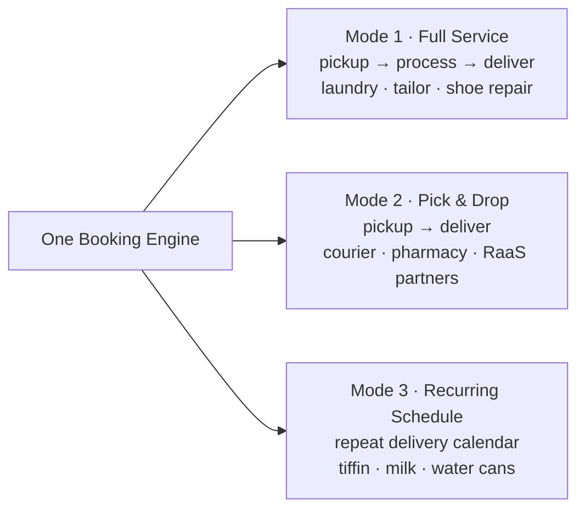
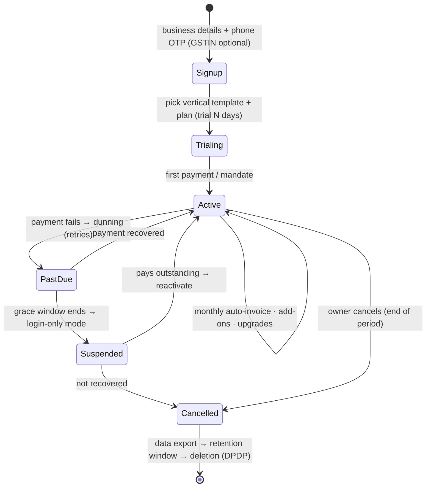

# Platform Strategy — From Laundry SaaS to Hyperlocal Scheduling Platform

> Business analysis + platform design for generalizing LaundryGhar's scheduled pickup-and-drop core into a **white-label, subscription-based platform** any hyperlocal business can run — under our brand or their own domain and name.

---

## 1. The idea in one line

**"Shopify for scheduled hyperlocal services."** Any business that picks up, optionally processes, and delivers on a schedule — laundry, tiffin, courier, pharmacy, tailor, water cans — launches their own branded service on our platform, pays a subscription, and buys only the features they need.

---

## 2. What we already have vs what generalizes

The laundry build is ~80% of the platform. The core loop — *book → schedule slot → assign rider → pick up → (process) → deliver → pay* — is vertical-agnostic.

| Already built (laundry) | Generalizes to |
|---|---|
| `brands` (theming, domain, locales) | The white-label tenant ("Provider") |
| Stores / warehouses | Business locations / optional processing facility |
| Orders + delivery slots + capacity | Bookings + scheduling (any vertical) |
| Riders, GPS, OTP, proof photos | Fleet module (any vertical) |
| Garment tagging + inspection photos | Item tracking module (optional, per vertical) |
| Packages, wallet, loyalty, coupons | Commerce module (any vertical) |
| `platform_plans` + `franchise_subscriptions` (module B) | **The SaaS billing engine — already done** |
| `feature_flags` + `platform_plans.features` JSONB | **Feature entitlements — already done** |
| RaaS partner logistics plan | Pick-&-drop-only mode for external businesses |
| RLS by `brand_id` | Tenant isolation for every provider |

What's genuinely new: **vertical templates**, **custom-domain resolution**, and a **simplified role surface** (§6).

---

## 3. Three product modes (one engine)

Every vertical is a configuration of the same engine, in one of three modes:

A **vertical template** = mode + terminology pack + preset catalog structure + default feature set. Launch templates: **Laundry** (Mode 1), **Courier/Parcel** (Mode 2), **Tiffin** (Mode 3). Terminology is config, not code: "garment" ⇄ "parcel" ⇄ "meal box" — same tables underneath.

---

## 4. White-label & multi-domain (how a provider gets their own name)

A provider can run under **our super-app**, or fully under **their own domain + brand**. Tiered:

| Tier | What they get | How |
|---|---|---|
| **T1 — Listed** | Their business inside our consumer app | Row in `brands` (or lighter: provider profile) |
| **T2 — Own web (PWA)** | `theirbrand.com` — their logo, colors, name | Custom domain + Host-header brand resolution |
| **T3 — Own mobile app** | Their app in Play/App Store | White-label Expo build (config-driven), one-time fee |

**Multi-domain mechanics (T2) — the only new infrastructure:**
1. New table `brand_domains` (`brand_id`, `domain`, `verification_txt`, `verified_at`, `ssl_status`, `is_primary`).
2. Provider adds a CNAME → our edge; verifies via TXT record.
3. SSL automated (Let's Encrypt / Cloudflare-for-SaaS).
4. **Resolution middleware:** every request's `Host` header → `brand_domains` → sets `app.current_brand_id`. Same single deployment serves N domains; RLS does the rest. No per-provider servers.
5. Per-provider sender identity: email domain, WhatsApp number, SMS sender ID stored on `brands` (already have the columns).

One codebase, one database, N branded businesses. That is the platform.

---

## 5. Monetization: subscription + pay-for-what-you-use

Billing engine is **already built** (module B: `platform_plans`, `franchise_subscriptions`, overage, dunning, suspend-on-nonpay). What we define now is the **feature catalog** sold through it:

**Feature catalog (entitlements):** `bookings`, `scheduling`, `fleet`, `item_tracking`, `processing_facility`, `online_payments`, `wallet`, `loyalty`, `coupons`, `customer_subscriptions`, `raas_partner`, `whatsapp_bot`, `multi_location`, `advanced_analytics`, `api_access`, `custom_domain`, `white_label_app`.

**Plans (example):**

| Plan | Includes | Price idea |
|---|---|---|
| **Starter** | bookings + scheduling, 1 location, our sub-domain | low monthly |
| **Growth** | + fleet, online payments, multi-location, WhatsApp bot | mid |
| **Pro** | + processing, item tracking, loyalty/coupons, analytics, API | higher |
| **Enterprise** | + custom domain, white-label app, RaaS, dedicated support | custom |

Plus: **à la carte add-ons** on any plan (each feature purchasable solo), **usage overage** per booking beyond quota (already in `platform_plans`), **RaaS take-rate** on partner bookings, **white-label app build fee** (one-time), **WhatsApp/SMS credit resale**.

**Enforcement:** entitlement check = `plan.features ∪ purchased add-ons`, cached per brand, evaluated the same place feature_flags are. UI hides what's not owned; API returns `402 feature_not_in_plan` with an upgrade link.

**Roles follow features (the simplifier):** a provider only *sees* the roles their features unlock. No fleet feature → no Rider role on screen. No processing → no Facility roles. A courier shop sees 4 roles, a full laundry sees 7. Same engine, simpler surface.

---

## 6. Roles & permissions — the simple model

Design rules: **max 8 roles**, **10 permission groups** (not 300 permissions), plain do/don't language, and two absolute laws:

> **Law 1:** Money settings, branding, and the subscription belong to the **Owner** only.
> **Law 2:** Cross-provider anything belongs to the **Platform** only.

### 6.1 The roles

**Platform side (us):**

| Role | DOES | DOES NOT |
|---|---|---|
| **Platform Admin** | Everything, all providers: plans, features, domains, suspend/reactivate, break-glass support | Day-to-day work inside a provider's business |
| **Platform Support** | View any provider's data to help; add notes; guide | Change money, plans, branding, or any provider config; delete anything |

**Provider side (the business):**

| Role | DOES | DOES NOT |
|---|---|---|
| **Owner** | Everything in their business: locations, staff, pricing, refunds, reports, branding, domain, **pays the subscription** | See any other provider; platform config |
| **Manager** | Run operations: bookings, dispatch, pricing edits, staff & rider management, location reports, refunds up to a cap | Branding/domain, subscription & billing, add/remove Owner, refunds above cap |
| **Staff** | Daily counter work: create/update bookings, collect payment, handle customers, print labels | Change pricing, manage staff, see reports, refunds, settings |
| **Rider** *(Fleet feature)* | See & run **assigned** jobs: accept, navigate, OTP, photos, COD handover, own earnings | See other riders' jobs, customers beyond the job, pricing, reports |
| **Facility Staff** *(Processing feature)* | Receive, process, QC, scan items at the facility | Bookings, customers, money, dispatch |
| **Customer** | Book, track, pay, rate — **their own data only** | Anything beyond self |

*(Optional add-on role: **Auditor** — read-only everything in the provider, changes nothing. Only appears with the Compliance add-on.)*

### 6.2 Role × permission-group matrix

`F` = full · `V` = view · `O` = own records only · `—` = none

| Permission group | Platform Admin | Platform Support | Owner | Manager | Staff | Rider | Facility Staff | Customer |
|---|---|---|---|---|---|---|---|---|
| 1. Bookings | F | V | F | F | F | O | — | O |
| 2. Dispatch (assign riders) | F | V | F | F | V | O | — | — |
| 3. Customers | F | V | F | F | F | — | — | O |
| 4. Catalog & Pricing | F | V | F | F | V | — | — | V |
| 5. Staff & Riders | F | V | F | F | — | — | — | — |
| 6. Money (payments/refunds) | F | V | F | refund ≤ cap | collect only | COD handover | — | O |
| 7. Item tracking / Processing | F | V | F | F | V | O | F | O(track) |
| 8. Reports | F | V | F | own location | — | own earnings | — | — |
| 9. Branding, Domain & Settings | F | — | F | — | — | — | — | — |
| 10. Subscription & Billing (pays us) | F | V | F | — | — | — | — | — |

### 6.3 Why this stays simple

- **Presets over the engine.** These 8 roles are presets on the scoped-RBAC engine already specced in `RBAC.md` (scopes, deny-wins). The engine's power stays; the surface is 8 named roles and a 10-row matrix.
- **Customize by subtraction only.** A provider can clone a role and *remove* groups ("Cashier = Staff minus Money"). Never invent from scratch — that's where complexity breeds.
- **Roles appear with features.** Buy Fleet → Rider appears. Buy Processing → Facility Staff appears. Small business, small screen.
- **One-line mental model per role:** Owner = everything + pays us · Manager = run it, not own it · Staff = serve today's customers · Rider = my jobs only · Facility = items only · Customer = myself only.

---

## 7. Multi-provider management (us as the platform)

Platform console (us) manages the fleet of providers:
- **Onboard:** create provider → pick vertical template → pick plan → live on sub-domain in minutes; custom domain when they upgrade.
- **Monitor:** MRR/ARR per plan (`mv_franchise_saas_mrr` already exists), bookings volume, feature adoption, dunning states.
- **Control:** suspend-on-nonpay (built), feature kill-switches (`feature_flags`), per-provider rate limits.
- **Support:** impersonation with consent + full audit (Platform Support role, read-first).

---

## 8. Platform vs Company — who does what

Two sides, one contract. **We run the platform; they run their business.** Neither crosses the line.

### 8.1 The Platform (us) — DO / DON'T

| The Platform DOES | The Platform DOES NOT |
|---|---|
| Build, host, secure, and operate the software: uptime, backups, SSL, domain automation | Run the company's daily business or create bookings for them (support-assist only, with consent + audit) |
| Define **platform plans, pricing, and the feature catalog**; bill companies (subscription, add-ons, overage); dunning; suspend/reactivate on non-pay | Set the company's **customer prices** — their rate cards, discounts, and margins are entirely theirs |
| Guarantee tenant isolation (RLS), data protection (DPDP), audit trails | Own the company's customers — customer data belongs to the company; we are the processor, not the owner |
| Provide vertical templates, onboarding wizard, docs, and support | Hold or spend the company's revenue — their collections settle to **their** gateway/bank account; we only charge our agreed fees |
| Provide the rails: payment gateway integration, WhatsApp/SMS infra (credits bought by the company) | Hire, manage, or pay their staff and riders |
| Ship white-label mechanics: custom domains, PWA, app builds | Arbitrate company↔customer disputes (except ToS/fraud violations) |
| Monitor abuse/fraud; enforce Terms of Service; kill-switch features when necessary | Change a company's branding, config, or data without recorded consent |
| Platform analytics on itself: MRR/ARR, adoption, churn | Peek across tenants for anything but aggregate, anonymized platform metrics |

### 8.2 The Company (subscribed provider) — DO / DON'T

| The Company DOES | The Company DOES NOT |
|---|---|
| Choose a vertical template + plan; **pay the subscription** and any add-ons/overage | Access any other company's data (RLS makes this impossible, not just forbidden) |
| Set up and run their business: locations, catalog, **their prices**, staff, riders, branding | Modify platform code, plans, or unlock features outside their entitlements |
| Serve their customers; own the relationship, the revenue, and dispute resolution | Bypass platform metering/billing (all usage is counted) |
| Manage their own team using the role presets (§6); customize by subtraction only | Resell or sub-license the platform (separate reseller agreement required) |
| Comply with their local obligations: GST invoices to customers, labor, licenses | Use the platform for prohibited goods/services (ToS) |
| Export their data at any time; take it with them if they leave | Hold the platform liable for their business decisions (pricing, staffing, service quality) |

**One-line split:** *we own the machine, they own the shop.*

---

## 9. How a company subscribes (lifecycle)

Runs on the **module-B engine already built** (`platform_plans`, `franchise_subscriptions`, invoices, dunning, suspend-on-nonpay). Onboarding order: sign up → template → plan/trial → wizard (locations, catalog seed, staff invites, gateway link) → live on sub-domain → upgrade to custom domain / white-label app later. Suspension = **login-only mode** (owner can see invoices and pay; operations frozen) — never silent data loss. Cancellation = export offered, wind-down retention, then deletion per DPDP.

---

## 10. Combined role map — subscription & operations

Who can touch what, across both sides. `✔` = yes · `—` = no.

| Action | Platform Admin | Platform Support | Owner | Manager | Staff | Rider | Facility Staff | Customer |
|---|---|---|---|---|---|---|---|---|
| Define platform plans & feature catalog | ✔ | — | — | — | — | — | — | — |
| Suspend / reactivate a company (non-pay, ToS) | ✔ | — | — | — | — | — | — | — |
| View any company's data (support, read-only) | ✔ | ✔ | — | — | — | — | — | — |
| **Subscribe / upgrade / downgrade / cancel plan** | — | — | ✔ | — | — | — | — | — |
| **Pay platform invoices; manage payment mandate** | — | — | ✔ | — | — | — | — | — |
| Buy feature add-ons; request custom domain / app | — | — | ✔ | — | — | — | — | — |
| Set company branding, domain, settings | — | — | ✔ | — | — | — | — | — |
| Set customer-facing prices & catalog | — | — | ✔ | ✔ | — | — | — | — |
| Manage staff & riders (invite, roles, shifts) | — | — | ✔ | ✔ | — | — | — | — |
| Create / manage bookings; dispatch | — | — | ✔ | ✔ | ✔ | own jobs | — | own |
| Process / QC items at facility | — | — | ✔ | ✔ | — | — | ✔ | — |
| Refunds | — | — | ✔ | ≤ cap | — | — | — | — |
| Reports | platform-level | view | ✔ all | own location | — | own earnings | — | — |
| Export company data | on request | — | ✔ | — | — | — | — | own data |

Reading the map: the **subscription column of life belongs to the Owner alone** (Law 1); everything cross-company belongs to the Platform alone (Law 2); everyone else only operates.

---

## 11. Rollout phases

| Phase | Deliverable | Builds on |
|---|---|---|
| **P1** | Feature-entitlement enforcement + terminology config; roles-follow-features | module B, feature_flags |
| **P2** | `brand_domains` + Host-resolution middleware + PWA white-label (T2) | brands, RLS |
| **P3** | Vertical templates: Laundry, Courier, Tiffin; provider self-onboarding wizard | booking engine |
| **P4** | White-label app factory (Expo config builds) + Partner/public API | mobile apps |

Each phase is sellable on its own; P1+P2 alone unlocks "your own domain, pay for what you use."

---

## 12. Risks (honest list)

- **Over-generalizing too early:** keep laundry as the flagship proof; extract only what the 2nd and 3rd vertical actually need.
- **Terminology leakage:** laundry words in a courier UI kills credibility — the terminology pack must cover *every* user-facing string.
- **White-label support load:** N domains = N "my site is down" tickets; automate SSL/domain health checks from day one.
- **Role sprawl:** resist adding role #9. Every new request maps to clone-minus or a feature role.
