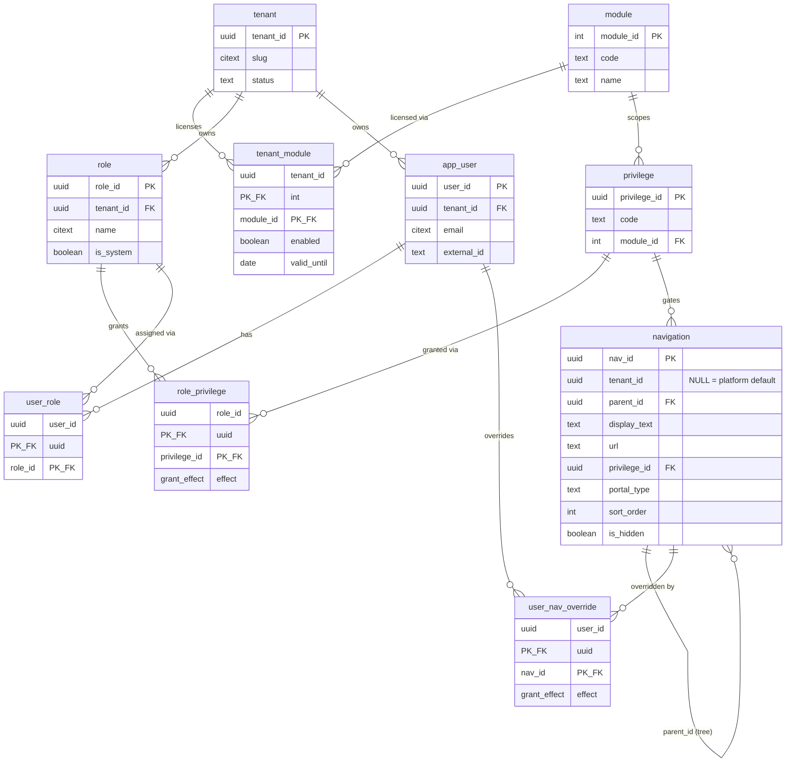
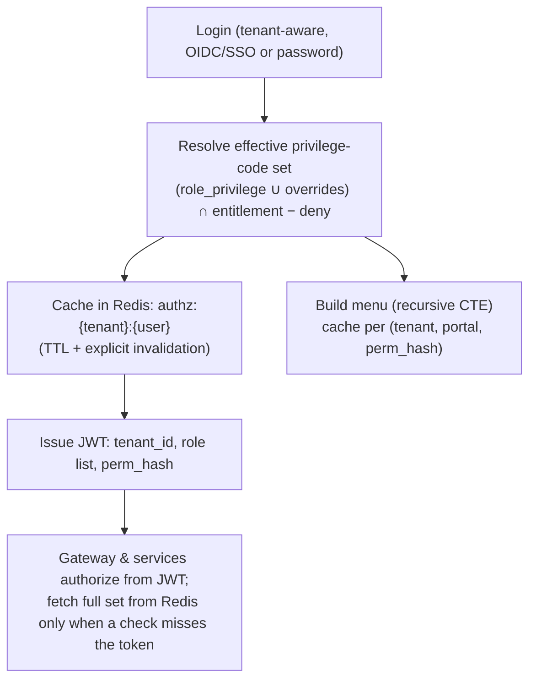

# Multi-Tenant RBAC & Dynamic Navigation — PostgreSQL Architecture

A data-driven authorization and navigation engine for a Platform-as-a-Service. Roles, privileges, feature modules, and the **entire navigation menu live in tables** — so adding a feature, onboarding a tenant, or changing what a user can see is a *data* operation, never a deploy.

---

## 1. Design goals

1. **Multi-tenant by construction** — one schema serves many organizations; no row ever leaks across tenants.
2. **Two-dimensional access control** — separate *what the tenant has paid for* (entitlement) from *what the user is allowed to do* (authorization).
3. **Dynamic, permission-gated UI** — the navigation menu is data; each tenant/role/user renders a different UI from one codebase.
4. **Allow *and* deny** — broad grants with precise exceptions, without creating a new role for every edge case.
5. **Fast at runtime** — resolve the permission set once, cache it, enforce from a token; the database is the source of truth, not the hot path.
6. **PostgreSQL-native** — Row-Level Security for isolation, recursive CTEs for the menu tree, `citext` for case-insensitive identifiers, composite FKs for tenant integrity.

---

## 2. Core model

Effective access is the **intersection of two independent dimensions**:

```
EFFECTIVE ACCESS  =  TENANT ENTITLEMENT  ∩  USER AUTHORIZATION
                     (tenant ↔ module)      (user → role → privilege, ± overrides)
```

A privilege the user "has" but whose module the tenant has not licensed is invisible. This separation is what makes the system a platform rather than a single app.

| Layer | Question it answers | Tables |
|---|---|---|
| **Entitlement** | What has this *organization* purchased? | `tenant`, `module`, `tenant_module` |
| **Authorization** | What can this *person* do? | `app_user`, `role`, `user_role`, `privilege`, `role_privilege` |
| **Navigation** | What does this person *see and reach*? | `navigation`, `user_nav_override` |

### 2.1 Entity-relationship overview



---

## 3. Schema (PostgreSQL DDL)

Target: PostgreSQL 14+. Uses built-in `gen_random_uuid()` (core since PG 13), `citext`, RLS, and composite foreign keys for tenant-consistency.

### 3.1 Extensions & types

```sql
CREATE EXTENSION IF NOT EXISTS citext;   -- case-insensitive emails / role names

-- A grant is either an explicit allow or an explicit deny. Deny always wins.
CREATE TYPE grant_effect AS ENUM ('allow', 'deny');

-- Reusable updated_at trigger
CREATE OR REPLACE FUNCTION set_updated_at() RETURNS trigger AS $$
BEGIN
    NEW.updated_at := now();
    RETURN NEW;
END $$ LANGUAGE plpgsql;
```

### 3.2 Tenancy & module catalog

```sql
CREATE TABLE tenant (
    tenant_id     uuid PRIMARY KEY DEFAULT gen_random_uuid(),
    slug          citext UNIQUE NOT NULL,                 -- subdomain: acme.app.com
    display_name  text   NOT NULL,
    status        text   NOT NULL DEFAULT 'active'
                    CHECK (status IN ('active','trial','suspended','closed')),
    created_at    timestamptz NOT NULL DEFAULT now(),
    updated_at    timestamptz NOT NULL DEFAULT now()
);

-- Platform-global feature catalog (NOT tenant-scoped). One row per licensable module.
CREATE TABLE module (
    module_id     int GENERATED ALWAYS AS IDENTITY PRIMARY KEY,
    code          text UNIQUE NOT NULL,                   -- 'hrm.employee', 'billing.invoice'
    name          text NOT NULL,
    description   text,
    is_active     boolean NOT NULL DEFAULT true
);

-- ENTITLEMENT: which modules a tenant has licensed, and until when.
CREATE TABLE tenant_module (
    tenant_id     uuid NOT NULL REFERENCES tenant(tenant_id) ON DELETE CASCADE,
    module_id     int  NOT NULL REFERENCES module(module_id),
    enabled       boolean NOT NULL DEFAULT true,
    valid_until   date,                                   -- NULL = perpetual
    created_at    timestamptz NOT NULL DEFAULT now(),
    PRIMARY KEY (tenant_id, module_id)
);
```

### 3.3 Privileges & roles

```sql
-- Platform-global privilege definitions, each scoped to one module.
CREATE TABLE privilege (
    privilege_id  uuid PRIMARY KEY DEFAULT gen_random_uuid(),
    module_id     int  NOT NULL REFERENCES module(module_id),
    code          text NOT NULL,                          -- 'employee.manage'
    name          text NOT NULL,
    description   text,
    UNIQUE (module_id, code)
);

-- Tenant-scoped roles. is_system marks seeded template roles (Admin, HR…).
CREATE TABLE role (
    role_id       uuid PRIMARY KEY DEFAULT gen_random_uuid(),
    tenant_id     uuid   NOT NULL REFERENCES tenant(tenant_id) ON DELETE CASCADE,
    name          citext NOT NULL,                        -- case-insensitive: 'HR' = 'hr'
    description   text,
    is_system     boolean NOT NULL DEFAULT false,
    created_at    timestamptz NOT NULL DEFAULT now(),
    updated_at    timestamptz NOT NULL DEFAULT now(),
    UNIQUE (tenant_id, name),
    UNIQUE (tenant_id, role_id)                            -- enables tenant-safe composite FK
);

-- Role → privilege (many-to-many), with allow/deny effect.
CREATE TABLE role_privilege (
    tenant_id     uuid NOT NULL,
    role_id       uuid NOT NULL,
    privilege_id  uuid NOT NULL REFERENCES privilege(privilege_id),
    effect        grant_effect NOT NULL DEFAULT 'allow',
    created_at    timestamptz NOT NULL DEFAULT now(),
    PRIMARY KEY (role_id, privilege_id),
    FOREIGN KEY (tenant_id, role_id)                       -- role must belong to this tenant
        REFERENCES role(tenant_id, role_id) ON DELETE CASCADE
);
```

### 3.4 Users & role membership

```sql
CREATE TABLE app_user (
    user_id       uuid PRIMARY KEY DEFAULT gen_random_uuid(),
    tenant_id     uuid   NOT NULL REFERENCES tenant(tenant_id) ON DELETE CASCADE,
    email         citext NOT NULL,
    external_id   text,                                    -- IdP subject for SSO/OIDC
    display_name  text,
    status        text   NOT NULL DEFAULT 'active'
                    CHECK (status IN ('active','invited','disabled')),
    created_at    timestamptz NOT NULL DEFAULT now(),
    updated_at    timestamptz NOT NULL DEFAULT now(),
    UNIQUE (tenant_id, email),
    UNIQUE (tenant_id, user_id)                            -- enables tenant-safe composite FK
);

CREATE TABLE user_role (
    tenant_id     uuid NOT NULL,
    user_id       uuid NOT NULL,
    role_id       uuid NOT NULL,
    created_at    timestamptz NOT NULL DEFAULT now(),
    PRIMARY KEY (user_id, role_id),
    FOREIGN KEY (tenant_id, user_id) REFERENCES app_user(tenant_id, user_id) ON DELETE CASCADE,
    FOREIGN KEY (tenant_id, role_id) REFERENCES role(tenant_id, role_id)     ON DELETE CASCADE
);
```

### 3.5 Navigation tree & per-user overrides

```sql
-- The menu, as data. Self-referencing tree; each leaf gated by a privilege.
-- tenant_id NULL = platform-default item (shared); non-NULL = tenant-specific override/addition.
CREATE TABLE navigation (
    nav_id        uuid PRIMARY KEY DEFAULT gen_random_uuid(),
    tenant_id     uuid REFERENCES tenant(tenant_id) ON DELETE CASCADE,
    parent_id     uuid REFERENCES navigation(nav_id) ON DELETE CASCADE,
    display_text  text NOT NULL,
    url           text,                                    -- NULL for pure container nodes
    privilege_id  uuid REFERENCES privilege(privilege_id),-- NULL = always visible container
    portal_type   text NOT NULL DEFAULT 'web'
                    CHECK (portal_type IN ('web','mobile','admin','partner')),
    icon          text,
    css_class     text,
    sort_order    int  NOT NULL DEFAULT 0,
    is_default    boolean NOT NULL DEFAULT false,          -- landing item for the portal
    is_hidden     boolean NOT NULL DEFAULT false,
    created_at    timestamptz NOT NULL DEFAULT now(),
    updated_at    timestamptz NOT NULL DEFAULT now()
    -- depth is computed via recursive CTE, never stored (no denormalized level column)
);

-- Per-user override: grant or revoke a specific nav item for one individual.
-- Deny here beats any role-granted access.
CREATE TABLE user_nav_override (
    tenant_id     uuid NOT NULL,
    user_id       uuid NOT NULL,
    nav_id        uuid NOT NULL REFERENCES navigation(nav_id) ON DELETE CASCADE,
    effect        grant_effect NOT NULL DEFAULT 'allow',
    created_at    timestamptz NOT NULL DEFAULT now(),
    PRIMARY KEY (user_id, nav_id),
    FOREIGN KEY (tenant_id, user_id) REFERENCES app_user(tenant_id, user_id) ON DELETE CASCADE
);
```

### 3.6 Indexes (hot paths)

```sql
CREATE INDEX ix_tenant_module_tenant   ON tenant_module (tenant_id) WHERE enabled;
CREATE INDEX ix_privilege_module       ON privilege (module_id);
CREATE INDEX ix_role_privilege_role    ON role_privilege (role_id);
CREATE INDEX ix_role_privilege_priv    ON role_privilege (privilege_id);
CREATE INDEX ix_user_role_user         ON user_role (user_id);
CREATE INDEX ix_user_role_role         ON user_role (role_id);
CREATE INDEX ix_nav_parent             ON navigation (parent_id);
CREATE INDEX ix_nav_privilege          ON navigation (privilege_id);
CREATE INDEX ix_nav_tenant_portal      ON navigation (tenant_id, portal_type) WHERE NOT is_hidden;
CREATE INDEX ix_user_nav_override_user ON user_nav_override (user_id);
CREATE INDEX ix_app_user_external      ON app_user (external_id) WHERE external_id IS NOT NULL;
```

### 3.7 updated_at triggers

```sql
CREATE TRIGGER trg_tenant_upd     BEFORE UPDATE ON tenant     FOR EACH ROW EXECUTE FUNCTION set_updated_at();
CREATE TRIGGER trg_role_upd       BEFORE UPDATE ON role       FOR EACH ROW EXECUTE FUNCTION set_updated_at();
CREATE TRIGGER trg_app_user_upd   BEFORE UPDATE ON app_user   FOR EACH ROW EXECUTE FUNCTION set_updated_at();
CREATE TRIGGER trg_navigation_upd BEFORE UPDATE ON navigation FOR EACH ROW EXECUTE FUNCTION set_updated_at();
```

---

## 4. Tenant isolation with Row-Level Security

The application sets the current tenant per request/transaction; the database enforces isolation regardless of application bugs.

```sql
-- Application connection sets this at the start of each request:
--   SELECT set_config('app.current_tenant', '<tenant-uuid>', false);

ALTER TABLE tenant_module     ENABLE ROW LEVEL SECURITY;
ALTER TABLE role              ENABLE ROW LEVEL SECURITY;
ALTER TABLE role_privilege    ENABLE ROW LEVEL SECURITY;
ALTER TABLE app_user          ENABLE ROW LEVEL SECURITY;
ALTER TABLE user_role         ENABLE ROW LEVEL SECURITY;
ALTER TABLE user_nav_override ENABLE ROW LEVEL SECURITY;
ALTER TABLE navigation        ENABLE ROW LEVEL SECURITY;

-- Generic tenant policy (repeat per table). navigation also lets platform-default rows through.
CREATE POLICY tenant_isolation ON role
    USING (tenant_id = current_setting('app.current_tenant', true)::uuid);

CREATE POLICY tenant_isolation ON app_user
    USING (tenant_id = current_setting('app.current_tenant', true)::uuid);

CREATE POLICY tenant_isolation ON navigation
    USING (tenant_id IS NULL                                   -- shared platform items
        OR tenant_id = current_setting('app.current_tenant', true)::uuid);

-- … same pattern for tenant_module, role_privilege, user_role, user_nav_override.
```

> `module` and `privilege` are platform-global (no `tenant_id`) and intentionally have **no** RLS — they are shared definitions. The platform/admin connection should use a role with `BYPASSRLS` for cross-tenant operations (provisioning, billing, support).

---

## 5. Permission resolution

### 5.1 The access formula

```
visible_leaf_nav =
    (  role_granted_nav   ∩  tenant_licensed_modules   )      -- role path, gated by entitlement
  ∪  user_allow_overrides                                     -- personal grants
  −  user_deny_overrides                                      -- personal revokes (deny wins)
then add ancestor containers, scope to portal, drop hidden, order by sort_order.
```

### 5.2 Resolve a user's menu (single recursive CTE)

```sql
-- Parameters: :user_id, :tenant_id, :portal_type
WITH RECURSIVE
-- Privileges from roles, collapsing allow/deny (deny wins per privilege)
role_privs AS (
    SELECT rp.privilege_id,
           bool_or(rp.effect = 'allow') AS allowed,
           bool_or(rp.effect = 'deny')  AS denied
    FROM   user_role ur
    JOIN   role_privilege rp ON rp.role_id = ur.role_id
    WHERE  ur.user_id = :user_id
    GROUP  BY rp.privilege_id
),
effective_privs AS (
    SELECT privilege_id FROM role_privs WHERE allowed AND NOT denied
),
-- Modules the tenant currently licenses
licensed_modules AS (
    SELECT module_id FROM tenant_module
    WHERE  tenant_id = :tenant_id AND enabled
      AND (valid_until IS NULL OR valid_until >= current_date)
),
-- Nav leaves granted by role-privileges, restricted to licensed modules
role_nav AS (
    SELECT n.nav_id
    FROM   navigation n
    JOIN   privilege  p ON p.privilege_id = n.privilege_id
    WHERE  p.module_id IN (SELECT module_id FROM licensed_modules)
      AND  n.privilege_id IN (SELECT privilege_id FROM effective_privs)
),
-- Per-user overrides
user_allow AS (SELECT nav_id FROM user_nav_override WHERE user_id = :user_id AND effect = 'allow'),
user_deny  AS (SELECT nav_id FROM user_nav_override WHERE user_id = :user_id AND effect = 'deny'),
-- Final visible leaves: (role ∪ allow) − deny
visible AS (
    SELECT nav_id FROM role_nav
    UNION
    SELECT nav_id FROM user_allow
    EXCEPT
    SELECT nav_id FROM user_deny
),
-- Walk UP to pull in parent containers so the tree stays connected
nav_tree AS (
    SELECT n.* FROM navigation n WHERE n.nav_id IN (SELECT nav_id FROM visible)
    UNION
    SELECT parent.* FROM navigation parent
    JOIN   nav_tree child ON child.parent_id = parent.nav_id
)
SELECT DISTINCT nav_id, parent_id, display_text, url, icon, css_class, sort_order, is_default
FROM   nav_tree
WHERE  portal_type = :portal_type
  AND  NOT is_hidden
ORDER  BY sort_order;
```

The app receives a flat, connected set and assembles the tree by `parent_id`. The "walk up to parents" step matters: if a user can reach a leaf page but not its menu group, the group still renders as a container.

### 5.3 Single-privilege enforcement (API hot path)

```sql
-- Returns true only if the user holds the privilege AND the tenant licenses its module.
CREATE OR REPLACE FUNCTION has_privilege(p_user uuid, p_tenant uuid, p_code text)
RETURNS boolean LANGUAGE sql STABLE AS $$
    SELECT EXISTS (
        SELECT 1
        FROM   user_role ur
        JOIN   role_privilege rp ON rp.role_id = ur.role_id AND rp.effect = 'allow'
        JOIN   privilege p       ON p.privilege_id = rp.privilege_id
        JOIN   tenant_module tm  ON tm.module_id = p.module_id
                                 AND tm.tenant_id = p_tenant AND tm.enabled
                                 AND (tm.valid_until IS NULL OR tm.valid_until >= current_date)
        WHERE  ur.user_id = p_user
          AND  p.code = p_code
          AND  NOT EXISTS (  -- no deny on this privilege via any of the user's roles
                 SELECT 1 FROM user_role ur2
                 JOIN   role_privilege rp2 ON rp2.role_id = ur2.role_id AND rp2.effect = 'deny'
                 WHERE  ur2.user_id = p_user AND rp2.privilege_id = p.privilege_id)
    );
$$;
```

In practice you don't call this per request — you compute the **full privilege-code set on login**, cache it, and check membership in memory (Section 6). This function is the source-of-truth fallback and the basis for the cached set.

---

## 6. Caching & performance

Resolve once, cache, enforce from a token. The database stays authoritative but off the hot path.



- **Cache key:** `authz:{tenant_id}:{user_id}` → set of privilege codes (+ resolved nav for the portal).
- **Token:** put the role list and a `perm_hash` (hash of the sorted privilege-code set) in the JWT. Menu and fine checks key off `perm_hash`, so the many users who share a permission profile share one cached menu — high hit rate.
- **Invalidation via `LISTEN`/`NOTIFY`:** a trigger on the grant tables publishes the affected scope; the cache layer evicts.

```sql
CREATE OR REPLACE FUNCTION notify_authz_change() RETURNS trigger AS $$
DECLARE v_tenant uuid := COALESCE(NEW.tenant_id, OLD.tenant_id);
BEGIN
    PERFORM pg_notify('authz_invalidate', v_tenant::text);   -- payload: tenant to flush
    RETURN COALESCE(NEW, OLD);
END $$ LANGUAGE plpgsql;

CREATE TRIGGER trg_authz_rp  AFTER INSERT OR UPDATE OR DELETE ON role_privilege
    FOR EACH ROW EXECUTE FUNCTION notify_authz_change();
CREATE TRIGGER trg_authz_ur  AFTER INSERT OR UPDATE OR DELETE ON user_role
    FOR EACH ROW EXECUTE FUNCTION notify_authz_change();
CREATE TRIGGER trg_authz_uno AFTER INSERT OR UPDATE OR DELETE ON user_nav_override
    FOR EACH ROW EXECUTE FUNCTION notify_authz_change();
CREATE TRIGGER trg_authz_tm  AFTER INSERT OR UPDATE OR DELETE ON tenant_module
    FOR EACH ROW EXECUTE FUNCTION notify_authz_change();
```

> A materialized view of effective permissions is tempting but usually the wrong tool at scale — it's large and refresh-heavy across many tenants. Prefer per-user resolution + Redis. Keep an MV only for admin/reporting ("who can do X across the tenant").

---

## 7. Administration surface (CQRS-style commands)

Keep authorization logic in a testable service layer, not in monolithic stored procedures. Each write emits an event that busts the relevant cache scope.

| Command | Effect |
|---|---|
| `LicenseModuleToTenant(tenant, module, until)` | upsert `tenant_module` |
| `CreateRole(tenant, name, fromTemplate?)` | insert `role` (clone template grants if given) |
| `GrantPrivilegeToRole(role, privilege, effect)` | upsert `role_privilege` |
| `AssignRoleToUser(user, role)` | insert `user_role` |
| `OverrideUserNav(user, nav, effect)` | upsert `user_nav_override` |
| `UpsertNavigationItem(...)` | insert/update `navigation` |

Enforcement wraps `has_privilege` (or the cached set) as an ASP.NET Core authorization policy / endpoint filter. **Menu hiding is UX; every protected endpoint must still check server-side.**

---

## 8. Tenant onboarding (pure data)

```
1. Create tenant            → insert tenant (slug = subdomain).
2. Seed system roles        → clone is_system role templates for the new tenant.
3. Apply purchased plan     → insert tenant_module rows (which modules go live).
4. Navigation               → inherit platform-default nav (tenant_id IS NULL);
                              optionally add tenant-specific items/overrides.
5. Invite first Admin       → insert app_user (status='invited', external_id for SSO);
                              assign the Admin role. Admin self-manages the rest.
```

Everything after step 1 is configuration, not deployment — the entire reason the menu and permissions live in tables.

---

## 9. Extension points

- **Field- and row-level access** — privileges gate *pages/actions* today. For record ownership ("see only my team's data"), add an attribute/policy layer (resource owner, team scope) checked alongside privileges, or push ownership predicates into RLS on the business tables.
- **ABAC overlay** — keep RBAC as the base; layer attribute rules (time, IP, record attributes) for the few cases that need them. Don't model everything as attributes.
- **Role hierarchy** — add `role.parent_role_id` and union inherited grants in `role_privs` if you want senior roles to subsume junior ones.
- **Deep menus** — `parent_id` + recursive CTE handles typical 2–4-level menus comfortably. For very deep or path-query-heavy trees, consider the `ltree` extension with a materialized path column.
- **Audit** — add an append-only `authz_audit` table (or logical-decoding stream) capturing every grant/revoke with actor and timestamp for compliance.

---

## 10. Summary

Three properties make this a platform rather than an app:

1. **Module-scoped privileges + `tenant_module`** → per-tenant feature licensing; effective access = `entitlement ∩ authorization`.
2. **Privilege-gated navigation tree (`navigation` + `portal_type`)** → every tenant/role/user renders a different UI from one codebase.
3. **Role grants + allow/deny overrides** → broad access with precise exceptions, no role explosion.

PostgreSQL does the heavy lifting: **RLS** guarantees isolation, **composite FKs** guarantee tenant integrity, **recursive CTEs** build the menu, **`citext`** kills identifier-casing bugs, and **`LISTEN`/`NOTIFY`** keeps caches honest. Resolve permissions once on login, cache them, enforce from the token — the database is the source of truth, never the bottleneck.
