# Authority model — who manages what, and who does not

**LaundryGhar · multi-vertical SaaS platform · state as of 2026-08-26**

Generated from the **live `laundry_ghar_db` schema** and the backend source, not from the design
documents. Where a document and the schema disagree, the schema wins and the divergence is named.
Every count in this file was executed against the database; every code claim carries a `file:line`.

> **How this was produced.** Seven parallel analyses (roles/scope, authority matrix, deny/override,
> step-up/entitlement, non-console actors, RLS/impersonation, gaps), each re-checked by an
> independent adversarial verifier whose job was to refute it. **50 claims were refuted and
> corrected** before anything reached this page. Numbers that survived that pass are marked with
> the query that produced them; anything that did not survive is either omitted or flagged.

---

## 0. The one thing to understand first

Authority here is **not one system**. It is four independent gates, and a request must clear all of
them. People reason about this platform as though the role matrix were the answer to "who can do
what". It is roughly a quarter of the answer.

```mermaid
flowchart LR
    R[Request] --> G1

    subgraph G1["1 · IDENTITY — which lane are you in?"]
        direction TB
        I1["token_use = user · staff, riders<br/>token_use = customer<br/>token_use = partner<br/>token_use = api_key"]
    end

    G1 --> G2

    subgraph G2["2 · AUTHORITY — do you hold the permission?"]
        direction TB
        A1["role grants − role denies<br/>± user overrides<br/>baked into the JWT at mint"]
    end

    G2 --> G3

    subgraph G3["3 · FRESHNESS — did you re-prove it recently?"]
        direction TB
        S1["step-up OTP required for<br/>risk_level = high OR critical<br/>62 permissions, 5 minute window"]
    end

    G3 --> G4

    subgraph G4["4 · ENTITLEMENT — did the brand pay for it?"]
        direction TB
        E1["permission → module → feature<br/>→ brand_feature<br/>stripped at token mint"]
    end

    G4 --> G5

    subgraph G5["5 · VISIBILITY — which rows exist for you?"]
        direction TB
        V1["Postgres RLS<br/>brand only — see §8"]
    end

    G5 --> OK[Handler runs]

    style G1 fill:#e8f0fe,stroke:#4285f4
    style G2 fill:#e6f4ea,stroke:#34a853
    style G3 fill:#fef7e0,stroke:#fbbc04
    style G4 fill:#fce8e6,stroke:#ea4335
    style G5 fill:#f3e8fd,stroke:#a142f4
```

Gates 2 and 4 are resolved **once, at token mint** (`ScopeResolver.BuildTokenClaimsAsync`) and
travel in the signed JWT. Gate 3 is checked per-request against a claim. Gate 5 is enforced by
PostgreSQL from session variables. **They can and do disagree with each other** — §10.

---

## 1. Who exists at all

Not every actor is in the RBAC system. Two of the largest populations are entirely outside it.

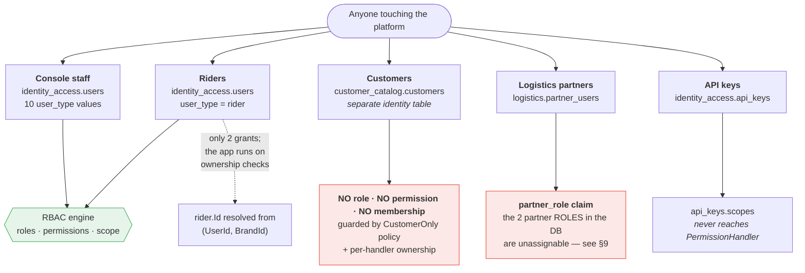

| Actor | Identity table | Roles? | Permissions? | Actually guarded by |
|---|---|---|---|---|
| Console staff | `identity_access.users` | yes | yes | the full RBAC engine |
| **Rider** | `identity_access.users` | `rider` (**2** grants) | 2 | `RiderOnly` policy + `(UserId, BrandId)` ownership |
| **Customer** | `customer_catalog.customers` | **none** | **none** | `CustomerOnly` policy + per-handler ownership |
| **Partner** | `logistics.partner_users` | 2 roles that **cannot be assigned** | 8 codes, **read by zero production lines** | `partner_role` claim |
| API key | `identity_access.api_keys` | n/a | `scopes[]` | `ApiScopeHandler`, a separate lane |

**`users.user_type` accepts 10 values** — `platform_admin, brand_admin, franchise_owner, store_admin,
staff, warehouse_staff, ops_staff, rider, auditor, support`. There is **no `customer` and no
`partner`**, which is the schema stating plainly that those two are not RBAC subjects.

> **`user_type` is not a role.** They are unrelated columns that have already drifted:
> `warehouse@laundryghar.local` has `user_type='warehouse_staff'` but holds the
> **`warehouse_supervisor`** role. This matters because `user_type` — not the role — is what
> `PermissionHandler.cs:33` and `TenantResolutionMiddleware.cs:40` key on.

---

## 2. The scope hierarchy — designed vs enforced

This is the single biggest gap between the documentation and the running system.

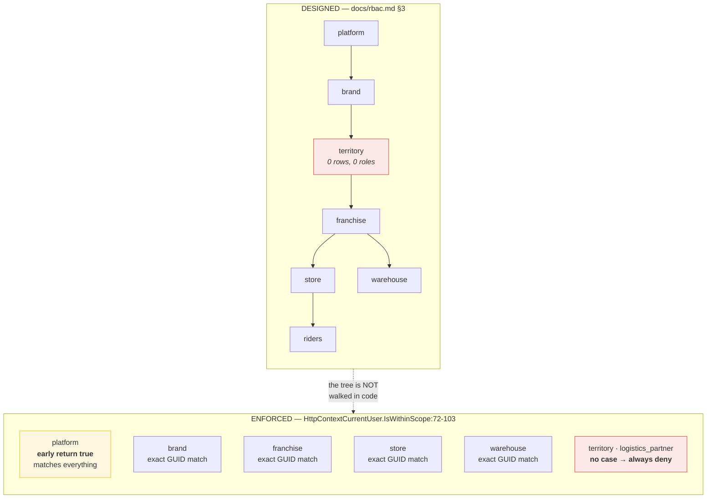

**`IsWithinScope` is a flat exact-match over four caller-supplied slots — there is no parent/child
relation inside it.** Nesting works only because each of **79 call sites** hand-resolves the
target's full ancestry and passes every slot. A call site that passes only the leaf silently denies
every ancestor. That behaviour is deliberate and pinned by `ScopeBoundaryTests.cs:49`.

Three consequences worth knowing:

- **`territory` is dead everywhere.** Declared in the CHECK constraint and in `ScopeType.cs`, with
  5 `territories.*` permissions — but `tenancy_org.territories` has **0 rows**, no role uses it, and
  `IsWithinScope` has no case for it.
- **`platform` scope is a master key.** `HttpContextCurrentUser.cs:46-48` —
  `IsPlatformAdmin => UserType == PlatformAdmin || ScopeType == "platform"`. **`auditor` is
  platform-scoped**, so an auditor token returns `true` from `IsWithinScope` for every target.
- **An absent `scope_nodes` claim fails OPEN** (`HttpContextCurrentUser.cs:84`) — a present-but-empty
  claim denies, a missing one allows everything.

### Role scope_type is advisory, not enforced

`GrantMembership` never compares `targetRole.ScopeType` against the requested membership scope.
Live proof — **4 of 20 active memberships violate their own role's declared scope**:

| Role | Declared scope | Actually granted at | Rows |
|---|---|---|---|
| `rider` | `store` | **`franchise`** | 3 |
| `platform_admin` | `platform` | **`brand`** | 1 |

---

## 3. The role catalogue

23 roles from **three different producers**: 17 seeded in C# (`IdentitySeeder.RoleDefs`,
`is_system=true`, `brand_id NULL`), 4 seeded by SQL patch as **brand-owned** custom roles, and
2 QA artefacts created through the live API.

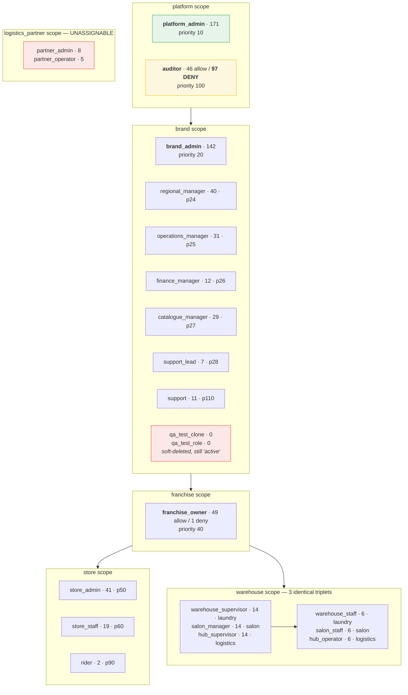

**`priority` is load-bearing in exactly one place**: the anti-escalation guard at
`GrantMembership.cs:180` — `targetRole.Priority < actorMinPriority` → 403. Note the **strict `<`**:
an actor can always grant a role of *equal* rank. Every UI-created role is hardcoded to priority 50
(`ManageRoles.cs:26`), the same as `store_admin`.

**The three warehouse triplets are byte-identical permission sets** differing only in `name` and
`vertical_key`. They are one role wearing three vertical costumes.

---

## 4. Who manages what — the authority matrix

The ten permission groups are `identity_access.permission_groups`, matched against a permission's
**legacy `module` column** (`GetRoleSurface.cs:114`). Cell = *permissions held / permissions in group*.
**Bold** = the role holds the entire group. `·` = nothing.

| Role | Scope | Book `24` | Disp `14` | Cust `7` | Catlg `26` | Staff `14` | Money `19` | Proc `12` | Rept `7` | Set `16` | Bill `4` | Ungrp `28` | Deny | **Total** |
|---|---|---|---|---|---|---|---|---|---|---|---|---|---|---|
| `platform_admin` | platform | **24/24** | **14/14** | **7/7** | **26/26** | **14/14** | **19/19** | **12/12** | **7/7** | **16/16** | **4/4** | **28/28** | · | **171** |
| `brand_admin` | brand | 15/24 | 11/14 | **7/7** | **26/26** | 13/14 | 18/19 | **12/12** | **7/7** | 14/16 | 2/4 | 17/28 | · | **142** |
| `regional_manager` | brand | 10/24 | 8/14 | 2/7 | 2/26 | 2/14 | 3/19 | 8/12 | 1/7 | · | · | 4/28 | · | **40** |
| `operations_manager` | brand | 11/24 | 10/14 | 2/7 | · | · | · | 7/12 | 1/7 | · | · | · | · | **31** |
| `finance_manager` | brand | · | · | · | · | · | 11/19 | · | 1/7 | · | · | · | · | **12** |
| `catalogue_manager` | brand | · | · | · | 24/26 | · | · | · | · | 5/16 | · | · | · | **29** |
| `support_lead` | brand | 3/24 | · | 2/7 | · | · | 1/19 | · | · | · | · | 1/28 | · | **7** |
| `franchise_owner` | franchise | 9/24 | 6/14 | 4/7 | 2/26 | 5/14 | 7/19 | 4/12 | 1/7 | · | 1/4 | 10/28 | 1 | **49** |
| `qa_test_clone` | brand | · | · | · | · | · | · | · | · | · | · | · | · | **0** |
| `qa_test_role` | brand | · | · | · | · | · | · | · | · | · | · | · | · | **0** |
| `store_admin` | store | 12/24 | 5/14 | 2/7 | 3/26 | 5/14 | 5/19 | 3/12 | · | 1/16 | 1/4 | 4/28 | · | **41** |
| `store_staff` | store | 10/24 | 1/14 | 1/7 | 2/26 | · | 1/19 | 3/12 | · | · | · | 1/28 | · | **19** |
| `hub_supervisor` | warehouse | 3/24 | 3/14 | · | · | · | · | 8/12 | · | · | · | · | · | **14** |
| `salon_manager` | warehouse | 3/24 | 3/14 | · | · | · | · | 8/12 | · | · | · | · | · | **14** |
| `warehouse_supervisor` | warehouse | 3/24 | 3/14 | · | · | · | · | 8/12 | · | · | · | · | · | **14** |
| `hub_operator` | warehouse | 2/24 | · | · | · | · | · | 4/12 | · | · | · | · | · | **6** |
| `salon_staff` | warehouse | 2/24 | · | · | · | · | · | 4/12 | · | · | · | · | · | **6** |
| `warehouse_staff` | warehouse | 2/24 | · | · | · | · | · | 4/12 | · | · | · | · | · | **6** |
| `rider` | store | · | 2/14 | · | · | · | · | · | · | · | · | · | · | **2** |
| `auditor` | platform | 4/24 | 4/14 | 2/7 | 5/26 | 3/14 | 10/19 | 2/12 | 6/7 | 6/16 | · | 4/28 | 97 | **46** |
| `support` | brand | 5/24 | 1/14 | 3/7 | · | · | 1/19 | · | · | · | · | 1/28 | · | **11** |
| `partner_admin` | logistics_partner | 8/24 | · | · | · | · | · | · | · | · | · | · | · | **8** |
| `partner_operator` | logistics_partner | 5/24 | · | · | · | · | · | · | · | · | · | · | · | **5** |

> ⚠️ **`module` and `module_key` are two different columns and they group differently.**
> `permissions.module` (51 values) drives this matrix and the admin UI.
> `permissions.module_key` (27 values + 3 NULL) drives the **entitlement** chain in §7.
> A reader who joins on the wrong one gets a different — and wrong — answer.

### Reading it by domain

| Domain | Owns it | Participates | Locked out |
|---|---|---|---|
| **Bookings** (24) | `platform_admin` | brand_admin 15, store_admin 12, operations_manager 11, regional_manager 10, store_staff 10, franchise_owner 9, partner_admin 8 | finance_manager, catalogue_manager, all 3 warehouse *staff* tiers beyond 2 |
| **Dispatch** (14) | `platform_admin` | brand_admin 11, operations_manager 10, regional_manager 8, franchise_owner 6, store_admin 5 | finance_manager, catalogue_manager, support_lead, **the operator tier** |
| **Customers** (7) | `platform_admin`, **`brand_admin`** | franchise_owner 4, support 3 | every warehouse role, both partner roles, rider |
| **Catalog** (26) | `platform_admin`, **`brand_admin`** | **catalogue_manager 24**, auditor 5, store_admin 3 | operations_manager, finance_manager, support, support_lead, all warehouse |
| **Staff & riders** (14) | `platform_admin` | brand_admin 13, franchise_owner 5, store_admin 5, auditor 3 | **operations_manager**, finance_manager, catalogue_manager, store_staff |
| **Money** (19) | `platform_admin` | brand_admin 18, **finance_manager 11**, auditor 10, franchise_owner 7, store_admin 5 | operations_manager, regional_manager (3), catalogue_manager |
| **Processing** (12) | `platform_admin`, **`brand_admin`** | **the 3 supervisors 8 each**, regional_manager 8, operations_manager 7 | finance_manager, catalogue_manager, support, partners |
| **Reports** (7) | `platform_admin`, **`brand_admin`** | auditor 6 | everyone else has 0 or 1 |
| **Settings** (16) | `platform_admin` | brand_admin 14, auditor 6, catalogue_manager 5 | **`franchise_owner` — 0/16**, and every store/warehouse role but one |
| **Billing** (4) | `platform_admin` | brand_admin 2, franchise_owner 1, store_admin 1 | all 19 others |
| **Ungrouped** (28) | `platform_admin` | brand_admin 17, franchise_owner 10 | — *invisible on the matrix UI, see below* |

### Five boundaries nobody would guess

**1 · Refund authority is split across two permissions with different holders.**

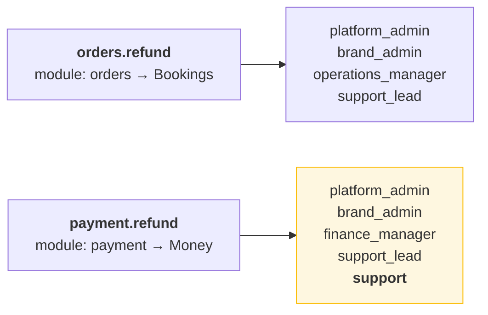

`support` — the **weakest brand role, 11 permissions** — can refund a payment but not an order.
`operations_manager` is the exact mirror: order yes, payment no. `finance_manager` can refund a
payment but cannot record one. Only `support_lead` and the two admins hold both.

**2 · `franchise_owner` holds two of the platform's most dangerous permissions.**
It has **0/16 Settings** — cannot change branding, cannot touch a domain — yet holds
**`api_keys.manage`** and **`impersonation.approve`**, both `risk_level='critical'`. They land in
the **ungrouped** 28, so neither appears on the matrix a brand owner delegates from.

**3 · The role built to be read-only can write.** `auditor` carries 97 explicit DENY rows and still
holds two mutating ALLOWs: **`domains.manage`** (high — rewrites the brand's custom domain config,
`AdminBrandDomains.cs:42-44`) and **`pricing.slab.manage`**. Root cause in §10.

**4 · `operations_manager` cannot manage staff.** 31 permissions, 10 of 14 Dispatch — and **0 in
Staff & Riders**. It can redirect the fleet but cannot onboard, verify or suspend a rider.

**5 · `regional_manager` can redirect the fleet but cannot read a report about it.**
Holds `pickup.assign` and `delivery.assign` (both high risk), 1/7 Reports, 0/16 Settings.

---

## 5. How authority is removed

Four mechanisms, in the order `ScopeResolver` applies them.

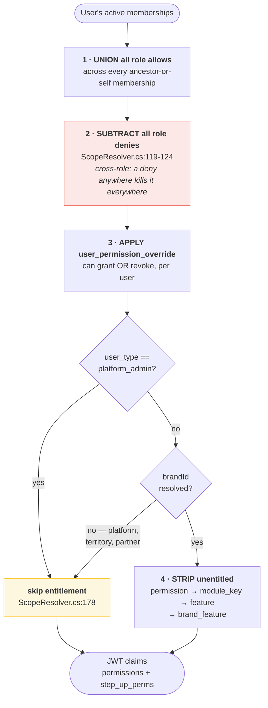

**Deny is cross-role and absolute.** Denies are unioned across *every* membership and subtracted
from the union of *all* allows. Granting someone an extra `auditor` membership at platform scope
would strip **97 permissions** from their other roles. `auditor` is an ambient poison pill.

**Two roles carry denies**, not one: `auditor` (97) and `franchise_owner` (1 — `royalty.override`,
which is `docs/rbac.md` §7's own worked example).

**Live revocation is real but partial.** `Auth:EnforceTokenVersion: true` is set in all three hosts'
`appsettings.json`. `users.perm_version` is bumped on six paths, with a ~15s propagation bound. But:

- `PermVersionBumper.BumpBrandMembersAsync:38-44` filters `ScopeType == Brand` — **franchise-,
  store-, warehouse-scoped users of that brand are not bumped** and keep their old authority until
  natural refresh. The code's own comment admits it.
- **Changing a user's `user_type` is not revocable at all.** `SetUserType.cs:61-69` bumps
  `users.version` but never `perm_version` — and `user_type` is what grants the total bypass.

**`user_permission_override` is write-only in the product.** There is no query anywhere that lists
a user's overrides; `admin-web/src/api/accessControl.ts` exposes only the POST. An administrator
cannot see what they previously set.

---

## 6. Step-up — the freshness gate

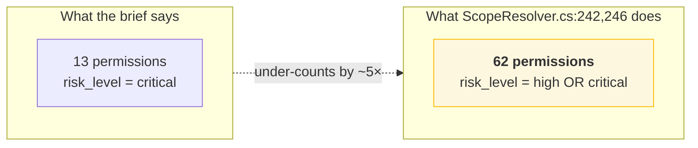

**Step-up is 5× broader than "the 13 criticals".** `users.create`, `pickup.assign`,
`delivery.assign`, `cashbook.manage`, `rider.manage`, every catalog write and every pricing publish
all demand a fresh OTP inside a **5-minute** window.

### The 13 critical permissions and who holds them

| Permission | platform_admin | brand_admin | franchise_owner |
|---|:--:|:--:|:--:|
| `platforms.create` · `platforms.delete` | ✓ | — | — |
| `brands.delete` | ✓ | — | — |
| `franchise_agreements.delete` | ✓ | — | — |
| `users.set_password` | ✓ | — | — |
| `royalty.override` | ✓ | — | *(deny)* |
| `customer.delete` · `franchises.delete` | ✓ | ✓ | — |
| `permissions.assign` · `roles.manage` · `users.set_type` | ✓ | ✓ | — |
| **`api_keys.manage`** | ✓ | ✓ | **✓** |
| **`impersonation.approve`** | ✓ | ✓ | **✓** |

**Five are platform-admin-only.** The two in bold are the ones that reach a franchisee.

### Where the gate leaks

- **The `amr` claim is write-only.** `TokenClaims.cs:69` defines it, `StepUpVerifyHandler.cs:120`
  sets it, `JwtTokenService` emits it — and **nothing ever reads it**. `StepUp.IsFresh` decides
  purely on `stepup_at`. The gate proves *recency*, not *method*.
- **An ordinary token refresh destroys freshness.** The upgraded token lives 15 minutes but is
  fresh for 5; `RefreshTokenHandler.cs:80` rebuilds claims with `StepUpAt` null.
- **It fails OPEN on a missing claim.** `StepUp.cs:22-23` returns false (not-required) when
  `step_up_perms` is absent.
- **Outside Production the gate is satisfiable with a constant.** `StepUpVerifyHandler.cs:96` keys
  the test-code path on `IsProduction()`, and `appsettings.Development.json` sets a `TestCode`.
- **`permissions.requires_scope` gates nothing** — the column exists on all 171 rows, is mapped by
  EF, and has no other reader anywhere in the backend.

---

## 7. Entitlement — the plan gate

A brand buys **features**; a feature unlocks **modules**; a module owns **permissions**.

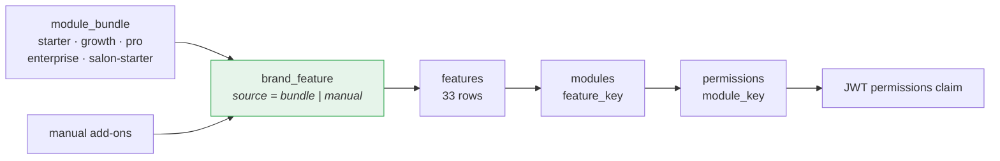

Enforced at **two points**, and they key on **different columns**:

| | Gate | Keys on |
|---|---|---|
| Token mint | `ScopeResolver.cs:177-231` | `permissions.module_key` |
| Sidebar | `GetNavigator.cs:53-55` | `modules.feature_key` |

`GetNavigator` claims it mirrors ScopeResolver "so the sidebar and the API can never disagree".
**They key on different columns and can disagree.** They also differ on platform admins:
`ScopeResolver` exempts them outright; `GetNavigator` does not and honours the `X-Brand-Id` header.

**`Entitlement:Enforced` is `true`** in all three hosts. **No feature is `is_core`** (`SELECT
count(*) FROM features WHERE is_core` → **0**), so the entitled set is exactly the licensed set.

Three carve-outs survive any plan:
- `module_key` is one of the 3 core modules (settings 34 + users 14) → **48 permissions**
- `module_key IS NULL` → orphans are kept unconditionally (`ScopeResolver.cs:231`) → **3 more**
  (`feature_flag.view`, `feature_flag.manage`, `dispatch.mode.manage`)
- the caller is a platform admin, or has no brand in context

**Six sellable features are billable no-ops** — `api_access`, `item_tracking`, `loyalty`,
`online_payments`, `wallet`, `whatsapp_bot` have no module, therefore no permission and no nav item.
Toggling them changes nothing. `api_access` is the sharpest: `api_keys.manage` is *not* behind it.

**Plan downgrade can revoke a rider.** `features.fleet` is not core, so un-licensing `fleet` strips
`rider.tasks.*` from every rider of that brand and 15 of the 22 rider routes begin returning 403 —
while login and GPS keep working, because those sit on `RiderOnly` alone.

---

## 8. Visibility — what you can *see*

Authority says what you may do. RLS says which rows exist for you. **They are not aligned.**

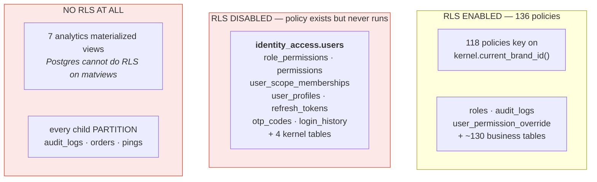

**RLS is brand-only.** `RlsConnectionInterceptor.cs:60-68` sets brand / franchise / store / user /
partner session variables, but **118 of 136 policies reference only `current_brand_id()`**. Proven
live: setting `app.current_store_id` and `app.current_franchise_id` to foreign UUIDs changes nothing
— orders 9→9, customers 12→12. **The entire franchise/store/warehouse layer has zero database
enforcement.** There is no `app.current_warehouse_id` at all.

Four things follow that are worth knowing before trusting the tenant boundary:

1. **`identity_access.users` has RLS disabled** — its `rls_admin_only` policy is inert, there is no
   EF query filter, and `GetUsers.cs:19-30` applies no brand predicate.
2. **Direct partition access defeats RLS.** Every child partition has `relrowsecurity='f'`. Querying
   `audit_logs_p20260801` directly returns rows the parent would filter.
3. **`bypass_rls` is set in at least six places**, three of them on *unauthenticated* requests
   (`core.WebApi/Program.cs:542` — the whole customer and partner auth surface).
4. **Reads are never audited.** `AuditSaveChangesInterceptor.cs:85` fires only on
   Added/Modified/Deleted. Every PII read — bank details, Aadhaar, the customer directory, an
   impersonated session browsing — leaves no trace. And **86% of audit rows have `brand_id IS NULL`**,
   so tenants cannot see them through the parent table anyway.

### Impersonation

`impersonation.request` and `impersonation.approve` are deliberately split so nobody can consent on
their own behalf — migration 0014 ends with a `DO $$` block that raises if any role holds both.
**The dev seeder re-breaks it**: `IdentitySeeder.cs:495-496` blanket-grants every permission to
`platform_admin`, and runs automatically on every boot in Development.

**An impersonation session is not restricted.** `StartImpersonationSession` preserves
`user_type=platform_admin`, so `TenantResolutionMiddleware` still sets `bypass_rls=true` — the
session ignores the brand narrowing the grant was meant to impose.

---

## 9. Non-console actors in detail

### Rider — 2 permissions, 22 routes

The `rider` role holds only `rider.tasks.read` and `rider.tasks.update`. The app works because
authority is **ownership**, not permission:

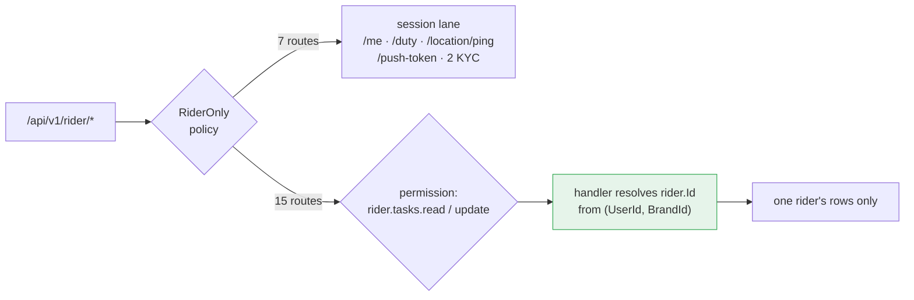

That split is deliberate: stripping `rider.tasks.*` leaves login and live GPS working while task and
earnings routes 403. **Three handlers break the ownership pattern** — `GetMyRiderProfile` omits
`BrandId` entirely, `RiderPushToken` register does no rider lookup, and `GetProofPhotoStream` is a
brand-scoped admin query filed under `RiderSelf`.

### Customer — zero RBAC surface

Customers live in `customer_catalog.customers`, hold no role and no permission, and are guarded by
the `CustomerOnly` policy (9 group-level gates + 5 route-level) plus per-handler ownership. The
customer-self RLS key **is never set**: `ICurrentTenant` declares five ids and **no `CustomerId`**,
so `app.current_customer_id` is declared in SQL and never populated. `docs/raas-partner-rbac-blueprint.md`
calls this "the single most important correctness lesson from the codebase".

### Logistics partner — roles that cannot exist

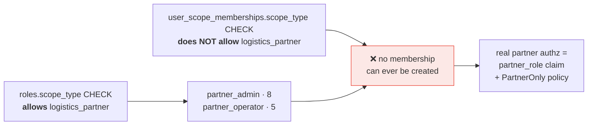

The two `roles` CHECK constraints were relaxed asymmetrically. The **8 partner permission codes are
read by zero lines of production code**; `partner_booking.cancel` is granted to both partner roles
and explicitly denied to `auditor` for **an endpoint that was never built**.

Partners also have **no logout and no refresh** — `PartnerAuth` maps only `/otp/send` and
`/otp/verify`, and `refresh_tokens` has no partner column. Customers do have a logout.

---

## 10. Where the model lies

Ranked by how badly a reader would be misled.

| # | What the screen says | What is true | Where |
|---|---|---|---|
| 1 | `auditor` looks like the **most powerful role** on the access-control matrix — 102 ticked cells vs `platform_admin`'s 103 | Only **36** are real grants. The other 66 are its **DENY rows rendered as ticks** — `GetAccessRoles.cs:44` selects permission codes with no `Effect` filter | `GetAccessRoles.cs:44` |
| 2 | Ticking a checkbox saves | If the cell has a deny row, `SetRoleCells.cs:69` inserts nothing, leaves the deny, and **returns success**. The box was already ticked and stays ticked | `SetRoleCells.cs:69` |
| 3 | One checkbox = one area | **"Settings · View" grants 38 permissions**, including `api_keys.manage` and `royalty.override` (both critical), `impersonation.request`, `paymentmethod.manage`, `dispatch.mode.manage`. `ModuleMatrix` falls **unmapped modules through to `settings`** | `ModuleMatrix.cs:46` |
| 4 | "Users · Approve" is one permission | It maps to **`permissions.assign` (critical) + `memberships.grant`** — one tick is the self-escalation checkbox, and `AssignPermissionCommandHandler` is 11 lines with **no guards at all** | `AssignPermission.cs:16-27` |
| 5 | `auditor` is read-only | It holds `domains.manage` and `pricing.slab.manage`. **Root cause:** migration `0019` and `value_slab_pricing.sql` both grant "to every role that already holds *X*" and **both forgot `AND rp.effect = 'allow'`** — reading a DENY row as evidence of holding it | `0019:52-61` |
| 6 | 23 roles, all active | `qa_test_clone` and `qa_test_role` were **soft-deleted 2026-06-21** but `roles.status` was never updated. The app filters on `deleted_at`; every SQL export and BI query sees them as live and assignable | `roles.status` |
| 7 | The matrix covers everything | **28 permissions are in no group** — all of franchises, agreements, stores, territories, platforms, API keys, impersonation, holidays, operating hours. **6 of the 13 criticals are in there** | `permission_groups` |
| 8 | Roles are visible to the people who delegate them | `identity_access.roles` has RLS **enabled** with `rls_brand USING (bypass OR brand_id = current_brand_id())`, and all 17 system roles have `brand_id NULL`. **A brand admin cannot SELECT a single system role** | `pg_policies` |
| 9 | `docs/rbac.md` §4 lists the roles | It lists **13**; the DB has **23**. It gives `regional_manager` the `territory` scope (DB says `brand`) and its critical examples (`role.manage`, `franchise.delete`) are **not real permission codes** | — |
| 10 | Permissions gate endpoints | **46 of 171 are referenced by no endpoint policy anywhere** — including `orders.refund` (high) and `royalty.override` (critical). Conversely, module `appointments` requires `appointment.manage`, **which does not exist** | — |

---

## 11. Reality check — what is actually assigned

The matrix above is largely **theoretical**.

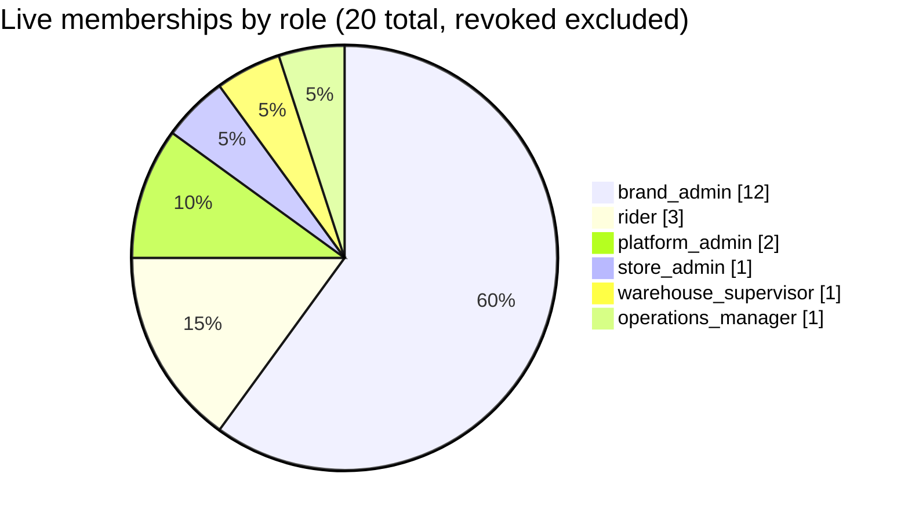

**17 of 23 roles have zero live members.** That includes `franchise_owner`, `finance_manager`,
`catalogue_manager`, `support`, `support_lead`, `auditor`, `store_staff`, both partner roles and
five of the six warehouse roles. Eleven of the twelve `brand_admin` memberships are on throwaway
wizard-test brands (`wd*`/`wiz*@test.local`), all written on 2026-08-25, **all with `granted_by NULL`**
— meaning none went through `GrantMembership`, so **the anti-escalation guard has never actually run
in this database**.

---

## 12. What to fix first

Ordered by blast radius, not by effort.

1. **Add `AND rp.effect = 'allow'`** to the two grant-propagation scripts, and revoke `auditor`'s
   `domains.manage` / `pricing.slab.manage`. A read-only role can currently rewrite a domain.
2. **Filter `Effect` in `GetAccessRoles.cs:44`.** Until then, the access-control screen shows denies
   as grants and the platform's read-only role looks like its most powerful one.
3. **Make `SetRoleCells` effect-aware** — it must flip or refuse denied cells, never silently no-op.
4. **Guard `AssignPermissionCommandHandler`.** Eleven unguarded lines behind a critical permission.
5. **Enable RLS on `identity_access.users`** (and decide about the other 12 inert-policy tables).
6. **Bump `perm_version` in `SetUserType`.** A `user_type` change is currently unrevocable, and
   `user_type` is what grants the total bypass.
7. **Decide the `settings` catch-all.** 38 permissions behind one checkbox, including four criticals,
   is not a delegation surface — it is an accident.
8. **Delete or deactivate `qa_test_clone` / `qa_test_role`**, and reconcile `roles.status` with
   `deleted_at`.
9. **Either implement or remove** the partner roles, the `territory` scope, and the 6 no-op sellable
   features. Each is a promise the schema makes and the code does not keep.

---

## Appendix · sources

- **Live DB** `laundry_ghar_db` @ localhost:5432 — PostgreSQL 18, migrations 0001–0022 applied.
- **Exports** used for the matrix: `roles`, `permissions`, `role_permissions`, `permission_groups`,
  `modules`, `features` (psql `-At`, no headers).
- **Code** `backend/laundryghar` — `ScopeResolver`, `HttpContextCurrentUser`, `PermissionHandler`,
  `StepUp`, `ModuleMatrix`, `GetAccessRoles`, `SetRoleCells`, `RlsConnectionInterceptor`,
  `AuditSaveChangesInterceptor`, `IdentitySeeder`.
- **Docs consulted and found to diverge**: `docs/rbac.md`, `docs/rbac-entitlement-plan.md`,
  `docs/raas-partner-rbac-blueprint.md`, `docs/SAAS_PLATFORM_ARCHITECTURE.md`.

*Counts are point-in-time against a development database with test fixtures. The structural claims
— which columns gate what, which policies are inert, which code paths skip which check — are
properties of the schema and the source, not of the data.*
