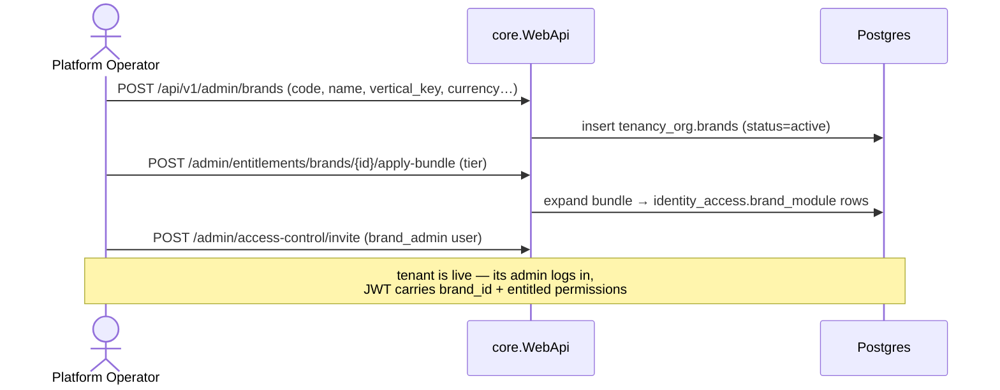
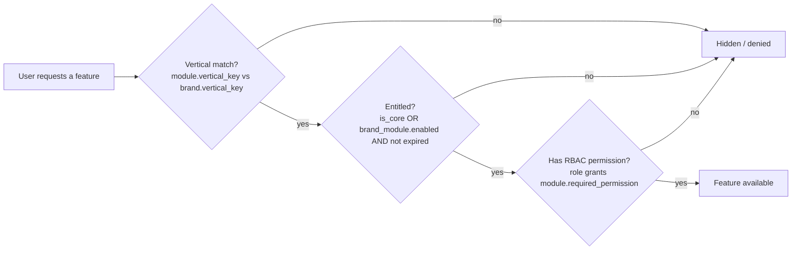
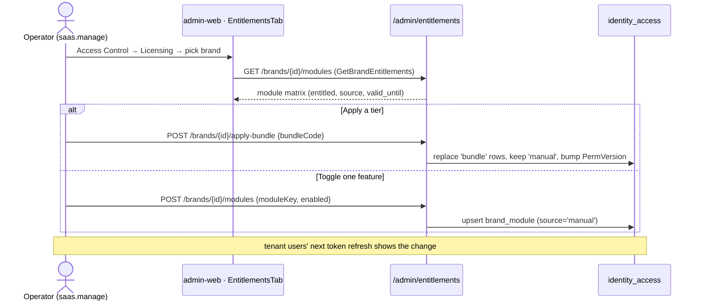
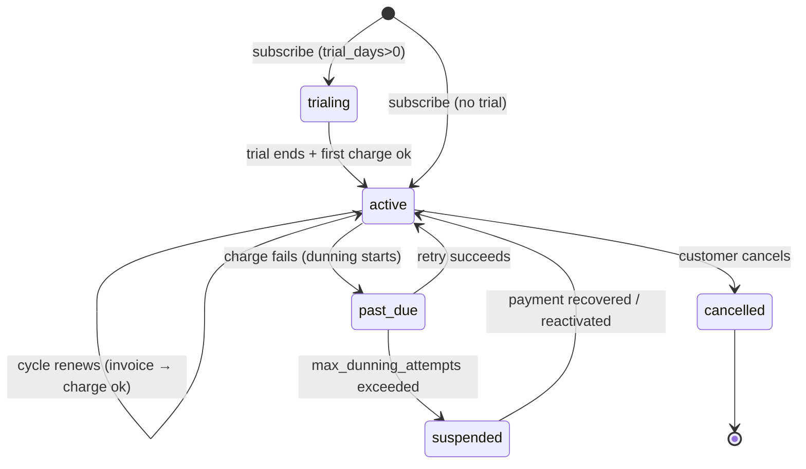
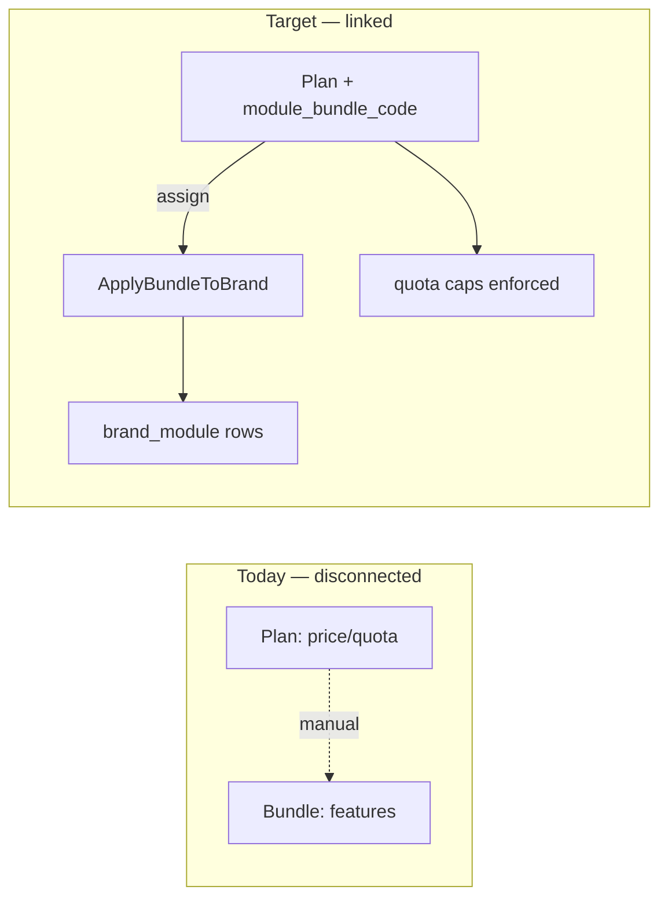

# LaundryGhar — SaaS / PaaS Platform Architecture

> **Status:** Living document · **Last updated:** 2026-06-28
> **Audience:** Engineering, Product, Platform Operations
> **Scope:** How LaundryGhar is delivered as a multi-tenant SaaS — tenant isolation, feature
> entitlement/gating ("which features a tenant can use"), and monetization/charging.
>
> Related: [`MULTI_VERTICAL_BLUEPRINT.md`](./MULTI_VERTICAL_BLUEPRINT.md) ·
> [`rbac-entitlement-plan.md`](./rbac-entitlement-plan.md) · [`rbac-paas-gap.md`](./rbac-paas-gap.md) ·
> [`ADRs/ADR-001-rls-over-schema-per-tenant.md`](./ADRs/ADR-001-rls-over-schema-per-tenant.md) ·
> [`ADRs/ADR-010-recurring-billing-and-dunning.md`](./ADRs/ADR-010-recurring-billing-and-dunning.md)

---

## 1. Executive summary

LaundryGhar is a **multi-tenant, multi-vertical SaaS**. A single deployment serves many independent
businesses ("brands") across the laundry, salon, and logistics verticals from one codebase and one
database, with hard data isolation and per-tenant feature licensing.

Three pillars make it a SaaS:

| Pillar | One-line model | Where it lives |
|---|---|---|
| **Tenancy** | A **Brand** is the tenant. Isolation by PostgreSQL **RLS** + a JWT `brand_id` claim. | `tenancy_org`, `RlsConnectionInterceptor`, `ScopeResolver` |
| **Feature entitlement** | `modules` (catalog) → `module_bundle` (tiers) → `brand_module` (what a tenant licensed). Access = **Entitlement ∩ RBAC**. | `identity_access`, `GetNavigator`, `ApplyBundleToBrand` |
| **Charging** | Customer subscriptions · prepaid packages · franchise SaaS fee + royalty. | `commerce`, `finance_royalty`, `SubscriptionBillingService` |

The **governing rule** for "which features can a tenant use" is:

> **Effective access = Entitlement (did the tenant buy it?) ∩ Authorization (does the user's role grant it?)**

Both checks are pre-computed and baked into the JWT at login, so every downstream API call enforces
licensing automatically with no per-endpoint code.

---

## 2. Tenancy — how a customer becomes an isolated tenant

### 2.1 The tenancy hierarchy

```
Platform                         (the operator: "LaundryGhar Inc.")
└── Brand            ← THE TENANT (e.g. "Sparkle Laundry", "Glow Salon")  · brand.vertical_key
    ├── Franchise               (a franchisee operating under the brand)
    │   ├── Store               (a customer-facing outlet)
    │   └── Warehouse           (an on-site processing hub)
    └── (users are attached to any scope via UserScopeMembership)
```

A **Brand operates exactly one vertical** (`brand.vertical_key` ∈ `laundry|salon|logistics`, immutable
once orders exist). The vertical is denormalized onto every order and drives fulfilment strategy, mobile
feature packs, and module/role visibility (see §3.4).

### 2.2 Tenant isolation (defense in depth)

| Layer | Mechanism | File |
|---|---|---|
| **Database (RLS)** | Every brand-scoped table has a Row-Level-Security policy: `brand_id = current_setting('app.current_brand_id')` (or `app.bypass_rls='true'` for platform admins). | `database_scripts/01_bc1_tenancy_org.sql`, ADR-001 |
| **Connection** | `RlsConnectionInterceptor` runs `SET app.current_brand_id/…` on **every** DB connection from the request's tenant context. | `…/Persistence/Interceptors/RlsConnectionInterceptor.cs` |
| **Request** | `TenantResolutionMiddleware` reads JWT claims, marks `bypass_rls` for platform admins, validates token version (live revocation). | `…/Middlewares/TenantResolutionMiddleware.cs` |
| **Identity** | `ScopeResolver` derives `brand_id/franchise_id/store_id` from the user's active membership → JWT claims. | `…/Identity/Auth/Common/ScopeResolver.cs` |
| **Business logic** | `ICurrentUser.RequireBrandId()` / `TryGetBrandId()` guard tenant-scoped reads/writes. | `…/Services/HttpContextCurrentUser.cs` |

> **RLS is the safety net, not the only gate.** Anonymous/public endpoints (e.g. the customer catalog)
> have no token, so `BrandResolver` resolves the brand from `X-Brand-Id`/`?brandCode=` and adds explicit
> `brand_id` predicates — RLS cannot be relied on there (`core.Infrastructure/Services/BrandResolver.cs`).

### 2.3 Platform-admin "operate-as-tenant"

A `platform_admin` carries no `brand_id` in their JWT. They select a brand in the **BrandSwitcher**, which
sends `X-Brand-Id: <uuid>` on every request. `ICurrentUser.TryGetBrandId()` returns that override, so the
operator sees and manages exactly one tenant's data at a time while retaining RLS bypass.

### 2.4 Users → tenants

Users are **global** (`identity_access.users`) but attached to a tenant via **`UserScopeMembership`**
(user → role within a scope: Platform/Brand/Franchise/Store/Warehouse). A user can hold several
memberships; one is `is_primary`. Login resolves the primary membership → the brand it belongs to → the
JWT `brand_id`. (A denormalized `user.vertical_key` "home vertical" mirrors the primary membership's brand
vertical for convenience — see `phase4_user_vertical_key.sql`.)

### 2.5 Provisioning a tenant



`POST /api/v1/admin/brands` (`CreateBrandCommand`, perm `brands.create`) is **operator-driven** today —
there is **no self-serve signup** (see §6 gaps).

---

## 3. Feature entitlement & gating — "which features can a tenant use or not"

This is the PaaS licensing layer. It answers *"Brand X may use feature Y"* and enforces it everywhere.

### 3.1 The three tables

```
identity_access.modules            the FEATURE CATALOG
  key, label, icon, route, section, required_permission,
  permission_modules[], vertical_key (null=neutral), is_core, show_in_nav

identity_access.module_bundle      the SELLABLE TIERS  (+ module_bundle_item = N:M to modules)
  code (starter|pro|enterprise|salon-starter…), vertical_key

identity_access.brand_module       WHAT A TENANT ACTUALLY OWNS   (brand_id, module_key)
  enabled, valid_until (null=perpetual), source ('bundle' | 'manual')
```

- **Module** = a gateable feature (a nav entry + the permission that guards it).
- **Bundle** = a tier/package = a set of modules. Bundles are *not* read on the hot path — they exist only
  to **expand into `brand_module` rows** when a plan is assigned.
- **BrandModule** = the per-tenant license. `source='bundle'` rows come from a tier; `source='manual'` rows
  are per-brand exceptions that **survive** bundle re-applies.

### 3.2 The governing rule: Entitlement ∩ Authorization



Two enforcement points apply this rule:

1. **`GetNavigator`** (the sidebar): filters modules `vertical → entitlement (Entitlement:Enforced flag) →
   permission`, groups by section. (`…/AccessControl/Queries/GetNavigator/GetNavigator.cs`)
2. **`ScopeResolver`** (login): strips un-entitled permissions out of the JWT, so **every API
   `HasPermission` check enforces licensing automatically** — no per-endpoint work.
   (`…/Identity/Auth/Common/ScopeResolver.cs`)

> **Canonical module ownership.** Each permission has a `permission.module_key` = the *single* module that
> "owns" it (`permission_canonical_module.sql`). This disambiguates tag overlap (e.g. `orders.*` is owned by
> the `orders` module even though the `pos` module also tags `orders`), so un-licensing one module revokes
> exactly its permissions.

### 3.3 Core modules never gate

Modules with `is_core=true` (dashboard, settings, users) bypass entitlement entirely — a tenant can never
lock its own admins out by mismanaging licensing.

### 3.4 Multi-vertical gating

`VerticalKey.IsAvailableTo(featureKey, brandKey)` = `feature==null || brand==null || feature==brand`. It is
applied to **modules, bundles, and roles** so a salon brand never sees laundry-only features. This now
covers:
- **Modules** (`GetNavigator`, `GetBrandEntitlements`, `ApplyBundleToBrand`)
- **Bundles** (`module_bundle.vertical_key`, validated on apply)
- **Roles** (`role.vertical_key` — `warehouse_*`=laundry, `salon_manager`/`stylist`=salon, `hub_*`=logistics;
  see `phase4_role_vertical_key.sql`)
- **Brand DTO** carries `vertical_key` so clients can drive vertical-aware terminology.

### 3.5 The operator workflow (admin-web → "Licensing" tab)



Endpoints (all under `AdminEntitlements.cs`, gated `saas.read`/`saas.manage`):
`GET /bundles` · `GET /brands/{id}/modules` · `POST /brands/{id}/modules` (`SetBrandModule`) ·
`POST /brands/{id}/apply-bundle` (`ApplyBundleToBrand`).

---

## 4. Charging & monetization — "how to charge"

There are **three independent revenue models**, each with entities, invoices, and background workers
already implemented (real gateway charging is the main stub — see §6).

### 4.1 Model A — Customer subscriptions (recurring) · `commerce`

```
SubscriptionPlan         price, billing_interval, quota_type/value, rollover, fulfillment_inclusions, gateway
  → CustomerSubscription  per-customer instance, snapshots, lifecycle (trialing→active→past_due→suspended)
      → SubscriptionInvoice         generated per cycle (subtotal + TaxBreakdown → grand_total, amount_due)
      → SubscriptionUsageLedger     append-only quota: allocate / consume / rollover / expire
      → PaymentMandate              UPI AutoPay / e-mandate authorization (Razorpay)
      → SubscriptionBillingAttempt  append-only charge attempts (idempotency key, dunning backoff)
```

Daily **`SubscriptionBillingService`** (flag `Worker:SubscriptionBillingEnabled`): generates due invoices,
allocates quota (with rollover), charges via `ISubscriptionCharger` against the mandate, and runs
**dunning** — on failure it records an attempt, schedules `next_retry_at`, and after
`max_dunning_attempts` (default 3) flips the subscription to **suspended** and emits
`subscription.suspended`. `RazorpayWebhook` reconciles `payment.captured/failed`.

### 4.2 Model B — Prepaid packages (one-time) · `commerce`

`commerce.packages` = one-time credit purchases (code, price, credit_value, validity) drawn down via
`package_usage_ledger`. Distinct from subscriptions (no recurrence).

### 4.3 Model C — Franchise SaaS fee + royalty · `finance_royalty`

```
PlatformPlan             SaaS tier sold to franchises: price, setup_fee, trial,
                          quotas (max_stores/users/orders/riders), overage rates, features[]
  → FranchiseSubscription per-franchise instance (one live, snapshots, dunning fields)
      → FranchiseSubscriptionInvoice  base + overage + tax, usage_snapshot
RoyaltyInvoice           monthly revenue-share (royalty% + marketing fee + tech fee + GST)
  → RoyaltyCalculation    per-source line items (gross → eligible → royalty)
```

Monthly **`RoyaltyGenerationService`** (flag `Worker:RoyaltyGenerationEnabled`) aggregates the prior
month's captured payments per franchise and emits `royalty.invoice_generated`.

### 4.4 Cross-cutting

- **Tax:** one shared `TaxBreakdown` owned type (CGST/SGST/IGST, jsonb) across all three invoice families
  (multi-vertical slice 2F).
- **Payments/wallet:** `payment_methods` (upi/card/cod/wallet/…), `wallet_accounts` + append-only
  `wallet_transactions`.
- **Events:** transactional **outbox** (`kernel.outbox_events`, ADR-007) → `subscription.renewed`,
  `…past_due`, `…suspended`, `payment.captured/failed`, `royalty.invoice_generated`.

### 4.5 Subscription billing lifecycle



---

## 5. How money maps to features (the connective tissue)

This is the crux of operating as a commercial SaaS, and it is the **least complete** seam today.

**Two separate concepts exist:**

| Concept | Encodes | Table |
|---|---|---|
| **Module bundle** | *which features* a tier unlocks | `identity_access.module_bundle` |
| **Plan** | *the price + quotas* a tenant/franchise pays | `commerce.subscription_plans`, `finance_royalty.platform_plans` |

**There is no link table between them.** So "subscribe to **Pro** = ₹X **and** unlock the Pro modules" is
*two manual operations*: set the price on a plan, then separately `apply-bundle` the matching tier.

> **✅ Implemented (2026-06-28) — refined from the original FK idea.** `platform_plan` lives in the
> **commerce** host (`finance_royalty`) while `brand_module`/`module_bundle` live in **core**
> (`identity_access`), so a `platform_plan.module_bundle_code` FK would make both *validation* and
> *apply* cross core↔commerce. And `platform_plans` are **franchise-level** SaaS tiers — the wrong grain
> for **brand-level** entitlement. So instead the **`module_bundle` itself carries the brand-tier price**
> (`price`, `billing_interval`, `currency_code`, `is_public` — patch `phase4_bundle_pricing.sql`). Now
> **one object ties price ↔ features in the same context as entitlement**, and `ApplyBundleToBrand`
> (which already bumps `PermVersion`) is the single "put brand on tier" action. `platform_plans` remains
> the separate **franchise** SaaS axis. Pricing surfaces in the Licensing tab (`GetModuleBundles` →
> `EntitlementsTab`). **Next:** issue a recurring brand-platform invoice from this price (reuse the
> `SubscriptionBillingService` machinery).



---

## 6. Gaps & roadmap to commercial GA

Ordered by leverage. The architecture is present; these are the "last-mile" items.

### P0 — blocks taking real money
1. **Real gateway charging.** `ISubscriptionCharger` is `DevSubscriptionCharger` (simulates success).
   Implement `RazorpaySubscriptionCharger` (mandate auth + auto-debit). Plumbing (mandates, webhook) exists.
   *(Still open — needs live Razorpay credentials.)*
2. **✅ DONE — Plan ↔ Bundle link + brand-platform billing** (§5). `module_bundle` now carries the
   brand-tier price (`phase4_bundle_pricing.sql`); applying a bundle sets price + features in one action.
   And there is now a **brand-level platform subscription**: `identity_access.brand_platform_subscription`
   + `brand_platform_invoice` (`phase4_brand_platform_subscription.sql`). `ApplyBundleToBrand` snapshots
   the tier price → upserts the subscription → issues the first invoice (one core transaction); the
   `BrandPlatformBillingService` worker (opt-in `Worker:BrandPlatformBillingEnabled`) issues renewals. A
   mid-cycle **upgrade** issues a prorated invoice for the price difference over the remaining period (a
   downgrade keeps the lower price and applies at next renewal). The Licensing tab shows the current tier +
   latest invoice. **Remaining:** actually *charge* the invoices (P0 #1).
3. **✅ ALREADY DONE — Live entitlement revocation.** Both `ApplyBundleToBrand` *and* `SetBrandModule`
   already bump `PermVersion` (`BumpBrandMembersAsync`); with `Auth:EnforceTokenVersion` on, the change is
   live (stale tokens rejected). The earlier audit claim that neither bumps was incorrect.

### P1 — operate the business
4. **Franchise subscription billing job** (analogue of `SubscriptionBillingService`) — invoices + charges
   for `finance_royalty.franchise_subscriptions` are entity-only today.
5. **Operator UIs:** ✅ **platform MRR view DONE** (`/platform-billing` — MRR, ARR, active tenants,
   revenue-by-tier, invoices-by-status; `GET /admin/entitlements/platform-billing`). Remaining:
   per-invoice management/retry, usage/quota dashboard, churn analytics, payment-gateway settings.
6. **Overage & proration** — plans carry overage rates and mid-cycle starts but neither is charged.
7. **Suspension enforcement in the order path** — a `suspended` subscription does not yet block service.

### P2 — growth & polish
8. **Self-serve brand signup** (product-led growth) — brands are operator-created only.
9. **Plan↔quota unification in UX** — `max_stores/users/orders` caps aren't surfaced next to feature
   licensing; a tenant can be "entitled" to a feature yet blocked by a quota.
10. **Entitlement audit log** + **graceful degradation** (sunset warnings / read-only) instead of hard lockout.
11. **Coupons on subscriptions**, **mandate-expiry re-auth**, **revenue recognition (ASC 606)**.

---

## 7. Configuration flags

| Key | Effect |
|---|---|
| `Entitlement:Enforced` | Master switch for the entitlement gate in `GetNavigator` + `ScopeResolver`. Off = RBAC only (all features visible if permitted). |
| `Auth:EnforceTokenVersion` | Reject JWTs with a stale `perm_version` (live revocation of role/permission changes). |
| `Worker:SubscriptionBillingEnabled` / `…PollIntervalSeconds` | Enable + cadence of the customer-subscription billing job. |
| `Worker:SubscriptionDunningBackoffMinutes` | Backoff between failed-charge retries. |
| `Worker:RoyaltyGenerationEnabled` / trigger day | Enable + day-of-month for royalty invoice generation. |
| `Razorpay:WebhookSecret` | HMAC secret for `POST /webhooks/razorpay` (fail-closed in non-Development). |

---

## 8. Key files index

**Tenancy**
- `database_scripts/01_bc1_tenancy_org.sql` — brand/franchise/store/warehouse + RLS policies
- `…/Persistence/Interceptors/RlsConnectionInterceptor.cs`, `…/Middlewares/TenantResolutionMiddleware.cs`
- `…/Identity/Auth/Common/ScopeResolver.cs`, `…/Services/HttpContextCurrentUser.cs`
- `…/Identity/TenancyOrg/Brands/Commands/CreateBrand/CreateBrand.cs`, `…/Endpoints/Identity/AdminBrands.cs`

**Entitlement / gating**
- Entities: `…/IdentityAccess/AppModule.cs`, `ModuleBundle.cs`, `ModuleBundleItem.cs`, `BrandModule.cs`, `Permission.cs`
- `…/Identity/Entitlements/Queries/GetBrandEntitlements.cs`, `GetModuleBundles.cs`
- `…/Identity/Entitlements/Commands/ApplyBundleToBrand.cs`, `SetBrandModule.cs`
- `…/AccessControl/Queries/GetNavigator/GetNavigator.cs`, `…/Endpoints/Identity/AdminEntitlements.cs`
- `…/Enums/VerticalKey.cs`; patches `brand_module_entitlement.sql`, `permission_canonical_module.sql`,
  `phase4_role_vertical_key.sql`

**Charging**
- `…/Commerce/Subscriptions/{SubscriptionPlan,CustomerSubscription,SubscriptionInvoice,PaymentMandate}.cs`
- `…/FinanceRoyalty/Subscriptions/{PlatformPlan,FranchiseSubscription,FranchiseSubscriptionInvoice}.cs`
- `commerce.Infrastructure/Worker/Services/{SubscriptionBillingService,RoyaltyGenerationService}.cs`
- `commerce.Application/Commerce/Webhooks/RazorpayWebhookHandler.cs`, `…/Common/TaxBreakdown.cs`
- `docs/08_subscriptions_customer.sql`, `docs/09_subscriptions_franchise.sql`, `ADRs/ADR-010-recurring-billing-and-dunning.md`

**Operator UI (admin-web)**
- `src/pages/access-control/EntitlementsTab.tsx`, `AccessControlPage.tsx`
- `src/pages/tenancy/TenancyPage.tsx`, `src/pages/subscriptions/SubscriptionsPage.tsx`, `src/pages/packages/PackagesPage.tsx`
- `src/components/layout/BrandSwitcher.tsx`, `src/stores/brandStore.ts`

---

## 9. Glossary

| Term | Meaning |
|---|---|
| **Platform** | The operator running the SaaS (top of the hierarchy). |
| **Brand** | **The tenant.** The unit of data isolation and licensing. Operates one vertical. |
| **Module** | A gateable feature (nav entry + guarding permission). |
| **Bundle** | A sellable tier = a set of modules. Expands into `brand_module` rows on apply. |
| **BrandModule** | A tenant's license for one module (`enabled`, `valid_until`, `source`). |
| **Entitlement** | "Did the tenant buy this feature?" (`brand_module`). |
| **Authorization (RBAC)** | "Does this user's role grant this permission?" (`roles`/`role_permissions`). |
| **Vertical** | `laundry` / `salon` / `logistics`; a brand operates exactly one. |
| **Mandate** | A customer's standing authorization for recurring debits (UPI AutoPay / e-mandate). |
| **Royalty** | The brand→franchise revenue-share invoice (separate from the SaaS access fee). |
