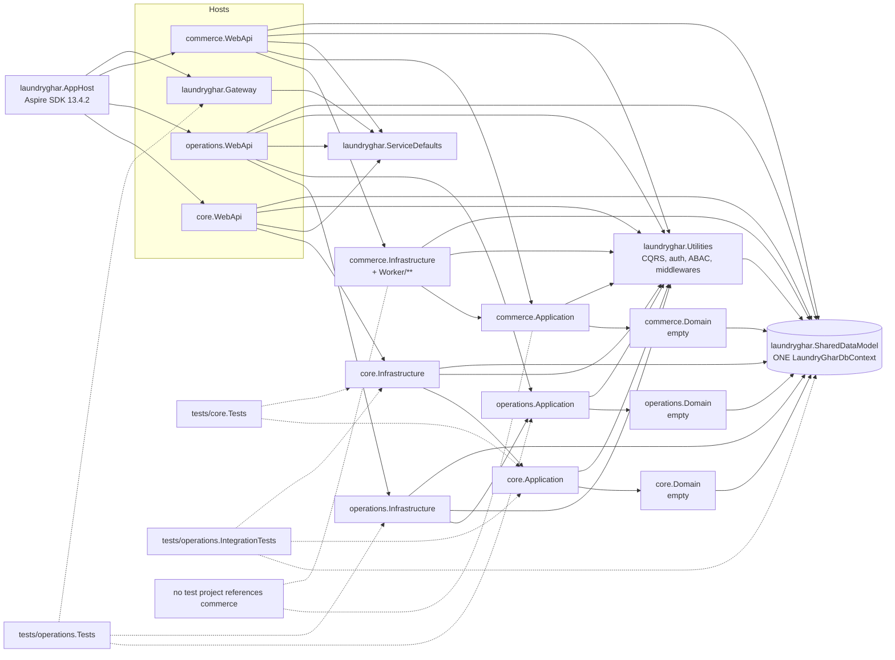
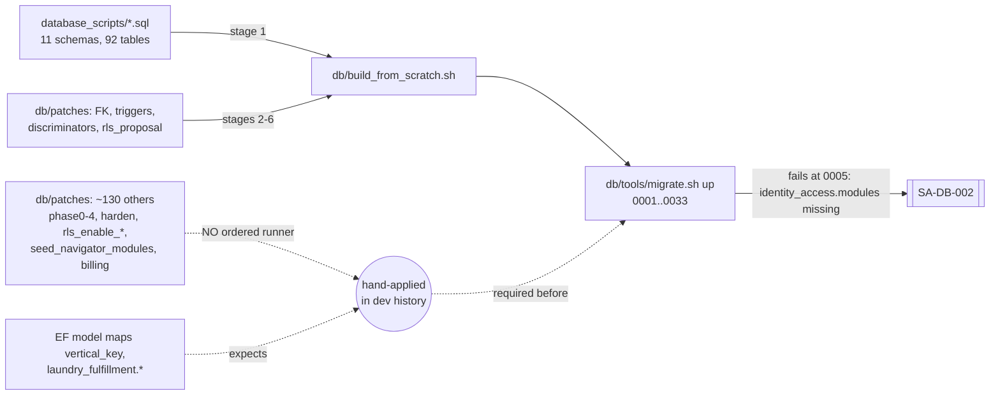
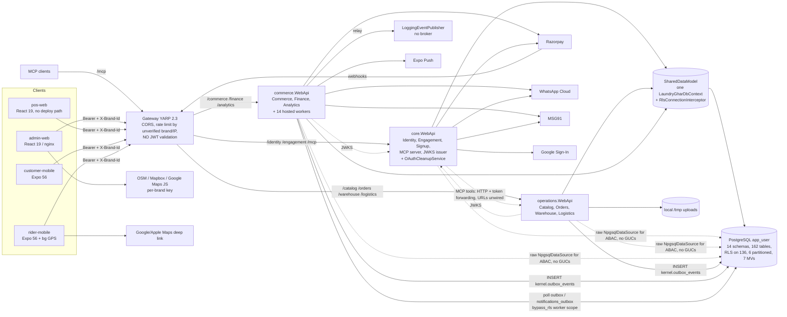

# 02 — Application and Codebase Inventory

LaundryGhar SaaS audit · Report 2 of the consolidated deliverables · 2026-10-09 · branch `claude/brave-dijkstra-6hlddw` (HEAD `a9fedd0`; the only commits after the CI-tested SHA `274b7af` touch `docs/`, per [10b](specialists/10b-qa-verification-platform.md))

## Summary

- **Shape.** The backend is one .NET 10 solution of **17 production projects and 3 test projects** (`backend/laundryghar/laundryghar.slnx`). It deploys as a YARP gateway plus **three ASP.NET Core hosts** (`core`, `operations`, `commerce`). All three hosts load **one shared EF Core model** (`LaundryGharDbContext`, ~150 `DbSet`s) and use one PostgreSQL database and one runtime role (`app_user`). The architects call this a modular monolith deployed as three hosts, not microservices ([01](specialists/01-architecture.md), [SA-ARCH-001](../../FINDINGS.md#sa-arch-001), Medium).
- **Clients.** There are four clients: `admin-web` and `pos-web` (React 19 + Vite) and `customer-mobile` and `rider-mobile` (Expo 56 / React Native 0.85). There is no public storefront and no signup client ([09](specialists/09-frontend-mobile.md)). An MCP server with 8 customer tools runs inside the `core` host.
- **API surface.** Roughly **514 mapped endpoints**: core 172, operations 232, commerce 110 ([06](specialists/06-abac-rbac.md)). Every endpoint carries explicit authorization metadata or an explicit `AllowAnonymous`. No host sets a fallback policy.
- **Database.** PostgreSQL with RLS. A live rebuild found **162 logical tables in 14 schemas, 136 with RLS enabled, 190 policies, 6 partitioned parents and 7 materialized views** ([08b](specialists/08b-database.md)). The schema comes from three sources: `database_scripts/`, about 142 `db/patches/*.sql` files, and 33 `db/migrations` pairs. The documented bootstrap **cannot build it**: `migrate.sh up` fails at `0005` ([SA-DB-002](../../FINDINGS.md#sa-db-002), High, P0; reproduced twice).
- **Background work.** **14 hosted services run in-process inside the commerce API host.** They have no leader election and no row locks ([SA-OPS-005](../../FINDINGS.md#sa-ops-005), Medium). Events go through a DB-polled outbox with no broker.
- **Delivery and tests.** CI on `main` has never been green: the backend and admin-web jobs pass, the mobile jobs fail. The release workflow pushes `latest` images regardless of CI ([SA-OPS-006](../../FINDINGS.md#sa-ops-006), High). Backend tests passed in CI 137 + 426 + 284. Commerce has no test project ([SA-ARCH-010](../../FINDINGS.md#sa-arch-010)), and the web apps have no unit tests.

**Evidence rules for this report.** Every claim cites a canonical finding ID and/or a repository path that appears in the specialist/QA reports or that I opened myself (marked *checked for this report*). Severities are the **final** values in [`findings-registry.json`](findings-registry.json). The audit environment had no .NET SDK and no Docker, so nothing was compiled or run over HTTP. SQL claims were reproduced by the DB agent ([08b](specialists/08b-database.md)) and QA-C ([10c](specialists/10c-qa-verification-db-mobile.md)) on throwaway PostgreSQL 16 clusters built from the repo. Client builds and tests were run locally by QA-B ([10b](specialists/10b-qa-verification-platform.md)) and the frontend specialist ([09](specialists/09-frontend-mobile.md)).

---

## 1. Repository layout

| Path | Contents | Role |
|---|---|---|
| `backend/laundryghar/` | .NET solution (`laundryghar.slnx`), `Dockerfile`, `PRODUCTION_ENV.md` | All server code: gateway, three hosts, AppHost, shared libraries, tests |
| `admin-web/` | React 19 + Vite SPA, `Dockerfile`, `deploy/nginx.conf`, Playwright `e2e/` | Platform-operator and brand/franchise/store/warehouse console |
| `pos-web/` | React 19 + Vite SPA (no Dockerfile) | Store counter app |
| `customer-mobile/` | Expo 56 app (`app.config.ts`, `eas.json`, Firebase client files) | Consumer app (also builds for web) |
| `rider-mobile/` | Expo 56 app with background location | Delivery partner (rider) app |
| `database_scripts/` | `00_kernel.sql` … `09_bc9_analytics.sql`, `99_cross_cutting*.sql`, `apply_schemas.sh`, `apply_all.sh` | Base DDL, one file per bounded context |
| `db/patches/` | 145 files (142 `.sql` plus `apply_patches.sh`, `apply_saas_billing_patches.sh`, `apply_rider_ops_patches.sh`) | Historical hand-applied patches (FK completion, RLS enablement, phase0–4 multi-vertical, billing, seeds) |
| `db/migrations/` | 33 `NNNN_*.up.sql` / `.down.sql` pairs (0001–0033), `README.md` | Versioned migrations applied by `db/tools/migrate.sh` |
| `db/tools/` | `migrate.sh`, `run_partman_maintenance.sh`, `com.laundryghar.partman.plist`, `generate_fk_patches.py` | Migration runner and partition maintenance |
| `db/build_from_scratch.sh` | 7-stage bootstrap | Documented fresh build (broken: SA-DB-002) |
| `deploy/` | `docker-compose.yml`, `README.md`, `.env.example` | Single-node production topology |
| `ops/backup/` | `backup.sh`, `restore.sh`, `verify-backup.sh`, launchd plist, `README.md` | Logical backup and restore tooling |
| `.github/workflows/` | `ci.yml`, `release.yml` | CI and image release |
| `scripts/` | `run-stack.sh`, `smoke.sh` | Local developer stack launcher and live-stack smoke test (*checked for this report*) |
| `docs/`, root `*.md`, `bodies/`, `protocol/` | Architecture docs, ADRs, handoffs, agent/process notes | Documentation. Several of these docs are stale versus the code ([SA-OPS-018](../../FINDINGS.md#sa-ops-018), which also covers SA-ARCH-012). Do not cite them as evidence. |

---

## 2. .NET projects, roles and ProjectReferences

All projects target `net10.0`. I read the references from the `ProjectReference` elements (*checked for this report*; same graph as [01 §Project dependency graph](specialists/01-architecture.md)).

| Project | Role | Direct ProjectReferences | Notable packages (version) |
|---|---|---|---|
| `laundryghar.SharedDataModel` | All entities (10 folders: Analytics, Commerce, CustomerCatalog, EngagementCms, FinanceRoyalty, IdentityAccess, Kernel, Logistics, OrderLifecycle, TenancyOrg), all EF configurations, the single `LaundryGharDbContext`, `RlsConnectionInterceptor`, PII cipher, and some application-like services (`BrandExportService`, `FeatureCatalog`, token/brand-status stores) | — | EF Core 10.0.4, Npgsql.EntityFrameworkCore.PostgreSQL 10.0.2 (+ NetTopologySuite 10.0.2) |
| `laundryghar.Utilities` | Cross-cutting "god library": custom CQRS (`IDispatcher`, dead behaviours), auth handlers, ABAC PDP/store, middlewares (tenant resolution, impersonation guard, brand suspension, exception handler), validation filter, output caching, email, OpenAPI | SharedDataModel; `FrameworkReference Microsoft.AspNetCore.App` | MailKit 4.17.0, Npgsql 10.0.3, FluentValidation 11.11.0, Scrutor 5.0.2, Microsoft.AspNetCore.OpenApi 10.0.4, Scalar.AspNetCore 2.16.3 |
| `laundryghar.ServiceDefaults` | OpenTelemetry, health endpoints, resilience, service discovery, Sentry, security headers, forwarded headers | — (`FrameworkReference` ASP.NET Core) | Microsoft.Extensions.Http.Resilience 10.6.0, ServiceDiscovery 10.6.0, OpenTelemetry 1.15.x, Sentry.AspNetCore 6.6.0 |
| `core.Domain`, `operations.Domain`, `commerce.Domain` | **Empty.** Each contains only its csproj (SA-ARCH-002, dup of [SA-SOLID-009](../../FINDINGS.md#sa-solid-009)) | SharedDataModel | — |
| `core.Application` | Identity, access control, tenancy/brands, signup, engagement handlers | core.Domain, Utilities | EF Core 10.0.4, FluentValidation 11.11.0 |
| `core.Infrastructure` | JWT/JWKS (`JwtTokenService`, `RsaJwtKeyProvider`), OTP senders (WhatsApp/MSG91), Google ID-token verification, SMTP mailer, brand resolver, Razorpay payment-link clients | core.Application, Utilities, SharedDataModel | MailKit 4.17.0, DnsClient 1.8.0, Konscious Argon2 1.3.1, System.IdentityModel.Tokens.Jwt 8.16.0, Microsoft.IdentityModel.Protocols.OpenIdConnect 8.16.0 |
| `core.WebApi` | **core host**: Identity + Engagement + MCP server + signup; JWKS issuer | ServiceDefaults, Utilities, SharedDataModel, core.Infrastructure | JwtBearer 10.0.0, ModelContextProtocol.AspNetCore 1.4.0 |
| `operations.Application` | Catalog, orders, pickups, warehouse/laundry fulfilment, logistics/rider-self, fulfilment strategies, invoices (PDF), imports | operations.Domain, Utilities | QuestPDF 2025.4.0, CsvHelper 33.0.1, ClosedXML 0.104.2, Npgsql 10.0.3 |
| `operations.Infrastructure` | Context adapter and file storage (local provider only; S3/Blob throw) | operations.Application, Utilities, SharedDataModel | — |
| `operations.WebApi` | **operations host**: Catalog + Orders + Warehouse + Logistics | ServiceDefaults, Utilities, SharedDataModel, operations.Application, operations.Infrastructure | OpenApi 10.0.4, Scalar 2.16.3, JwtBearer 10.0.0 |
| `commerce.Application` | Payments, wallets, coupons, packages, subscriptions, finance (cash book, expenses, royalty), analytics | commerce.Domain, Utilities | EF Core 10.0.4, FluentValidation 11.11.0, Scrutor 5.0.2 |
| `commerce.Infrastructure` | Razorpay gateway, notification channels (WhatsApp/MSG91/Expo), **all 14 hosted workers** (`Worker/**`), worker tenant context | commerce.Application, Utilities, SharedDataModel; `FrameworkReference` ASP.NET Core | Microsoft.Extensions.Http 10.0.4 |
| `commerce.WebApi` | **commerce host**: Commerce + Finance + Analytics + workers | ServiceDefaults, Utilities, SharedDataModel, commerce.Application, commerce.Infrastructure | OpenApi 10.0.4, Scalar 2.16.3, JwtBearer 10.0.0 |
| `laundryghar.Gateway` | YARP reverse proxy: routing, CORS, rate limiting, compression, security headers, `/health/services` | ServiceDefaults only (independent of the data model) | Yarp.ReverseProxy 2.3.0 |
| `laundryghar.AppHost` | .NET Aspire dev orchestration: three hosts plus gateway on fixed ports 5300–5303, shared dev PII key, `app_user` connection string; no DB container | core/operations/commerce WebApi, Gateway | `Aspire.AppHost.Sdk/13.4.2` |
| `tests/core.Tests` | Unit tests (EF InMemory) | core.Application, core.Infrastructure, SharedDataModel, Utilities | xunit 2.9.2, Microsoft.NET.Test.Sdk 17.12.0, EF InMemory 10.0.4 |
| `tests/operations.Tests` | Unit tests, including fulfilment-strategy parity and gateway rate-limit partitioning | operations.Application, operations.Infrastructure, SharedDataModel, Utilities, **Gateway** | xunit 2.9.2, EF InMemory 10.0.4 |
| `tests/operations.IntegrationTests` | Testcontainers Postgres tests that apply individual patches/migrations onto minimal fixtures | SharedDataModel, core.Application, core.Infrastructure | Testcontainers.PostgreSql 4.0.0, Npgsql EF 10.0.2 |

**What the graph implies** ([01](specialists/01-architecture.md); [01b RC1–RC11](specialists/01b-architect-challenge-review.md)):

- **Shared model.** Every host depends on the whole data model. An entity or configuration change rebuilds and redeploys all three hosts.
- **No compile-time bounded-context boundary.** Per-host `I*DbContext` interfaces overlap: payments, coupons, cash books and wallets are writable from both operations and commerce ([SA-ARCH-001](../../FINDINGS.md#sa-arch-001), Medium after QA-B; the specialist rated it High).
- **Nominal Clean Architecture ring.** Application projects reach ASP.NET Core and Npgsql through Utilities, and 6 commands take `IFormFile` ([SA-ARCH-009](../../FINDINGS.md#sa-arch-009), Low).
- **No architecture tests exist.**
- **Dead CQRS pipeline.** The custom pipeline behaviours (validation, transaction, audit) are dead code. Validation runs only where an endpoint attaches `ValidationFilter<T>`, and 39 validators never execute ([SA-API-003](../../FINDINGS.md#sa-api-003), Medium; QA-A dissent kept it at High; dups SA-ARCH-005, SA-SOLID-005).

### 2.1 Project dependency diagram (as implemented)

---

## 3. Runtime components: gateway, hosts, AppHost, ServiceDefaults, MCP

| Component | Listens (dev / compose) | Responsibilities | Key evidence |
|---|---|---|---|
| **Gateway** (`laundryghar.Gateway`) | 8080 (compose, the only public backend port) | Routes 9 path prefixes plus `/mcp` to 3 clusters and strips the first segment. CORS (static allow-list outside Development), global rate limiter partitioned by brand or IP, compression, security headers, per-cluster Polly breaker/timeout/bulkhead (100). **Does not validate JWTs.** | `Gateway/Program.cs:89-121, 178-258, 287-315`; `appsettings.json:12-22` (clusters: identity/engagement/mcp → 5301, catalog/orders/warehouse/logistics → 5302, commerce/finance/analytics → 5303; *checked*); `ResilientForwarderHttpClientFactory.cs` ([08](specialists/08-backend-api.md), [11](specialists/11-devops.md)) |
| **core host** | 5301 / `core:8080` | Identity (auth, OTP, password, Google, OAuth 2.1, signup, users, roles, entitlements, brands, settings, navigator), Engagement (CMS, notifications admin), MCP server, JWKS + OpenID configuration, platform paylink webhook. In-process RS256 validation. Runs `OAuthCleanupService`. | `core.WebApi/Program.cs:2` (host comment), `:190`, `:301-318`, `:438-444` (*checked*) |
| **operations host** | 5302 / `operations:8080` | Catalog, orders, pickups, warehouse/laundry fulfilment, logistics (riders, rider-self, dispatch), settings. JWT via core JWKS. | `operations.WebApi/Program.cs:88-110, 142-179` |
| **commerce host** | 5303 / `commerce:8080` | Commerce (payments, wallets, coupons, packages, subscriptions), Finance (cash book, expenses, royalty, platform plans), Analytics, Razorpay webhooks, **all 14 hosted workers**. JWT via core JWKS. | `commerce.WebApi/Program.cs:136-158, 301-321, 339-395` |
| **AppHost** (Aspire) | — | Development entry point. Starts the 3 hosts plus the gateway with fixed ports and injects `ConnectionStrings__Default` (`app_user`) and a shared dev PII key into all of them. Admin (superuser) connection is for Development seeding only. Does not set `DownstreamServices__*` for MCP ([SA-ARCH-011](../../FINDINGS.md#sa-arch-011), Low). | `laundryghar.AppHost/AppHost.cs:1-60` (*checked*); [08b](specialists/08b-database.md) §Current-state |
| **ServiceDefaults** | — | `AddServiceDefaults`: OTel (exports only when `OTEL_EXPORTER_OTLP_ENDPOINT` is set), `/health` + `/alive` (self check only), resilience, service discovery, Sentry (PII off), security headers, `UseForwardedHeadersIfEnabled` (clears known proxies when enabled). Contains only `Extensions.cs` and `ExternalDependencyResilience.cs`. The documented secrets provider is absent ([SA-OPS-009](../../FINDINGS.md#sa-ops-009), Medium). | `ServiceDefaults/Extensions.cs:26-203, 267-287` ([11](specialists/11-devops.md)) |
| **MCP server** (inside core) | `/mcp` via gateway | Streamable-HTTP MCP server `laundryghar-mcp` with 8 customer-facing tools (`core.WebApi/Mcp/Tools/LaundryTools.cs`). Separate `mcp` JWT scheme with an RFC 9728 challenge and a `McpCustomerOnly` policy. Calls operations over HTTP with token forwarding; this is the only synchronous inter-host call. The downstream URLs default to localhost ports that do not match AppHost or compose. | `core.WebApi/Program.cs:93-125, 319-325, 400-444, 599-601` (*checked*); [SA-ARCH-011](../../FINDINGS.md#sa-arch-011) |

**Request pipeline (all hosts).** The order is:

1. `ForwardedHeaders` (only if enabled)
2. `[core only: RateLimiter]`
3. `ExceptionHandler`
4. `Authentication`
5. anonymous RLS-bypass shims for auth, signup and webhooks
6. `TenantResolutionMiddleware`
7. `ImpersonationGuard`
8. `BrandSuspension`
9. `Authorization` (`permission:*` policies plus inert ABAC)
10. `OutputCache`
11. minimal-API endpoint
12. `IDispatcher`
13. handler
14. EF
15. `RlsConnectionInterceptor` (12 GUCs on every open)

Sources: [08](specialists/08-backend-api.md) §Current-state; [06](specialists/06-abac-rbac.md) Table 1.

---

## 4. Client applications

| Client | Stack (from `package.json`) | Entry / routing | Backend access | Auth & tenant context | Build / deploy path | Tests |
|---|---|---|---|---|---|---|
| **admin-web** | React ^19.2.6, Vite ^8.0.12, TypeScript ~6.0.2, react-router-dom ^7.17, TanStack Query ^5.101, Zustand ^5.0.14, axios ^1.17, react-hook-form ^7.77 + zod ^4.4, Radix UI, Tailwind ^4.3, i18next ^26.3; maps: leaflet ^1.9.4 / react-leaflet ^5.0, `@vis.gl/react-google-maps` ^1.8.3; Playwright ^1.60 (e2e) | `src/App.tsx:55-121` | One axios instance per service from 9 build-time `VITE_*_URL` values (`src/api/client.ts:26-34`); sends `Authorization` and `X-Brand-Id` | Access token in `localStorage`; refresh in memory plus HttpOnly `lg_refresh` cookie; server navigator plus client route map (`routePermissions.ts`) | `admin-web/Dockerfile` → nginx; built and pushed by `release.yml`. **The production image bakes only 3 of 9 base URLs** (reproduced, [SA-FE-001](../../FINDINGS.md#sa-fe-001), High, P0) | No unit tests; lint 0 errors / 12 warnings; build OK; `e2e/saas-billing.mjs` needs a live stack (Not Tested) |
| **pos-web** | Same React/Vite stack plus jsbarcode ^3.12 | `src/App.tsx:55-91` | axios per service | **Both tokens in `localStorage`** ([SA-FE-003](../../FINDINGS.md#sa-fe-003), Medium; QA-B would raise it to High once pos-web is deployed) | **No Dockerfile, no CI job, no release entry** ([SA-OPS-012](../../FINDINGS.md#sa-ops-012), Medium) | No tests; `tsc -b` OK; lint 0 errors / 2 warnings |
| **customer-mobile** (`laundryghar-customer` 1.0.0; app id `com.laundryghar.customer`) | Expo ^56, React Native 0.85.3, React 19.2.3, expo-router ~56.2.18, NativeWind ^4.1, TanStack Query, Zustand, axios, Sentry RN ~7.11, expo-notifications, expo-auth-session, expo-secure-store, expo-updates; **no maps or location libraries** | `expo-router/entry` → `app/_layout.tsx` | Gateway URLs from `app.config.ts` `extra` | Tokens in secure-store (falls back to `localStorage` on web). **Brand is a build-time constant `DEFAULT_BRAND_CODE` (`LG-MAIN`)** | `eas.json` channels exist, but the EAS project id is a placeholder (OTA 404s) and submit credentials are empty ([SA-OPS-016](../../FINDINGS.md#sa-ops-016), Medium). Firebase client files have mismatched ids and are not wired ([12](specialists/12-mobile-delivery-maps.md) §1) | jest 11 suites, **170/170 passed**; **typecheck fails** TS2882 on `../global.css` |
| **rider-mobile** (`laundryghar-rider` 1.0.0; app id `com.laundryghar.rider`) | Same stack plus expo-location ~56.0.23, expo-task-manager ~56.0.25, expo-image-picker, expo-network | `expo-router/entry` → `app/_layout.tsx` (imports background location at load) | Gateway `/logistics` and `/identity` | Secure-store; build-time brand | Same EAS gaps; no FCM config; dev default port 8080 is stale against AppHost ([12](specialists/12-mobile-delivery-maps.md) §1) | **`npm ci` fails ERESOLVE**; with `--legacy-peer-deps`, jest 8 suites **91/91 passed**; typecheck fails TS2882 |

Most screens in all four apps call real endpoints. Placeholders are listed in [09 §Current-state](specialists/09-frontend-mobile.md): the customer online-payment "coming soon" screen, `demoItems.ts` used as a production fallback ([SA-FE-010](../../FINDINGS.md#sa-fe-010)), the rider task-detail map, and an unrouted `ComingSoonPage`. Client quality gates: [SA-FE-011](../../FINDINGS.md#sa-fe-011) (Medium; covers SA-MOB-017).

---

## 5. Technology stack summary

| Layer | Technology (version as pinned in repo) | Source |
|---|---|---|
| Runtime | .NET 10 (`net10.0`); container base images `mcr.microsoft.com/dotnet/sdk:10.0` and `aspnet:10.0` (floating tags, [SA-OPS-017](../../FINDINGS.md#sa-ops-017)) | csproj files; `backend/laundryghar/Dockerfile:15,25` |
| Web framework | ASP.NET Core minimal APIs (`IEndpointGroup` discovery), Microsoft.AspNetCore.OpenApi 10.0.4 + Scalar 2.16.3, JwtBearer 10.0.0 (RS256 via JWKS) | csproj; [08](specialists/08-backend-api.md) |
| Gateway | YARP 2.3.0 | `laundryghar.Gateway.csproj` |
| Orchestration (dev) | .NET Aspire AppHost SDK 13.4.2 | `laundryghar.AppHost.csproj` |
| Data access | EF Core 10.0.4, Npgsql EF provider 10.0.2 (+ NetTopologySuite), raw Npgsql 10.0.3 (ABAC store) | csproj |
| CQRS / validation / DI | Custom `IDispatcher` (no MediatR), FluentValidation 11.11.0, Scrutor 5.0.2 | `Utilities/CQRS/**` |
| Documents / import | QuestPDF 2025.4.0, ClosedXML 0.104.2, CsvHelper 33.0.1 | `operations.Application.csproj` |
| Security libraries | Konscious Argon2 1.3.1, System.IdentityModel.Tokens.Jwt 8.16.0, OpenIdConnect protocols 8.16.0, DnsClient 1.8.0 (custom-domain verification) | `core.Infrastructure.csproj` |
| MCP | ModelContextProtocol.AspNetCore 1.4.0 | `core.WebApi.csproj` |
| Observability | OpenTelemetry 1.15.x (ASP.NET Core, HTTP, runtime; no EF/Npgsql instrumentation), Sentry.AspNetCore 6.6.0. **No Serilog, Redis, broker or Hangfire**, despite `PRODUCTION_SPEC.md` ([SA-OPS-018](../../FINDINGS.md#sa-ops-018)) | `ServiceDefaults.csproj`; [11](specialists/11-devops.md) |
| Database | PostgreSQL with PostGIS (geography columns, GIST indexes) and pg_partman. Tests use `postgres:16-alpine`; compose `local-db` profile and the backup verifier use `postgres:18` (version skew, [SA-OPS-007](../../FINDINGS.md#sa-ops-007)). Audit rebuilds used PG 16.15 + partman 5.0.1 + PostGIS 3.4.2 | `deploy/docker-compose.yml:118-135`; [08b](specialists/08b-database.md) |
| Test | xunit 2.9.2, Microsoft.NET.Test.Sdk 17.12.0, EF InMemory 10.0.4, Testcontainers.PostgreSql 4.0.0; jest ^29.7 + jest-expo ~56 + @testing-library/react-native ^14 (mobile); Playwright ^1.60 (admin e2e) | csproj, `package.json` |
| Web clients | React 19.2, Vite 8, TypeScript 6.0, Tailwind 4, TanStack Query 5, Zustand 5, axios 1.17, i18next 26 | `admin-web/package.json`, `pos-web/package.json` |
| Mobile clients | Expo SDK 56, React Native 0.85.3, React 19.2.3, expo-router 56.2, NativeWind 4.1, Sentry RN 7.11 | mobile `package.json` |
| CI/CD | GitHub Actions (major-version pins, not SHAs); GHCR images; Node 22 | `.github/workflows/*.yml` |

---

## 6. Database

### 6.1 Schemas (bounded contexts) and principal tables

The live rebuild found 14 schemas ([08b](specialists/08b-database.md); the table names below are from the DB agent's scratch `schema_dump.sql`, *checked for this report*). The base scripts create 11 schemas, "92 logical tables + 5 MVs" and 5 partitioned tables (`db/build_from_scratch.sh:10-11`). Patches and migrations then add `laundry_fulfillment`, `salon_fulfillment` and `authz`, and grow the database to 162 logical tables and 7 MVs.

| Schema | Bounded context / owner host(s) in code | Principal tables |
|---|---|---|
| `kernel` | Cross-cutting | `outbox_events`, `outbox_consumed_events`, `system_settings` (per-brand provider settings, maps keys), `feature_flags`, `file_attachments`; RLS helper functions `kernel.current_*()`, `rls_bypass()`, `within_scope_cols()`; SECURITY DEFINER lifecycle functions (`purge_brand`, `export_brand`, …) |
| `tenancy_org` | Tenancy (core) | `platforms`, `brands` (tenant; `vertical_key` immutable once orders exist), `franchises`, `stores`, `warehouses`, `territories`, `brand_domains`, `brand_cancellations`, `onboarding_progress`, `franchise_agreements`, `operating_hours`, `holidays` |
| `identity_access` | Identity & access, entitlements, platform billing (core) | `users`, `user_profiles`, `user_scope_memberships`, `roles`, `permissions`, `role_permissions`, `user_permission_override`, `refresh_tokens`, `otp_codes`, `login_history`, `api_keys`, `impersonation_grants`, `oauth_clients`, `audit_logs` (partitioned), `modules`, `features`, `bundle_feature`, `module_bundle`, `brand_feature`, `brand_platform_subscription`, `brand_platform_invoice`, `vertical_templates`, `vertical_terms` |
| `customer_catalog` | Customers & catalogue (operations) | `customers`, `customer_addresses` (PostGIS `geo_location`, never written), `customer_identities`, `customer_devices`, `dpdp_consents`, `account_deletion_requests`, `services`, `service_categories`, `items`, `item_variants`, `item_groups`, `fabric_types`, `add_ons`, `price_lists`, `price_list_items`, `value_price_slabs` |
| `order_lifecycle` | Order spine (operations) | `orders` (partitioned; `vertical_key`, `fulfillment_mode`), `order_items`, `order_addons`, `order_notes`, `order_status_history`, `invoices`, `pickup_requests`, `delivery_slots`, `delivery_slot_bookings`, `delivery_assignments`, `delivery_schedules` / `delivery_schedule_occurrences` (tiffin; no C# entity), `order_number_sequences`, `invoice_number_sequences` |
| `laundry_fulfillment` | Laundry vertical (operations; C# still in `OrderLifecycle` namespace) | `fulfillment_unit` (+ `_tags`, `_conditions`, `_inspections`, `_inspection_photos`), `warehouse_batches`, `warehouse_processes`, `quality_checks`, `process_logs` (partitioned), `stock_reconciliations` |
| `salon_fulfillment` | Salon vertical (patch only; **0 C# references; `app_user` has no schema USAGE**) | `staff_members`, `resources`, `appointments`, `resource_bookings` ([SA-DB-021](../../FINDINGS.md#sa-db-021), Low) |
| `logistics` | Riders and partners (operations; commerce worker also writes) | `riders`, `rider_location_pings` (partitioned daily), `rider_documents`, `rider_assignments`, `rider_settlements`, `rider_payout_requests`, `rider_incentive_awards`, `incentive_rules`, `rider_ratings`, `rider_capacity_config`, `partners`, `partner_users`, `partner_bookings`, `partner_dispatches` |
| `commerce` | Payments & monetisation (commerce; operations also writes) | `payments`, `payment_refunds`, `payment_methods`, `payment_mandates`, `wallet_accounts`, `wallet_transactions`, `coupons`, `coupon_redemptions`, `promotions`, `packages`, `customer_packages`, `package_usage_ledger`, `loyalty_programs`, `loyalty_points_ledger`, `subscription_plans`, `customer_subscriptions`, `subscription_invoices`, `subscription_billing_attempts`, `subscription_usage_ledger`, `partner_wallet_accounts`, `partner_wallet_transactions`, `partner_invoices` |
| `finance_royalty` | Finance (commerce; operations also writes cash book) | `cash_books`, `cash_book_entries`, `expenses`, `expense_categories`, `royalty_calculations`, `royalty_invoices`, `franchise_subscriptions`, `franchise_subscription_invoices`, `platform_plans`, `shift_handovers` |
| `engagement_cms` | Engagement (core; commerce workers write outbox/log) | `notification_templates`, `notifications_outbox`, `notifications_log` (partitioned), `notification_event_catalog`, `notification_event_cursors`, `notification_preferences`, `push_tokens`, `support_tickets`, `ticket_messages`, `app_banners`, `onboarding_slides`, `mobile_app_config`, `whatsapp_message_log` |
| `analytics` | Analytics (commerce) | 7 materialized views (§6.4), `matview_registry` |
| `authz` | ABAC (Utilities; engine inert, [SA-AUTHZ-008](../../FINDINGS.md#sa-authz-008)) | `policy`, `policy_condition`, `decision_log` (partitioned), `action`, `attribute`, `resource_type` |
| `partman` / `public` | Extension and tooling | pg_partman config and templates; `public.schema_migrations` (migrate.sh bookkeeping) |

The EF model maps all of these, except salon and the tiffin schedule tables, in one `LaundryGharDbContext` (144 `DbSet<…>` declarations by grep, *checked*; "~150" in [01](specialists/01-architecture.md)). EF index names match the DB for 126 of 128 declared names; the 2 misses are PostgreSQL's 63-character truncation ([08b](specialists/08b-database.md) I34).

### 6.2 RLS model

| Element | Implementation | Evidence |
|---|---|---|
| Runtime principal | `app_user`: NOSUPERUSER, NOBYPASSRLS, owns no tables (live check). Every host uses it via `ConnectionStrings__Default`. The superuser `Admin` connection string is used only for Development seeding. | [08b](specialists/08b-database.md) §Current-state; `deploy/.env.example:4-5`; `AppHost.cs:22-28` |
| Tenant key | Brand = tenant (`brand_id` on 126 tables) | [08b](specialists/08b-database.md) |
| Context propagation | JWT claims go to `HttpContextCurrentTenant`. `RlsConnectionInterceptor` then runs one `SELECT set_config(…, false)` for **12 `app.*` GUCs** on every connection open. `''` means null, and `'?'` marks unresolved scope or roles. The interceptor is scoped per request. Session-level GUCs are reset by Npgsql `DISCARD ALL`. | `RlsConnectionInterceptor.cs:30-121`; `SharedDataModel/DependencyInjection.cs:48-105` |
| Policy families | `rls_brand` (`rls_bypass() OR brand_id = current_brand_id()`), `rls_brand_or_customer` (8 commerce tables), `rls_partner`, `rls_partner_or_brand`, `rls_brand_or_platform`, `rls_admin_only`, `rls_user_self`, and the RESTRICTIVE `rls_subbrand_scope` from migration 0031 on 39 tables | [08b](specialists/08b-database.md) RLS matrix |
| Bypass | The `app.bypass_rls` GUC is set for platform admins on every request, for pre-auth/signup paths, for Razorpay webhooks, and inside positively-marked `WorkerScope`s. **Any app_user session can set it itself** (SA-DB-015, dup of [SA-TEN-007](../../FINDINGS.md#sa-ten-007), Medium). | `TenantResolutionMiddleware.cs:32-48`; `WorkerScope.cs` |
| Coverage | All 126 brand tables have RLS plus policies. 10 non-brand tables also have RLS (partner, authz). **8 identity tables have inert policies** ([SA-DB-005](../../FINDINGS.md#sa-db-005), High). MVs cannot carry RLS ([SA-DB-013](../../FINDINGS.md#sa-db-013), Medium). | [08b](specialists/08b-database.md) |
| Known defects | The 0031 RESTRICTIVE policy denies customer, API-key and commerce-host non-platform sessions ([SA-TEN-001](../../FINDINGS.md#sa-ten-001), Critical; SA-DB-001 is a dup). Commerce host never sets `current_customer_id` ([SA-TEN-002](../../FINDINGS.md#sa-ten-002), High). Raw uuid-cast policies throw on an empty GUC ([SA-DB-012](../../FINDINGS.md#sa-db-012), High). No composite tenant FKs ([SA-DB-004](../../FINDINGS.md#sa-db-004)). DEFINER functions are callable cross-brand ([SA-DB-003](../../FINDINGS.md#sa-db-003), Medium after QA-C; specialist High). | registry |

The ABAC store (`NpgsqlAbacStore`) opens raw connections from a separate `NpgsqlDataSource` that never sets these GUCs ([SA-DB-014](../../FINDINGS.md#sa-db-014), Medium). That is why DB-Q8 is **Partially Supported**: the EF path is safe, but the raw path has no tenant context ([01b §2.1](specialists/01b-architect-challenge-review.md)).

### 6.3 Partitioned tables

| Parent | Partition key / interval | Created by | Maintenance |
|---|---|---|---|
| `order_lifecycle.orders` | `created_at`, monthly (premake 6) | `99_cross_cutting_schema_qualified.sql` | partman, **scheduled only by a developer-Mac launchd plist** ([SA-OPS-004](../../FINDINGS.md#sa-ops-004), High, P0) |
| `identity_access.audit_logs` | `occurred_at`, monthly | same | same; `identity_access.ensure_audit_partitions` has no caller ([10b](specialists/10b-qa-verification-platform.md) cmd 7) |
| `laundry_fulfillment.process_logs` | `occurred_at`, monthly | same, then moved by `phase1_slice_c_laundry_fulfillment.sql` | **The stale `partman.part_config` row (`order_lifecycle.process_logs`) makes `run_maintenance_proc()` abort for every table** ([SA-QC-003](../../FINDINGS.md#sa-qc-003), Medium; reproduced) |
| `engagement_cms.notifications_log` | `sent_at`, monthly (premake 3) | same | partman (same issue) |
| `logistics.rider_location_pings` | `pinged_at`, daily; 14-day retention configured | same | `PartitionMaintenanceService` creates partitions; retention depends on partman ([SA-MOB-012](../../FINDINGS.md#sa-mob-012), dup of SA-OPS-004) |
| `authz.decision_log` | `occurred_at`, monthly | `db/migrations/0024_authz_abac_foundation.up.sql:144-149` | partman |

Partitioned parents enforce RLS correctly (live, [08b](specialists/08b-database.md) positive controls). Because `orders` has PK `(id, created_at)`, every FK to orders is composite on `(order_id, order_created_at)`. The documented partition runway ends **2026-12-01** (`db/HANDOFF.md:175-181`; doc figure, not measured).

### 6.4 Materialized views

`analytics.mv_customer_ltv`, `mv_daily_store_revenue`, `mv_franchise_saas_mrr`, `mv_monthly_franchise_revenue`, `mv_rider_performance`, `mv_subscription_mrr`, `mv_warehouse_throughput` (7; the base scripts create 5).

- Refresh: `MatviewRefreshService` refreshes them on an interval.
- Grants: app_user has SELECT.
- Isolation: **app-only**. A brand-A session read brand-B rows ([SA-DB-013](../../FINDINGS.md#sa-db-013), Medium; reproduced by 08b and 10c T9).

### 6.5 The three schema sources and how they relate

| Source | What it holds | Applied by | Notes |
|---|---|---|---|
| `database_scripts/` (00–09, 99) | Base DDL per bounded context: 11 schemas, 92 tables, 5 MVs, partman parents | `apply_schemas.sh`, stage 1 of `db/build_from_scratch.sh` | No `vertical_key`, no `laundry_fulfillment` |
| `db/patches/` (~142 `.sql`) | Historical hand-applied changes: 11 `fk_patch_*`, triggers, `rls_proposal.sql`, `rls_enable_*`, `harden_app_user_and_rls_bypass.sql`, `payment_idempotency.sql`, `phase0`–`phase4` multi-vertical and salon packs, SaaS billing, seeds | **Only a subset** by `build_from_scratch.sh` stages 2–6 (FK patches, triggers, discriminators, token lineage, `rls_proposal.sql`); `apply_saas_billing_patches.sh` / `apply_rider_ops_patches.sh` cover other subsets. **No ordered runner** exists for the rest. | The migrations README says the patches "remain the historical record and part of the fresh-environment bootstrap" (`db/migrations/README.md`) |
| `db/migrations/` (0001–0033 up/down) | All new changes since the cut-over: vertical templates (0011), recurring mode (0012), brand cancellation and DEFINER functions (0015), ABAC (0024), users RLS (0029), sub-brand RLS (0031), … | `db/tools/migrate.sh up` (transactional, checksummed `public.schema_migrations`) | CI checks only that up/down files pair (`ci.yml:88-110`) |

**Bootstrap defect: [SA-DB-002](../../FINDINGS.md#sa-db-002), High, Verified, P0.** Canonical for SA-ARCH-008, SA-VERT-010 and SA-SUB-020.

- **What is documented.** `deploy/README.md:34-35` and `ops/backup/README.md:5` prescribe `build_from_scratch.sh` + `migrate.sh up`.
- **Reproduced failure.** That sequence **fails at `0005_split_features_from_modules.up.sql:102`** because `identity_access.modules` does not exist. The DB agent and QA-C reproduced this independently ([08b](specialists/08b-database.md) §Scope; [10c](specialists/10c-qa-verification-db-mobile.md) C3). The cause: `modules` is created only by `seed_navigator_modules.sql`, and `modules.vertical_key` only by `phase2_slice_b_fabric_module.sql` ([10b](specialists/10b-qa-verification-platform.md) row SA-ARCH-008).
- **What it took to get further.** Both agents applied the remaining patches in git first-commit order over several passes. Two patches assert on rows that only the .NET `IdentitySeeder` creates, so their `DO $verify$` blocks had to be stripped. Demo seeds need a hand-made brand. After that, `migrate.sh up` applied 0005–0033.
- **Second half.** Re-running `build_from_scratch.sh` re-applies `rls_proposal.sql`. That overwrites the hardened `kernel.rls_bypass()` with a version that accepts only `'on'`, while the interceptor sends `'true'`. Every bypass-dependent path would then see zero rows (fails closed, but an outage). QA-C reproduced this (C6). QA-B did not re-trace it.
- **Consequences.** CI never builds the real schema. Integration tests apply single patches onto fixtures ([SA-QB-002](../../FINDINGS.md#sa-qb-002)). `docs/SCHEMA_FULL.sql` is stale: 102 tables, no `vertical_key` ([08b](specialists/08b-database.md) I35). Whether production was built with every patch is **Not Verified** ([01b](specialists/01b-architect-challenge-review.md) open questions).

Severity note: 08b originally rated SA-DB-002 P1, and 01 rated SA-ARCH-008 P0. The registry puts the canonical in **Phase 0**, matching 01b's "freeze the bootstrap path". 10b recorded that SA-VERT-010 and SA-SUB-020 had been under-rated as Medium.

---

## 7. APIs

### 7.1 Endpoint groups per host

The authoritative count is [06](specialists/06-abac-rbac.md) Table "Endpoint authorization coverage": **514 mapped endpoints, approximate ±a few**. Each endpoint has explicit `RequireAuthorization` (permission or lane policy) or `AllowAnonymous`, and no host configures a `FallbackPolicy`. The per-folder split below comes from a raw grep of `.Map{Get,Post,Put,Patch,Delete}(` calls (*checked for this report*). It totals 517, which is within 06's stated tolerance; 06's lambda-aware parser is the figure to quote.

| Host (gateway prefixes) | 06 count | Permission / Lane / Auth-only / Anonymous | Endpoint folders (raw `Map*` count) | Main groups |
|---|---|---|---|---|
| **core** (`/identity`, `/engagement`, `/mcp`) | 172 | ~131 / 6 / 3 / 32 | `Endpoints/Identity` 26 files (146); `Engagement` 8 files (25); `Webhooks` 1 file (1) | Auth (password, OTP, refresh, step-up, logout), customer auth (OTP, Google, PIN), partner auth, OAuth 2.1 + JWKS/OpenID, signup (`/signup/templates,start,complete`), users/roles/memberships/overrides/ABAC policies, entitlements and modules, brands (+ domains, cancellation, white-label), settings (email/SMS/WhatsApp/payments/maps/fare/dispatch), navigator, terminology; CMS, notification templates/outbox/logs; platform paylink webhook; MCP `/mcp` |
| **operations** (`/catalog`, `/orders`, `/warehouse`, `/logistics`) | 232 | ~165 / 65 / 2 / 0 | `Catalog` 12 files (88); `Logistics` 11 (64); `Orders` 8 (48); `Warehouse` 9 (32); `Settings` 1 (3) | Items, services, price lists, fabrics, add-ons, customers, addresses, serviceability; admin/POS orders, customer orders, parcel orders, pickups, slots, invoices, status; warehouse batches, tags, inspections, QC, recon; riders, rider-self (tasks, status, OTP, proof photo, documents, location ping, duty, offers, payouts), delivery assignments, partners/bookings, fare quote; `/fulfillment-config` |
| **commerce** (`/commerce`, `/finance`, `/analytics`) | 110 | 80 / 28 / 0 / 2 | `Commerce` 16 files (69); `Finance` 7 (32); `Analytics` 1 (7); `Webhooks` 2 (2) | Customer payments (initiate/verify), refunds, wallets, coupons, packages, promotions, customer subscriptions, partner wallet; cash book, expenses, royalty, platform plans/invoices; dashboards; Razorpay webhooks (customer, partner paylink) |

Conventions ([08](specialists/08-backend-api.md)):

- Routes are hard-coded `/api/v1/...`, with no versioning library.
- Errors use a custom response envelope, not RFC 7807.
- Policies are dynamic `permission:<code>` plus lane policies (`CustomerOnly`, `RiderOnly`, `PartnerOnly`, `McpCustomerOnly`, api-key scopes).
- Entitlement is stripped from **staff tokens only**, at mint (SA-SUB-010, dup of [SA-AUTHZ-011](../../FINDINGS.md#sa-authz-011), Medium).
- Vertical gating exists only in the navigator. No endpoint enforces it server-side ([SA-AUTHZ-012](../../FINDINGS.md#sa-authz-012), Medium; SA-ONB-003 is a dup).

### 7.2 External integrations

| Integration | Code location | Credential source | Notes / findings |
|---|---|---|---|
| **Razorpay** orders, verify, refunds, mandates (customer payments) | `commerce.Infrastructure/Gateway/RazorpayPaymentGateway.cs`, `SettingsFirstPaymentGateway.cs`; webhook `/api/v1/webhooks/razorpay` → `RazorpayWebhookHandler.cs` | Per-brand `system_settings`, then env fallback (`commerce.WebApi/Program.cs:74-106`); `DevPaymentGateway` in Development | Per-brand HMAC with constant-time compare, fail-closed outside Development (positive control). Online capture never updates the order ([SA-API-007](../../FINDINGS.md#sa-api-007), High; QA-B rates it **Medium-latent** because no shipped client calls initiate/verify, and the dissent is recorded under SA-SOLID-002). Refund call runs inside a retried DB transaction ([SA-API-009](../../FINDINGS.md#sa-api-009)). Cancellation refunds are never executed ([SA-API-008](../../FINDINGS.md#sa-api-008)). |
| **Razorpay Payment Links** (platform billing, RaaS partner) | core `RazorpayLinkClient`, `ProcessPaylinkWebhook.cs`; `PartnerRazorpayLinkClient`, `ProcessPartnerPaylinkWebhook.cs` | Platform setting, then env | `past_due` invoices are ignored ([SA-SUB-002](../../FINDINGS.md#sa-sub-002)) |
| **Razorpay recurring charges** | `GatewaySubscriptionCharger.cs` (Development: `DevSubscriptionCharger`) | as above | Sends a `Razorpay-Idempotency` header; whether Razorpay honours it is **Not Verified** |
| **MSG91 SMS** (OTP, notifications) | `Msg91OtpDispatcher.cs`, `Msg91SmsChannelSender.cs` | Brand row, then platform row (OTP); **notifications use a singleton, brand-agnostic cache** | [SA-API-012](../../FINDINGS.md#sa-api-012) (High, P0; dup SA-SOLID-007): every tenant's messages go out with one arbitrary tenant's credentials |
| **WhatsApp Cloud API** (OTP, notifications) | `core.Infrastructure/Auth/Otp/RoutingOtpSender.cs:48-80`; `commerce…/Channels/RoutingChannelSender.cs:98-130`, `NotificationSettingsCache.cs` (60 s TTL) | as above | OTP path is brand-aware (positive). Notification path: SA-API-012 |
| **Expo Push** | `ExpoPushChannelSender.cs:14-26` | One platform token, `Notifications:Push:AccessToken` | One Expo project for all tenants. Android FCM is not wired. Riders get no assignment push ([SA-MOB-007](../../FINDINGS.md#sa-mob-007)) |
| **Google Sign-In** | core `GoogleIdTokenVerifier` (issuer, audience, signing key) | `GoogleAuth` config (platform-wide audience list) | Customer Google sign-in fails under the production role because of a raw-cast RLS policy ([SA-DB-012](../../FINDINGS.md#sa-db-012), High) |
| **Maps** | admin-web `mapConfig.ts`, `RiderMap.tsx`: Leaflet + OSM by default; Mapbox raster or Google Maps JS when a per-brand key is set | `kernel.system_settings` `maps/provider`, stored with `isEncrypted:false` and returned by the admin settings GET (`UpdateMaps.cs:52`, `GetAdminSettings.cs:44`) | No geocoding, routing or ETA provider anywhere. No code writes coordinates for addresses, stores or legs ([SA-MOB-004](../../FINDINGS.md#sa-mob-004), High). The rider app hands off to Google/Apple Maps by deep link |
| Firebase client config | `customer-mobile/google-services.json`, `GoogleService-Info.plist` | Committed public client identifiers | Package/bundle ids do not match the app and the files are not wired ([12](specialists/12-mobile-delivery-maps.md) §1) |
| SMTP | `core.Infrastructure/Email/SettingsMailer.cs` | settings | Default sender "Laundry Ghar" (white-label leak, [SA-API-013](../../FINDINGS.md#sa-api-013)) |
| Google Sheets import | `operations.WebApi/Program.cs:61-67` | none | 15 s timeout, redirects off (SSRF guard) |

---

## 8. Background workers

**The 14 hosted services.** All are registered inside `commerce.WebApi/Program.cs:304-321` (*checked*), and only when `ConnectionStrings:Default` is set. All share these properties:

- **Placement:** in-process in every commerce replica.
- **Locking:** no leader election, no advisory lock, no `SKIP LOCKED` ([SA-OPS-005](../../FINDINGS.md#sa-ops-005), Medium, canonical; dups SA-ARCH-007 and SA-API-014; P0 before any scale-out).
- **Failure handling:** `BackgroundServiceExceptionBehavior.Ignore` (`Program.cs:196-197`).
- **Health:** no worker health check ([SA-OPS-011](../../FINDINGS.md#sa-ops-011)).

Sources: [08 §Background jobs](specialists/08-backend-api.md), [11](specialists/11-devops.md), [08b idempotency matrix](specialists/08b-database.md).

| # | Service | Default | Trigger | Tenant handling | Idempotency / known issues |
|---|---|---|---|---|---|
| 1 | `MatviewRefreshService` | on | interval | worker scope | Refresh is naturally idempotent |
| 2 | `NotificationDispatcherService` | on | poll `NotificationPollIntervalSeconds` | worker scope; **credentials not per brand** | Claims rows by re-read then `sending`, with no lock; stuck rows never reclaimed ([SA-DB-009](../../FINDINGS.md#sa-db-009), [SA-API-012](../../FINDINGS.md#sa-api-012)) |
| 3 | `OutboxEventRelayService` | on | poll | worker scope | Publishes to `LoggingEventPublisher` in **every** environment, so there is no broker ([SA-ARCH-006](../../FINDINGS.md#sa-arch-006)). Claim race reproduced ([SA-DB-009](../../FINDINGS.md#sa-db-009)) |
| 4 | `NotificationMappingService` | on | poll `EventRelayPollIntervalSeconds` | worker scope (bypass, all brands) | `(occurred_at, id)` watermark can skip late commits ([SA-API-015](../../FINDINGS.md#sa-api-015)); a bad event is skipped permanently; fallback bodies hard-code "Laundry Ghar" |
| 5 | `CustomerErasureService` | on | poll | worker scope | not traced |
| 6 | `RetentionSweepService` | on | daily | worker scope per sweep | Calls `kernel.purge_brand` and relies on the accidental app_user EXECUTE grant ([SA-DB-003](../../FINDINGS.md#sa-db-003)) |
| 7 | `AutoDispatchService` | opt-in `AutoDispatch:Enabled` | poll | worker scope | Writes logistics tables from the commerce host ([SA-SOLID-011](../../FINDINGS.md#sa-solid-011)); `AnyAsync` check without lock (multi-replica double assign Suspected) |
| 8 | `RoyaltyGenerationService` | opt-in `Worker:RoyaltyGenerationEnabled` | poll, day of month | worker scope | Filters on `"completed"`, which the DB never stores ([SA-SOLID-003](../../FINDINGS.md#sa-solid-003), High); payments lack `franchise_id` ([SA-QB-001](../../FINDINGS.md#sa-qb-001)) |
| 9 | `DailyReconService` | opt-in `Worker:DailyReconEnabled` | 5-min poll | worker scope | per-warehouse-per-day `AnyAsync` |
| 10 | `SubscriptionBillingService` | opt-in `Worker:SubscriptionBillingEnabled` | poll | worker scope | Unique invoice per period (TI). Charge happens **before** the attempt row ([08b](specialists/08b-database.md) I26) |
| 11 | `BrandPlatformBillingService` | opt-in `Worker:BrandPlatformBillingEnabled` ([SA-SUB-005](../../FINDINGS.md#sa-sub-005)) | poll | dunning: worker scope; **renewal: plain `CreateAsyncScope`, so RLS hides everything** ([SA-SUB-004](../../FINDINGS.md#sa-sub-004), High; dup SA-API-010) | unique `(subscription_id, billing_period_start)` |
| 12 | `LoyaltyEarnService` | mandatory | poll 15 s | worker scope | Strict `OccurredAt >` watermark skips ties/late commits ([SA-API-015](../../FINDINGS.md#sa-api-015)) |
| 13 | `PartnerBookingDebitService` | mandatory | poll | worker scope | **Inbox pattern** (`outbox_consumed_events`) plus unique wallet key, the reference implementation (positive control) |
| 14 | `PartitionMaintenanceService` | on by default | daily | not traced | Only calls `logistics.ensure_rider_ping_partitions`; never calls partman ([SA-OPS-004](../../FINDINGS.md#sa-ops-004)) |

Other background services outside the 14: `OAuthCleanupService` (core, hourly, delete-only; `core.WebApi/Program.cs:190`). `ChannelDecisionLogWriter` (ABAC, any host when ABAC is enabled; `AbacServiceCollectionExtensions.cs:48`). Its `COPY` into `authz.decision_log` is rejected under RLS ([SA-DB-014](../../FINDINGS.md#sa-db-014)).

**Worker tenant handling.** Workers get RLS bypass only inside a positively-marked `WorkerScope` (`CreateWorkerAsyncScope`). A missing marker fails closed (`WorkerScope.cs`, `CommerceHostCurrentTenant.cs`; positive control in [01](specialists/01-architecture.md)). The trust decision is per call site, though, and `BrandPlatformBillingService` gets it wrong. Tenant context is implemented three times ([SA-ARCH-014](../../FINDINGS.md#sa-arch-014), High, P0).

---

## 9. Deployment configuration

| Artefact | What it defines | Gaps (findings) |
|---|---|---|
| `deploy/docker-compose.yml` | `gateway` (:8080 public), `core`, `operations`, `commerce` (internal :8080, non-root, HEALTHCHECK `/alive`), `admin-web` (nginx, public). Optional `postgres:18` under `--profile local-db`; otherwise an external managed DB. Secrets come from `.env`. Verifiers fetch JWKS from `http://core:8080`. | `image:` names are unqualified, so `docker compose pull` cannot fetch the GHCR images ([SA-OPS-012](../../FINDINGS.md#sa-ops-012)). No storage volume ([SA-OPS-003](../../FINDINGS.md#sa-ops-003), High, P0). No `OTEL_*` ([SA-OPS-008](../../FINDINGS.md#sa-ops-008)). ForwardedHeaders off on services ([SA-API-001](../../FINDINGS.md#sa-api-001), Critical; [SA-QB-003](../../FINDINGS.md#sa-qb-003)). No resource limits ([SA-OPS-014](../../FINDINGS.md#sa-ops-014)). No `DownstreamServices__*` for MCP ([SA-ARCH-011](../../FINDINGS.md#sa-arch-011)) |
| `backend/laundryghar/Dockerfile` | Multi-stage `sdk:10.0` → `aspnet:10.0`, one image per host via build arg | Floating tags; `appsettings.Development.json` not excluded ([SA-OPS-017](../../FINDINGS.md#sa-ops-017)) |
| `admin-web/Dockerfile` + `deploy/nginx.conf` | Vite build with `VITE_*` args, nginx SPA, immutable hashed assets | Only 3 of 9 base URLs baked ([SA-FE-001](../../FINDINGS.md#sa-fe-001)); no CSP/HSTS |
| `.github/workflows/ci.yml` | Jobs: backend (restore, build, test incl. Testcontainers), admin-web (lint + build), mobile matrix (`npm ci` → typecheck → test), migration lint (up/down pairing) | pos-web absent. **All 8 runs on `main` failed or were cancelled.** The latest is 36294076412 on `274b7af`: backend and admin-web passed; rider-mobile failed at `npm ci` (ERESOLVE); customer-mobile failed at `tsc` (TS2882) ([SA-FE-011](../../FINDINGS.md#sa-fe-011)) |
| `.github/workflows/release.yml` | On push to `main`, matrix-builds 5 images (core, operations, commerce, gateway, admin-web) to `ghcr.io/<owner>/…`, tagged `latest` and the SHA | No dependency on CI; release run 36294076432 succeeded on the red-CI SHA ([SA-OPS-006](../../FINDINGS.md#sa-ops-006), High). No deploy, migration or approval stage |
| `deploy/README.md` | Manual `build_from_scratch.sh` + `migrate.sh up`, then `docker compose pull && up -d` | Bootstrap fails ([SA-DB-002](../../FINDINGS.md#sa-db-002)). Migrations are manual ([SA-OPS-007](../../FINDINGS.md#sa-ops-007)). Contradictory ForwardedHeaders guidance ([SA-QB-003](../../FINDINGS.md#sa-qb-003)) |
| `db/tools/migrate.sh` | Transactional per file, checksum drift detection, `status/up/down/verify/baseline/new` | Not run by any pipeline; no advisory lock around runs |
| `db/tools/run_partman_maintenance.sh` + `com.laundryghar.partman.plist` | `CALL partman.run_maintenance_proc()` | Scheduled only by a launchd plist hard-coding `/Users/gtmkumar/...` ([SA-OPS-004](../../FINDINGS.md#sa-ops-004)); aborts on the stale config ([SA-QC-003](../../FINDINGS.md#sa-qc-003)) |
| `ops/backup/` | `backup.sh` (daily `pg_dump -Fc` + globals, integrity `--list`, optional S3/rclone, 14-day prune), `restore.sh` (new DB by default, typed confirmation), `verify-backup.sh` (scratch restore with partman + PostGIS), launchd plist | No PITR, no encryption, no proven schedule; verify only checks `tables > 0`; tenant-level restore not implemented ([SA-OPS-010](../../FINDINGS.md#sa-ops-010), Medium, P0) |
| Mobile `eas.json` / `app.config.ts` | dev / preview / prod channels | Placeholder EAS project ids, empty submit config, no EAS workflow ([SA-OPS-016](../../FINDINGS.md#sa-ops-016)) |
| `scripts/run-stack.sh`, `scripts/smoke.sh` | Local stack launcher (macOS/Android emulator) and read-only live smoke test | Developer-only; see Observations |

The configured topology is single-node and single-replica. There is no orchestrator, no IaC, no staging definition and no replica configuration ([11](specialists/11-devops.md) §Current-state).

---

## 10. Test suites

| Suite | Contents | Result | Source |
|---|---|---|---|
| `tests/core.Tests` | 11 test files; EF InMemory | **137/137 passed** in CI job 108549585458 @ `274b7af` | [10b](specialists/10b-qa-verification-platform.md) cmd 9 |
| `tests/operations.Tests` | 35 files, including fulfilment strategy parity, salon/recurring strategy shape, gateway rate-limit partitioning | **426/426 passed** (same job) | same |
| `tests/operations.IntegrationTests` | 44 files; Testcontainers `postgres:16-alpine`; apply single patches/migrations onto minimal fixtures (RLS, partner RLS, phase tests) | **284/284 passed in 2 min 39 s** (Docker present in CI) | same |
| commerce | — | **No test project** ([SA-ARCH-010](../../FINDINGS.md#sa-arch-010), Medium) | csproj graph |
| admin-web | lint, build; Playwright `e2e/saas-billing.mjs` | lint 0 errors / 12 warnings; build OK; **no unit tests**; e2e Not Tested (needs a live stack) | [10b](specialists/10b-qa-verification-platform.md), [09](specialists/09-frontend-mobile.md) |
| pos-web | tsc, lint | OK (0 errors / 2 warnings); **no tests; not in CI** | same |
| customer-mobile | jest (11 suites), typecheck | **170/170 passed**; **typecheck FAIL** TS2882 (same as CI) | same |
| rider-mobile | jest (8 suites), typecheck | `npm ci` **FAIL** ERESOLVE (same as CI); with `--legacy-peer-deps`: **91/91 passed**, typecheck FAIL TS2882 | same |

**Count reconciliation.** [01](specialists/01-architecture.md) counted `[Fact]/[Theory]` attributes: 64, 311 and 243. CI reports executed test cases, including theory data rows: 137, 426 and 284. The figures measure different things and do not conflict. Quote the CI figures for "tests passing".

**Gaps** ([SA-QB-002](../../FINDINGS.md#sa-qb-002), Medium; [10b §Test inventory](specialists/10b-qa-verification-platform.md); [10c §Missing tests](specialists/10c-qa-verification-db-mobile.md)):

- **Integration tests pass silently without Docker.** The `catch → _dockerAvailable=false → return` pattern appears 60 times across 17 files.
- **Thin migration coverage.** Only 13 of 33 migrations are applied by any test. No `.down.sql` is ever executed. No test runs the documented bootstrap or an EF-model-versus-schema check.
- **Untested handlers:** `CreateOrderHandler`, `UpdateMyTaskStatusHandler`, `RazorpayWebhookHandler`, royalty, `NotificationSettingsCache`.
- **No concurrency tests:** booking, dispatch, refund, wallet, worker claims. 08b and 10c reproduced races that no test would catch (SA-DB-006, dup of [SA-API-009](../../FINDINGS.md#sa-api-009); SA-DB-008, dup of [SA-API-005](../../FINDINGS.md#sa-api-005); [SA-DB-009](../../FINDINGS.md#sa-db-009)).
- **No lane-matrix RLS test** (customer/commerce-host GUCs against the 0031 policy), which is why [SA-TEN-001](../../FINDINGS.md#sa-ten-001) shipped.
- **No web unit tests and no architecture tests.** One test suite asserts the vulnerable behaviour: the gateway rate-limit unit tests ([SA-QA-002](../../FINDINGS.md#sa-qa-002), Low).

---

## 11. Architectural boundaries and dependency relationships

### 11.1 Component diagram (as implemented)

Sources: [01](specialists/01-architecture.md) and [01b](specialists/01b-architect-challenge-review.md), extended with the integrations and workers above.

### 11.2 Boundaries: enforced versus nominal

| Boundary | Status | Evidence |
|---|---|---|
| Gateway ↔ data model | **Enforced** (gateway references only ServiceDefaults) | csproj graph; [01](specialists/01-architecture.md) positive controls |
| Host ↔ host (process) | Enforced at deploy time. Only one synchronous call exists (MCP); everything else goes through the shared DB | `core.WebApi/Program.cs:408-436` |
| Bounded context ↔ bounded context (code) | **Nominal.** All contexts sit in one assembly and one `DbContext`. Per-host context interfaces overlap on payments, coupons, cash book, partner wallet, customers and system settings | [SA-ARCH-001](../../FINDINGS.md#sa-arch-001) (Medium), [SA-SOLID-009](../../FINDINGS.md#sa-solid-009) |
| Table write ownership | **None.** Coupon, loyalty and package writes happen in both operations and commerce; logistics dispatch is written by the commerce worker | `CreateOrderCommand.cs:757-795`; `CustomerCouponHandlers.cs:120-145`; `AutoDispatchService.cs` |
| Domain ↔ Application ↔ Infrastructure | **Nominal.** Domain projects are empty. Application reaches ASP.NET Core and Npgsql via Utilities | [SA-ARCH-009](../../FINDINGS.md#sa-arch-009); SA-ARCH-002 (dup of [SA-SOLID-009](../../FINDINGS.md#sa-solid-009)) |
| Platform plane ↔ tenant plane | **Not separated.** Platform authority is one mutable `user_type` column, served by the same host and audience | [SA-ARCH-013](../../FINDINGS.md#sa-arch-013) (High), [SA-AUTHZ-001](../../FINDINGS.md#sa-authz-001) (Critical) |
| Tenant ↔ tenant (data) | Enforced by RLS on 126 brand tables via the interceptor. Weakened by the self-settable bypass, DEFINER functions, RLS-free identity tables, MVs and the absence of composite FKs | [08b](specialists/08b-database.md); [01b §2.1](specialists/01b-architect-challenge-review.md) |
| Vertical ↔ vertical | Metadata only (templates, terminology, bundles, navigator). The fulfilment strategy seam is real for status transitions, but order creation ignores the vertical | [SA-VERT-001](../../FINDINGS.md#sa-vert-001), [SA-VERT-002](../../FINDINGS.md#sa-vert-002); RC9 |
| Worker ↔ API | **Not separated.** Workers run inside the commerce API process | [SA-OPS-005](../../FINDINGS.md#sa-ops-005) |

01b ([§4](specialists/01b-architect-challenge-review.md)) compared three target options against these boundaries: the status quo, microservices per BC or vertical, and a single host. It concluded on a **modular monolith with a separate worker host and a platform control plane, keeping one shared database with RLS**. This inventory has no new evidence that changes that conclusion.

---

## 12. Positive controls (inventory view)

- **Explicit authorization metadata on all ~514 endpoints**, enforced by the hosts from signed RS256 claims ([06](specialists/06-abac-rbac.md)). There is no fallback policy, so this relies on discipline.
- **Pool-safe RLS interceptor.** Every GUC is written on every open, with a three-state sentinel. The runtime role is genuinely RLS-subject. Brand A/B isolation was proven live for SELECT, INSERT, UPDATE and DELETE ([08b](specialists/08b-database.md)).
- **Real fulfilment-strategy seam for transitions** (`UpdateOrderStatusCommand.cs:53-68`), with parity tests ([01](specialists/01-architecture.md)).
- **Reference idempotency patterns:** pickup scheduling with a partial unique index plus an atomic slot update; the partner wallet's `FOR UPDATE`; the inbox consumer; per-period invoice uniqueness; the order-number upsert ([08b](specialists/08b-database.md)).
- **Migration tooling is sound.** It is transactional and checksummed, CI enforces up/down pairs, and a 0025–0033 down/up round trip restored identical policies ([08b](specialists/08b-database.md)).
- **Container and edge basics:** non-root images, multi-stage builds, HEALTHCHECK, internal-only service ports, security headers, gateway circuit breaker and bulkhead. Startup fails closed when the JWT or PII key is missing ([11](specialists/11-devops.md)).
- **Backend CI is green:** 847 backend test cases pass, including Testcontainers integration tests ([10b](specialists/10b-qa-verification-platform.md)).
- **Mobile token storage** uses Keychain/Keystore via secure-store. Rider-self endpoints are IDOR-guarded by rider and brand ([12](specialists/12-mobile-delivery-maps.md), [01b](specialists/01b-architect-challenge-review.md)).

## 13. Disagreements and corrections preserved

| Item | Positions | Registry final |
|---|---|---|
| SA-ARCH-001 (distributed monolith) | 01: High. QA-B: Medium (structural, no runtime defect of its own) | Medium |
| SA-API-003 (dead validators/behaviours) | 08: High, "40 validators". QA-B: Medium, 39 (one runs via `SetValidator`). QA-A kept High | Medium, dissent recorded |
| SA-API-007 / SA-SOLID-002 (online capture ignored) | 07/08: High. QA-B: Medium-latent (no client calls initiate/verify) | SA-API-007 High, P0 |
| SA-OPS-005 group (workers) | 11: High. 01, 08, 08b and QA-B: Medium | Medium (P0 before scale-out) |
| SA-DB-002 group (bootstrap) | 01: "would not match". QA-B and 08b: **fails at 0005**. 04/03 rated their dups Medium | High, P0 |
| SA-DB-003 (DEFINER functions) | 08b: High. QA-C: Medium (no HTTP path passes a foreign brand; bypass is already self-settable) | Medium |
| SA-ONB-001 (custom domains, overlaps the gateway Host hop) | 05 and QA-B: High. QA-A and 11: Medium | Medium, P4 ("raise to High when Phase 4 starts") |
| DB-Q8 (pooled-connection tenant context) | 02: Fully Supported (EF path). 08b, 11 and 01b: Partially Supported (raw ABAC path; no transaction-mode pooling) | Partially Supported |
| Test counts | 01: 64/311/243 attributes. CI: 137/426/284 executed cases | Different measures, not a conflict |

## 14. Observations for registry triage

These are not new findings with IDs. I noticed them while confirming details for this report; the orchestrator should decide whether they warrant registry entries.

1. **Developer scripts drift from the documented topology.** `scripts/run-stack.sh` manages ports 5056, 5015, 5242 and 5174, which are not the AppHost's fixed 5300–5303 or the gateway clusters' 5301–5303 (`laundryghar.Gateway/appsettings.json:13-22`). Its header assumes a pre-migrated, pre-seeded local DB and an Android emulator under `~/Library`. This is the same class as the stale rider dev port noted in [12](specialists/12-mobile-delivery-maps.md) §1. Impact: developer-only. Likely Low or Informational.
2. **`scripts/smoke.sh` hard-codes a demo brand id and a local admin email/password pair.** These are local demo credentials; I have not reproduced the values here. If the same seeded credentials exist in any shared or staging database, this is a credential exposure. The seed source was not traced.
3. **The registry marks SA-DB-001 as a duplicate of SA-TEN-001.** Several specialist and QA reports, and 01b's roadmap, still cite SA-DB-001 as primary. Final reports should cite it as "SA-DB-001 (dup of SA-TEN-001)". This is a citation-consistency note, not a data error.

## 15. Not verified

- Nothing was compiled or executed over HTTP (no .NET SDK, no Docker). Runtime behaviour of hosts, gateway, workers and integrations is from code reading.
- Whether any production or staging database exists, and which patches and migrations it carries. This decides whether SA-TEN-001 and SA-DB-002 are live or latent.
- Real index usage, connection counts, replica counts and partition runway on any real database.
- Razorpay, MSG91, WhatsApp, Expo and Google sandbox behaviour (for example, honouring the `Razorpay-Idempotency` header).
- Mobile device builds, EAS, and the admin-web Playwright e2e.
- `CustomerErasureService`, `RetentionSweepService` and `PartitionMaintenanceService` tenant handling were not traced line by line ([08](specialists/08-backend-api.md)).
