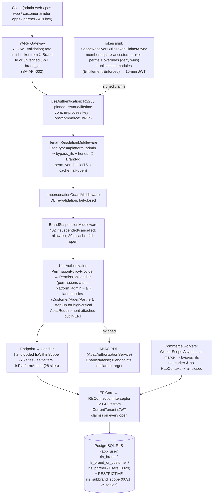

# Report 4 — ABAC / RBAC Security Audit

LaundryGhar SaaS audit · 2026-10-09 · Consolidated from [06](specialists/06-abac-rbac.md), [02](specialists/02-multitenancy.md), [10a](specialists/10a-qa-verification-security.md), [08b](specialists/08b-database.md) (RLS), [10c](specialists/10c-qa-verification-db-mobile.md), [12](specialists/12-mobile-delivery-maps.md) (location authz) and [01b](specialists/01b-architect-challenge-review.md) §2 and §4.4. Canonical IDs and final severities come from [FINDINGS](../../FINDINGS.md) and [`findings-registry.json`](findings-registry.json).

## Summary

1. **RBAC is real, data-driven and server-side.** Roles, permissions, memberships and overrides are database rows. `ScopeResolver` resolves them into a signed RS256 JWT. All **514** mapped endpoints carry explicit authorization metadata or an explicit `AllowAnonymous` ([06](specialists/06-abac-rbac.md) Table 1). Brand isolation is enforced twice: in handler predicates and by RLS on 126/126 brand tables ([08b](specialists/08b-database.md)).
2. **The identity-administration write plane trusts client-supplied attributes, and that breaks everything else.** Anyone who passes a phone OTP gets `brand_admin` through self-signup, then can create a `platform_admin` account ([SA-AUTHZ-001](../../FINDINGS.md#sa-authz-001), **Critical, Verified**). That account passes every permission policy and bypasses RLS on every table.
3. **Two High findings combine into chains the architect flagged** ([01b](specialists/01b-architect-challenge-review.md) §2.3):
   - SA-AUTHZ-003 + SA-AUTHZ-002 → cross-tenant account takeover;
   - SA-AUTHZ-004 + SA-SUB-006 → free paid features, and a tenant can mark its own platform invoice paid.
4. **ABAC is built but inert** ([SA-AUTHZ-008](../../FINDINGS.md#sa-authz-008)). Every attribute decision is hand-coded in handlers and RLS. The attributes they use come from signed claims (trusted). The attributes that are a problem are the client-supplied ones written into identity records: `userType`, a target `userId`, and any permission code.
5. **The DB layer has two bugs.** Migration 0031 fails closed for every customer and commerce-host session ([SA-TEN-001](../../FINDINGS.md#sa-ten-001), Critical outage, not a leak). The commerce host fails open on customer-vs-customer RLS ([SA-TEN-002](../../FINDINGS.md#sa-ten-002), High, reproduced).
6. **RLS is defence in depth only.** The bypass GUC can be set by the session itself ([SA-TEN-007](../../FINDINGS.md#sa-ten-007)), membership tables have no RLS ([SA-DB-005](../../FINDINGS.md#sa-db-005)), and platform admins bypass RLS on every request.
7. **Scenario matrix:** 7 of the 11 scenarios are **Allowed (vulnerable)** on at least one path. Four are blocked: two outright, two with bounded gaps.
8. **Verdicts:**

   | Question | Status |
   |---|---|
   | Q11 (RBAC) | **Partially Supported** |
   | Q12 (ABAC) | **Not Supported** |
   | Q13 (entitlements and tenant restrictions) | **Partially Supported** |
   | Q2 / Q3 (isolation as a guarantee) | **Not Supported** while the P0 chain is open |

9. **Phase 0 is a set of small handler guards plus one DB trigger, not a new engine** ([01b](specialists/01b-architect-challenge-review.md) §4.4).

---

## 1. Scope, sources and evidence discipline

- **Status labels** (Verified / Partially Verified / Suspected / Not Tested) are carried over from the registry as they are.
- **Verification limits.** No HTTP-level or .NET test execution was possible: there was no .NET SDK and no Docker.
- **SQL reproductions.** SQL claims were reproduced as `app_user` (NOBYPASSRLS) on throwaway PostgreSQL 16 clusters:
  - 02: verbatim extracts on port 55433;
  - 10a: S1–S7b on 55434, trimmed tables plus verbatim migration text;
  - 10c: T1–T12 on 55435, full `build_from_scratch.sh` + patches + `migrate.sh up` with the documented workarounds.

  In each case the GUC values were copied from `RlsConnectionInterceptor`.
- **Writer spot-checks.** Lines this writer re-opened for this report are marked *(writer-checked)*:
  - `PermissionHandler.cs:33`;
  - `TenantResolutionMiddleware.cs:34-47`;
  - `CreateUser.cs:31,45-46`;
  - `AbacOptions.cs:15`;
  - `0029_users_brand_rls.up.sql:121-122,147-153`;
  - `0031_subbrand_scope_rls.up.sql:76-83`;
  - the absence of `ScopeNodes`/`CustomerId` in `CommerceHostCurrentTenant.cs`;
  - `Auth:EnforceTokenVersion=true` in all three hosts' `appsettings.json`.
- **Unknown deployed state.** Nobody established which DB state is deployed: whether 0031 is applied, and whether production runs as `app_user`. [02](specialists/02-multitenancy.md), [08b](specialists/08b-database.md) and [01b](specialists/01b-architect-challenge-review.md) all list this as open.

---

## 2. Existing authorization architecture

### 2.1 Request flow

Sources: [06](specialists/06-abac-rbac.md) "Current-state summary" and Table 1; [02](specialists/02-multitenancy.md) "How tenant context is resolved"; [08b](specialists/08b-database.md) "Tenant context path".

### 2.2 Component inventory

| # | Component | Evidence | What it decides | Status |
|---|---|---|---|---|
| 1 | **Gateway** (YARP) | `laundryghar.Gateway/Program.cs:274-315`; `RateLimitPartitioning.cs:24-70` | Routing, CORS and rate limiting only. It passes `Authorization`/`X-Brand-Id` through **without validating the JWT**. | Verified ([06](specialists/06-abac-rbac.md)) |
| 2 | **JWT authentication** | core `Program.cs:301-317`; ops `Program.cs:88-110`; commerce `Program.cs:137-160` | RS256 signature, issuer, audience and lifetime (30 s skew). Core also has `mcp` and `ApiKey` schemes. | Verified |
| 3 | **Token minting: `ScopeResolver`** | `core.Application/Identity/Auth/Common/ScopeResolver.cs:19-277` | Ancestor-or-self memberships of the active node → role permissions → user allow/deny overrides (deny wins) → strip un-licensed module codes (`Entitlement:Enforced=true`, `core.WebApi/appsettings.json:12-14`). Emits `scope_nodes` (all membership nodes, L168-170), `user_type`, `perm_ver` and `ent_off`. Access token lifetime is 15 min (`appsettings.json:21`). | Verified |
| 4 | **Permission policies** | `PermissionPolicyProvider.cs:102-149`; `AnyPermissionRequirement.cs:225-269` | `permission:<code>` → `PermissionRequirement` (+ attached `AbacRequirement`). No `FallbackPolicy` is configured on any host. | Verified |
| 5 | **`PermissionHandler`** | `PermissionHandler.cs:17-56` | Gate 1: `token_use=user`. Gate 2: `user_type == platform_admin` ⇒ granted (**L33**, *writer-checked*), otherwise the code must be in the space-separated `permissions` claim. Gate 3: step-up for high/critical codes. | Verified |
| 6 | **`TenantResolutionMiddleware`** | `TenantResolutionMiddleware.cs:28-75` | `platform_admin` ⇒ `Items["bypass_rls"]=true`, and `X-Brand-Id` is honoured as a brand override (L34-47, *writer-checked*). Rejects a stale `perm_ver` with 401 using `TokenVersionStore` (15 s per-process cache; errors → null → pass, i.e. fail-open). | Verified |
| 7 | Impersonation guard | `ImpersonationGuardMiddleware.cs` | Grant still approved, subject and brand match, read-only ⇒ GET only. Fails closed. | Verified |
| 8 | Suspension gate | `BrandSuspensionMiddleware.cs:43-152`; `BrandStatusStore.cs:15-53` | 402 for a suspended or cancelled brand outside the allow-list. Platform admins are exempt. Fails open. 30 s cache. | Verified |
| 9 | Lane policies | `CustomerOnlyRequirement.cs`, `RiderOnlyRequirement.cs:15-28`, `PartnerOnlyRequirement.cs` | `token_use` / `user_type` lanes | Verified |
| 10 | Handler checks | `HttpContextCurrentUser.IsWithinScope` (75 call sites), customer and rider self-filters, `IsPlatformAdmin` (28 sites in 17 files), `UserBrandScope.ScopedToCallerBrand` (4 read queries) | Ownership, sub-brand scope, platform-only operations | Partially Verified (sampled) |
| 11 | **RLS interceptor** | `RlsConnectionInterceptor.cs:57-121` | Writes all 12 `app.*` GUCs on every EF open. Nulls become `''`, and `'?'` for `scope_nodes`/roles. Pool-safe on the EF path. | Verified (static); SQL semantics reproduced |
| 12 | **Migration 0031** | `0031_subbrand_scope_rls.up.sql:60-203` | A RESTRICTIVE `rls_subbrand_scope` on 39 tables (orders, pickups, slots, assignments, stores, price lists, payments, audit_logs, finance_royalty.*). `kernel.within_scope_cols` returns **NULL when `scope_nodes` is unresolved** (L82, *writer-checked*), which denies the row. | Verified (SQL reproduced S1–S4, T1/T1b) |
| 13 | **ABAC engine** | `AbacOptions.cs:15` (`Enabled` defaults to false, *writer-checked*); `AbacAuthorizationService.EvaluateAsync` (returns `Skipped`); `AbacAuthorizationHandler.cs:69-103` (succeeds when no target is declared, and on evaluator exceptions) | Nothing. No `Abac` key exists in any `appsettings*.json` or deploy file, and no endpoint declares `AbacResource`/`RequireAbac`. | Verified inert ([SA-AUTHZ-008](../../FINDINGS.md#sa-authz-008)) |
| 14 | Workers | `CommerceHostCurrentTenant.cs:42-94`; `WorkerScope.cs:50-87` | A positive AsyncLocal marker ⇒ RLS bypass for all tenants. No marker and no HttpContext ⇒ fail closed. | Verified |
| 15 | Output cache | `Caching/OutputCaching.cs:44-94` | Shared responses keyed by brand/franchise/store claims + `X-Brand-Id`. Authorization re-runs on cache hits. | Verified |
| 16 | Frontend | `admin-web/src/hooks/usePermissions.ts:14-69`; `pos-web/src/hooks/usePermissions.ts:42` | Hides menus and routes only. The backend is authoritative. | UI-only |

---

## 3. Role and permission model

### 3.1 Data model

| Object | Where | Semantics |
|---|---|---|
| `roles` | `identity_access.roles`. System roles have `brand_id IS NULL`; brand roles are brand-scoped (RLS split per command, visible-global since 0030) | Code + `priority` (rank). `RoleEditGuard` blocks editing system, foreign-brand or higher-rank roles (`RoleEditGuard.cs:53`, with tests). |
| `permissions` / `role_permissions` | identity tables; **RLS off** ([SA-DB-005](../../FINDINGS.md#sa-db-005)) | Each code has a risk tier (`normal` / `high` / `critical`) that drives step-up. Owning `module_key` drives entitlement stripping. Seeded by `IdentitySeeder.cs:120-640`. |
| `user_scope_memberships` | `(user_id, scope_type, scope_id, role_id)`; **RLS deliberately off** (`0029…up.sql:147-153`, *writer-checked*) | The only link between a global staff identity and a brand. Scope types are platform / brand / franchise / store / warehouse. |
| `user_permission_override` | `rls_user_self` | Per-user allow/deny at a scope; deny wins (`ScopeResolver.cs:134-160`). A global allow applies everywhere. |
| `users.user_type` | `identity_access.users`, **global** (no `brand_id`; unique phone and email) | A coarse "portal" axis. **`platform_admin` here is total authority** (H1/H2 below), independent of any membership ([10a](specialists/10a-qa-verification-security.md) SA-AUTHZ-001 trace: zero memberships still mints a token, `ScopeResolver.cs:27-49`). |
| `brand_feature` | own-brand RLS writes allowed (`0005…up.sql:158-161`) | Entitlement source read at mint (`ScopeResolver.cs:197-202`). Not linked to subscription status ([SA-SUB-006](../../FINDINGS.md#sa-sub-006)). |
| `authz.policy` / `policy_condition` / `decision_log` | migration 0024 | ABAC store. Inert. Its raw connections carry no GUCs ([SA-DB-014](../../FINDINGS.md#sa-db-014)). |

Seeded grants that matter for the findings:
- `users.create` (high risk) is held by `brand_admin`, `franchise_owner` and `store_admin` (`IdentitySeeder.cs:521,577,603`).
- `users.update` is **normal** risk (`:129`).
- `brand_admin` holds `permissions.assign`.
- `saas.*` belongs to a module with no `modules` row. It is therefore an orphan and survives entitlement stripping (`ScopeResolver.cs:236-240`; [10a](specialists/10a-qa-verification-security.md) SA-AUTHZ-004 row).

### 3.2 Actor taxonomy

`user_type` values (`SharedDataModel/Enums/UserType.cs`, *writer-checked*): `platform_admin`, `brand_admin`, `franchise_owner`, `store_admin`, `staff`, `warehouse_staff`, `ops_staff`, `rider`, `auditor`, `support`.

| Actor / lane | `token_use` | Tenant attributes in token | Policies it can satisfy | RLS GUCs (core/ops host) | Live revocation |
|---|---|---|---|---|---|
| Platform admin | `user` | `user_type=platform_admin` (`brand_id` optional) | **All** `permission:*` | `bypass_rls=true` on every request | perm_ver |
| Brand / franchise / store admin, staff, warehouse/ops staff, auditor, support | `user` | `brand_id`, `franchise_id`, `store_id`, `scope_nodes`, `permissions`, `perm_ver` | `permission:<code>` they hold | brand + `scope_nodes` | perm_ver (15 s) |
| Rider | `user` + `user_type=rider` | as staff; invites grant a franchise membership (`InviteRider.cs:83`) | `RiderOnly` + `rider.*` codes | brand + scope (franchise) | perm_ver; rider status **not** checked in self-resolve after `UpdateRider` suspend ([SA-MOB-011](../../FINDINGS.md#sa-mob-011)) |
| Customer | `customer` | `brand_id`, `sub`=customer id; **no `scope_nodes`** (`JwtTokenService.cs:98-119`) | `CustomerOnly` only | brand + `customer_id` on core/ops; **`customer_id` absent on commerce** | none (not `token_use=user`) |
| Customer via OAuth/MCP | `customer_mcp` | as customer (`JwtTokenService.cs:122-145`) | customer MCP scopes | as customer | none |
| RaaS partner | `partner` | `partner_id`; **no `brand_id`**, no permissions (`JwtTokenService.cs:149-171`) | `PartnerOnly` / `PartnerAdmin` | `partner_id` → `rls_partner` | none; suspension gate skips it ([SA-TEN-008](../../FINDINGS.md#sa-ten-008)) |
| API key | ApiKey scheme | `brand_id`, scopes (`ApiKeyAuthentication.cs:181-189`); no `scope_nodes` | `apiscope:*` | brand; `'?'` scope ⇒ denied on 0031 tables | key revocation |
| Worker | n/a | AsyncLocal marker | n/a | `bypass_rls=true` | n/a |
| Anonymous (auth/OTP/signup/OAuth/webhooks) | none | brand from Host / `X-Brand-Id` / body | `AllowAnonymous` | request-wide bypass on listed paths (`core.WebApi/Program.cs:532-562,620-646`; commerce webhooks `:351-366`) | n/a |
| Impersonation session | `user` | grant-bound | read-only ⇒ GET | as target | per-request DB re-validation |

---

## 4. Attribute sources and policy evaluation

| Attribute | Source | Trusted? | Used by | Notes |
|---|---|---|---|---|
| `brand_id`, `franchise_id`, `store_id` | Signed JWT claim | **Trusted** | `RequireBrandId()` predicates (159 files), RLS GUCs | `X-Brand-Id` overrides it **only** for `platform_admin` (`TenantResolutionMiddleware.cs:38-47`; `HttpContextCurrentUser.cs:131-138`) |
| `permissions`, `roles`, `scope_nodes`, `perm_ver`, `ent_off` | Signed JWT, minted from DB by `ScopeResolver` | **Trusted** (at mint time; up to 15 min stale) | `PermissionHandler`, `IsWithinScope`, 0031 RLS | The permission set is the union of all memberships' permissions; the node set is the union of all nodes, so scopes are amplified ([SA-AUTHZ-007](../../FINDINGS.md#sa-authz-007)) |
| `user_type` | Signed JWT, minted from `users.user_type` | Trusted **as a claim**, but **the column is written from client input** (`CreateUser.cs:45`, *writer-checked*) | god-mode (H1/H2) | Root cause RC6 / [SA-ARCH-013](../../FINDINGS.md#sa-arch-013) |
| `sub` (customer id / user id) | Signed JWT | Trusted | Customer and rider self-filters | Commerce publishes customer `sub` as `user_id`, never as `customer_id` ([SA-TEN-002](../../FINDINGS.md#sa-ten-002)) |
| `X-Brand-Id` header | Client | **Untrusted.** Honoured for platform admins (by design) and used by the gateway for rate-limit partitioning ([SA-API-002](../../FINDINGS.md#sa-api-002)) | Platform-admin brand narrowing; gateway bucket | Anonymous brand resolution also uses it (`BrandResolver.cs:67-96`; `CustomerBrandResolver.cs:20-52`) |
| Request-body `userType` (CreateUser / InviteUser) | Client | **Untrusted, yet persisted** | Becomes the `user_type` claim | [SA-AUTHZ-001](../../FINDINGS.md#sa-authz-001) |
| Request-body `userId` (GrantMembership) | Client | **Untrusted, not checked against the actor's brand** | Membership insert | [SA-AUTHZ-003](../../FINDINGS.md#sa-authz-003) |
| Route `{id}` on identity writes | Client | **Untrusted.** Bounded only by users RLS (same brand) | SetPersonStatus / UpdateUser / DeactivateUser | [SA-AUTHZ-002](../../FINDINGS.md#sa-authz-002) |
| Permission code and scope in an override; cells in a role edit | Client | **Untrusted, no ceiling** | `SetUserPermissionOverride`, `SetRoleCells` | [SA-AUTHZ-004](../../FINDINGS.md#sa-authz-004) |
| `addressId` on a customer pickup | Client | **Untrusted, no ownership check** | `PickupCommands.cs:103` | [SA-MOB-005](../../FINDINGS.md#sa-mob-005) |
| Location ping lat/lng/`PingedAt` | Client device | **Untrusted, unvalidated** | `BatchLocationPing.cs:42-60` | [SA-MOB-010](../../FINDINGS.md#sa-mob-010) |
| Resource attributes (`order.customer_id`, `assignment.rider_id`, `rider.user_id`) | DB rows | Trusted | Hand-coded handler predicates | — |
| ABAC subject attributes (roles, entitlements) | `NpgsqlAbacStore` raw connection | **Wrong**: read without GUCs, so empty sets (10c T10) | Nothing today (inert) | [SA-DB-014](../../FINDINGS.md#sa-db-014) |

**Policy evaluation order today.**
1. Lane check (`token_use`).
2. `user_type == platform_admin` short-circuit.
3. Membership of the code in the claim.
4. Step-up freshness for high/critical codes.
5. ABAC requirement, which succeeds trivially.
6. Handler-level `IsWithinScope` / ownership predicates (opt-in per handler).
7. RLS.

There is no default-deny `FallbackPolicy` ([06](specialists/06-abac-rbac.md) Table 1 note).

---

## 5. Enforcement locations and endpoint coverage

Counts come from 06's endpoint-mapping parse, hand-checked against the "NONE" rows. They are approximate, give or take a few, because some files use constants for policy names. That affects which column an endpoint falls in, not whether it is protected.

| Host | Endpoints | Permission policy (`permission:*`) | Lane policy (Customer / Rider / Partner / PartnerAdmin / apiscope) | Authenticated-only | Explicit anonymous | No metadata |
|---|---|---|---|---|---|---|
| core.WebApi | 172 | ~131 | 6 | 3 (`/auth/step-up/verify`, `/auth/logout`, `/admin/navigator`) | 32 (auth, OTP, OAuth, signup, terminology, public CMS, jwks/openid-configuration, paylink webhook) | 0 |
| operations.WebApi | 232 | ~165 | 65 | 2 (`/fulfillment-config`) | 0 | 0 |
| commerce.WebApi | 110 | 80 | 28 | 0 | 2 (Razorpay webhooks) | 0 |
| **Total** | **514** | **~376** | **~99** | **5** | **34** | **0** |

- **Coverage is complete (Verified), but only by discipline.** No host sets a `FallbackPolicy`, so the next endpoint someone forgets to annotate will be anonymous ([06](specialists/06-abac-rbac.md)). No contract test enforces this (06-T11, §13).
- **Endpoint-level RBAC is not the weak point.** QA verified the endpoints for AdminUsers, AdminAccessControl, AdminEntitlements and AdminCancellation ([10a](specialists/10a-qa-verification-security.md) Q11). The defects sit **below** the policy: the handlers accept targets, types and codes that the caller should not control.
- **Handler-level enforcement:**
  - 75 `IsWithinScope` sites (mutations);
  - 28 `IsPlatformAdmin` sites in 17 files;
  - `UserBrandScope.ScopedToCallerBrand` on 4 read queries (`GetUsers.cs:33`, `GetUserById.cs:25`, `GetPersonMemberships.cs:50`, `GetPersonPermissionOverrides.cs:48`);
  - none on the identity **write** handlers.

---

## 6. Hardcoded authorization decisions

From [06](specialists/06-abac-rbac.md) Table 3. Each row is a decision taken from a string compare on an identity attribute, not from a permission.

| # | Location | Decision | Risk / linked finding |
|---|---|---|---|
| H1 | `PermissionHandler.cs:33` (*writer-checked*); `AnyPermissionRequirement.cs:238-243` | `user_type == "platform_admin"` ⇒ every permission granted | One mutable column grants total authority: SA-AUTHZ-001, SA-ARCH-013 |
| H2 | `TenantResolutionMiddleware.cs:34-47` | `platform_admin` ⇒ `bypass_rls=true` + `X-Brand-Id` honoured | The same bit disables the DB layer: SA-TEN-007 |
| H3 | `BrandSuspensionMiddleware.cs:132-134` | `platform_admin` exempt from suspension | By design |
| H4 | `HttpContextCurrentUser.cs:62-63,90` | `IsPlatformAdmin` short-circuits `IsWithinScope` | Inherits the H1 risk |
| H5 | `AdminSettings.cs:181-185` | `UserType == "brand_admin"` gate on settings | Identity axis used instead of a permission: [SA-AUTHZ-013](../../FINDINGS.md#sa-authz-013) |
| H6 | `AdminSettings.cs:191-195` | Platform billing settings: `IsPlatformAdmin` only | Correct but hard-coded |
| H7 | `ScopeResolver.cs:185-186,248` | `platform_admin` exempt from entitlement stripping; gets the full step-up catalogue | By design |
| H8 | `GrantMembership.cs:51-56` | Role code `platform_admin` grantable only by a platform admin | Correct, but the *user_type* path is unguarded (SA-AUTHZ-001) |
| H9 | `SetUserType.cs:18-33` | Hard-coded user_type → priority table | Separate from `roles.priority`, so the two can drift |
| H10 | `RiderOnlyRequirement.cs:22-25` | `user_type == "rider"` lane | By design |
| H11 | `CreateRider.cs:42` | `UserType == Rider` precondition | Low |
| H12 | `GetAccessPeople.cs:52,147-148`; `GetAccessFranchises.cs:51` | Role code `"franchise_owner"` drives visibility and tiering | Display logic keyed on a role code |
| H13 | 28 `IsPlatformAdmin` sites (e.g. `PlatformPlanCommands.cs:28,129,203,244`; `ManageRoles.cs:104,134`) | Platform-only operations decided in handlers | **Inconsistent:** `SetBrandFeature`, `ApplyBundleToBrand`, `SetBrandPlatformInvoiceStatus` and `CancelBrandPlatformSubscription` have none ([10a](specialists/10a-qa-verification-security.md): grep `IsPlatformAdmin` in `Entitlements/Commands` = 0) → SA-AUTHZ-004 |
| H14 | `admin-web/src/hooks/usePermissions.ts:50,69`; `pos-web/.../usePermissions.ts:42`; `BrandSwitcher.tsx` | UI special-cases `platform_admin` / `brand_admin` | UI only; route map drifts ([SA-FE-013](../../FINDINGS.md#sa-fe-013)) |

---

## 7. Tenant and resource scope enforcement

| Boundary | Application control | Database control | Assessment |
|---|---|---|---|
| **Brand (tenant)** | Signed `brand_id` → `RequireBrandId()` + explicit `.Where(BrandId==…)` (159 files; no EF global tenant filter). `CreateOrderCommand.cs:98-115` checks that store and customer belong to the brand. | `rls_brand` on 126/126 brand tables. A/B SELECT/INSERT/UPDATE/DELETE isolation was proven live ([08b](specialists/08b-database.md); 10a S4 control). | **Strong for direct access.** Weak at the identity plane (§8). |
| **Sub-brand (franchise / store / warehouse)** | `IsWithinScope` at 75 mutation sites; `scope_nodes` = union of membership nodes | 0031 RESTRICTIVE policy on 39 tables (staff on core/ops correct; customer, API-key and commerce lanes **denied**) | Reads on the 39 tables are DB-enforced for staff. Tables outside the list (e.g. `order_status_history`, `order_addons`, `customers`) are brand-only. Amplified for multi-membership users ([SA-AUTHZ-007](../../FINDINGS.md#sa-authz-007)). Analytics `StoreId` is not scope-checked ([SA-DB-013](../../FINDINGS.md#sa-db-013), dup SA-TEN-013). |
| **Customer (within brand)** | `o.CustomerId == sub` in every sampled customer handler (`OrderQueries.cs:187-189,221-223`; `CustomerPaymentHandlers.cs:39-41,135-137`; `CustomerPackageHandlers.cs:84-87`; `CustomerSubscriptionHandlers.cs:232-235`) | `rls_brand_or_customer` on 8 commerce tables, **only when `app.current_customer_id` is set**. Orders and `customer_addresses` are brand-only (10c T1: c2's address visible to c1). | App-only on orders and addresses. **Fail-open on the commerce host** ([SA-TEN-002](../../FINDINGS.md#sa-ten-002), reproduced 10a S2b and 10c T1b). |
| **Rider (within brand)** | Self-resolve `riders.user_id == sub && brand` → `RiderId == self` (`UpdateMyTaskStatus.cs:44-53`, `VerifyTaskOtp.cs:23-32`, `OfferActions.cs:36-49,118-131`, `BatchLocationPing.cs:43-47`) | `rls_brand` (+ subbrand on some tables) only; nothing separates riders of one franchise (10c) | App-only |
| **Partner (RaaS)** | Handlers filter by id only (`GetPartnerBookingTrack.cs:31-33`) | `rls_partner` (`rls_partner.sql:54-67`) | DB-only ([SA-AUTHZ-015](../../FINDINGS.md#sa-authz-015)) |
| **Identity records (users / memberships)** | Reads: `ScopedToCallerBrand` (F-1/F-2). **Writes: no target guard.** | `users`: `user_in_brand` (0029), but INSERT is `WITH CHECK (true)` (L121-122, *writer-checked*). Memberships: **RLS off**. | Broken: SA-AUTHZ-001/002/003, SA-DB-005 |
| **Platform plane** (entitlements, plans, platform invoices, brands) | `IsPlatformAdmin` on plan commands; **missing on entitlement and invoice commands** | `brand_feature` and `brand_platform_*` allow own-brand writes | Broken: SA-AUTHZ-004 |
| **Vertical (business type)** | Menu only (`GetNavigator.cs:39-45`) | none | Not enforced: [SA-AUTHZ-012](../../FINDINGS.md#sa-authz-012) |
| **Cross-tenant references** | Per-handler checks (e.g. order create) | **No composite FKs** (0 of 617; 10c T7a: a brand-A order referencing a B franchise, store and customer was accepted) | App-only: [SA-DB-004](../../FINDINGS.md#sa-db-004) |

---

## 8. Cross-tenant access risks

| # | Path | Mechanism | Finding (final severity) | Status |
|---|---|---|---|---|
| X1 | Anonymous → brand_admin → `platform_admin` → all tenants | Self-signup grants `users.create`. `CreateUser` persists the client's `userType`. H1/H2 god-mode applies with no membership needed. The DB accepts the insert (10a S6). | [SA-AUTHZ-001](../../FINDINGS.md#sa-authz-001) **Critical** + [SA-QA-001](../../FINDINGS.md#sa-qa-001) Medium (invite commits before guards) | Verified (static; DB step reproduced) |
| X2 | Brand A admin → attach a brand-B user → reset password → log in as them | GrantMembership does not check the target user. Memberships RLS is off (10c T4 reproduced the DB insert). The victim becomes visible under users RLS. SetPersonStatus `activate` sets a password. | [SA-AUTHZ-003](../../FINDINGS.md#sa-authz-003) High (Critical if UUIDs are obtainable) + [SA-AUTHZ-002](../../FINDINGS.md#sa-authz-002) High; DB layer [SA-DB-005](../../FINDINGS.md#sa-db-005) High | Partially Verified (no UUID-discovery path found) |
| X3 | Any SQL-execution bug → all tenants | `app.bypass_rls` can be set by the session itself (10a S5; 10c T3: DELETE of a B payment). DEFINER `export_brand`/`purge_brand` accept any brand (10c T2). | [SA-TEN-007](../../FINDINGS.md#sa-ten-007) Medium (dup SA-DB-015); [SA-DB-003](../../FINDINGS.md#sa-db-003) Medium | Verified (SQL). No HTTP path passes a foreign brand id ([10c](specialists/10c-qa-verification-db-mobile.md)). |
| X4 | Notification worker sends tenant A's customer messages through tenant B's WhatsApp/SMS account | Singleton cache, `FirstOrDefault` over all brands' rows | [SA-API-012](../../FINDINGS.md#sa-api-012) High | Verified (code); which row wins is Not Tested |
| X5 | Tenant-targeted throttling / limiter bypass | Gateway partition keyed on client `X-Brand-Id` or an unverified JWT | [SA-API-002](../../FINDINGS.md#sa-api-002) High (dup SA-AUTHZ-010, SA-TEN-005, SA-OPS-002) | Verified (code; unit tests assert the vulnerable behaviour, [SA-QA-002](../../FINDINGS.md#sa-qa-002)) |
| X6 | Cross-tenant FK links | Single-column FKs ignore RLS | [SA-DB-004](../../FINDINGS.md#sa-db-004) Medium | Verified (SQL); reads of the linked row stay RLS-hidden |
| X7 | Analytics MVs | MVs cannot carry RLS; a brand-A session read B rows (08b; 10c T9) | [SA-DB-013](../../FINDINGS.md#sa-db-013) Medium | Verified (SQL); app predicates present |
| X8 | Existence oracle / cross-tenant blocking | Global uniques on business numbers and domains | [SA-DB-007](../../FINDINGS.md#sa-db-007) Medium | Verified |
| X9 | Self-licensing paid features (tenant vs platform boundary) | Self-grant `saas.manage` → platform-plane handlers | [SA-AUTHZ-004](../../FINDINGS.md#sa-authz-004) High | Verified (QA-A) |

What genuinely blocks cross-tenant access today (positive controls):
- signed-claim brand context;
- the `X-Brand-Id` override is limited to platform admins;
- the `rls_brand` coverage guard (migration 0027 aborts if a `brand_id` table lacks RLS);
- tenant export is bounded to the caller's own brand (`AdminCancellation.cs:64-97`);
- per-brand payment-gateway secrets and webhook HMAC (`GatewaySettingsCache.cs:35-63`; `RazorpayWebhookHandler.cs:94-115`);
- the worker bypass needs a positive marker.

The sources are [02](specialists/02-multitenancy.md) and [06](specialists/06-abac-rbac.md) "Positive controls".

---

## 9. Permission revocation and caching behaviour

| Cache / staleness source | Bound | Invalidation | Fail mode | Gap / finding |
|---|---|---|---|---|
| Permissions in the access token | ≤ 15 min (`AccessMinutes`) | `perm_ver` claim vs `kernel.user_perm_version`, checked per request when `Auth:EnforceTokenVersion=true`. True in core, operations and commerce `appsettings.json` (*writer-checked*). | **Fail-open**: lookup error → null → pass (`TokenVersionStore.cs:41-45`; `TenantResolutionMiddleware.cs:61-71`) | [SA-AUTHZ-009](../../FINDINGS.md#sa-authz-009) |
| `TokenVersionStore` per-process cache | 15 s TTL (`TokenVersionStore.cs:16`) | TTL only | per instance | — |
| Version bumps on role / membership / override / type changes | — | `GrantMembership.cs:225`, `RevokeMembership.cs:89`, `SetRoleCells.cs:106`, `AssignPermission.cs:94`, `SetUserPermissionOverride.cs:99`, `SetUserType.cs:75` | — | Positive control |
| User suspension / deactivation | ≤ 15 min | **No bump** in `SetPersonStatus.cs:48-68` or `DeactivateUser.cs:14-23`. Refresh does check status (`RefreshTokenHandler.cs:67-69`). | — | [SA-AUTHZ-009](../../FINDINGS.md#sa-authz-009) |
| Customer / partner tokens | ≤ token lifetime | `EnforceTokenVersion` applies only to `token_use=user` | — | SA-AUTHZ-009 |
| Rider suspension via `UpdateRider` | indefinite while the token refreshes | Self-resolve has no status filter. Deactivate soft-deletes, so the global filter does block it. | — | [SA-MOB-011](../../FINDINGS.md#sa-mob-011) (scope corrected by 10c) |
| Entitlement change | ≤ 15 min for franchise/store staff | `PermVersionBumper.BumpBrandMembersAsync` bumps only brand-scoped memberships (`PermVersionBumper.cs:36-44`) | `FeatureCatalog.cs:64-70` fails open | [SA-AUTHZ-011](../../FINDINGS.md#sa-authz-011); [SA-SUB-019](../../FINDINGS.md#sa-sub-019) (Info) |
| Brand status (suspension) | 30 s | TTL | **Fail-open** (`BrandStatusStore.cs:47-53`) | [SA-TEN-008](../../FINDINGS.md#sa-ten-008) (dup SA-AUTHZ-014) |
| Output cache | per TTL | Key = brand/franchise/store claims + `X-Brand-Id`; authorization re-runs on hits; no per-user endpoints are cached (all 19 `CacheSharedOutput` uses reviewed) | The key ignores `scope_nodes`, so users with different membership sets in one brand may share admin list responses | [SA-OPS-008](../../FINDINGS.md#sa-ops-008) (dup SA-TEN-014) |
| Refresh-token rotation | — | read → check `RevokedAt` → set, with no conditional update | race | [SA-API-020](../../FINDINGS.md#sa-api-020) |
| ABAC `PolicyCache` | — | — | inert | SA-AUTHZ-008 |

All caches are in-process `IMemoryCache`. Across replicas, each instance has its own staleness window ([02](specialists/02-multitenancy.md) data-path table).

---

## 10. Location-data access control

Sources: [12](specialists/12-mobile-delivery-maps.md) §7, [10c](specialists/10c-qa-verification-db-mobile.md) "Location-data authorization", [01b](specialists/01b-architect-challenge-review.md) §1.3.

| Data / operation | Application control | DB control | Gaps | Finding / status |
|---|---|---|---|---|
| **Customer addresses: reference in a pickup** | **None.** `AddressId = req.AddressId` (`PickupCommands.cs:103`); the customer handler (`:336-470`) has no `CustomerAddresses` lookup | FK `REFERENCES customer_addresses(id)` with no customer or brand match; FK checks ignore RLS. 10c T7b: c2's address and a brand-B address were both accepted. | The rider is dispatched to the victim's address and shown the victim's `RecipientPhone` (`RiderTaskMapper.cs:128`) | [SA-MOB-005](../../FINDINGS.md#sa-mob-005) Medium, P0. Verified (DB layer). Currently masked by SA-TEN-001; **ship the fix with the 0031 fix**. |
| Customer addresses: fare quote | Filtered by customer + brand (`GetFareQuoteQuery.cs:44-48`) | brand-only RLS | — | Positive control |
| Customer addresses: DB visibility | — | `customer_addresses` is brand-only; c1's session sees c2's address (10c T1) | Customer isolation is app-only | Part of the DB-Q10 gap |
| **Rider pings: write** | Rider resolved from the JWT (`BatchLocationPing.cs:43-47`), so a rider cannot post as another rider | `rider_location_pings` has `rls_brand` only | No lat/lng/batch/timestamp validation; no duty or status gate; client time drives staleness and partition routing | [SA-MOB-010](../../FINDINGS.md#sa-mob-010) Medium, P1 |
| Rider pings: suspended rider | Deactivate is blocked (soft-delete filter). **`UpdateRider` suspend/terminate is not** (`UpdateRider.cs:53,87-89`). | — | A suspended rider keeps pinging and completing legs | [SA-MOB-011](../../FINDINGS.md#sa-mob-011) Medium (evidence corrected by 10c) |
| **Rider pings / tracks: read** | Admin `GetRidersLive`, `GetRiderTrack` (`permission:rider.read`, `RidersAdmin.cs:60-61`) are brand + franchise scoped. **Not store-scoped**: a store manager sees every franchise rider's trail (`GetRiderTrack.cs:27-33`). | `riders` has no `store_id` column (it has `primary_store_id`), so 0031 cannot narrow by store | Store-level scope is missing | No canonical ID (see §17). [12](specialists/12-mobile-delivery-maps.md): Partially Verified; [10c](specialists/10c-qa-verification-db-mobile.md) confirmed. |
| Rider location: customer read | **No customer endpoint exposes rider identity or location** (`OrderQueries.cs:207-232`; customer group is `CustomerOnly`, `CustomerOrderEndpoints.cs:32`) | — | — | Positive control (Verified by 10c grep of every `LastKnownLocation`/`RiderLocationPings` reader) |
| Rider location: retention (DPDP 14 days) | — | partman retention is configured (1 day / 14 days), but nothing schedules maintenance in deploy, and `run_maintenance_proc()` aborts on a stale `process_logs` row (10c T12) | GPS history is not deleted | [SA-OPS-004](../../FINDINGS.md#sa-ops-004) High (dup SA-MOB-012); [SA-QC-003](../../FINDINGS.md#sa-qc-003) Medium |
| **Assignments: rider mutation** | Own leg only (`RiderId == self && BrandId`). Rider X cannot touch rider Y's leg (404). | No transition guard, no unique active-leg index (10c T11) | **No state machine.** A rider can move their own leg to any status, revive cancelled legs and force a cancelled order to `delivered` with a COD side-effect. `UpdateMyAssignmentStatus.cs:44` writes any string. | [SA-MOB-001](../../FINDINGS.md#sa-mob-001) High, P0 (business-logic authorization) |
| Assignments: admin assign | Rider, order and pickup are brand-checked; store scope is checked (`PickupCommands.cs:207-218`; `DeliveryAssignmentCommands.cs:37-86`) | no partial unique | No pickup-status check; a duplicate active leg is possible | [SA-MOB-002](../../FINDINGS.md#sa-mob-002) High, P1 |
| **Tracking history: customer** | `o.CustomerId == jwt.sub` on `/customer/orders/{id}/tracking` (`OrderQueries.cs:221-223`) | orders: brand + 0031 (customers are currently denied, SA-TEN-001) | Status timeline only | Positive control |
| Tracking history: rider | Own tasks for any past date (`RiderSelfEndpoints.cs:84,307-319`) | — | Customer name, phone and address remain available indefinitely | [SA-MOB-019](../../FINDINGS.md#sa-mob-019) Low, P3 |
| Tracking history: admin | Track capped at 1,500 points, brand + franchise scoped (`GetRiderTrack.cs:20-48`) | — | Not store-scoped; no retention-window bound | as above |
| Proof photos | `GetProofPhotoStreamQuery(id, brandId)` | — | Handler not read | Partially Verified ([12](specialists/12-mobile-delivery-maps.md)) |
| Map provider keys | Echoed to every settings reader (`GetAdminSettings.cs:44`) | stored unencrypted | — | [SA-MOB-021](../../FINDINGS.md#sa-mob-021) Low |
| **Overriding risk** | — | — | A `platform_admin` minted via SA-AUTHZ-001 bypasses RLS on every location table | [01b](specialists/01b-architect-challenge-review.md) M9 |

Target policy set (from [12](specialists/12-mobile-delivery-maps.md) §6, adjusted by [01b](specialists/01b-architect-challenge-review.md) §1.3). These are implemented as **handler guards plus DB constraints**, not by switching on the ABAC engine:

| Rule | Condition |
|---|---|
| Address | `address.customer_id == sub && address.brand_id == jwt.brand` on every write and reference. Backed by a composite FK address→customer. |
| Ping write | `rider.user_id == sub && rider.status == active && rider.is_on_duty` |
| Location read | Admin with `rider.read` within brand → franchise → **store**. A customer sees only their own active leg (`started|arrived`), coarse, and never after a terminal state. |
| Assignment | Rider transitions only along the state machine. Admin assigns within scope, only to an active, KYC-verified rider in the same brand. Backed by a partial unique active-leg index. |
| History | Admin reads within scope and the retention window. Riders see their own history with PII masked after completion. |

---

## 11. Mandatory scenario matrix

Verdict vocabulary: **Blocked by X** / **Allowed (vulnerable)** / **Not determinable**. Where a scenario has more than one path, the worst path sets the verdict and the others are listed.

| # | Scenario | Verdict | Evidence | Finding IDs |
|---|---|---|---|---|
| 1 | Tenant A reads / updates / deletes / exports tenant B's data | **Allowed (vulnerable)** through the identity-admin chain | **Direct access is Blocked** by the signed `brand_id` → `RequireBrandId()` predicates + `rls_brand`. Proven live for SELECT/INSERT/UPDATE/DELETE (08b; 10a S4 control). Export is bounded to the caller (`AdminCancellation.cs:64-97`). `X-Brand-Id` is honoured only for platform admins (`TenantResolutionMiddleware.cs:38-47`). **But:** anonymous signup → `platform_admin` → RLS bypass on all tenants (X1); attach-and-take-over a brand-B user (X2); the notification worker sends A's customer data through B's account (X4). | SA-AUTHZ-001, SA-QA-001, SA-AUTHZ-003, SA-AUTHZ-002, SA-API-012 |
| 2 | ID manipulation (change org / tenant / branch / resource id) | **Allowed (vulnerable)** within a brand. **Blocked by RLS** across brands; **Blocked by app predicates** in the customer and rider self-lanes. | Cross-brand ids return 0 rows / 404 (RLS). Customer `GetMyOrderById` filters `o.CustomerId == q.CustomerId` (`OrderQueries.cs:187-189`). Rider handlers filter `RiderId == self`. **Vulnerable:** identity writes take a target id with no scope or rank check (`UpdateUser.cs:20`, `SetPersonStatus.cs:26`, `DeactivateUser.cs:16`). Pickup `addressId` is unchecked (`PickupCommands.cs:103`). The DB accepts cross-brand FKs (10c T7a/T7b). | SA-AUTHZ-002, SA-MOB-005, SA-DB-004 |
| 3 | Employee accesses another employee's work | **Blocked by app predicate** for the rider lane, with no DB backstop. **Allowed (vulnerable)** for staff *accounts* via identity writes. | Every `RiderSelf` handler resolves the rider from `riders.user_id == sub && brand_id` and filters `RiderId == rider.Id` (`GetMyTasksToday.cs:42`, `UpdateMyTaskStatus.cs:51`, `VerifyTaskOtp.cs:30`, `UploadProofPhoto.cs:42-50`, `OfferActions.cs:45,127`). At the DB layer, nothing separates riders of one franchise (10c). A store admin can rewrite other stores' staff email, phone, bank and UPI details (`UpdateUser.cs:27-28,54-63`). | SA-AUTHZ-002 (rider lane: positive control) |
| 4 | Manager outside their scope (store manager → other store) | **Allowed (vulnerable)** for identity writes, multi-membership users, analytics and rider tracks. **Blocked by RLS 0031** for reads on the 39 listed tables (core/ops hosts) and **by `IsWithinScope`** where it is called (75 sites). | `0031…up.sql:60-203`; `HttpContextCurrentUser.cs:87-124`. Tables outside 0031 (e.g. `order_status_history`, `order_addons`, `customers`) are brand-only. A store admin can reset the brand admin's password (SetPersonStatus `activate`). A store role at S1 plus a brand read-only role ⇒ store-admin writes brand-wide. The analytics `StoreId` is not scope-checked. `GetRiderTrack` is franchise-, not store-scoped. | SA-AUTHZ-002, SA-AUTHZ-007, SA-DB-013 |
| 5 | Permission revoked, role used afterwards | **Blocked by the `perm_ver` check within ≈15 s** for role, membership, override and user-type changes. **Allowed (vulnerable)** for up to 15 min after user suspension or deactivation, and whenever the version lookup errors (fail-open). | Bumps listed in §9. No bump in `SetPersonStatus.cs:48-68` or `DeactivateUser.cs:14-23`. `TokenVersionStore.cs:41-45` returns null on error and the middleware passes. | SA-AUTHZ-009 |
| 6 | Suspended tenant uses protected functionality | **Allowed (vulnerable)**. The gate exists (402 for staff and customer tokens on all three hosts within ≤30 s), but the tenant can lift its own suspension, and the gate skips partners and workers and fails open. | `BrandSuspensionMiddleware.cs:63-152` (registered at core `Program.cs:571`, ops `:164`, commerce `:380`). Cancel → withdraw sets `status=active` from `suspended` (10a S7: final `status=active, suspension_reason=tos`). Partner tokens carry no `brand_id`. Workers do no brand-status check. `/api/v1/admin/entitlements` is allow-listed, so the SA-AUTHZ-004 invoice-paid path works while suspended. | SA-TEN-003, SA-TEN-008 (dup SA-AUTHZ-014), SA-AUTHZ-004 |
| 7 | Missing entitlement (plan lacks the feature) | **Allowed (vulnerable)**. **Blocked by mint-time stripping** on the staff lane only. | `ScopeResolver.cs:185-241` strips un-licensed module codes from staff tokens (≤15 min lag for non-brand-scoped staff). Customer, partner and API-key lanes have no feature check (`PermissionPolicyProvider.cs:151-189`; no `BrandFeatureGate`/`RequireFeature` outside core identity). A brand admin can self-grant `saas.manage` and license features. Entitlements are not tied to payment. | SA-AUTHZ-011 (dup SA-SUB-010), SA-AUTHZ-004, SA-SUB-006 |
| 8 | User accesses another vertical's features | **Allowed (vulnerable)**. Not enforced server-side. | The only vertical gate is the menu builder (`GetNavigator.cs:39-45`). No endpoint or handler reads `Brand.VerticalKey`. [10b](specialists/10b-qa-verification-platform.md) mitigation: a vertical-specific *feature* still gates where it is a licensed module, and only a platform admin can license it. SA-AUTHZ-004 removes that "only". | SA-AUTHZ-012 (dups SA-ONB-003, SA-VERT-005, SA-FE-006, SA-MOB-015) |
| 9 | Background job processes the wrong tenant's records | **Allowed (vulnerable)** for notifications. **Not determinable** per job for the remaining workers. | The bypass grant itself is safe: a positive marker is required (`WorkerScope.cs:70-86`; `CommerceHostCurrentTenant.cs:80-91`). **Verified instance:** `NotificationSettingsCache.cs:31-62` selects WhatsApp/SMS credentials across all brands with `FirstOrDefault`, so tenant A's messages are sent with B's credentials. Workers ignore brand status (SA-TEN-008). The renewal pass runs *outside* the worker scope and silently does nothing (fails closed, no cross-tenant effect). The other jobs' per-record brand handling was not traced job by job ([06](specialists/06-abac-rbac.md) scenario 9). | SA-API-012 (dup SA-SOLID-007), SA-TEN-008, SA-SUB-004 |
| 10 | Cached authorization decision survives a role change | **Blocked by the `perm_ver` check (bounded ≤15 s)**, with gaps. **Allowed (vulnerable)** for suspension (≤15 min), entitlement downgrades for franchise/store staff (≤15 min) and lookup errors (fail-open). | Permissions live in the JWT for ≤15 min and are invalidated by `perm_ver` (15 s cache). Brand status: 30 s. Output cache keyed by tenant claims, with authorization re-run on hits. ABAC `PolicyCache` inert. | SA-AUTHZ-009, SA-AUTHZ-011, SA-SUB-019, SA-OPS-008 |
| C | Customer A reads customer B's order | **Blocked by app predicate** (404). The DB backstop is partial: orders are brand-only RLS. On commerce, the wallet, loyalty, refund and package tables fail open (reproduced). | `OrderQueries.cs:187-189,221-223`; commerce handlers listed in §7. 10c T1b: a customer on the commerce host sees 2 wallets (c1 and c2). Under 0031 customers currently see **0** of their own orders (10a S1; 10c T1), an outage rather than a leak. | SA-TEN-002 (dup SA-AUTHZ-005), SA-TEN-001 |

**Tally.** 7 scenarios have a vulnerable path: 1, 2, 4, 6, 7, 8, 9. Scenarios 3, 5, 10 and C are blocked on the main path; 5 and 10 have bounded gaps.

---

## 12. Verified issues (one subsection per canonical issue)

Severity, status and phase are taken from the registry. Disagreements are recorded where they exist.

### 12.1 Attack chains (the architect's combined-impact view)

The registry records severity per finding. [01b](specialists/01b-architect-challenge-review.md) §2.3 warns that per-finding ratings understate these combinations.

**Chain A: SA-AUTHZ-003 + SA-AUTHZ-002 → cross-tenant account takeover.** Status: Partially Verified (static; DB step reproduced; no UUID-discovery path found).

| Step | Action | Evidence |
|---|---|---|
| 0 | Attacker becomes `brand_admin` of a new brand A through anonymous self-signup (OTP to their own phone). | `Signup.cs:30-32`; `CompleteSignup.cs:46,150,161-165` |
| 1 | `POST /admin/roles/memberships/grant {userId:<victim>, scopeType:"brand", roleId:<low role>}`. Role and scope are checked; **the target user is not**. With `IsPrimary=true` the call also clears the victim's primary flag in other brands. | `GrantMembership.cs:42-225` (checks at L144-180, reset at L188-193); memberships RLS off (`0029:147-153`); DB insert of a cross-brand membership reproduced (10c T4) |
| 2 | `user_in_brand(victim, A)` is now true, so the victim is visible and writable under users RLS. | `0029_users_brand_rls.up.sql` |
| 3 | `POST /admin/access-control/people/{victim}/status {action:"activate", password}` (normal-risk `users.update`), or change email/phone and use forgot-password. | `SetPersonStatus.cs:33-46`; `UpdateUser.cs:27-28` |
| 4 | Log in as the victim. `MustChangePassword` is not enforced. The token carries the victim's brand-B memberships, or full god-mode if the victim is a platform admin with any brand membership (0031 header records one). | `PasswordLoginHandler.cs:60-125`; `0031…up.sql:9-14` |

- **Precondition:** the victim's UUID (v4). QA found no DTO that exposes foreign user ids.
- **Detection:** the temporary password is emailed to the victim, which makes the attack detectable but does not prevent it ([10a](specialists/10a-qa-verification-security.md)).
- **Combined impact:** Critical-equivalent cross-tenant takeover once a UUID is known.

**Chain B: SA-AUTHZ-004 + SA-SUB-006 → free paid features and self-marked invoices.** Status: Verified (QA-A traced the invoice leg the specialist left open).

| Step | Action | Evidence |
|---|---|---|
| 0 | Brand admin (self-signup), holding `permissions.assign`. | `IdentitySeeder.cs` brand_admin grants |
| 1 | Grant self `saas.manage` through a user override. Any code and any scope type are accepted. Step-up OTP goes to the attacker's own phone. | `SetUserPermissionOverride.cs:37-99` (code accepted at L64-66) |
| 2 | Refresh. `saas` has no `modules` row, so it is an orphan and **survives entitlement stripping**. | `ScopeResolver.cs:236-240`; `IdentitySeeder.cs:221-222` |
| 3 | `POST /admin/entitlements/brands/{own}/features` or apply a bundle. These handlers have no `IsPlatformAdmin` check; own-brand RLS allows the write. `ApplyBundleToBrand` forces `sub.Status="active"`. | `SetBrandFeature.cs:20-54`; `ApplyBundleToBrand.cs:100-107`; `AdminEntitlements.cs:33-38`; `0005…up.sql:158-161` |
| 4 | Mark the brand's own platform invoice `paid`. This works while suspended (`/admin/entitlements` is allow-listed), and dunning then auto-reinstates the brand. | `SetBrandPlatformInvoiceStatus.cs:23-39`; `BrandPlatformBillingService.cs:164-182` |
| 5 | Entitlement reads only `brand_feature`, never subscription status, so the features persist without payment. | `ScopeResolver.cs:197-202`; SA-SUB-006 |

**Combined impact:** revenue bypass and a broken boundary between tenant and platform. [SA-SUB-007](../../FINDINGS.md#sa-sub-007) notes that this self-grant is the only way an owner can "reach" billing today.

**Chain 0, the single-finding chain: SA-AUTHZ-001 (+ SA-QA-001).** Anonymous signup → `users.create` → `platform_admin` → bypass of every app and DB control. Described in §12.2.

### 12.2 SA-AUTHZ-001: Any `users.create` holder can create a `platform_admin` (anonymous → platform takeover)

- **Affected component:** `core.Application/Identity/Users/Commands/CreateUser/CreateUser.cs`, reached through `AdminUsers.cs:33` and `AdminAccessControl.cs:39` → `InviteUser.cs:29-35`.
- **Evidence:**
  - L31 checks only `UserType.IsValid`; L45 copies `cmd.Request.UserType`; L46 sets `Active` when a password is given (all *writer-checked*). `platform_admin` is in `UserType.All`.
  - Contrast `SetUserType.cs:43-59`, which does block this.
  - `users.create` is held by brand_admin, franchise_owner and store_admin (`IdentitySeeder.cs:521,577,603`).
  - No validator exists and no pipeline runs one (`Dispatcher.cs:15-29`).
  - DB: the CHECK admits `platform_admin` (`02_bc2_identity_access.sql:31-33`), and users INSERT is `WITH CHECK (true)` (0029 L121-122). 10a S6 reproduced `INSERT 0 1` as `app_user`.
  - A login needs no membership (`ScopeResolver.cs:27-49`).
- **Exploitability:** anyone who can receive an OTP. Step-up on `users.create` goes to the attacker's own phone.
- **Impact:** complete loss of multi-tenant isolation. The account gets every permission (H1), RLS bypass on all tables (H2), exemption from suspension (H3) and exemption from entitlements (H7).
- **Final severity:** **Critical**. Status: **Verified** (static end-to-end by specialist, QA-A and architect; DB step reproduced; HTTP not executed). Phase **P0**.
- **Remediation:**
  1. In `CreateUserCommandHandler`, reject `platform_admin` unless `actor.IsPlatformAdmin`, and reject any type that outranks the actor (reuse the `SetUserType` guard).
  2. Derive `user_type` from the granted role (`UserType.ForPrimaryRole`) and stop accepting it from clients.
  3. Add a DB trigger: only a bypass/platform session may write `user_type='platform_admin'`.
  4. Tighten `rls_users_insert`.
- **Prior docs:** this contradicts `docs/ABAC_AUDIT_2026-08-31.md` §3/§6, which tested `set-type` only.

### 12.3 SA-QA-001: InviteUser is not atomic; the user is committed before the membership guards run

- **Affected component:** `InviteUser.cs:29-35` → `CreateUser.cs:72` (its own `SaveChangesAsync`) → `GrantMembership.cs:144-185`. `TransactionBehavior` is never registered (`ServiceCollectionExtensions.cs:14`).
- **Exploitability / impact:** an invite that the grant guard rejects with 403 still leaves an **active account of the requested `user_type`**. Combined with SA-AUTHZ-001, GrantMembership's guards give the invite path no protection at all. Benign side effect: orphan accounts.
- **Final severity:** Medium (10a: "High while SA-AUTHZ-001 is open"). Status: Verified (code read). Phase **P0**, together with SA-AUTHZ-001.
- **Remediation:** run the invite inside `ExecuteInTransactionAsync`, or validate the grant before creating the user. Apply the SA-AUTHZ-001 type ceiling.

### 12.4 SA-AUTHZ-002: Identity write handlers lack target-rank and target-scope guards (in-brand account takeover)

- **Affected component:**
  - `SetPersonStatus.cs:24-68` (`POST /admin/access-control/people/{id}/status`, `users.update`, **normal** risk);
  - `UpdateUser.cs:18-75` (email, phone, bank, UPI, KYC);
  - `DeactivateUser.cs:14-23`.
- **Evidence:**
  - `activate` sets a caller-supplied `PasswordHash` on any non-deleted user (L33-46).
  - No handler loads the actor's rank or calls `IsWithinScope` / `ScopedToCallerBrand`; the only boundary is users RLS (same brand).
  - `MustChangePassword` is never checked at login.
- **Exploitability:** any holder of `users.update` (store_admin, franchise_owner) inside a brand.
- **Impact:** vertical escalation to brand admin, account takeover, payout fraud by changing staff or rider bank/UPI details. The critical, step-up-protected `users.set_password` is bypassed through a normal-risk door.
- **Final severity:** **High**. Status: **Verified** (code read; not executed). Phase **P0**.
- **Remediation:**
  1. One shared `TargetUserGuard` on every identity write: `ScopedToCallerBrand`, target rank ≥ actor rank, and `IsWithinScope` on the target's memberships.
  2. Restrict `activate` to `Invited`/`Locked` users and require `users.set_password`.
  3. Put contact and bank changes behind a high-risk code with step-up, plus a `perm_version` bump.

### 12.5 SA-AUTHZ-003: `GrantMembership` accepts any user id platform-wide (dup SA-TEN-004)

- **Affected component:** `GrantMembership.cs:42-225`; route `AdminRoles.cs:33`.
- **Evidence:**
  - Checks cover the target *role* and *scope* (L144-180), never `cmd.Request.UserId`.
  - `IsPrimary` resets the victim's other memberships (L188-193).
  - Memberships RLS is off. The DB insert was reproduced cross-brand (10c T4). The brand-B *role* vector is blocked in the app because `Roles.FindAsync` runs under roles RLS; the reachable vector is a foreign **user id** ([10c](specialists/10c-qa-verification-db-mobile.md) SA-DB-005 row).
- **Exploitability:** requires the victim's UUID. QA found no exposing DTO.
- **Impact:** cross-tenant account takeover (Chain A) and re-homing of the victim's primary scope.
- **Final severity:** **High** (Critical if UUIDs are obtainable; unconfirmed). Status: **Partially Verified**. Phase **P0**.
- **Remediation:** require the target to be visible in the actor's brand, unless the actor is a platform admin. Create new users only through invite. Scope the `IsPrimary` reset to the actor's brand. The DB layer is SA-DB-005 (§12.15).

### 12.6 SA-AUTHZ-004: No permission ceiling on role edits and overrides; platform-plane handlers check only permission codes

- **Affected component:**
  - `SetUserPermissionOverride.cs:37-99` (any code, any scope type including `platform`);
  - `SetRoleCells.cs:43-106`;
  - `SetBrandFeature.cs`, `ApplyBundleToBrand.cs`, `SetBrandPlatformInvoiceStatus.cs`, `CancelBrandPlatformSubscription.cs`. Grep for `IsPlatformAdmin` in `Entitlements/Commands` = 0.
- **Exploitability:** any brand admin, with step-up to their own phone.
- **Impact:** see Chain B. Self-minting **any** code the brand can see also undermines RBAC in general.
- **Final severity:** **High**. Status: **Verified** (status corrected by QA-A from Partially Verified). Phase **P0**.
- **Remediation:**
  1. Grant ceiling: an actor may grant only codes they hold, and never platform-scope codes.
  2. Override scope must be within the actor's scope.
  3. Add `IsPlatformAdmin` (later a platform audience, SA-ARCH-013) to every `/admin/entitlements`, `/admin/brands` and platform-invoice handler.

### 12.7 SA-ARCH-013: The platform control plane is not separated; global authority is a single mutable column

- **Affected component:** H1/H2/H4 plus tenant-plane writes to `users.user_type`. Platform endpoints share a host and audience with tenant admin (`AdminEntitlements.cs`, `AdminBrands.cs`).
- **Impact:** any write path to `user_type` amounts to a platform takeover. It is the root cause (RC6) of SA-AUTHZ-001/002/003/004.
- **Final severity:** High. Status: Verified (code read; accepted without QA re-verification). Phase **P0** for the trigger and server derivation; P1 for the audience split.
- **Remediation:**
  - P0: server-derive `user_type` and add a DB trigger.
  - P1: a separate platform token audience and endpoint group that tenant tokens cannot satisfy ([01b](specialists/01b-architect-challenge-review.md) §4.4).

### 12.8 SA-TEN-001: Migration 0031 denies all rows and all audited writes for customer, API-key and commerce-host sessions (dups SA-AUTHZ-006, SA-DB-001)

- **Affected component:**
  - `0031_subbrand_scope_rls.up.sql` L82 (NULL ⇒ deny) and L198 (RESTRICTIVE FOR ALL);
  - `RlsConnectionInterceptor.cs:85-90` (writes `'?'`);
  - customer and API-key tokens without `scope_nodes`;
  - `CommerceHostCurrentTenant.cs:42-94`, which has no `ScopeNodes` (*writer-checked*).
- **Evidence (reproduced):**
  - 10a S1–S3 and 10c T1/T1b: customer orders, payments and stores return 0; inserts fail with `rls_subbrand_scope`.
  - Brand staff on the commerce host see 0 payments.
  - S4 control: core/ops staff are unaffected.
  - `SubBrandScopeRlsTests.cs:264-273` **asserts** this denial; no customer or commerce case exists.
- **Exploitability:** none as a leak. It **fails closed**.
- **Impact:** the customer order, pickup, slot and payment lanes and the commerce finance console stop working on any database migrated per the runbook. 10a corrected the impact text: wallets, loyalty, refunds, packages, analytics and partner billing are *not* in 0031, so reads there stay brand-equal (SA-TEN-002).
- **Final severity:** **Critical** (availability / release blocker). Status: **Verified** at SQL level. Phase **P0**.
- **Disagreement:** SA-AUTHZ-006 was rated High from the security lens (no exposure). QA (10a G2, 10c D1) and the architect resolved it to Critical on the availability axis. Both views are right on their own axis.
- **Remediation:** give customer and API-key principals defined semantics in `within_scope_cols` (e.g. `true` when `token_use` is `customer`/`customer_mcp`/`api_key`; brand and customer policies still confine them), and make the commerce adapter delegate claim reads (SA-ARCH-014). **Ship SA-MOB-005 in the same release** ([10c](specialists/10c-qa-verification-db-mobile.md)).

### 12.9 SA-TEN-002: The commerce host never sets `app.current_customer_id`; customer RLS degrades to brand equality (dup SA-AUTHZ-005)

- **Affected component:** `CommerceHostCurrentTenant.cs:67-70` (customer `sub` is published as `UserId`; no `CustomerId`).
- **Evidence (reproduced):**
  - 10a S2b: pre-0031, payments visible = 2 (c1 and c2).
  - 10c T1b: wallets visible = 2.
  - This stays live after 0031 on `wallet_accounts`, `wallet_transactions`, `loyalty_points_ledger`, `payment_refunds`, `customer_packages`, `package_usage_ledger` and `coupon_redemptions`.
- **Exploitability:** needs one handler that forgets its `CustomerId ==` predicate. The sampled handlers are correct.
- **Impact:** no DB backstop for customer-vs-customer isolation on the money host. This is the A0.6 fail-open re-introduced through a second adapter.
- **Final severity:** **High**. The registry raised it from Medium on the strength of the 10c T1b reproduction; 10a had Medium; 06 and 02 had Medium. Status: **Verified**. Phase **P0**.
- **Remediation:** compose `CommerceHostCurrentTenant` around `HttpContextCurrentTenant` for the HTTP lane.

### 12.10 SA-ARCH-014: Tenant context is implemented three times, per lane, and the implementations diverge

- **Affected component:** `HttpContextCurrentTenant`, `CommerceHostCurrentTenant`, `WorkerCurrentTenant`; worker trust decided per call site (`BrandPlatformBillingService.cs:63` vs `:156`).
- **Impact:** the root cause (RC7) of SA-TEN-001, SA-TEN-002 and SA-SUB-004.
- **Final severity:** High. Status: Verified (code read). Phase **P0** (customer and commerce lanes), P1 (consolidation).
- **Remediation:** a single `TenantContextResolver` that maps every lane to the same GUC set. Add a lane × host × restrictive-table test matrix on a migrated schema.

### 12.11 SA-AUTHZ-007: The scope check is decoupled from the permission source (scope amplification)

- **Affected component:** `ScopeResolver.cs:105-131` (permission union), `:168-170` (all nodes → `scope_nodes`); `IsWithinScope` (`HttpContextCurrentUser.cs:107-120`); `kernel.within_scope_cols` (0031 L85-108).
- **Exploitability:** a user holding a store role at S1 plus any brand-level role.
- **Impact:** that user gets store-admin writes with brand-wide reach. Least privilege fails.
- **Final severity:** Medium. Status: **Verified**. Phase P1.
- **Remediation:** evaluate `(permission, node)` pairs, so that the node granting a code must cover the resource.

### 12.12 SA-AUTHZ-008: The ABAC engine is inert; attribute rules are hand-coded per handler

- **Affected component:** `AbacOptions.cs:15`; `AbacAuthorizationService`; `AbacAuthorizationHandler.cs:73-78` (no target ⇒ succeed), `:97-103` (exception ⇒ succeed); no `Abac` configuration anywhere.
- **Impact:** there is no central policy point. New resources depend on developers remembering to add checks, which is how SA-AUTHZ-002/003 arose. When enabled, the store would read without GUCs (SA-DB-014).
- **Final severity:** Medium (measured against the stated RBAC+ABAC target). Status: **Verified**. Phase **P5**.
- **Recommendation (architect):** keep RBAC authoritative and fix the missing guards. Activate ABAC (shadow first, deny on evaluator exception in enforce mode) only if declarative brand rules are still needed ([01b](specialists/01b-architect-challenge-review.md) §4.4, Phase 5).

### 12.13 SA-AUTHZ-009: User suspension and deactivation do not revoke live sessions; the revocation check fails open

- **Affected component:** `SetPersonStatus.cs:48-68` and `DeactivateUser.cs:14-23` (no bump, no refresh-family revoke); `TokenVersionStore.cs:41-45`; `TenantResolutionMiddleware.cs:54-71`.
- **Impact:** a fired or compromised employee keeps access for ≤15 min. A DB fault silently disables revocation. Customer and partner tokens have no live revocation at all.
- **Final severity:** Medium. Status: **Verified**. Phase P1.
- **Remediation:** bump `perm_version` and revoke the refresh family in both suspend paths. Fail closed for high and critical codes, or at least alert.

### 12.14 SA-AUTHZ-011: Plan entitlements are enforced only on the staff lane (dup SA-SUB-010)

- **Affected component:** `ScopeResolver.cs:185-241` is the only enforcement point. `CustomerOnly`/`PartnerOnly` have no feature check. `PermVersionBumper.cs:36-44` bumps brand-scoped members only.
- **Impact:** customers of a brand can call wallet, loyalty and subscription APIs the plan lacks. Downgrades take ≤15 min to reach store staff.
- **Final severity:** Medium. Status: **Verified**. Phase P2.
- **Remediation:** a `RequireFeature("<key>")` endpoint filter on every lane, backed by a versioned entitlement snapshot ([01b](specialists/01b-architect-challenge-review.md) §4.5). Bump all members that resolve to the brand.

### 12.15 SA-DB-005: Identity tables have no RLS; cross-tenant role grants and PII/token reads are possible at the DB layer

- **Affected component:** `relrowsecurity=f` on `user_scope_memberships`, `user_profiles`, `login_history`, `otp_codes`, `refresh_tokens`, `password_resets`, `permissions` and `role_permissions`. `users` INSERT is `WITH CHECK (true)`.
- **Evidence:**
  - 08b live: brand A inserted a membership with a B role.
  - 10c T4: same insert reproduced, plus `otp_codes` and `refresh_tokens` readable by `app_user`.
- **Distinctness:** this is a DB-layer control gap, separate from the app-layer SA-AUTHZ-003 (registry "related").
- **Final severity:** High. Status: **Verified**. Phase P1.
- **Remediation:** a brand-resolving policy on memberships, designed rather than copied (0029 note); `rls_user_self` on token, OTP and profile tables, keeping the auth-path bypass; a restricted users INSERT check.

### 12.16 SA-TEN-007: The DB layer trusts the application completely (dup SA-DB-015)

- **Affected component:**
  - `kernel.rls_bypass()` reads a plain GUC (`harden_app_user_and_rls_bypass.sql:31-38`);
  - platform-admin bypass applies on every request;
  - more than ten SECURITY DEFINER functions trust `p_brand_id`.
- **Evidence:** 10a S5 (a brand-B session reads A's orders after setting the GUC); 10c T3 (DELETE of a B payment).
- **Exploitability:** needs SQL execution (injection or a raw-SQL bug). No HTTP path was found.
- **Impact:** RLS stops forgotten predicates, not injection. Platform-admin writes have no `WITH CHECK` backstop.
- **Final severity:** Medium. Status: **Verified**. Phase P1.
- **Remediation:** move bypass to a separate DB role (the `app_admin` role exists in `rls_proposal.sql:54-57`). Have platform admins with `X-Brand-Id` set the brand GUC instead of bypassing. Add a startup assertion of NOSUPERUSER/NOBYPASSRLS.

### 12.17 SA-DB-003: SECURITY DEFINER brand-lifecycle functions are callable by `app_user` with any brand id

- **Affected component:** `kernel.purge_brand`, `export_brand`, `set_brand_suspension`, `set_brand_cancellation_state`. The grant comes from default privileges (10c C8).
- **Evidence:** 10c T2: `export_brand(B)` returned B's data; `purge_brand(B)` deleted all B rows (rolled back).
- **Final severity:** Medium. QA-C corrected it from High: no HTTP path passes a foreign brand, and SA-TEN-007 already gives the same power. Status: **Verified**. Phase **P0** in the registry.
- **Remediation:** REVOKE, plus an internal `p_brand_id = current_brand_id() OR rls_bypass()` assertion. This must be sequenced with a maintenance role, because `RetentionSweepService.cs:241` needs purge.

### 12.18 SA-DB-014: The ABAC store's raw connections run without tenant GUCs

- **Affected component:** `NpgsqlAbacStore.cs:33-48` (separate `NpgsqlDataSource`); `DecisionLogWriter.cs:125-140` (binary COPY).
- **Evidence:** 10c T10: 58 platform policies visible, 0 brand policies; subject roles and entitlements come back empty; `COPY FROM not supported with row-level security`.
- **Impact:** today, wrong parity data and failed decision-log flushes. After enforcement, brand policies would never apply, and `subject.roles contains X` deny rules would **fail open**.
- **Final severity:** Medium. Status: **Verified** (DB). Phase P1 (must land before any ABAC enforce).
- **Remediation:** read under `SET LOCAL app.bypass_rls` in a transaction, or through DEFINER read functions. Replace COPY with batched INSERT.

### 12.19 SA-API-002: The gateway rate-limit partition is attacker-controlled (dups SA-AUTHZ-010, SA-TEN-005, SA-OPS-002)

- **Affected component:** `RateLimitPartitioning.cs:24-70,80-86`. The partition is `X-Brand-Id`, then the unverified JWT `brand_id`, then the leftmost XFF.
- **Impact:** rotating GUIDs escapes the IP limit. Sending a victim's brand id throttles that tenant. Brand ids are not secret: every customer token carries one.
- **Final severity:** **High**. SA-AUTHZ-010 and SA-TEN-005 originally said Medium; QA resolved to High (10a G5, 10b G11). Status: **Verified**. Phase P1.
- **Remediation:** partition on verified claims only (validate the JWT at the gateway, or key on `(IP, brand)`), ignore `X-Brand-Id`, and trust XFF only from known proxies. Replace the tests that assert the bug ([SA-QA-002](../../FINDINGS.md#sa-qa-002), Low, P1).

### 12.20 SA-TEN-003: A suspended brand can lift its own suspension (cancel → withdraw)

- **Affected component:** `BrandSuspensionMiddleware.cs:54` (allow-list); `AdminCancellation.cs:35-36` (`settings.manage`); `RequestBrandCancellation.cs:60-67,94`; `WithdrawBrandCancellation.cs:56`; `0015…up.sql:277-289`.
- **Evidence:** reproduced in 02 and 10a S7: final `status=active, suspension_reason=tos`.
- **Final severity:** **High**. Status: **Verified**. Phase **P0**.
- **Remediation:** refuse `cancelled` from `suspended` (or restore the prior status on withdraw), and reject the request in the handler.

### 12.21 SA-TEN-008: Suspension, cancellation and deletion gates are HTTP-only and partial (dups SA-AUTHZ-014, SA-SUB-017, SA-SUB-018)

- **Affected component:** the middleware skips anonymous traffic, partners and platform admins, and fails open (`BrandStatusStore.cs:47-53`). Workers have no brand-status check. `DeleteBrand` only stamps `deleted_at`.
- **Final severity:** Medium (SA-AUTHZ-014 was originally Low; it inherits the canonical rating). Status: **Partially Verified** (workers sampled). Phase P1.
- **Remediation:** a shared brand-status check in workers; fail closed for mutating methods; `DeleteBrand` → `archived`.

### 12.22 SA-API-012: The notification worker uses one arbitrary tenant's WhatsApp/SMS credentials for every tenant (dup SA-SOLID-007)

- **Affected component:** `NotificationSettingsCache.cs:31-62` (singleton; all brands; `FirstOrDefault` with no ordering); `RoutingChannelSender.cs:98-130`.
- **Impact:** customers' phone numbers and order details flow through another tenant's business account. This is the verified answer to scenario 9.
- **Final severity:** High. Status: Verified (code); which row wins is Not Tested. Phase **P0**.
- **Remediation:** resolve credentials per `request.BrandId` (brand row, then platform row) and cache per brand.

### 12.23 SA-AUTHZ-012: The vertical boundary is not enforced server-side (dups SA-ONB-003, SA-VERT-005, SA-FE-006, SA-MOB-015)

- **Affected component:** `GetNavigator.cs:39-45` is the only gate.
- **Final severity:** Medium. SA-ONB-003 originally said High; 10b corrected it to Medium because feature entitlement still gates licensed vertical modules. Note that SA-AUTHZ-004 weakens that mitigation. Status: **Verified** (absence searched). Phase P3.
- **Remediation:** feature metadata on vertical endpoint groups, enforced by the same `RequireFeature` filter (§12.14), or folding the vertical into the entitlement map.

### 12.24 SA-AUTHZ-013: `user_type` gates where permission gates belong; platform dispatch settings reachable by brand admins

- **Affected component:** `AdminSettings.cs:181-185`; `UpdateDispatchSettings.cs:38-39` (upserts a platform row; only stopped by the `system_settings` WITH CHECK, which surfaces as an unhandled DB error rather than a 403).
- **Final severity:** Low. Status: Verified. Phase P1.
- **Remediation:** permission or `IsPlatformAdmin` checks; dispatch settings platform-only in the handler.

### 12.25 SA-AUTHZ-015: Partner isolation is a single, RLS-only layer

- **Affected component:** `GetPartnerBookingTrack.cs:31-33`; `GetMyPartnerBookingsQuery` filters by id only.
- **Final severity:** Low. Status: Partially Verified. Phase P3.
- **Remediation:** explicit `PartnerId ==` predicates from claims.

### 12.26 SA-MOB-005: A customer can attach another customer's address to a pickup (IDOR)

- **Affected component, evidence and remediation:** see §10.
- **Final severity:** Medium. Status: Verified (DB layer, 10c T7b; HTTP not executed). Phase **P0**. Currently masked by SA-TEN-001, so it must ship with that fix.
- **Remediation:** an ownership `Any(...)` check in the customer and admin create handlers. Longer term, a composite FK (SA-DB-004).

### 12.27 SA-MOB-001: The rider task status endpoint has no state machine (business-logic authorization)

- **Affected component:** `UpdateMyTaskStatus.cs:34-42,96,150-176,262-264`; `UpdateMyAssignmentStatus.cs:44`.
- **Impact:** a rider, acting on their own leg, can mark a cancelled order delivered and create a COD payment. Ownership authorization is correct; state authorization is absent.
- **Final severity:** High. Status: Verified. Phase **P0**.
- **Remediation:** a single leg-transition service that routes order effects through the order's strategy ([01b](specialists/01b-architect-challenge-review.md) §4.7).

### 12.28 SA-MOB-010 and SA-MOB-011: Location ingestion and rider lifecycle

- **SA-MOB-010** (Medium, Verified, P1): unvalidated pings with no duty or status gate. Remediation: a validator plus a duty/status gate; use server time.
- **SA-MOB-011** (Medium, Verified with evidence corrected, P1): the real gap is `UpdateRider` suspend/terminate. The "deactivate" path in the registry title is a false positive per 10c. Remediation: add a status filter in the shared rider self-resolve; on suspend, set `IsOnDuty=false`, flag open legs and revoke refresh tokens.

### 12.29 SA-MOB-019, SA-MOB-020, SA-MOB-021: Location privacy hygiene

| ID | Issue | Severity | Status | Phase | Note |
|---|---|---|---|---|---|
| SA-MOB-019 | Indefinite rider access to customer PII on historical tasks | Low | Verified | P3 | — |
| SA-MOB-020 | Slot listing relies on RLS only | Low | Partially Verified | P1 | Moot under 0031 (10c) |
| SA-MOB-021 | Map keys unencrypted and echoed to every settings reader | Low | Verified | P1 | — |

### 12.30 Defence-in-depth gaps that bear on authorization

| ID | Issue | Severity | Status | Phase | Detail |
|---|---|---|---|---|---|
| [SA-DB-004](../../FINDINGS.md#sa-db-004) (dup SA-TEN-011) | No composite tenant FKs | Medium | Verified | P3 | — |
| [SA-DB-013](../../FINDINGS.md#sa-db-013) (dup SA-TEN-013) | Analytics MVs are app-only; analytics `StoreId` not scope-checked | Medium | Verified | P3 | — |
| [SA-DB-012](../../FINDINGS.md#sa-db-012) | Raw uuid cast in `custident_tenant` throws under an anonymous bypass | High | Verified | P0 | Google customer sign-in fails; same "empty GUC" class as SA-TEN-001 |
| [SA-TEN-010](../../FINDINGS.md#sa-ten-010) | Isolation tests miss the real runtime path | Medium | Verified | P1 | Fixture sets 6 of 12 GUCs, pooling off, trimmed DDL |
| [SA-FE-013](../../FINDINGS.md#sa-fe-013) | UI route gate drifts from server authorization | Low | Verified | P3 | — |
| [SA-FE-014](../../FINDINGS.md#sa-fe-014) | WebMCP exposes customer search and order-status mutation to in-browser agents | Low | Verified | P1 | — |

---

## 13. Missing security tests

**Existing coverage.**
- `UsersBrandRlsTests` (14, applies 0029 verbatim), `UserTenantIsolationTests` (6), `RlsIsolationTests` (9), `SubBrandScopeRlsTests` (15, applies 0031 verbatim), partner RLS tests (17), `RoleEditGuardTests`, `ScopeBoundaryTests` (single-node cases), `BrandSuspensionMiddlewareTests` (8) and `GetRidersLiveTests` ([02](specialists/02-multitenancy.md), [06](specialists/06-abac-rbac.md), [10c](specialists/10c-qa-verification-db-mobile.md)).
- None was executed in this audit.

**Two coverage hazards.**
- `SubBrandScopeRlsTests.cs:264-273` and `RateLimitPartitioningTests.cs:27-37,63-77` assert the defective behaviour (SA-TEN-001, [SA-QA-002](../../FINDINGS.md#sa-qa-002)).
- Docker-backed tests return early and report "passed" when Docker is absent ([SA-QB-002](../../FINDINGS.md#sa-qb-002)).

### 13.1 10a negative tests T1–T21

Paths are relative to `backend/laundryghar/tests/`.

| # | Negative test | Guards | Location (proposed) |
|---|---|---|---|
| T1 | brand_admin / franchise_owner / store_admin `CreateUser` or `InviteUser` with `userType=platform_admin` (and store_admin with `brand_admin`) → refused, **no row written** | SA-AUTHZ-001, SA-QA-001 | `operations.IntegrationTests/Rbac/UserCreationEscalationTests.cs` (new) |
| T2 | A token minted for a `platform_admin` user without a platform-scoped membership → no bypass, no all-permissions | SA-AUTHZ-001 (defence in depth) | `…/Rbac/ScopeResolverTests.cs` |
| T3 | `GrantMembership` to a user with no membership in the actor's brand → 403; `IsPrimary` does not touch other brands | SA-AUTHZ-003 | `…/Rbac/GrantMembershipTargetTests.cs` (new) |
| T4 | store_admin `SetPersonStatus activate`, `UpdateUser` email/bank, `Deactivate` on brand_admin or another store's staff → refused | SA-AUTHZ-002 | `…/Rbac/IdentityWriteTargetGuardTests.cs` (new) |
| T5 | Override granting a code the actor lacks (`saas.manage`, `brands.create`) → refused. `SetBrandFeature` / `ApplyBundle` / `SetBrandPlatformInvoiceStatus` as a non-platform caller → 403 | SA-AUTHZ-004 | `…/Rbac/EntitlementEnforcementTests.cs` |
| T6 | 0031 with customer, `customer_mcp`, `api_key` and commerce-adapter sessions: own rows visible, others not; audit insert succeeds | SA-TEN-001 | `…/Rbac/SubBrandScopeRlsTests.cs` |
| T7 | `CommerceHostCurrentTenant` and `HttpContextCurrentTenant` publish identical GUCs through the real interceptor | SA-TEN-001/002 | `operations.Tests/Auth/CurrentTenantAdapterParityTests.cs` (new) |
| T8 | Commerce customer c1 cannot read c2's `wallet_accounts` / `payments` at RLS level | SA-TEN-002 | `…/Rbac/RlsIsolationTests.cs` |
| T9 | Header-only `X-Brand-Id` does not leave the IP bucket; XFF ignored from an untrusted hop | SA-API-002 | `operations.Tests/Auth/RateLimitPartitioningTests.cs` (replace L63-77) |
| T10 | Two clients behind a trusted proxy get independent auth partitions; `/refresh` is not throttled by logins | SA-API-001 | `core.Tests/Auth/AuthRateLimitPartitionTests.cs` (new) |
| T11 | A suspended (`tos` / `manual` / `nonpayment`) brand cannot cancel and then withdraw back to `active` | SA-TEN-003 | `…/Rbac/BrandCancellationTests.cs` |
| T12 | Renewal under `app_user` issues an invoice; trial → conversion or `past_due`; `past_due` → paid → active | SA-SUB-001/003/004 | `…/Rbac/BrandDunningTests.cs` or a new commerce test project |
| T13 | `payment_link.paid` for a `past_due` invoice → paid → reinstated | SA-SUB-002 | `core.Tests/Identity/ProcessPaylinkWebhookTests.cs` (new) |
| T14 | Razorpay `failed` → `captured` ends captured and the order `amount_paid` updates | SA-API-007 | new `commerce.Tests` |
| T15 | Two brands with distinct WhatsApp/SMS credentials → each send uses its own brand's | SA-API-012 | new `commerce.Tests` |
| T16 | Customer endpoint for an unlicensed feature → 402; franchise/store staff lose the feature within the TTL after a downgrade | SA-AUTHZ-011 | `…/Rbac/EntitlementEnforcementTests.cs` |
| T17 | Laundry brand calls a salon or parcel endpoint → 403/402 | SA-AUTHZ-012 | `operations.Tests/Auth/ScopeBoundaryTests.cs` |
| T18 | A suspended user's existing access token → 401 within the version TTL | SA-AUTHZ-009 | `operations.Tests/Auth/TokenVersionRevocationTests.cs` (new) |
| T19 | Store role at S1 + brand read-only role → write to S2 refused | SA-AUTHZ-007 | `operations.Tests/Auth/ScopeBoundaryTests.cs` |
| T20 | Every `AbstractValidator<T>` is reachable | SA-API-003 | `core.Tests/Configuration/ValidatorReachabilityTests.cs` (new) |
| T21 | Parallel POS CreateOrder with the same key → one order; parallel refunds respect the cap | SA-API-004/009 | `operations.IntegrationTests` (Testcontainers) |

Two architecture tests from [06](specialists/06-abac-rbac.md) Table 4 have no 10a equivalent:
- **06-T11:** reflect over `EndpointDataSource` and assert that every endpoint has authorization metadata or is on an explicit anonymous allow-list. This covers the missing `FallbackPolicy`.
- **06-T12:** assert that `IsWithinScope` is present on every mutating handler that takes a franchise, store or warehouse id.

### 13.2 10c location and RLS tests

Labels L1–L9 are local to this report.

| # | Test | Guards | Existing |
|---|---|---|---|
| L1 | Customer-token GUCs (`scope '?'`, `customer_id` set): SELECT/INSERT on orders, pickup_requests, payments, delivery_slots, audit_logs | SA-TEN-001 | `SubBrandScopeRlsTests.cs:264-273` asserts the opposite |
| L2 | Adapter parity (commerce vs HTTP) for staff and customer principals | SA-TEN-001/002 | none |
| L3 | Brand `''` + bypass `true` against every table touched by auth paths (`customer_identities`) | SA-DB-012 | none |
| L4 | `has_function_privilege('app_user', purge/export, 'EXECUTE')` = false; every brand-taking DEFINER raises on a foreign brand | SA-DB-003 | none |
| L5 | An A session cannot insert a membership for a B user/role/scope; app_user cannot read another brand's `otp_codes`/`refresh_tokens` | SA-DB-005 / SA-AUTHZ-003 | `UsersBrandRlsTests` covers users only |
| L6 | **Location authz:** rider X cannot read or PATCH rider Y's leg (404); suspended rider ping/status → 403; customer endpoints never return rider coordinates; store-scoped admin cannot read another store's rider track | M9, SA-MOB-011 | `GetRidersLiveTests` only |
| L7 | **Location ingestion:** ping validator bounds; off-duty ping ignored; future timestamp clamped | SA-MOB-010 | none |
| L8 | **Retention:** `run_maintenance_proc()` succeeds on the migrated schema; a ping partition older than 14 days is dropped | SA-QC-003, SA-OPS-004 | none |
| L9 | Pickup with a foreign `addressId` → 404; own address → 201 | SA-MOB-005 | none |

L9 comes from [12](specialists/12-mobile-delivery-maps.md) SA-MOB-005. **CI prerequisite:** run all of the above against a schema built from baseline + migrations, not hand-trimmed fixtures ([SA-DB-002](../../FINDINGS.md#sa-db-002), [SA-TEN-010](../../FINDINGS.md#sa-ten-010)).

---

## 14. Remediation plan (priority order)

The principle comes from [01b](specialists/01b-architect-challenge-review.md) §4.4: the exploitable gaps are **missing guards, not a missing engine**. Keep RBAC plus hand-written resource guards plus DB backstops. Do not switch ABAC on or adopt an external PDP now. Each step lists its regression test from §13.

### P0: guards first (stop takeover and cross-tenant flows)

| # | Change (smallest safe) | IDs | Test |
|---|---|---|---|
| 1 | **User-type ceiling.** `CreateUserCommandHandler` rejects `platform_admin` from non-platform actors and any type outranking the actor. Derive `user_type` from the granted role. **InviteUser runs in one transaction**, or validates the grant before creating. | SA-AUTHZ-001, SA-QA-001 | T1, T2 |
| 2 | **DB backstop for platform authority.** A trigger allowing `user_type='platform_admin'` writes only from a platform/bypass role; tighten `rls_users_insert`. | SA-ARCH-013 (P0 part), SA-AUTHZ-001 | T1 (DB variant), 10a S6 inverted |
| 3 | **`TargetUserGuard`** on SetPersonStatus, UpdateUser, DeactivateUser and SetUserType (brand-visible target, rank ≥ actor, `IsWithinScope`). `activate` only for `Invited`/`Locked` and requires `users.set_password`. Contact and bank changes need step-up. | SA-AUTHZ-002 | T4 |
| 4 | **GrantMembership target-in-brand.** Refuse users not visible in the actor's brand (unless platform admin); scope the `IsPrimary` reset to the actor's brand. | SA-AUTHZ-003 | T3 |
| 5 | **Grant ceiling + platform-only handlers.** Overrides and role cells may grant only codes the actor holds and never platform-scope codes; override scope must be within the actor's scope. `IsPlatformAdmin` on every entitlement, brand and platform-invoice command. | SA-AUTHZ-004 | T5 |
| 6 | **Suspension cannot be self-lifted.** | SA-TEN-003 | T11 |
| 7 | **Lane-aware tenant context.** Customer and API-key semantics in `within_scope_cols`; the commerce adapter delegates claim reads (publishes `CustomerId`, `ScopeNodes`). **Ship it with the address-ownership check.** | SA-TEN-001, SA-TEN-002, SA-ARCH-014 (P0 part), SA-MOB-005 | T6, T7, T8, L1, L2, L9 |
| 8 | **Brand-keyed notification credentials.** | SA-API-012 | T15 |
| 9 | **DEFINER functions** assert the caller's brand; REVOKE purge/export from `app_user`, sequenced with a maintenance role for `RetentionSweepService`. | SA-DB-003 | L4 |
| 10 | Rider leg state machine (single transition service). | SA-MOB-001 | 10c leg-state tests |
| 11 | Raw-cast policy fix (`custident_tenant`, salon). | SA-DB-012 | L3 |
| 12 | **Exploitation review (writer's recommendation):** after items 1–5 deploy, audit `identity_access.users` for `platform_admin` rows and memberships not created by platform admins, and `brand_feature` / platform-invoice changes made by non-platform actors. Use `audit_logs` where the audit interceptor wrote them. | SA-AUTHZ-001/003/004 | — |

### P1: production foundations

- Revocation on suspend/deactivate, plus fail-closed for high/critical codes (SA-AUTHZ-009, T18). Rider suspend via `UpdateRider` (SA-MOB-011, L6).
- Per-node permission evaluation (SA-AUTHZ-007, T19).
- RLS on memberships and identity tables (SA-DB-005, L5).
- Bypass moved to a separate DB role; startup role assertion (SA-TEN-007).
- Gateway partition on verified claims; replace the tests that assert the bug (SA-API-002, SA-QA-002, T9).
- Ping validation and duty gate (SA-MOB-010, L7). Retention scheduler and partman fix (SA-OPS-004, SA-QC-003, L8).
- Lifecycle gates for workers and partners; fail closed on mutations (SA-TEN-008).
- `user_type` gates → permission gates (SA-AUTHZ-013).
- ABAC store GUCs, required before any ABAC enforce (SA-DB-014).
- Unified `ICurrentTenant` (SA-ARCH-014) and a platform token audience (SA-ARCH-013, P1 part).
- Isolation tests on the real schema (SA-TEN-010, SA-QB-002).
- Add a default-deny `FallbackPolicy` or the endpoint-metadata contract test (06-T11; no registry ID, see §17).

### P2: entitlements on every lane

- `RequireFeature` metadata for customer, partner and API-key lanes, and bumps for all brand members (SA-AUTHZ-011, T16).
- Subscription → entitlement projection (SA-SUB-006).

### P3: boundaries and defence in depth

- Server-side vertical gates (SA-AUTHZ-012, T17).
- Partner predicates (SA-AUTHZ-015).
- Composite tenant FKs (SA-DB-004).
- MV security-barrier views and an analytics `StoreId` scope check (SA-DB-013).
- PII masking on historical rider tasks (SA-MOB-019).
- Store-level scope for rider tracks (no ID).
- UI route-map drift (SA-FE-013).

### P5

- ABAC activation, only if declarative brand rules are still needed after the guards exist; shadow first, deny on evaluator exception (SA-AUTHZ-008).

---

## 15. Application-level vs database-level controls

| Control | Application layer | Database layer | Net |
|---|---|---|---|
| Authentication / token integrity | RS256, iss/aud/lifetime on all hosts | n/a | App |
| Brand isolation | Signed claim + `RequireBrandId()` (159 files); no EF global filter | `rls_brand` on 126/126 tables; 0027 coverage guard | **Both**, but the DB bypass GUC can be self-set (SA-TEN-007) and platform admins bypass on every request |
| Sub-brand scope | `IsWithinScope` (75 sites) | 0031 RESTRICTIVE (39 tables): correct for core/ops staff, **denies** customer, API-key and commerce lanes | Both for staff reads; the DB layer is miswired for other lanes (SA-TEN-001) |
| Customer vs customer | `CustomerId == sub` predicates | `rls_brand_or_customer` on 8 tables, only with the `customer_id` GUC; **absent on commerce**; orders and addresses brand-only | Mostly app-only (SA-TEN-002) |
| Rider vs rider | Self-resolve + `RiderId == self` | brand / subbrand only | App-only |
| Partner | id-only queries | `rls_partner` | DB-only (SA-AUTHZ-015) |
| User creation / `user_type` | `UserType.IsValid` only | CHECK admits `platform_admin`; INSERT `WITH CHECK (true)` | **Neither** (SA-AUTHZ-001) |
| Membership grants | Role and scope checks; **no target check** | **RLS off** | **Neither for the target user** (SA-AUTHZ-003, SA-DB-005) |
| Identity writes on existing users | none (target) | users RLS same-brand | DB brand boundary only (SA-AUTHZ-002) |
| Platform-plane authority | `user_type` claim; `IsPlatformAdmin` on some handlers | bypass for platform admins; own-brand writes on `brand_feature` | App only, inconsistent (SA-AUTHZ-004, SA-ARCH-013) |
| Permission revocation | `perm_ver` (15 s, fail-open) | n/a | App |
| Entitlements | Token stripping (staff lane) | none | App, staff only (SA-AUTHZ-011) |
| Suspension | Middleware (HTTP, fail-open) | DEFINER lifecycle functions trust their argument | App, self-reversible (SA-TEN-003) |
| Vertical boundary | Navigation menu only | none | **Neither** (SA-AUTHZ-012) |
| Cross-tenant references | Per-handler checks | **No composite FKs** | App-only (SA-DB-004) |
| Analytics | Brand predicate | MVs cannot carry RLS | App-only (SA-DB-013) |
| Lifecycle operations (export, purge, cancel) | Caller passes its own brand | DEFINER trusts `p_brand_id` | App-only (SA-DB-003) |
| Location pings and tracks | JWT-derived rider; brand + franchise admin scope | `rls_brand` (+ subbrand on some) | Both for brand; app-only below brand; no store scope |
| Address ownership | **none** on pickup | FK without customer/brand match | **Neither** (SA-MOB-005) |
| Workers | Positive-marker bypass; per-record brand | full bypass | App per-job (SA-API-012 shows a failure) |
| ABAC | inert | store reads without GUCs | **Neither** (SA-AUTHZ-008, SA-DB-014) |

---

## 16. Verdicts

Questions are mapped **by meaning**, using the brief's canonical keys. 02's "Q2/Q3" meant onboarding and context resolution, and 06 used Q13 for entitlements. 10a and 10b both flagged this numbering drift.

| Key | Question | Status | Justification |
|---|---|---|---|
| **Q2** | Tenant isolation across all critical paths | **Not Supported** (as a guarantee). The mechanism is Partially Supported. | The signed claim + predicates + RLS mechanism is real and verified for direct access (10a S4; 08b live A/B). But an anonymous party can become `platform_admin` and bypass all of it (SA-AUTHZ-001, Critical, Verified). Membership grants cross tenants (SA-AUTHZ-003). Commerce customer RLS fails open (SA-TEN-002, reproduced). The notification worker crosses tenants (SA-API-012). 06 rated Q2/Q3 "Partially Supported" for the mechanism; 10a and 01b hold that isolation **as a guarantee** is Not Supported until Phase 0. This report adopts the stricter reading for "across all critical paths". |
| **Q3** | Independent companies cannot access each other's data | **Not Supported** while Phase 0 is open | Direct cross-tenant reads and writes are blocked (RLS + claims). Takeover paths reach other companies' data: Chain 0 (SA-AUTHZ-001) and Chain A (SA-AUTHZ-003 + 002). The DB backstop can be bypassed by SQL (SA-TEN-007), and identity tables have no RLS (SA-DB-005). |
| **Q11** | RBAC consistently enforced on the backend | **Partially Supported** (P0 blocker) | Every one of the 514 endpoints is permission-, lane- or explicitly-anonymous-gated from signed claims (Verified). Identity-administration writes lack type, rank, scope and grant ceilings (SA-AUTHZ-001/002/003/004). There is no default-deny fallback, and scopes are amplified (SA-AUTHZ-007). Specialist, QA and architect all agree. |
| **Q12** | ABAC real, trusted, server-side | **Not Supported** | The engine is inert (SA-AUTHZ-008; `AbacOptions.cs:15`). Attribute checks are hand-coded. Their claim-derived inputs are trusted, but client-supplied identity attributes are persisted unchecked (§4). The 0031 lane gaps and scope amplification weaken the hand-coded rules. The ABAC store would read empty subject attributes (SA-DB-014). |
| **Q13** | Entitlements and tenant restrictions enforced independently of the frontend | **Partially Supported** | Server-side: staff-lane token stripping, the suspension middleware, and 402 explanations. Not enforced: customer, partner, API-key and worker lanes (SA-AUTHZ-011); self-grantable entitlements (SA-AUTHZ-004); entitlements not tied to payment (SA-SUB-006); suspension self-reversible and HTTP-only (SA-TEN-003, SA-TEN-008); vertical restriction navigation-only (SA-AUTHZ-012). |
| **DB-Q6** | RLS enabled and correct on tenant tables | **Partially Supported** | Enabled on 126/126 brand tables with live A/B proof. Correctness is broken: 0031 denies the customer, API-key **and commerce-staff** lanes (SA-TEN-001; QA-C calls 08b's statement "understated"); raw-cast policies throw (SA-DB-012); identity tables and MVs are unprotected (SA-DB-005, SA-DB-013). |
| **DB-Q7** | Can the effective app role bypass RLS? | **Partially Supported (bypass possible)**, per 08b's phrasing | Not natively: `app_user` is NOSUPERUSER, NOBYPASSRLS and owns nothing. But it can set `app.bypass_rls` itself (10a S5, 10c T3), and it can call DEFINER purge/export with any brand (10c T2), use RLS-free identity tables (10c T4), read MVs (10c T9) and create cross-tenant FKs (10c T7a). |
| **DB-Q10** | Isolation at both the app and DB layers | **Partially Supported** | Brand isolation is two-layer. Role assignment, MVs, lifecycle functions, address ownership and customer-vs-customer on most tables are app-only. The sub-brand DB layer is miswired for non-staff lanes. Customer-vs-customer is not DB-enforced on the commerce host (10c correction to 08b). |
| **M9** | Location data protected by backend authz and tenant isolation | **Partially Supported** as a mechanism; **Not Supported** as a guarantee ([01b](specialists/01b-architect-challenge-review.md), stricter than 12) | Customers cannot read rider location (Verified). Rider self-lanes are correctly filtered (app-only at the DB). Gaps: address IDOR (SA-MOB-005); no store-level scope on tracks; a suspended rider keeps access via `UpdateRider` (SA-MOB-011, rationale corrected by 10c); retention not enforced (SA-OPS-004, SA-QC-003). Above all, SA-AUTHZ-001 lets an anonymous signup become `platform_admin` and bypass RLS on rider pings. |

---

## 17. Observations for registry triage

These are not new finding IDs. They are items the orchestrator may want to triage.

1. **Store-level scope on rider tracks.** `GetRiderTrack`/`GetRidersLive` are franchise-scoped, so a store manager sees every franchise rider's trail. This is reported in [12](specialists/12-mobile-delivery-maps.md) §7 and confirmed in [10c](specialists/10c-qa-verification-db-mobile.md), but it has no canonical ID. It is mentioned only inside the M9 rationale.
2. **No default-deny `FallbackPolicy`.** [06](specialists/06-abac-rbac.md) notes it with test 06-T11, but it has no ID. Coverage is complete today only by discipline.
3. **Stale code comment** *(writer-checked)*. The `TenantResolutionMiddleware.cs` comment says `Auth:EnforceTokenVersion` is "default off", but all three hosts' `appsettings.json` set it to `true`.
4. **The SA-MOB-011 registry title is stale.** It still reads "Deactivating a rider…", which 10c showed to be a false positive. The real gap is `UpdateRider` suspend/terminate.
5. **Registry consistency:**
   - SA-TEN-002 is High in the registry (from 10c D2), while 10a G3 says Medium. The registry records the reason, so this is noted, not an error.
   - 10b G9 proposed SA-ONB-003 as canonical for the vertical group; the registry uses SA-AUTHZ-012.
   - The SA-ONB-011 status field in FINDINGS.md is truncated ("- Prerequisite bypass: Ve").
   - 06 and 10a use different T-numbering. This report uses 10a's.
