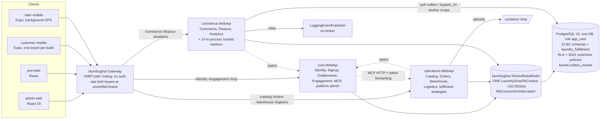
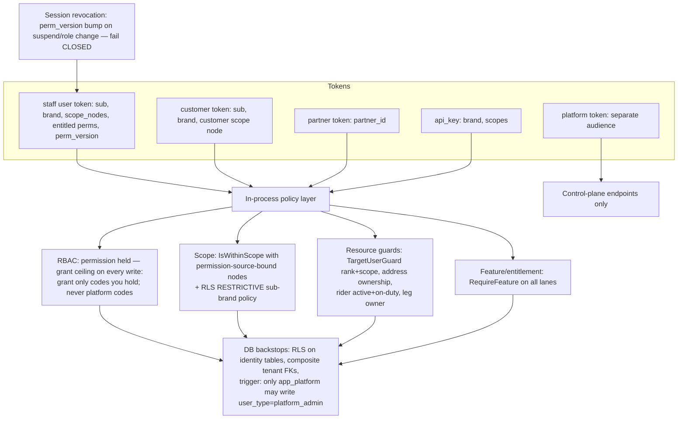

# Report 6 — Target Architecture Proposal (LaundryGhar multi-tenant, multi-vertical SaaS)

**Audience:** engineering leadership and the architects who will run remediation.
**Date:** 2026-10-09. **Author:** Principal Software Architect (multi-agent audit).
**Basis:**
- [01 architecture](specialists/01-architecture.md)
- [01b architect challenge review](specialists/01b-architect-challenge-review.md)
- the eleven specialist reports, QA verification [10a](specialists/10a-qa-verification-security.md) / [10b](specialists/10b-qa-verification-platform.md) / [10c](specialists/10c-qa-verification-db-mobile.md)
- the canonical registry [FINDINGS.md](../../FINDINGS.md) / [findings-registry.json](findings-registry.json)

## Summary

1. **Today.** LaundryGhar is a single-database, single-EF-model application split into three ASP.NET Core hosts behind a YARP gateway. It is a modular monolith in deployment shape. Table ownership is not enforced ([SA-ARCH-001](../../FINDINGS.md#sa-arch-001)), and fourteen background workers run inside the commerce API host ([SA-OPS-005](../../FINDINGS.md#sa-ops-005)).
2. **Recommendation.** Keep the shape and harden it: modular monolith + separate worker host + separate platform control plane, on one PostgreSQL database with row-level security (RLS). **No microservices, no schema-per-tenant, no DB-per-tenant, no plugin framework**, because none of the verified defects is caused by the deployment or isolation *model*.
3. The defects come from eleven cross-cutting root causes (RC1–RC11, §3). Three of them explain all three Critical findings:
   - **RC1:** no single schema source of truth;
   - **RC6:** the identity plane trusts client-supplied attributes;
   - **RC7:** tenant context is implemented per host and per lane.
4. **New structural elements in the target:**
   - one `TenantContextResolver` for every token lane;
   - a dispatcher pipeline that always validates;
   - an `OrderTransitionService` as the only writer of order status;
   - an `IVerticalModule` registration contract;
   - an entitlement *projection* driven by subscription state;
   - Location and Dispatch platform modules;
   - a maintenance DB role in place of the self-settable bypass;
   - a single baseline-plus-migrations schema pipeline built in CI.
5. Every recommendation in this report traces to canonical finding IDs and a root cause. Costs are **architect estimates** for planning, not measurements.
6. Nothing in this report was executed against a running .NET host. There was no .NET SDK and no Docker. SQL claims cited from QA were reproduced on throwaway PostgreSQL 16 clusters built from the repo (see 08b/10a/10c).

---

## 1. Conventions

- **IDs and severities** are the canonical, post-QA values from the registry. A duplicate is written `SA-X (dup of SA-Y)`.
- **Status labels** (Verified / Partially Verified / Suspected / Not Tested) are those recorded in the registry.
- **"Phase"** means the registry roadmap phase: P0 = verified critical risks … P5 = new verticals and scale.
- **Cost** is a T-shirt size with indicative engineer-weeks (ew). These are **estimates only**.

---

## 2. Current architecture (as implemented)

### 2.1 Diagram



### 2.2 Description

| Aspect | What exists | Evidence |
|---|---|---|
| Deployables | 3 API hosts + gateway + admin-web; Aspire AppHost for dev, docker-compose for prod; single replica per host | `laundryghar.AppHost/AppHost.cs:55-118`; `deploy/docker-compose.yml:33-100` |
| Shared data model | Every host references `laundryghar.SharedDataModel`: one `LaundryGharDbContext` mapping all bounded contexts. Per-host `I*DbContext` interfaces are views whose write sets overlap (coupons, payments, cash book, loyalty, packages). | `LaundryGharDbContext.cs:34-217`; `IOperationsDbContext.cs:83-112`; `ICommerceDbContext.cs:32-72` — [SA-ARCH-001](../../FINDINGS.md#sa-arch-001) (Medium after QA-B: structural, no runtime defect of its own) |
| Domain layer | `core.Domain` / `operations.Domain` / `commerce.Domain` contain no source files; entities are mutable property bags; business rules live in transaction-script handlers (e.g. `CreateOrderCommand.cs`, 925 lines) | [SA-SOLID-009](../../FINDINGS.md#sa-solid-009) (SA-ARCH-002 dup) |
| CQRS | Custom `IDispatcher` invokes handlers directly; the pipeline behaviours (validation, transaction, audit, caching) are never executed | `Utilities/CQRS/Dispatcher/Dispatcher.cs:15-45` — [SA-API-003](../../FINDINGS.md#sa-api-003) (SA-ARCH-005, SA-SOLID-005 dups) |
| Tenancy | Brand = tenant. JWT `brand_id` + `scope_nodes`; `RlsConnectionInterceptor` writes 12 GUCs on every open with a three-state sentinel. **Three** `ICurrentTenant` implementations (HTTP, commerce-host, worker) that diverge. | `RlsConnectionInterceptor.cs:57-121` — [SA-ARCH-014](../../FINDINGS.md#sa-arch-014), [SA-TEN-002](../../FINDINGS.md#sa-ten-002) (High; QA-C reproduced cross-customer wallet visibility) |
| Platform authority | `user_type == platform_admin` grants every permission and RLS bypass. It is the same column tenant-plane handlers write from request bodies. | `PermissionHandler.cs:31-33`; `TenantResolutionMiddleware.cs:34-40`; `CreateUser.cs:31,45` — [SA-ARCH-013](../../FINDINGS.md#sa-arch-013), [SA-AUTHZ-001](../../FINDINGS.md#sa-authz-001) (Critical) |
| Workers | 14 `AddHostedService` registrations inside the commerce HTTP host; no advisory locks, leader election or `SKIP LOCKED`; trust granted per call site (`CreateWorkerAsyncScope` vs `CreateAsyncScope`) | `commerce.WebApi/Program.cs:301-323`; `BrandPlatformBillingService.cs:63` vs `:156` — [SA-OPS-005](../../FINDINGS.md#sa-ops-005), [SA-DB-009](../../FINDINGS.md#sa-db-009), [SA-SUB-004](../../FINDINGS.md#sa-sub-004) |
| Eventing | Transactional outbox table. The relay publishes to a logging stub. Consumers poll with three different cursor semantics, two of which can skip events. | [SA-ARCH-006](../../FINDINGS.md#sa-arch-006), [SA-API-015](../../FINDINGS.md#sa-api-015) |
| Gateway | Path routing only; Host not forwarded; rate-limit partition from client-controlled `X-Brand-Id` / unverified JWT. Core's auth limiter sees the gateway IP for every user. | [SA-API-002](../../FINDINGS.md#sa-api-002), [SA-API-001](../../FINDINGS.md#sa-api-001) (Critical), [SA-ONB-001](../../FINDINGS.md#sa-onb-001), [SA-QB-003](../../FINDINGS.md#sa-qb-003) |
| Verticals | `Brand.VerticalKey`, `IFulfillmentStrategy` (laundry, point-to-point, salon, recurring) and templates exist. Order creation ignores the brand vertical. Salon and tiffin are not operable but are sellable. | [SA-VERT-001](../../FINDINGS.md#sa-vert-001), [SA-VERT-002](../../FINDINGS.md#sa-vert-002) |
| Schema pipeline | `database_scripts` + ~145 patches + 33 migrations. The documented bootstrap does not apply the `phase*` patches; per QA-B, `migrate.sh up` fails at 0005. | [SA-DB-002](../../FINDINGS.md#sa-db-002) (SA-ARCH-008 dup) |
| Clients | Four real, API-backed clients for laundry. Brand fixed per build; laundry copy hard-coded outside admin-web; admin-web prod image bakes 3 of 9 API URLs. | [SA-FE-001](../../FINDINGS.md#sa-fe-001), [SA-ONB-008](../../FINDINGS.md#sa-onb-008), [SA-FE-009](../../FINDINGS.md#sa-fe-009) |
| Infra | Uploads in container `/tmp`; partman scheduled only on a developer Mac and blocked by a stale `part_config` row; telemetry not exported or tenant-tagged | [SA-OPS-003](../../FINDINGS.md#sa-ops-003), [SA-OPS-004](../../FINDINGS.md#sa-ops-004), [SA-QC-003](../../FINDINGS.md#sa-qc-003), [SA-OPS-008](../../FINDINGS.md#sa-ops-008) |

**Characterisation:** a modular monolith deployed as three processes. The three hosts share one database role and one model, and their write ownership overlaps. It is not microservices, and the only synchronous inter-service call is MCP → operations ([SA-ARCH-011](../../FINDINGS.md#sa-arch-011)).

---

## 3. Root causes (RC1–RC11)

Root causes come from [01b §3](specialists/01b-architect-challenge-review.md). The finding IDs are re-keyed to canonical IDs.

| RC | Root cause | Canonical findings it explains (selection) |
|---|---|---|
| RC1 | No single schema source of truth | SA-DB-002 (High), SA-OPS-007, SA-QB-002, SA-QC-003, SA-TEN-010 |
| RC2 | Cross-cutting policy is opt-in per endpoint (CQRS pipeline not wired) | SA-API-003, SA-MOB-010, SA-API-016, SA-AUTHZ-011 |
| RC3 | Anemic shared model; invariants duplicated across handlers | SA-SOLID-001 (High), SA-MOB-001 (High), SA-SOLID-003, SA-SOLID-006, SA-SOLID-009, SA-SOLID-011, SA-FE-004, SA-MOB-016 |
| RC4 | No concurrency model | SA-API-004, SA-API-005, SA-API-009, SA-API-020, SA-DB-009, SA-DB-010, SA-MOB-002, SA-SUB-016, SA-QC-001 |
| RC5 | Workers co-hosted without locks, leader election or a uniform trust contract | SA-OPS-005, SA-DB-009, SA-SUB-004, SA-API-012 (High), SA-SOLID-008, SA-ARCH-006, SA-MOB-007 |
| RC6 | Identity plane trusts client attributes; platform power is one mutable column | SA-AUTHZ-001 (Critical), SA-AUTHZ-002/003/004, SA-ARCH-013, SA-DB-005, SA-QA-001, SA-AUTHZ-013 |
| RC7 | Tenant context composed per host and per lane | SA-TEN-001 (Critical), SA-TEN-002, SA-ARCH-014, SA-API-001 (Critical), SA-API-002, SA-QC-002, SA-DB-014 |
| RC8 | Subscription state is not the source of entitlements | SA-SUB-001/002/003/006/007/009/011/012, SA-AUTHZ-004, SA-AUTHZ-011 |
| RC9 | Vertical modelled as metadata, not modules | SA-VERT-001/002/004/006/007/008, SA-AUTHZ-012, SA-API-013, SA-FE-009 |
| RC10 | Single-node / dev-machine infrastructure assumptions | SA-OPS-003, SA-OPS-004, SA-OPS-010, SA-OPS-014, SA-OPS-015, SA-DB-016 |
| RC11 | Documentation ahead of code, used as evidence | SA-OPS-018 (SA-ARCH-012, SA-VERT-011 dups), SA-OPS-009 |

---

## 4. Recommended target architecture

### 4.1 Diagram

```mermaid
flowchart TB
  subgraph Edge
    GW[Gateway<br/>TLS; forwards Host + client IP (trusted network only);<br/>per-tenant + per-plan rate limits keyed on VERIFIED JWT]
  end
  subgraph CP["Platform control plane (separate token audience)"]
    PADM[Platform Admin API:<br/>tenants, plans, platform invoices,<br/>entitlement grants, impersonation]
  end
  subgraph TP["Tenant plane API host(s) — one codebase, modular monolith"]
    direction TB
    subgraph PM["Platform modules (vertical-neutral)"]
      IAM[Identity & Access<br/>TargetUserGuard, grant ceiling, server-derived user_type]
      TEN[Tenancy, Lifecycle, Branding, Domains]
      ENT[Entitlements = projection of subscription]
      BILL[Billing & Subscriptions]
      COMM[Commerce: payments, refunds, coupons, wallet, loyalty]
      SPINE[Order Spine + OrderTransitionService]
      SCHED[Capacity & Scheduling (slots, resources)]
      DISP[Dispatch: Assignment / Leg / Tracking services]
      LOC[Location: geocoder port, service areas, distance]
      ENG[Engagement: brand-keyed channel credentials]
      FILE[File storage port → object storage]
    end
    subgraph VM["Vertical modules (IVerticalModule)"]
      LAU[Laundry]
      COU[Courier]
      SAL[Salon]
      TIF[Tiffin]
    end
  end
  WRK[Worker host (singleton or advisory-locked jobs):<br/>billing, dunning, dispatch policy, outbox inbox consumers,<br/>partition maintenance, retention, notifications]
  PG[(PostgreSQL: shared schema + RLS<br/>module schemas; composite tenant FKs;<br/>roles: app_user / app_maintenance / app_platform)]
  OBJ[(Object storage)]
  OTEL[(OTLP collector: tenant-tagged traces/logs)]
  GW --> TP
  GW --> CP
  TP --> PG
  CP --> PG
  WRK --> PG
  FILE --> OBJ
  TP & CP & WRK --> OTEL
  VM -->|strategy, catalog kind, tax profile,<br/>templates, permission pack, capabilities| SPINE
  SPINE --> COMM
  SPINE --> DISP
  DISP --> LOC
  BILL --> ENT
```

### 4.2 Top-level design choices

| # | Choice | Rationale (findings / RC) | Alternatives considered | Risks | Cost (estimate) |
|---|---|---|---|---|---|
| D1 | **Modular monolith** with explicit modules and one writing module per table, enforced by architecture tests | The order spine, payments, coupons and dispatch are committed in one transaction (`CreateOrderCommand.cs:757-795`), so process boundaries without data boundaries add cost without independence (SA-ARCH-001, SA-SOLID-009, SA-SOLID-012; RC3) | (a) Status quo of three hosts over one model: fails Q7 and keeps drift. (b) Microservice per bounded context or vertical: needs sagas, a broker, per-service DB and RLS; no measured need. (c) Collapse to one host: viable, but loses independent scaling of HTTP lanes. | Module discipline erodes without failing tests | M: 6–10 ew to carve modules and add architecture tests |
| D2 | **Separate worker host** (same code, own composition root), with advisory locks and `SKIP LOCKED` claims | RC5: SA-OPS-005, SA-DB-009, SA-SUB-004, SA-API-015 | Leader election via a lock service; keep co-hosted with per-job advisory locks only (acceptable interim) | Operational: one more deployable | S: 2–3 ew |
| D3 | **Platform control plane**: separate token audience and endpoint group; platform users cannot be created or promoted from tenant APIs | RC6: SA-AUTHZ-001 (Critical), SA-ARCH-013, SA-AUTHZ-004 | Keep `user_type` god-mode with handler guards only (necessary in Phase 0 but not sufficient) | Operator tooling must switch audience | S–M: 3–5 ew |
| D4 | **Shared schema + RLS kept**, with database backstops added (§11) | 126/126 brand tables already carry RLS (08b); the defects are wiring (RC7) and missing backstops, not the model; ADR-001 (`docs/ADRs/ADR-001-rls-over-schema-per-tenant.md`) | Schema-per-tenant, DB-per-tenant (§11) | RLS performance (SA-DB-017) | see §11 |
| D5 | **One schema pipeline**: reviewed baseline + versioned migrations, built from empty in CI with an EF-model check | RC1: SA-DB-002, SA-OPS-007, SA-QB-002, SA-QC-003 | Keep the patch bootstrap and document it better (rejected: it already fails at 0005 per QA-B) | Baseline must match production; obtain a production `pg_dump --schema-only` first | S–M: 3–4 ew |
| D6 | **Outbox + inbox, typed contracts, no broker yet** | SA-ARCH-006, SA-API-015; ADR-007 intent | RabbitMQ/Kafka now (premature: polling latency is acceptable for notifications and loyalty) | Event-table growth; mitigated by partitioning and retention | S: 2 ew |

---

## 5. Tenant provisioning flow

```mermaid
sequenceDiagram
  actor Owner as Business owner (or platform operator)
  participant API as Provisioning service (one path for signup AND operator)
  participant REG as IVerticalModule registry
  participant IAM as Identity & Access
  participant BILL as Billing
  participant ENT as Entitlements
  participant DB as PostgreSQL (single transaction, app_platform role)
  Owner->>API: start(phone OTP) / complete(template, plan, business info)
  API->>REG: template.vertical registered AND IsOperable?
  REG-->>API: ok / reject (non-operable verticals never offered)
  API->>DB: brand(vertical_key, branding defaults), franchise, store
  API->>IAM: owner user — user_type DERIVED from role, never from request
  API->>BILL: subscription(plan, status=trialing, trial_end)
  BILL->>ENT: project features from plan + status
  ENT->>DB: brand_feature rows (source=subscription, valid_until)
  API->>REG: module.Provision(brand): catalog seed, role pack, terminology,<br/>tax profile, notification templates, location defaults
  DB-->>Owner: tenant live at <slug>.platform-domain
  Note over BILL,ENT: Worker host: trial_end → invoice → past_due → suspend;<br/>payment → active; every transition re-projects entitlements
```

| Element | Fixes | Alternatives | Risks | Cost (estimate) |
|---|---|---|---|---|
| One provisioning service for self-signup and operator `CreateBrand` | [SA-ONB-005](../../FINDINGS.md#sa-onb-005) (unprovisioned operator path; SA-VERT-009 dup), [SA-ONB-010](../../FINDINGS.md#sa-onb-010) (no plan choice) | Keep two paths and patch both | Partial provisioning, mitigated by a single transaction plus an idempotent re-run | S: 2 ew |
| Operability check before a template is sellable | [SA-VERT-002](../../FINDINGS.md#sa-vert-002) (P0 flip of `is_public`) | Manual `is_public` flags (today; already drifted per QA-B contradiction 8) | — | XS |
| Server-derived owner `user_type`; atomic invite | [SA-AUTHZ-001](../../FINDINGS.md#sa-authz-001), [SA-QA-001](../../FINDINGS.md#sa-qa-001) | — | — | S (Phase 0) |
| Module-supplied provisioning (tax profile, templates, GSTIN to invoices) | [SA-VERT-004](../../FINDINGS.md#sa-vert-004), [SA-API-013](../../FINDINGS.md#sa-api-013), [SA-ONB-007](../../FINDINGS.md#sa-onb-007) | Hard-coded laundry defaults (today) | — | M: 3–4 ew |

Root causes: RC6, RC8, RC9.

---

## 6. Request-processing flow

```mermaid
flowchart LR
  C[Client] --> G[Gateway: overwrite X-Forwarded-For;<br/>forward Host; verify JWT signature<br/>for rate-limit key]
  G --> E[ExceptionHandler]
  E --> A[AuthN: JWT, audience per plane]
  A --> T[TenantContextResolver — ONE implementation:<br/>user / customer / partner / api_key / worker → same 12 GUCs,<br/>customer gets an explicit customer scope node]
  T --> L[Lifecycle gate: suspended/cancelled on ALL lanes incl. partner, api_key, workers]
  L --> Z[AuthZ: permission + scope + RequireFeature metadata]
  Z --> D[Dispatcher pipeline (always on):<br/>Validation → UnitOfWork+concurrency → Audit]
  D --> H[Handler → owning module API → DbContext]
  H --> I[RlsConnectionInterceptor]
  I --> P[(PostgreSQL RLS)]
```

| Element | Fixes (canonical) | RC | Alternatives | Risks | Cost (estimate) |
|---|---|---|---|---|---|
| Single `TenantContextResolver`; customer scope node; commerce host delegates | [SA-TEN-001](../../FINDINGS.md#sa-ten-001) (Critical; 0031 denies customer, API-key **and** commerce-host staff lanes, per QA-C T1b), [SA-TEN-002](../../FINDINGS.md#sa-ten-002), [SA-ARCH-014](../../FINDINGS.md#sa-arch-014) | RC7 | Exempt `token_use=customer` in the 0031 predicate (acceptable Phase 0 stopgap, weaker) | Must ship with the address-ownership fix [SA-MOB-005](../../FINDINGS.md#sa-mob-005) (QA-C M12 note) | S: 2 ew + lane×host test matrix |
| Gateway forwards client IP with an allow-listed proxy network | [SA-API-001](../../FINDINGS.md#sa-api-001) (Critical), [SA-QB-003](../../FINDINGS.md#sa-qb-003) | RC7 | Move auth limiting to the gateway only | Trusting `X-Forwarded-For` from any peer (current `ServiceDefaults/Extensions.cs:273-283` clears `KnownNetworks`) | XS–S |
| Lifecycle gate on every lane and in workers | [SA-TEN-003](../../FINDINGS.md#sa-ten-003), [SA-TEN-008](../../FINDINGS.md#sa-ten-008) | RC7/RC8 | HTTP-only gate (today) | — | S |
| Dispatcher pipeline with validation always on (39 dead validators per QA-B) | [SA-API-003](../../FINDINGS.md#sa-api-003) | RC2 | Keep per-endpoint `ValidationFilter` (rejected: forgotten in practice) | Latent 400s surface; roll out per module with tests. The existing `ExceptionBehavior` would wrap business exceptions into 500s, so it must be redesigned, not enabled. | S: 2 ew |
| Optimistic concurrency (`xmin`) on orders, assignments, wallets, coupons, subscriptions | [SA-API-005](../../FINDINGS.md#sa-api-005), [SA-API-004](../../FINDINGS.md#sa-api-004), [SA-DB-010](../../FINDINGS.md#sa-db-010) | RC4 | Pessimistic `FOR UPDATE` per path | Retry semantics in handlers | M: 4–6 ew |

---

## 7. AuthN / AuthZ flow



| Choice | Fixes | RC | Alternatives | Risks | Cost (estimate) |
|---|---|---|---|---|---|
| Server-derived `user_type`; platform audience; DB trigger | SA-AUTHZ-001 (Critical), SA-ARCH-013 | RC6 | Handler guard only | — | S (P0) + S–M (audience) |
| One `TargetUserGuard` for all identity writes; `GrantMembership` target must be in the actor's brand | [SA-AUTHZ-002](../../FINDINGS.md#sa-authz-002), [SA-AUTHZ-003](../../FINDINGS.md#sa-authz-003) | RC6 | Per-handler checks | Guard bypass if a new handler forgets it; add an architecture test | S |
| Grant ceiling on overrides and role cells; platform-only entitlement handlers | [SA-AUTHZ-004](../../FINDINGS.md#sa-authz-004) | RC6/RC8 | — | — | S |
| Bind scope nodes to the permission source | [SA-AUTHZ-007](../../FINDINGS.md#sa-authz-007) | RC6 | — | Token size | S–M |
| Revocation fails closed | [SA-AUTHZ-009](../../FINDINGS.md#sa-authz-009) | RC6 | — | Login availability coupled to the version store | S |
| **ABAC engine stays off**; attribute rules are guards plus DB constraints; activate later only with parity tests | [SA-AUTHZ-008](../../FINDINGS.md#sa-authz-008), [SA-DB-014](../../FINDINGS.md#sa-db-014) | RC2 | (a) Activate the generic engine now: its raw connections lack GUCs (SA-DB-014). (b) External PDP (OPA/Cedar): latency and operational cost with no current need. | Guard sprawl, mitigated by a shared guard library | — |

---

## 8. Subscription entitlement enforcement flow

```mermaid
flowchart LR
  PLAN[Plan + add-ons] --> SM[Subscription state machine<br/>trialing → active → past_due → suspended → cancelled<br/>(past_due → active on payment)]
  PAY[Razorpay webhook / paylink<br/>accepts past_due invoices] --> SM
  SM -->|projection, versioned| BF[brand_feature<br/>source = subscription | operator_grant, valid_until]
  OG[Operator grant — control plane only, audited] --> BF
  BF --> SNAP[Entitlement snapshot cache (brand, version)]
  SNAP --> TOK[Staff token perms filtered at mint (optimisation only)]
  SNAP --> EP[RequireFeature endpoint metadata — staff, customer, partner, api_key]
  SNAP --> WK[Workers check before acting (notifications, billing, dispatch)]
  SNAP --> AC[/app-config: entitlement ∩ strategy capability requirements/]
  SNAP --> Q[Quota checks (locations, users, orders/month)]
```

| Choice | Fixes | RC | Alternatives | Risks | Cost (estimate) |
|---|---|---|---|---|---|
| Entitlements are a **projection** of subscription state | [SA-SUB-006](../../FINDINGS.md#sa-sub-006), [SA-SUB-001](../../FINDINGS.md#sa-sub-001), [SA-SUB-003](../../FINDINGS.md#sa-sub-003), [SA-SUB-012](../../FINDINGS.md#sa-sub-012) | RC8 | Keep `brand_feature` written directly by signup and operators (today) | Revocation latency; bounded by snapshot TTL + `perm_version` bump | M: 4–6 ew |
| Billing worker on by default, in a trusted worker scope; `past_due` paylinks accepted | [SA-SUB-004](../../FINDINGS.md#sa-sub-004), [SA-SUB-005](../../FINDINGS.md#sa-sub-005), [SA-SUB-002](../../FINDINGS.md#sa-sub-002), [SA-SUB-014](../../FINDINGS.md#sa-sub-014) | RC5/RC8 | — | — | S–M |
| `RequireFeature` metadata on every lane (not only staff token stripping) | [SA-AUTHZ-011](../../FINDINGS.md#sa-authz-011) (SA-SUB-010 dup), [SA-SUB-009](../../FINDINGS.md#sa-sub-009) | RC2/RC8 | Per-request DB lookup (correct but costly); token-only (today: misses non-staff lanes) | — | S–M |
| Quotas evaluated from the same snapshot | [SA-SUB-008](../../FINDINGS.md#sa-sub-008) | RC8 | — | Plan-limit modelling must be fixed first (Starter "1 location") | S |
| Tenant billing self-service; GST platform invoices | [SA-SUB-007](../../FINDINGS.md#sa-sub-007), [SA-SUB-013](../../FINDINGS.md#sa-sub-013) | RC8 | — | — | M |
| Franchise SaaS (ADR-010 module B): decide to build or descope | [SA-SUB-011](../../FINDINGS.md#sa-sub-011) | RC11 | — | — | decision first |

---

## 9. Business-vertical module boundaries

### 9.1 Boundaries

```mermaid
flowchart TB
  subgraph Spine["Order spine (vertical-neutral, platform-owned)"]
    OC[OrderCreationService:<br/>mode = isParcel ? point_to_point : FulfillmentMode.DefaultFor(brand.vertical_key);<br/>order.vertical_key = brand.vertical_key]
    OTS[OrderTransitionService — the ONLY writer of orders.status:<br/>strategy.EnsureTransition → LifecycleState → effects → history → outbox]
    INV[Invoicing via module TaxProfile]
    NC[Notification event catalog → module templates]
  end
  subgraph Module["IVerticalModule (per vertical)"]
    S[IFulfillmentStrategy (keyed by FulfillmentMode)]
    CK[CatalogKind + attributes]
    PP[Permission/role pack + seed + terminology]
    TP[TaxProfile, notification templates]
    CAP[Capabilities: RequiresAddressGeo, RequiresStoreDrop,<br/>SupportsLiveTracking, RequiresAppointmentSlot]
    EP[Vertical endpoints + private schema + EF configurations]
    OP[IsOperable() — gates signup and templates]
  end
  ADM[Admin, POS, rider leg completion, customer cancel,<br/>warehouse QC, workers] -->|all transitions| OTS
  OC --> S
  OTS --> S
  INV --> TP
  NC --> TP
  EP --> PRIV[(laundry_fulfillment / salon_fulfillment / tiffin schemas)]
```

### 9.2 Contract sketch (design only; not code in the repo)

```text
interface IVerticalModule
  VerticalKey            : string           // laundry | salon | logistics | tiffin
  FulfillmentModes       : set<string>      // strategies it contributes
  IsOperable()           : bool             // false ⇒ template hidden, signup refused
  CatalogKind, TaxProfile, Terminology, NotificationTemplates
  Capabilities           : set<Capability>  // drives /app-config and endpoint gates
  ConfigureModel(ModelBuilder)              // its EF configurations / private schema
  MapEndpoints(IEndpointRouteBuilder)       // each tagged RequireFeature(vertical feature)
  Provision(brand)                          // seed catalog, roles, templates
```

### 9.3 Decisions

| Choice | Fixes | RC | Alternatives | Risks | Cost (estimate) |
|---|---|---|---|---|---|
| `OrderCreationService` uses the brand vertical | [SA-VERT-001](../../FINDINGS.md#sa-vert-001) (SA-ARCH-003, SA-ONB-004, SA-SOLID-004 dups) | RC9 | DB trigger deriving `orders.vertical_key` from the brand (useful backstop as well) | Laundry parity | S |
| `OrderTransitionService` is the sole status writer; admin-web uses server `allowedTransitions` | [SA-SOLID-001](../../FINDINGS.md#sa-solid-001) (SA-API-006 dup), [SA-MOB-001](../../FINDINGS.md#sa-mob-001), [SA-MOB-016](../../FINDINGS.md#sa-mob-016), [SA-FE-004](../../FINDINGS.md#sa-fe-004) | RC3 | Patch each of the five writers (`CancelOrderCommand.cs:59`, `CancelOrderByCustomerCommand.cs:53`, `UpdateOrderStatusCommand.cs:60`, `UpdateMyTaskStatus.cs:159,368`) | Touches the money path; parity tests first | M: 4–5 ew |
| Server-side vertical gates through `RequireFeature` on module endpoints | [SA-AUTHZ-012](../../FINDINGS.md#sa-authz-012) (SA-FE-006, SA-MOB-015, SA-ONB-003, SA-VERT-005 dups) | RC9 | Navigation-only gating (today) | — | S |
| Module-supplied tax, templates, catalog | [SA-VERT-004](../../FINDINGS.md#sa-vert-004), [SA-VERT-006](../../FINDINGS.md#sa-vert-006), [SA-VERT-008](../../FINDINGS.md#sa-vert-008), [SA-VERT-007](../../FINDINGS.md#sa-vert-007) | RC9 | — | — | M |
| Compile-time module registration | Q7 | RC9 | Runtime plugin assemblies (premature) | — | — |
| Coupon/promotion policy owned by Commerce, used by order creation | [SA-SOLID-006](../../FINDINGS.md#sa-solid-006), [SA-DB-010](../../FINDINGS.md#sa-db-010) | RC3/RC4 | Three implementations (today) | — | S–M |

---

## 10. Tenant configuration and branding model

### 10.1 Where configuration lives (target)

| Concern | Store (existing where possible) | Served by | Consumed by | Today → gap |
|---|---|---|---|---|
| Identity: name, logo, favicon, colours | `tenancy_org.brands.logo_url/favicon_url/primary_color/secondary_color/accent_color` (`database_scripts/01_bc1_tenancy_org.sql:42-70`, per 05) + an upload endpoint via the file storage port | `GET /app-config` (public, brand resolved by Host / brand code; served through a SECURITY DEFINER read or a dedicated public view) | all four clients at runtime | No write path, no consumer ([SA-ONB-002](../../FINDINGS.md#sa-onb-002)); anonymous reads return nothing under RLS ([SA-TEN-006](../../FINDINGS.md#sa-ten-006)) |
| Domains | `tenancy_org.brand_domains` + `kernel.resolve_brand_domain` (migrations 0002/0003) | Gateway forwards Host; `BrandResolver` (Host first) | storefront / web | Host not forwarded ([SA-ONB-001](../../FINDINGS.md#sa-onb-001), Medium, dissent below); no TLS automation |
| Terminology | `identity_access.vertical_terms` (0010) | `GET /terminology` | all clients | Wired only in admin-web/pos-web ([SA-FE-009](../../FINDINGS.md#sa-fe-009)) |
| Navigation | `identity_access.modules` (vertical-tagged) | `GetNavigator` | admin-web | Vertical gate fails open (SA-AUTHZ-012) |
| Capabilities (parcel, address geo, live tracking, store locator) | **No new table**: features in the existing catalog (`features.vertical_key`, `brand_feature`) ∩ strategy capability flags | `GET /app-config` | mobile flows, endpoint gates | Not modelled (M4/M5 Not Supported) |
| Channel credentials (WhatsApp, SMS, email, maps) | `kernel.system_settings` brand rows, encrypted | brand-keyed resolver | workers, admin map | Worker picks an arbitrary tenant's credentials ([SA-API-012](../../FINDINGS.md#sa-api-012)); map keys unencrypted ([SA-MOB-021](../../FINDINGS.md#sa-mob-021)) |
| Notification templates, invoice identity | `engagement_cms.notification_templates` per brand; supplier + GSTIN from brand/franchise | module-supplied defaults at provisioning | — | LaundryGhar identity leaks ([SA-API-013](../../FINDINGS.md#sa-api-013)); GSTIN dropped ([SA-ONB-007](../../FINDINGS.md#sa-onb-007)) |
| Mobile build identity | `GetAppConfig` (`core.Application/Identity/WhiteLabel/Queries/GetAppConfig.cs:46-97`) → JSON → `app.config.ts` per EAS profile | build pipeline | EAS | Output has no consumer ([SA-ONB-008](../../FINDINGS.md#sa-onb-008)); identifiers can collide ([SA-ONB-012](../../FINDINGS.md#sa-onb-012)); pipeline not operational ([SA-OPS-016](../../FINDINGS.md#sa-ops-016)) |

### 10.2 Runtime configuration vs per-tenant builds

| Model | When to use | Fit | Risks | Cost (estimate) |
|---|---|---|---|---|
| **Runtime-configured shared app** (default): one "host" customer app and one rider app; brand chosen by deep link, QR, search or domain; theme, terminology and capabilities from `/app-config` | Default tier for all tenants | Uses the existing endpoints (`/terminology`, `/fulfillment-config`, `GetAppConfig`) | Store listing shows the platform brand, not the tenant's | M: 4–6 ew (runtime theming + brand discovery) |
| **Per-tenant white-label builds** from the same source: EAS profile per brand generated from `GetAppConfig` JSON; never fork source | Premium tier needing an own store listing | 05 and 12 both recommend it as the build-time option | Per-brand signing keys, store accounts, review cycles, OTA channels; app-store policy on template apps must be checked (not verified, 01b open question) | S per brand once the pipeline exists; pipeline M |
| Dedicated deployment per tenant | Only for a contractual data-residency requirement | Nothing in code needs it (05 comparison) | N stacks, N migrations | High; not recommended |

Root causes: RC9 and RC10. Phase P4 in the registry, except the credential and identity leaks.

---

## 11. Database isolation recommendation and alternatives

### 11.1 Recommendation

**Keep shared schema + RLS** (ADR-001) and add the missing backstops:

| Backstop | Fixes | RC | Risks | Cost (estimate) |
|---|---|---|---|---|
| **Fix 0031 lane mapping**: customer scope node; commerce host delegates to the shared resolver; lane×host×restrictive-table test matrix on a migrated schema | [SA-TEN-001](../../FINDINGS.md#sa-ten-001) (Critical), [SA-TEN-002](../../FINDINGS.md#sa-ten-002), [SA-QC-002](../../FINDINGS.md#sa-qc-002) | RC7 | The existing test `SubBrandScopeRlsTests.cs:264-273` encodes the defect (QA-C) and must change | S |
| **Replace the self-settable `app.bypass_rls` GUC** with role-based bypass: `kernel.rls_bypass()` true only for `current_user IN (app_platform, app_maintenance)`. Platform admins and workers connect with those roles. | [SA-TEN-007](../../FINDINGS.md#sa-ten-007) (SA-DB-015 dup; S5 reproduced `app_user` self-setting bypass) | RC6/RC7 | Extra connection pools; platform requests need explicit brand predicates (already required) | S–M: 2–3 ew |
| **Separate maintenance role** owning SECURITY DEFINER lifecycle functions; revoke them from `app_user` | [SA-DB-003](../../FINDINGS.md#sa-db-003) (Medium after QA-C; QA-C notes `RetentionSweepService.cs:241` needs it, so the revoke must be sequenced with the new role) | RC6 | Retention/erasure jobs must move to the worker host's maintenance connection | S |
| **RLS on identity tables** (`user_scope_memberships`, `user_profiles`, `refresh_tokens`, `role_permissions`, `login_history`) with a brand-resolving policy; users INSERT no longer `WITH CHECK (true)` | [SA-DB-005](../../FINDINGS.md#sa-db-005), SA-AUTHZ-003 | RC6 | Access-control screens read others' memberships by design, so the policy must be designed, not copied (0029 note) | M: 3 ew |
| **Composite tenant FKs** (`UNIQUE(brand_id,id)` on parents; `(brand_id,parent_id)` FKs), incrementally on high-value relations (orders→addresses, assignments→riders, payments→orders) | [SA-DB-004](../../FINDINGS.md#sa-db-004) (Medium after QA-C), [SA-MOB-005](../../FINDINGS.md#sa-mob-005) | RC4/RC7 | Partitioned `orders(id, created_at)` composite keys complicate FKs; do it per relation | M: 3–5 ew |
| **Brand-scoped business uniques + counter rows** (`(brand_id, number)`; `next_*_number` upsert pattern) | [SA-DB-007](../../FINDINGS.md#sa-db-007) (Medium), [SA-QC-002](../../FINDINGS.md#sa-qc-002) | RC4 | Number format change for existing data | S |
| **Analytics MVs** behind brand-filtered SECURITY DEFINER views or per-brand refresh | [SA-DB-013](../../FINDINGS.md#sa-db-013) | RC7 | Refresh cost | S |
| Set-based scope predicate replacing per-row plpgsql | [SA-DB-017](../../FINDINGS.md#sa-db-017) (~8× slower, synthetic) | RC10 | Behaviour parity | S |

### 11.2 Alternatives

| Model | Isolation | Fit with codebase | Operational cost | Verdict |
|---|---|---|---|---|
| **Shared schema + RLS (recommended)** | Logical; strong once backstops exist | Already implemented on 126/126 brand tables; interceptor pool-safe for EF (DB-Q8 Partially: raw ABAC/`BrandExportService` paths and session-level GUCs) | Lowest | Adopt |
| Schema-per-tenant | Stronger blast radius per tenant | Requires search_path routing, N× migrations, cross-tenant platform analytics rework, partman per schema | High; migration runner and partman at N schemas | Reject: the verified defects (identity escalation, lane mapping) would survive unchanged |
| DB-per-tenant | Strongest; per-tenant restore and residency | Connection management, N migrations, N backups; platform billing and analytics become federated | Highest | Only for a contractual residency or isolation tier, later, as a separate deployment |

---

## 12. Booking, scheduling, fulfilment, map, location and dispatch boundaries

```mermaid
flowchart LR
  subgraph Clients
    CA[Customer app: address pin/geocode, serviceability,<br/>slot/appointment booking, own-leg coarse tracking]
    RA[Rider app: tasks, offers, push, deep-link nav,<br/>validated background pings]
    AW[Admin: store-scoped live map, assign/reassign]
  end
  subgraph Sched["Capacity & Scheduling (platform)"]
    SL[Slots: store-resolved, atomic capacity (existing)]
    RES[Resources/appointments: staff, chairs, duration,<br/>exclusion constraints (salon)]
    REC[Recurring schedule generator (tiffin)]
  end
  subgraph Loc["Location (platform)"]
    GEO[IGeocoder port → one provider adapter]
    SA[ServiceAreaResolver: pincode → polygon (ST_Covers)]
    DIST[DistanceService: haversine → matrix later]
  end
  subgraph Disp["Dispatch (operations-owned, single writer)"]
    AS[AssignmentService: create/offer/accept/reassign/cancel;<br/>partial unique index on active leg; conditional UPDATE]
    LTS[LegTransitionService: leg state machine → OrderTransitionService]
    TRK[TrackingService: validated pings, duty/active gate,<br/>server time, retention, customer view]
  end
  CA --> SA & GEO & SL & RES
  RA --> LTS & TRK
  AW --> AS
  WRK[Worker host: auto-dispatch policy, offer expiry,<br/>retention, recurring emission] --> AS & TRK & REC
  AS --> DIST
  LTS --> SPINE[Order spine]
  STRAT[Strategy capabilities] --> AS & CA
```

| Choice | Fixes | RC | Alternatives | Risks | Cost (estimate) |
|---|---|---|---|---|---|
| **One Dispatch module** owns assignments. AutoDispatch moves out of `commerce.Infrastructure` and the worker host composes it. | [SA-MOB-002](../../FINDINGS.md#sa-mob-002) (SA-DB-022 dup), [SA-SOLID-011](../../FINDINGS.md#sa-solid-011), SA-ARCH-001 | RC3/RC5 | "Shared static helpers" across hosts (12's proposal; rejected in 01b: two writers for one invariant); dispatch microservice (rejected: shares order and payment transactions) | Migration of auto-dispatch behaviour; parity tests | M: 3–4 ew |
| **Leg state machine**, idempotent terminal handling, order effects through `OrderTransitionService` | [SA-MOB-001](../../FINDINGS.md#sa-mob-001), [SA-MOB-016](../../FINDINGS.md#sa-mob-016), [SA-MOB-014](../../FINDINGS.md#sa-mob-014) | RC3 | — | — | S–M |
| **Location module** as the single writer of coordinates; geocode on address save; copy to legs; store pinning | [SA-MOB-004](../../FINDINGS.md#sa-mob-004), [SA-MOB-013](../../FINDINGS.md#sa-mob-013) | RC9 | Client-only device coordinates (insufficient for typed addresses) | Third-party geocoding cost and quota; DPDP processor obligations | M: 3–4 ew |
| **Capabilities as entitlement features** combined with strategy flags (no separate capability system) | M4/M5; SA-AUTHZ-012 | RC8/RC9 | A new capability table (rejected in 01b: third source of truth) | — | S |
| **Tracking privacy**: ping validation, duty/status gating, retention by partition drop in-app, PII masking for history | [SA-MOB-010](../../FINDINGS.md#sa-mob-010), [SA-MOB-011](../../FINDINGS.md#sa-mob-011) (QA-C correction: the gap is via `UpdateRider` suspend/terminate, not deactivate), [SA-OPS-004](../../FINDINGS.md#sa-ops-004) (SA-MOB-012 dup), [SA-MOB-019](../../FINDINGS.md#sa-mob-019) | RC2/RC10 | partman retention alone (blocked by [SA-QC-003](../../FINDINGS.md#sa-qc-003)) | — | S |
| **Proof of delivery**: OTP generation as a strategy transition effect, with attempt lockout | [SA-MOB-003](../../FINDINGS.md#sa-mob-003) | RC3 | Remove the OTP claim until built | — | S |
| **Appointment scheduling** with exclusion constraints in the salon module | [SA-VERT-003](../../FINDINGS.md#sa-vert-003), [SA-DB-021](../../FINDINGS.md#sa-db-021) | RC9 | Reuse delivery slots (insufficient for staff/chair concurrency) | Salon scope is large; the blueprint's 49 person-day claim is unverified | L: 8–12 ew |
| **Real-time**: keep polling; add rider push for assign and cancel | [SA-MOB-007](../../FINDINGS.md#sa-mob-007), [SA-MOB-006](../../FINDINGS.md#sa-mob-006) | RC5 | SignalR/WebSockets (deferred; no measured need) | — | S |

**Minimum for laundry go-live** (from 01b M12 with the QA-C additions): fix SA-TEN-001 first (a prerequisite for any customer journey); ship SA-MOB-005 in the same release; then SA-MOB-001, SA-MOB-002, SA-MOB-010/011, SA-MOB-008/009, SA-MOB-003 (or retract the claim) and SA-FE-011. Courier additionally needs SA-MOB-004 and SA-MOB-013.

---

## 13. Deployment and scaling implications

| Concern | Target | Fixes | RC | Alternatives | Risks | Cost (estimate) |
|---|---|---|---|---|---|---|
| **Worker host and locks** | Separate `Worker` deployable. Each job tick takes `pg_try_advisory_lock(job_id)`. Claims use `UPDATE … WHERE status='pending' … FOR UPDATE SKIP LOCKED`. Inbox (`outbox_consumed_events`) for every consumer, following the proven `PartnerBookingDebitService` pattern. | [SA-OPS-005](../../FINDINGS.md#sa-ops-005) (Medium; P0 before scale-out), [SA-DB-009](../../FINDINGS.md#sa-db-009), [SA-API-015](../../FINDINGS.md#sa-api-015), [SA-ARCH-006](../../FINDINGS.md#sa-arch-006) | RC5 | Keep in the commerce host with advisory locks (acceptable interim) | Lock starvation if a job hangs; use lock timeouts and metrics | S–M |
| **Object storage** | Implement the S3/Blob provider at the existing seam (`FileStorageProviderFactory.cs:16-37`, which currently throws for non-local). Brand-prefixed keys (existing). Signed URLs. | [SA-OPS-003](../../FINDINGS.md#sa-ops-003) (SA-API-017 dup) | RC10 | Named volume (interim P0 step per 11) | Migration of existing files | S |
| **Partition maintenance** | Fix the stale `part_config` row. Run maintenance **per table** from the worker host (`PartitionMaintenanceService` exists for pings) or pg_cron. Alert on failure and on runway below N days. | [SA-OPS-004](../../FINDINGS.md#sa-ops-004) (runway reported to 2026-12-01 on the dev DB), [SA-QC-003](../../FINDINGS.md#sa-qc-003) | RC10 | macOS launchd (today) | A single bad row aborts `run_maintenance_proc` (QA-C) | S |
| **Connection pooling / PgBouncer** | Keep Npgsql in-process pooling with session-level GUCs (safe on the EF path, SA-DB-016). Any external pooler must run in **session** mode. To allow transaction-mode later, move to `set_config(…, true)` inside an explicit per-request transaction and route raw connections through the interceptor. Add a startup assertion against `No Reset On Close`. | [SA-DB-016](../../FINDINGS.md#sa-db-016), [SA-DB-014](../../FINDINGS.md#sa-db-014); DB-Q8 Partially | RC7/RC10 | Transaction-mode PgBouncer now (breaks tenant context: no session affinity) | Connection budget with three roles and more hosts; size pools explicitly | S (document + assert), M (transaction-local GUCs) |
| **Per-tenant rate limits** | Gateway validates the JWT signature (JWKS) before using `brand_id` as the partition. Plan-aware limits from the entitlement snapshot. Core auth limits on the forwarded client IP. Distributed limiter store only when there is more than one gateway replica. | [SA-API-001](../../FINDINGS.md#sa-api-001), [SA-API-002](../../FINDINGS.md#sa-api-002), [SA-OPS-014](../../FINDINGS.md#sa-ops-014), [SA-QA-002](../../FINDINGS.md#sa-qa-002) | RC7/RC10 | IP-only limits (unfair behind NAT) | Gateway JWKS dependency | S |
| **Observability** | OTLP exporter configured in production. `brand_id` and lane as trace/log attributes (not high-cardinality metric labels). Correlation id linked to the audit trail. Alerts on worker failures, partition runway and 402/403 spikes. | [SA-OPS-008](../../FINDINGS.md#sa-ops-008) (SA-TEN-014 dup), [SA-OPS-011](../../FINDINGS.md#sa-ops-011) | RC10 | — | PII in logs ([SA-API-025](../../FINDINGS.md#sa-api-025)) | S–M |
| **Caches** | Output cache and IMemoryCache stay in-process for one replica. Swap to a distributed store before scaling API replicas (documented in `OutputCaching.cs:27-29`). | [SA-OPS-015](../../FINDINGS.md#sa-ops-015) | RC10 | — | Stale entitlement or brand status across replicas | S when needed |
| **Release pipeline** | Images only from green CI; migration stage (baseline + up/down in CI); approval gate; pos-web and mobile in CI. | [SA-OPS-006](../../FINDINGS.md#sa-ops-006), [SA-OPS-007](../../FINDINGS.md#sa-ops-007), [SA-OPS-012](../../FINDINGS.md#sa-ops-012), [SA-FE-011](../../FINDINGS.md#sa-fe-011), [SA-FE-001](../../FINDINGS.md#sa-fe-001) | RC1/RC10 | — | — | S–M |
| **Backup / DR** | PITR (WAL archiving), encrypted backups, proven schedule; tenant export already exists, tenant restore later | [SA-OPS-010](../../FINDINGS.md#sa-ops-010) | RC10 | Daily logical dumps only (today) | — | S–M |
| **Secrets** | Secrets store behind the documented provider abstraction; rotate the hard-coded runtime role password | [SA-OPS-009](../../FINDINGS.md#sa-ops-009), [SA-TEN-015](../../FINDINGS.md#sa-ten-015), [SA-API-023](../../FINDINGS.md#sa-api-023) | RC10/RC11 | — | — | S |

---

## 14. Phasing (dependency order; aligned to registry phases)

| Phase | Architectural work | Key canonical IDs |
|---|---|---|
| **P0: verified critical security and data-loss risks** | Server-derived `user_type`, platform trigger, TargetUserGuard, grant ceiling. Single tenant-context mapping for the customer and commerce lanes. Forwarded client IP. Brand-keyed channel credentials. Suspension self-lift. Payment capture/refund correctness (refund row before gateway call). Leg state machine. Object storage or volume. Partman fix + schedule. Backups. Hide non-operable templates. Freeze the bootstrap path. | SA-AUTHZ-001/002/003/004, SA-ARCH-013/014, SA-TEN-001/002/003, SA-API-001/007/008/009/012, SA-QC-001/003, SA-MOB-001/005, SA-OPS-003/004/010, SA-VERT-002, SA-DB-002/003/012, SA-QA-001, SA-FE-001 |
| **P1: production foundations** | Schema baseline + CI build. Worker host + locks + inbox. Concurrency tokens + unique indexes. Dispatcher validation. Role-based bypass. Identity RLS. Gateway JWT-verified rate keys. Release gating. Commerce tests. Telemetry. | SA-DB-002, SA-OPS-005/006/007/008, SA-DB-009, SA-API-002/003/004/005/015, SA-TEN-007, SA-DB-005, SA-ARCH-006/010, SA-QC-002, SA-MOB-002/003/008/010/011 |
| **P2: billing and entitlement correctness** | Entitlement projection; billing state machine; RequireFeature on all lanes; quotas; tenant billing UI | SA-SUB-001…015, SA-AUTHZ-011, SA-SOLID-003, SA-QB-001 |
| **P3: module boundaries and seams** | Table ownership + architecture tests; OrderCreation/OrderTransitionService; Commerce policy; Dispatch and Location modules; IVerticalModule; vertical gates; composite FKs; brand-scoped uniques | SA-ARCH-001/009/011, SA-SOLID-001/006/009/011/012, SA-VERT-001/004/006/007/008, SA-AUTHZ-012, SA-DB-004/007/013, SA-MOB-004/006/007/013/014/016, SA-FE-004 |
| **P4: white-label and onboarding** | Branding write path + runtime theming; Host forwarding + TLS automation; public `/app-config`; mobile host app + per-tenant build pipeline; unified provisioning | SA-ONB-001/002/005/008/012, SA-TEN-006, SA-FE-009, SA-API-013, SA-OPS-016 |
| **P5: new verticals and scale** | Salon module (appointments, exclusion constraints); tiffin generator; courier GA; ABAC only if needed; transaction-mode pooling; distributed caches | SA-VERT-003, SA-DB-016/017/021, SA-AUTHZ-008, SA-OPS-015 |

The detailed, dated plan belongs in the remediation roadmap (`docs/audit/07-remediation-roadmap.md`, referenced by the registry). This table only fixes the architectural dependency order: P0 → P1 (schema + workers + concurrency) → P2 → P3 → P4 → P5.

---

## 15. Positive controls to preserve

| Control | Evidence |
|---|---|
| The fulfilment strategy seam is sound where used: transitions, lifecycle super-state and effects are delegated | `UpdateOrderStatusCommand.cs:53-68`; `FulfillmentStrategyResolver.cs`; parity tests `tests/operations.Tests/Fulfillment/*` |
| The RLS interceptor is scoped and writes all GUCs on every open with an "unresolved" sentinel, so it is pool-safe on the EF path | `SharedDataModel/DependencyInjection.cs:48-96`; `RlsConnectionInterceptor.cs:57-121` (SA-DB-016) |
| RLS is enabled on 126/126 brand tables; `app_user` is NOBYPASSRLS and not the owner | 08b DB-Q5/Q6/Q7 |
| Worker RLS bypass uses a positive marker, not absence of HttpContext | `commerce.Infrastructure/Worker/WorkerScope.cs:5-60` |
| A correct inbox consumer already exists | `PartnerBookingDebitService.cs:100-125` |
| Pickup booking: atomic slot capacity plus an idempotency unique index | `PickupCommands.cs:376-470` (12 positive controls) |
| Rider self-service IDOR guards (JWT-derived rider + brand) | `UpdateMyTaskStatus.cs:44-53`; `VerifyTaskOtp.cs:23-32` |
| Webhook HMAC verification is fail-closed | 03 (DB-Q4 view) |
| Uniform endpoint → dispatcher → handler slices; gateway independent of the data model; ServiceDefaults centralises OTel, health and resilience | 01 positive controls |
| Self-signup provisions brand, owner, features, catalogue and trial atomically; `brands.vertical_key` is immutable once orders exist | `CompleteSignup.cs`; `db/patches/phase0_multi_vertical.sql:77-99` |
| Every migration ships a rollback, enforced in CI | `.github/workflows/ci.yml:88-110` |

---

## 16. Preserved disagreements

| Topic | Positions | Status in this report |
|---|---|---|
| SA-API-003 severity | QA-B lowered it to Medium (DB CHECKs, size limits, attachment-only serving bound the impact; 39 not 40 dead validators). QA-A kept High. | Registry Medium; dissent recorded. The architecture still treats it as a P1 structural fix (RC2). |
| SA-API-007 (SA-SOLID-002 dup) severity | 07/08 High. QA-B: High describes the future state because no client calls initiate/verify today. | Registry High, P0 *before taking online payments*. |
| SA-ONB-001 severity | QA-A Medium vs QA-B High; orchestrator Medium "raise to High when Phase 4 starts" | Medium; P4 dependency in §10 |
| SA-ARCH-001 severity | Architect High; QA-B Medium (structural; the three-host consolidation is deliberate) | Medium accepted. The recommendation stands as the enabler for Q7 (RC3). |
| SA-TEN-001 (0031) severity | Critical as an outage / release blocker (specialists, QA-C, architect) vs High in the security lens (06, fail-closed, no exposure) | Critical, both axes stated |
| DB-Q8 (pooled connections) | 02 Fully (EF path) vs 08b, 11, QA-A, QA-C Partially | **Partially Supported**: EF path safe; raw `NpgsqlDataSource` paths and session-level GUCs |
| SA-OPS-005 severity | 11 High vs QA-B Medium ("P0 before scale-out") | Medium; worker host is P1 and mandatory before a second replica |
| Q7 meaning | Extensibility (01, 07) vs cross-vertical reach (04) | Canonical Q7 = extensibility: **Not Supported**. Cross-vertical reach is covered under Q13 (vertical restrictions are client-only, SA-AUTHZ-012). |

---

## 17. Verdict inputs (architecture view; canonical keys)

| Key | Status | Justification |
|---|---|---|
| Q1 Genuine multi-tenant SaaS today | **Partially Supported** | Brand tenancy, RLS, self-signup and entitlements exist. As a security guarantee it is undermined by SA-AUTHZ-001 (Critical) and SA-TEN-001 (Critical). |
| Q2 Tenant isolation across all critical paths | **Not Supported** | The commerce-host customer lane is fail-open (SA-TEN-002, reproduced). Identity tables have no RLS (SA-DB-005). The bypass GUC is self-settable (SA-TEN-007). |
| Q3 Independent companies cannot access each other's data | **Not Supported** while an anonymous signup can become platform admin (SA-AUTHZ-001) and channel credentials cross tenants (SA-API-012) | Brand-to-brand direct reads are blocked by RLS for ordinary sessions (positive control). |
| Q7 Add verticals without widespread modification | **Not Supported** | SA-VERT-001/002/004/006; no module contract; laundry-coded spine and clients |
| Q14 OOP/SOLID in material areas | **Partially Supported** | Strategy seam and slices are sound; anemic model and duplicated invariants (SA-SOLID-001/006/009) |
| Q15 Production-ready commercial multi-tenant SaaS | **Not Supported** | 3 Critical and 40 High canonical findings; P0 list in §14 |
| DB-Q8 Tenant context safe with pooled connections | **Partially Supported** | §16 |

---

## 18. Observations for registry triage

These are not new IDs.

1. `SA-ONB-011` has a malformed status field in the FINDINGS index ("- Prerequisite bypass: Ve…"), apparently a parsing artefact.
2. For several findings, the **priority** text differs from the **phase**:
   - `SA-TEN-002`: priority "P1", phase P0;
   - `SA-QC-001`: priority "P1", phase P0;
   - `SA-QC-003`: priority "P1", phase P0;
   - `SA-QC-002`: priority "P2", phase P1.

   The phase appears to be the orchestrator's decision. The priority line should be aligned or annotated.
3. `SA-DB-003`'s remediation ("REVOKE from app_user") conflicts with `RetentionSweepService.cs:241` (QA-C contradiction 5). This report sequences it behind a maintenance role (§11). The registry remediation text should reflect that ordering.

## 19. Not verified

- No .NET host or HTTP path was executed. Runtime claims rely on static traces and on the SQL reproductions recorded in 08b, 10a and 10c.
- Production database state is unknown: whether 0031 and the `phase*` patches are applied, `part_config` contents, `kernel.rls_bypass()` body, role grants. This decides whether SA-TEN-001 is a live outage or a latent release blocker.
- Cost figures are architect estimates, not measured.
- App-store policy for per-tenant template apps was not verified.
- The blueprint's salon estimate (49 person-days) is a document claim and was not verified.
