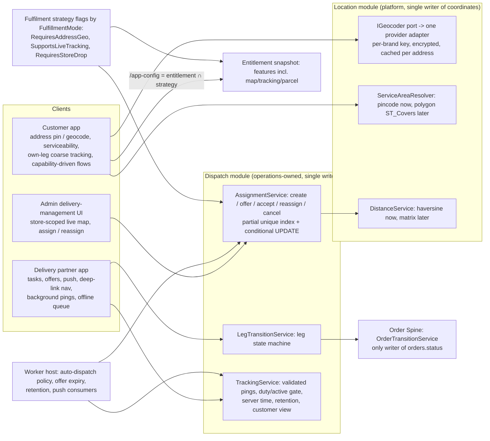

# 10 — Mobile Apps, Delivery Partner App and Business-Aware Maps Audit

Consolidated deliverable for the additional mandatory mobile/maps audit · LaundryGhar SaaS audit · 2026-10-09

**Sources:**
- Specialist report: [12 — Mobile, delivery and maps](specialists/12-mobile-delivery-maps.md), which has the full evidence.
- Architect's independent re-check: [01b §1](specialists/01b-architect-challenge-review.md) (SA-MOB-001…005, M1–M12, architecture judgement), plus §4.7 and §5 of the same file.
- QA verification: [10c — DB + mobile](specialists/10c-qa-verification-db-mobile.md).
- Client context: [09 — Frontend and mobile](specialists/09-frontend-mobile.md) and [10b](specialists/10b-qa-verification-platform.md) (CI logs).
- Severities, statuses and phases: the authoritative registry ([FINDINGS](../../FINDINGS.md), [registry JSON](findings-registry.json)).

## Summary

1. **There are two real Expo SDK 56 apps and an admin dispatch UI, and none of them is release-ready.** `customer-mobile` and `rider-mobile` call real APIs. CI is red for both apps ([SA-FE-011](../../FINDINGS.md#sa-fe-011), which absorbs SA-MOB-017).
2. **One condition governs every customer journey.** On any database migrated per the runbook, migration 0031 denies the customer lane:
   - booking, slot listing, order tracking and payments return nothing or fail ([SA-TEN-001](../../FINDINGS.md#sa-ten-001), Critical, P0);
   - customer Google sign-in fails ([SA-DB-012](../../FINDINGS.md#sa-db-012), High);
   - every OTP and login across all tenants shares one bucket of 10 requests per minute ([SA-API-001](../../FINDINGS.md#sa-api-001), Critical).

   By code reasoning, the rider lane survives 0031.
3. **The delivery workflow is not consistent:**
   - Rider leg status has no state machine, so a cancelled order can become "delivered" with a phantom COD payment ([SA-MOB-001](../../FINDINGS.md#sa-mob-001), High, P0).
   - One job can be assigned to two riders ([SA-MOB-002](../../FINDINGS.md#sa-mob-002), High).
   - The proof-of-delivery OTP is never generated ([SA-MOB-003](../../FINDINGS.md#sa-mob-003), High).
4. **Outside rider GPS pings and the admin map, there is no location stack.** No code writes a coordinate for an address, store or leg ([SA-MOB-004](../../FINDINGS.md#sa-mob-004), High). As a result:
   - the courier/parcel fare quote throws for every app-created address;
   - geofence auto-arrival, distance-aware dispatch and coordinate navigation are inert.
5. **Business type does not drive mobile flows or map capabilities.** The vertical boundary is not enforced server-side ([SA-AUTHZ-012](../../FINDINGS.md#sa-authz-012), which absorbs the backend half of SA-MOB-015).
6. **Location privacy:**
   - Customers cannot read rider location (Verified).
   - The pickup-address IDOR ([SA-MOB-005](../../FINDINGS.md#sa-mob-005)) becomes live the moment 0031 is fixed, so the two fixes must ship together.
   - The 14-day GPS retention never runs. Nothing schedules maintenance ([SA-OPS-004](../../FINDINGS.md#sa-ops-004), which absorbs SA-MOB-012), and when maintenance does run, it aborts ([SA-QC-003](../../FINDINGS.md#sa-qc-003)).
7. **Verdicts:**
   - **M1, M2, M3, M6, M9, M10:** Partially Supported. M1 is blocked under 0031. M9 is not a security guarantee while [SA-AUTHZ-001](../../FINDINGS.md#sa-authz-001) is open.
   - **M4, M5, M7, M8, M11:** Not Supported.
8. **Launch implications:** laundry can launch without geocoding, provided geofence and distance ranking are documented as inactive. Courier cannot launch until coordinate capture and serviceability enforcement exist.

**Evidence discipline.**
- No .NET SDK, Docker, device or simulator was available. Backend behaviour is from code reading. Race conditions are reasoned, not reproduced, except where a SQL reproduction on a throwaway PostgreSQL 16 cluster is cited (QA-C T1–T12).
- Mobile `npm ci`, `tsc` and jest were run in scratch copies by 12 and 09. QA-B read the CI job logs ([10b](specialists/10b-qa-verification-platform.md) cmd 9).
- Status labels (Verified / Partially Verified / Suspected / Not Tested) are preserved from the registry.

### Three different clients (terminology used throughout)

| Term in this report | What it is | Repo |
|---|---|---|
| **Customer app** | Consumer Expo app: booking, addresses, tracking, parcel | `customer-mobile/` |
| **Delivery partner app** (rider app) | Expo app for riders: duty, tasks, status, OTP, proof, GPS | `rider-mobile/` |
| **Admin delivery-management UI** | Pages in the web console for staff: live rider map, breadcrumb track, assign pickup, rider KYC and payouts | `admin-web/src/pages/riders/*`, `src/pages/orders/PickupDetailDrawer.tsx`, `src/components/map/*` |

"Partner lane" in the registry (for example [SA-AUTHZ-015](../../FINDINGS.md#sa-authz-015)) means **API/RaaS partners** (`PartnerDispatch`, `PartnerBooking`), not the rider app. The two are kept separate here.

### Canonical findings in scope

| ID | Final severity | Status | Phase | Title (short) | Absorbs |
|---|---|---|---|---|---|
| [SA-MOB-001](../../FINDINGS.md#sa-mob-001) | High | Verified | P0 | No leg state machine; cancelled order → delivered + COD | — |
| [SA-MOB-002](../../FINDINGS.md#sa-mob-002) | High | Verified (manual paths); races Suspected | P1 | Duplicate active assignments; no reassign | SA-DB-022 |
| [SA-MOB-003](../../FINDINGS.md#sa-mob-003) | High | Verified | P1 | Delivery/pickup OTP never generated; no attempt limit | — |
| [SA-MOB-004](../../FINDINGS.md#sa-mob-004) | High | Verified | P3 | No geocoding or coordinate capture | — |
| [SA-MOB-005](../../FINDINGS.md#sa-mob-005) | Medium | Verified (DB layer, QA-C T7b) | P0 | Pickup `addressId` not owner-checked (IDOR) | — |
| [SA-MOB-006](../../FINDINGS.md#sa-mob-006) | Medium | Verified | P3 | Offer→accept mode not wired end-to-end | — |
| [SA-MOB-007](../../FINDINGS.md#sa-mob-007) | Medium | Verified | P3 | No rider push for assign/cancel | — |
| [SA-MOB-008](../../FINDINGS.md#sa-mob-008) | Medium | Verified | P1 | Rider offline queue poisons itself; drops reasons | — |
| [SA-MOB-009](../../FINDINGS.md#sa-mob-009) | Medium | Suspected | P1 | Headless background task can trigger logout | — |
| [SA-MOB-010](../../FINDINGS.md#sa-mob-010) | Medium | Verified | P1 | Ping ingestion unvalidated, not duty-gated, client time | — |
| [SA-MOB-011](../../FINDINGS.md#sa-mob-011) | Medium | Verified (scope corrected) | P1 | Suspended/terminated (via `UpdateRider`) rider keeps operating | — |
| [SA-MOB-013](../../FINDINGS.md#sa-mob-013) | Medium | Verified | P3 | Serviceability/zones not enforced | — |
| [SA-MOB-014](../../FINDINGS.md#sa-mob-014) | Medium | Verified | P3 | Customer tracking timeline only; pickup progress not propagated | — |
| [SA-MOB-016](../../FINDINGS.md#sa-mob-016) | Medium | Verified | P3 | Order cancel does not cancel legs | — |
| [SA-MOB-019](../../FINDINGS.md#sa-mob-019) | Low | Verified | P3 | Riders retain historical customer PII | — |
| [SA-MOB-020](../../FINDINGS.md#sa-mob-020) | Low | Partially Verified | P1 | Slot listing RLS-only (moot under 0031) | — |
| [SA-MOB-021](../../FINDINGS.md#sa-mob-021) | Low | Verified | P1 | Map keys unencrypted, echoed to readers | — |
| SA-MOB-012 → [SA-OPS-004](../../FINDINGS.md#sa-ops-004) | High (canonical) | Verified | P0 | Partition maintenance/retention not scheduled | SA-MOB-012 |
| SA-MOB-015 → [SA-AUTHZ-012](../../FINDINGS.md#sa-authz-012) / [SA-ONB-008](../../FINDINGS.md#sa-onb-008) | Medium | Verified | P3 / P4 | Vertical not gated server-side / build-time tenant | SA-MOB-015 |
| SA-MOB-017 → [SA-FE-011](../../FINDINGS.md#sa-fe-011) (+ [SA-OPS-016](../../FINDINGS.md#sa-ops-016)) | Medium | Verified (QA-B reproduced) | P1 (P4) | Mobile CI red; EAS/OTA/FCM unconfigured | SA-MOB-017 |
| SA-MOB-018 → [SA-API-018](../../FINDINGS.md#sa-api-018) | Medium (canonical) | Verified | P1 | Customer app sends no Idempotency-Key | SA-MOB-018 |
| [SA-QC-003](../../FINDINGS.md#sa-qc-003) | Medium | Verified (rebuilt schema) | P0 | Stale partman row aborts `run_maintenance_proc()` | — |

Cross-cutting findings that condition this slice:
- **Phase 0 platform risks:** [SA-TEN-001](../../FINDINGS.md#sa-ten-001) (Critical), [SA-API-001](../../FINDINGS.md#sa-api-001) (Critical), [SA-AUTHZ-001](../../FINDINGS.md#sa-authz-001) (Critical), [SA-DB-012](../../FINDINGS.md#sa-db-012), [SA-TEN-002](../../FINDINGS.md#sa-ten-002), [SA-ARCH-014](../../FINDINGS.md#sa-arch-014), [SA-OPS-003](../../FINDINGS.md#sa-ops-003) and [SA-FE-001](../../FINDINGS.md#sa-fe-001).
- **Order spine:** [SA-SOLID-001](../../FINDINGS.md#sa-solid-001) (absorbs SA-API-006).
- **Vertical model:** [SA-VERT-001](../../FINDINGS.md#sa-vert-001).
- **Payments:** [SA-API-007](../../FINDINGS.md#sa-api-007) (absorbs SA-SOLID-002).

---

## 0. Precondition: the SA-TEN-001 customer-lane outage

Migration `db/migrations/0031_subbrand_scope_rls.up.sql` creates a RESTRICTIVE `FOR ALL` policy (`:198`). It applies to `orders`, `order_items`, `pickup_requests`, `delivery_slots`, `delivery_slot_bookings`, `delivery_assignments`, `payments`, `tenancy_org.stores` and other tables (`:139-178`). The mechanism:
1. Customer tokens carry no `scope_nodes` claim (`core.Infrastructure/Auth/JwtTokenService.cs:98-119`).
2. The interceptor therefore publishes `'?'` (`RlsConnectionInterceptor.cs:85-90`).
3. `kernel.within_scope_cols` returns NULL for that value (`0031…up.sql:82`), and NULL denies the row.

QA-C reproduced the result as `app_user` (T1):

| Customer-session check (QA-C T1/T1b) | Result |
|---|---|
| Own orders / own payments / stores visible | 0 / 0 / 0 |
| `customer_addresses` visible | 2 (the other customer's address too: addresses are brand-only RLS) |
| INSERT order or pickup_request | `new row violates row-level security policy "rls_subbrand_scope"` |
| Commerce host, customer: `wallet_accounts` visible | 2 (own and another customer's; [SA-TEN-002](../../FINDINGS.md#sa-ten-002)) |
| Commerce host, brand-A staff: payments visible | 0 (the outage also covers non-platform staff on the commerce host) |

**Status:** Verified at the SQL level by the DB agent, QA-A and QA-C. HTTP was not executed. Whether 0031 has been applied to any production database is unknown ([01b](specialists/01b-architect-challenge-review.md) open questions). That decides whether this is a live outage or a latent release blocker.

**Rider lane:** survives 0031, per architect reasoning (Partially Verified, not SQL-reproduced for rider GUCs):
- rider invites grant a franchise membership (`InviteRider.cs:83`);
- `delivery_assignments` has no franchise column, so the NULL-column arm passes.

**Admin delivery-management UI:** survives on the core/operations host for brand-scoped staff (QA-C T1b: staff with `brand:A` see their rows). It is broken in the released Docker image for a separate reason: `logisticsClient` gets `baseURL: undefined` ([SA-FE-001](../../FINDINGS.md#sa-fe-001), High, P0).

Every "Status" in §2 is therefore stated twice: first as the code would behave once SA-TEN-001 is fixed, then under 0031.

---

## 1. Mobile Application Inventory

| App | Framework / SDK | Entry point | Build config | Key native capabilities | Status | Evidence |
|---|---|---|---|---|---|---|
| **Customer app** `customer-mobile` (`com.laundryghar.customer`, v2.0.0) | Expo ^56, React Native 0.85.3, React 19.2.3, TypeScript ~6.0.3, expo-router ~56.2, NativeWind 4, TanStack Query 5, Zustand 5, axios | `expo-router/entry` → `app/_layout.tsx` | See notes (a) below | secure-store, notifications, auth-session, local-auth, updates, Sentry. **No location or maps** (`app.config.ts:29` `permissions: []`; no maps/location dependency in `package.json`) | **Partially Supported**: functional against the API; not release-ready; blocked under 0031 | [12 §1](specialists/12-mobile-delivery-maps.md); [SA-OPS-016](../../FINDINGS.md#sa-ops-016); [SA-ONB-008](../../FINDINGS.md#sa-onb-008) |
| **Delivery partner app** `rider-mobile` (`com.laundryghar.rider`, v1.0.0) | Same stack, plus expo-location ~56.0.23, expo-task-manager ~56.0.25, expo-image-picker, expo-network | `expo-router/entry` → `app/_layout.tsx` (imports `@/lib/backgroundLocation` at module load, `:33`) | See notes (b) below | Background GPS (25 s / 30 m, Android foreground service), camera, push (no FCM) | **Partially Supported** | [12 §1](specialists/12-mobile-delivery-maps.md) |
| **Admin delivery-management UI** (in `admin-web`) | React 19 + Vite; react-leaflet 5; `@vis.gl/react-google-maps` 1.8 | `src/pages/riders/RiderOpsView.tsx`, `src/pages/orders/PickupDetailDrawer.tsx` | Per-brand maps settings `PUT /admin/settings/maps` (`AdminSettings.cs:54`). The production image bakes only 3 of 9 API URLs; **logistics is missing** ([SA-FE-001](../../FINDINGS.md#sa-fe-001)) | Live rider map (20 s polling), breadcrumb trail, assign pickup, KYC verification, payouts | **Partially Supported**: works in dev; rider ops broken in the released image | `mapConfig.ts:24-42`, `useRiders.ts:87,99`; [09](specialists/09-frontend-mobile.md) |
| CI for both apps | `.github/workflows/ci.yml:65-86` runs `npm ci` → typecheck → test per app | — | See notes (c) below | — | **Not Supported** (red as committed) | [SA-FE-011](../../FINDINGS.md#sa-fe-011) (Verified, reproduced by QA-B) |

**(a) Customer app build config:**
- `app.config.ts`: the EAS projectId is a slug placeholder (`:6`), so the OTA URL returns 404.
- `eas.json` has dev/preview/production profiles, but the submit IDs are empty (`:48-59`).
- The Firebase files belong to other app IDs and are not wired: `google-services.json` has package `com.launddryghar.app` and the plist has `com.laundrygahar.ios`, and there is no `googleServicesFile`.
- The brand is the build-time `DEFAULT_BRAND_CODE` (`src/constants/config.ts:49`).

**(b) Rider app build config:**
- `app.config.ts:21-32` sets the iOS location strings and `UIBackgroundModes:['location']`.
- `:41-55` sets the Android permissions FINE/COARSE/BACKGROUND_LOCATION and FOREGROUND_SERVICE_LOCATION.
- The EAS projectId is a placeholder (`:6`), and there is **no FCM file**.
- The dev gateway port is 8080 (`src/constants/config.ts:19`), but the AppHost binds 5300.

**(c) CI results:**
- In CI run 36294076412, rider-mobile failed at `npm ci` (ERESOLVE, react-dom@19.2.8 versus react@19.2.3), and customer-mobile failed at `tsc` (TS2882 `../global.css`, `app/_layout.tsx:11`).
- Locally, jest passes: customer 11 suites / 170 tests, rider 8 suites / 91 tests (rider only with `--legacy-peer-deps`).

**Inventory notes**
- **One brand per binary.** Name, bundle ID and colours are hardcoded, and the brand code is injected at build. A second tenant needs code edits ([SA-ONB-008](../../FINDINGS.md#sa-onb-008), Medium; [SA-ONB-012](../../FINDINGS.md#sa-onb-012) app-identifier collisions, Low).
- **Vertical awareness in the apps is limited to tracking stages** (`GET /fulfillment-config`, `useFulfillmentConfig.ts` in both apps). `src/lib/terminology.ts` exists in both apps but has no importer. 09 found this, and the writer re-checked it with grep on 2026-10-09 ([SA-FE-009](../../FINDINGS.md#sa-fe-009)). 12's statement that mobile words are "server-driven" is therefore corrected here; see the observations for registry triage.
- **Placeholders:**
  - Customer UPI/card and wallet top-up are "coming soon" ([SA-FE-012](../../FINDINGS.md#sa-fe-012)).
  - Customer booking falls back to demo garments in production ([SA-FE-010](../../FINDINGS.md#sa-fe-010)).
  - The rider notifications screen is static.
  - The rider task-detail map is a stylised placeholder (`rider-mobile/app/(app)/tasks/[id].tsx:11-12`, writer re-checked).

---

## 2. Customer Journey Audit (customer app)

Status = behaviour of the code once SA-TEN-001 is fixed. The last column gives the effect **under 0031** (QA-C T1 unless noted).

| Step | Screen | API | Backend handler | DB | Status | Evidence | Under 0031 |
|---|---|---|---|---|---|---|---|
| Tenant resolution | (build constant) | `brandCode` in auth bodies | identity auth | `tenancy_org.brands` | Partially Supported: one brand per binary | `customer-mobile/src/constants/config.ts:49`; `src/api/auth.ts:68-111`; [SA-ONB-008](../../FINDINGS.md#sa-onb-008) | Unaffected |
| Login: phone OTP / PIN | `(auth)/phone,otp,secure,unlock` | `/identity/api/v1/customer/auth/*` | core identity | identity_access | Fully Supported in code (not run). In the shipped topology, all tenants share one 10/min auth bucket ([SA-API-001](../../FINDINGS.md#sa-api-001), Critical) | `src/api/auth.ts`; `src/lib/tokenStorage.ts:16-50` | Unaffected by 0031 |
| Login: Google | `(auth)/*` | `/customer/auth/google` | `CustomerGoogleSignInHandler` | `customer_identities` | **Not Supported in production role config**: the raw uuid cast throws on an empty brand GUC ([SA-DB-012](../../FINDINGS.md#sa-db-012), High, P0) | QA-C T7c | Fails (independent of 0031) |
| Business-type awareness | home, tracking | `GET /fulfillment-config` (the terminology helper is unused) | config queries | `vertical_terms`, strategies | Partially Supported: tracking stages only; copy is laundry; flows are not gated | `(tabs)/_layout.tsx:160-177`; [SA-FE-009](../../FINDINGS.md#sa-fe-009); [SA-AUTHZ-012](../../FINDINGS.md#sa-authz-012) | Not Verified |
| Service discovery / price list / cart | `booking/items`, `price-list` | `/catalog/...` | `CustomerCatalogEndpoints` | customer_catalog | Partially Supported. Demo garments shown in production when the list is empty or the call fails ([SA-FE-010](../../FINDINGS.md#sa-fe-010)). Expected COD is set from client prices ([SA-SOLID-014](../../FINDINGS.md#sa-solid-014), Low) | `booking/items.tsx:158-184` | Not Verified (catalog tables not in QA-C's repro) |
| Address management | `addresses.tsx` | `POST/PUT/DELETE /customer/addresses` | catalog customer self | `customer_addresses` (`geo_location` never written) | Partially Supported: text form plus a 6-digit pincode regex; no geo, map pick or geocode | `addresses.tsx:47-124`; `src/types/api.ts:235-254`; [SA-MOB-004](../../FINDINGS.md#sa-mob-004) | Works (brand-only RLS). Customer-vs-customer separation is app-only at the DB |
| Map-based location pick / geocoding | — | — | — | — | Not Supported | No location/maps dependency; the only `CreatePoint` calls are `BatchLocationPing.cs:53,85` | n/a |
| Serviceability check | none calls it | `GET /customer/serviceability?pincode=` | `CheckServiceabilityHandler` | stores, territories | Partially Supported: the API exists; the client never calls it; booking never enforces it ([SA-MOB-013](../../FINDINGS.md#sa-mob-013)) | `SelfQueries.cs:89-116`; `useCatalog.ts:172-179` (no caller) | Store arm sees 0 stores (T1), so it would answer "not serviceable" (inferred) |
| Slot selection | `booking/pickup.tsx` | `GET /customer/delivery-slots?date=` | `GetAvailableSlotsHandler` | `delivery_slots` | Partially Supported: brand-wide, not zone/store aware, past slots of "today" not filtered; brand filter relies on RLS ([SA-MOB-020](../../FINDINGS.md#sa-mob-020)) | `pickup.tsx:202-228`; `DeliverySlotQueries.cs:47-66` | **Blocked**: 0 slots |
| Checkout / book pickup | `booking/pay.tsx` | `POST /customer/pickup-requests` | `CustomerSchedulePickupHandler` (atomic slot capacity, idempotency index) | `pickup_requests`, `delivery_slot_bookings` | Partially Supported: `addressId` ownership not checked ([SA-MOB-005](../../FINDINGS.md#sa-mob-005)); no Idempotency-Key sent ([SA-API-018](../../FINDINGS.md#sa-api-018)) | `PickupCommands.cs:103,310-470`; `pay.tsx:390-405` | **Blocked**: INSERT violates `rls_subbrand_scope` |
| Payment | `pay.tsx` | wallet/COD preference only | — | `payments`, `wallet_accounts` | Partially Supported: online UPI/card "coming soon"; top-up disabled ([SA-FE-012](../../FINDINGS.md#sa-fe-012)). When online pay ships, [SA-API-007](../../FINDINGS.md#sa-api-007) (High) must be fixed first | `pay.tsx:66-78,586-595`; `config.ts:116` | Payments 0 rows; wallets visible across customers on the commerce host ([SA-TEN-002](../../FINDINGS.md#sa-ten-002)) |
| Parcel (logistics vertical) | `parcel/pickup,drop,vehicle,quote` | `POST /customer/fare/quote`, `POST /customer/orders/parcel` | `GetFareQuoteHandler`, `CreateParcelOrderCommand` | `customer_addresses.geo_location` | **Not Supported in practice**: the quote throws when either address lacks geo, and nothing writes geo. Shown to every brand; not vertical-gated | `GetFareQuoteQuery.cs:56-59`; `CustomerOrderEndpoints.cs:41,60`; [SA-MOB-004](../../FINDINGS.md#sa-mob-004), [SA-AUTHZ-012](../../FINDINGS.md#sa-authz-012) | Blocked twice (order INSERT denied) |
| Status / tracking | `orders/tracking/[id].tsx` | `GET /customer/orders/{id}/tracking`, `GET /customer/pickup-requests/{id}` | `GetMyOrderTrackingHandler` (owner check) | `order_status_history`, orders | Partially Supported: timeline only; a pickup never shows `rider_dispatched`/`arrived` ([SA-MOB-014](../../FINDINGS.md#sa-mob-014)) | `OrderQueries.cs:207-232`; `tracking/[id].tsx:57-66` | **Blocked**: own orders 0 |
| Rider visibility / live tracking / ETA | — | — | — | — | Not Supported: no rider identity, location or ETA is exposed to the customer | `orders/[id].tsx:213`; QA-C location-authz check | n/a |
| Cancellation | order detail / pickups | `POST /customer/orders/{id}/cancel`, `POST /customer/pickup-requests/{id}/cancel` | `CancelOrderByCustomerHandler`; `CancelPickupByCustomerHandler` | orders, assignments | Partially Supported: pickup cancel propagates to legs, slot and load; **order cancel does not cancel legs** ([SA-MOB-016](../../FINDINGS.md#sa-mob-016)) | `CancelOrderByCustomerCommand.cs:35-111`; `CustomerPickupCommands.cs:345-427` | Blocked (orders invisible) |
| Delivery OTP shown to customer | order detail | `GET /customer/orders/{id}` | `OrderQueries.cs:125` | `orders.delivery_otp` | Not Supported in practice: the OTP is never generated ([SA-MOB-003](../../FINDINGS.md#sa-mob-003)) | `CreateOrderCommand.cs:841-844` | Blocked |
| Notifications | push | Expo push token register | `ExpoPushChannelSender` | push_tokens | Partially Supported: Android FCM not wired ([SA-FE-011](../../FINDINGS.md#sa-fe-011) / SA-MOB-017) | `app.config.ts:89-101` | Not Verified |
| Support / refunds | `support/*` | `/customer/support/tickets` | support handlers; `OrderCancellationRefund.QueueAsync` | — | Partially Supported (not deep-audited). Refunds are queued but never executed ([SA-API-008](../../FINDINGS.md#sa-api-008)) | `CancelOrderByCustomerCommand.cs:108-111` | Not Verified |
| Offline / errors | all | axios 15 s timeout, refresh coalescing | — | — | Partially Supported: no offline queue; ErrorState with retry; a timeout plus re-tap creates duplicate pickups (no key) | `src/api/client.ts`; [SA-API-018](../../FINDINGS.md#sa-api-018) | — |

**Customer journey verdict:** Partially Supported in code, and **blocked end-to-end on a 0031-migrated database**. Once SA-TEN-001 is fixed:
- laundry booking and timeline tracking work;
- parcel does not work;
- there is no map, geocode, serviceability enforcement, live tracking or online payment.

---

## 3. Delivery Partner Journey Audit (delivery partner app)

The rider lane survives 0031 by code reasoning (§0). Nothing in this section is runtime-verified.

| Step | Screen | API | Backend handler | DB | Status | Evidence |
|---|---|---|---|---|---|---|
| Onboarding / invite | (admin) | `POST /admin/riders`, invite | `CreateRider`, `InviteRider` | `logistics.riders` (`user_id` globally UNIQUE, so one brand per rider) | Partially Supported | `05_bc5_logistics.sql:25`; `InviteRider.cs:83` |
| KYC docs / approval | `documents.tsx` | `GET/POST /rider/documents`; admin `/verify`, `/vehicle/approve` | `UploadRiderDocument`, `VerifyRiderKyc` | rider docs; files on local disk | Partially Supported. Auto-dispatch requires KYC and vehicle approval; **manual assign does not**. KYC files sit in container `/tmp` and are lost on redeploy ([SA-OPS-003](../../FINDINGS.md#sa-ops-003), High, P0). The MIME/size validator is orphaned ([SA-API-003](../../FINDINGS.md#sa-api-003)) | `AutoDispatchService.cs:147-148`; `PickupCommands.cs:214-218` |
| Login | `(auth)/login,otp` | `/identity/api/v1/auth/otp/*` (staff lane) | identity | users | Fully Supported in code (not run). Subject to the shared auth bucket ([SA-API-001](../../FINDINGS.md#sa-api-001)) | `rider-mobile/src/api/auth.ts:1-40` |
| Duty online/offline | `home.tsx` | `PATCH /rider/duty`, `GET /rider/me` | `SetRiderDuty` | `riders.is_on_duty` | Partially Supported: optimistic local state, fire-and-forget server call, mismatch banner | `dutyStore.ts:91-116` |
| Offer accept / reject | — | `POST /rider/assignments/{id}/accept`, `/decline` | `AcceptOfferHandler`, `DeclineOfferHandler` | `delivery_assignments` | **Not Supported end-to-end**: no app UI; offers are excluded from the task list; no push ([SA-MOB-006](../../FINDINGS.md#sa-mob-006)) | `RiderSelfEndpoints.cs:64-65`; `RiderTaskMapper.cs:11-12` |
| New-assignment notification | — | — | outbox `assignment.auto_assigned`/`offered`, which no consumer reads | outbox_events | Not Supported: 30 s polling while foregrounded ([SA-MOB-007](../../FINDINGS.md#sa-mob-007)) | `AutoDispatchService.cs:360,445`; `useRiderTasks.ts:57` |
| Task list / detail | `tasks.tsx`, `tasks/[id].tsx` | `GET /rider/tasks/today` | `GetMyTasksToday` (rider and brand) | assignments, orders, addresses | Fully Supported for listing | `GetMyTasksToday/*.cs:25-110` |
| Pickup/drop address, markers, route | `tasks/[id].tsx` | — | `RiderTaskMapper` (lat/lng from `da.GeoLocation ?? addr.GeoLocation`) | geo never written | Partially Supported: address text yes; coordinates effectively always null; map is a placeholder; no route | `RiderTaskMapper.cs:107-110`; `tasks/[id].tsx:11-12` |
| Navigation handoff | `tasks/[id].tsx` | `Linking.openURL` (Google Maps dir/search; Apple Maps fallback) | — | — | Partially Supported: the coordinates branch is dead in practice and falls back to address search | `tasks/[id].tsx:196-222,488-505` |
| Start / arrive | `tasks.tsx`, `tasks/[id].tsx` | `PATCH /rider/tasks/{id}/status` | `UpdateMyTaskStatusHandler` | assignments | Partially Supported: allow-list only, **no transition guard** ([SA-MOB-001](../../FINDINGS.md#sa-mob-001)). Sibling `PATCH /rider/assignments/{id}/status` writes any string (QA-C) | `UpdateMyTaskStatus.cs:34-42,96`; `UpdateMyAssignmentStatus.cs:44` |
| Geofence auto-arrive / store drop | background | ping | `GeofenceEvaluator` (150 m haversine) | assignments, `stores.geo_location` | Not Supported in practice: needs geo that is never written ([SA-MOB-004](../../FINDINGS.md#sa-mob-004)). Spoofable once it works ([SA-MOB-010](../../FINDINGS.md#sa-mob-010)) | `GeofenceEvaluator.cs:83-106` |
| Pickup / delivery confirmation, OTP, proof of delivery | `tasks/[id].tsx` | `/verify-otp`, `/status completed`, `/proof-photo`, `/inspection` | `VerifyTaskOtpHandler`, `UpdateMyTaskStatusHandler`, `UploadProofPhoto`, `SubmitPickupInspection` | assignments; files on local disk | Partially Supported: the OTP gate exists, but OTPs are never generated and verify has no attempt limit ([SA-MOB-003](../../FINDINGS.md#sa-mob-003)); the photo is optional; proof photos are lost on redeploy ([SA-OPS-003](../../FINDINGS.md#sa-ops-003)); inspection is laundry "garment condition" | `VerifyTaskOtp.cs:39-59`; `UpdateMyTaskStatus.cs:89-94` |
| COD to collect | task detail | — | `UpdateMyTaskStatus.cs:118-126,185-228` | orders, payments | Partially Supported. Once online pay ships, the rider is asked to collect COD on prepaid orders ([SA-API-007](../../FINDINGS.md#sa-api-007), canonical High; QA-B rates the absorbed SA-SOLID-002 Medium/latent because no client starts an online payment today). The completion path can record COD on a cancelled order ([SA-MOB-001](../../FINDINGS.md#sa-mob-001)) | [10b](specialists/10b-qa-verification-platform.md) |
| Fail with reason | `tasks/[id].tsx` | `/status failed {reason,note}` | same | `cancellation_reason`, `notes` | Partially Supported: an offline replay drops the reason ([SA-MOB-008](../../FINDINGS.md#sa-mob-008)) | `useOfflineQueueFlush.ts:51` |
| GPS / live tracking | global | `POST /rider/location/ping` | `BatchLocationPingHandler` | `rider_location_pings` (daily partitions) | Partially Supported: works in foreground and background (dev/prod builds). Ingestion is unvalidated (SA-MOB-010); headless logout is Suspected (SA-MOB-009) | `backgroundLocation.ts:30-97`; `useLocationTracking.ts:21-66` |
| Offline / network interruption | banner + queue | replay of PATCH status / photo | — | AsyncStorage | Partially Supported: pings are dropped while offline; a 4xx is treated as "offline" and poisons the queue ([SA-MOB-008](../../FINDINGS.md#sa-mob-008)); the queue survives logout ([SA-FE-016](../../FINDINGS.md#sa-fe-016)) | `tasks/[id].tsx:392-402`; `useOfflineQueueFlush.ts:42-58` |
| History / earnings / payouts / cash | `earnings`, `payouts`, `cash` | `/rider/tasks?date=`, `/rider/payouts`, `/rider/balance`, `/rider/payout-requests` | RiderSelf queries | assignments, payouts | Partially Supported (not deep-audited). Historical tasks expose customer PII indefinitely ([SA-MOB-019](../../FINDINGS.md#sa-mob-019)) | `RiderSelfEndpoints.cs:74-97`; `RiderTaskMapper.cs:120-130` |
| Sign-out / deauthorisation | `profile.tsx` | `setOnDuty(false)` → stop background location; `/auth/logout` | `DeactivateRider`, `UpdateRider` (admin) | riders | Partially Supported. Client stops on sign-out. **Deactivate works server-side**: soft-delete plus the query filter mean ping returns 0 and tasks return 404. A **suspended/terminated rider set via `UpdateRider` keeps operating** ([SA-MOB-011](../../FINDINGS.md#sa-mob-011), QA-C corrected). Open legs and `IsOnDuty` are untouched on both paths | `DeactivateRider.cs:39-41`; `RiderConfiguration.cs:101`; `UpdateRider.cs:53,87-89` |

**Partner journey verdict:** Partially Supported. Tasks, status, photos, KYC and background GPS are real. Missing or incorrect:
- the state machine;
- duplicate-assignment protection;
- offer UI and push;
- OTP generation;
- offline-queue correctness;
- durable proof and KYC storage.

---

## 4. Business-Type Capability Matrix

| Vertical (fulfilment mode) | Required map capability | Existing implementation | Missing | Config dependency | Status |
|---|---|---|---|---|---|
| **Laundry** (`process_deliver`) | Customer address pick, pickup/drop, rider assignment, live tracking, store drop | Text addresses; slot booking; manual and auto assignment; rider GPS plus admin live map; Google/Apple Maps handoff by address text | Geocode or map pin; coordinate capture ([SA-MOB-004](../../FINDINGS.md#sa-mob-004)); serviceability enforcement ([SA-MOB-013](../../FINDINGS.md#sa-mob-013)); customer live tracking/ETA ([SA-MOB-014](../../FINDINGS.md#sa-mob-014)); zone-aware slots; working geofence | `delivery_slots`, `territories.pincodes`, per-brand `maps/provider` (admin tiles only) | **Partially Supported**. Launchable without geocoding if geofence and distance ranking are documented as inactive (architect) |
| **Salon** (`appointment`) | Salon location, nearby branches, directions, optional at-home service tracking | Nothing in the mobile apps: no store locator, no appointment screens. The salon strategy exists server-side only, with no customer booking endpoint ([SA-API-021](../../FINDINGS.md#sa-api-021)) | Branch list with coordinates, directions deep link, appointment UI and API, staff/resource capacity ([SA-VERT-003](../../FINDINGS.md#sa-vert-003)), optional at-home tracking | Template `salon` → `appointment`; no location config. The template is sellable but the vertical is not operable ([SA-VERT-002](../../FINDINGS.md#sa-vert-002), P0) | **Not Supported** |
| **Hyperlocal marketplace** | Customer address, vendor discovery by service area, coverage checks, multi-vendor delivery tracking | No vendor/marketplace model; serviceability by pincode equality only, never enforced | Vendor geo index, service-area polygons (`ST_Covers`), coverage checks, multi-vendor dispatch | None. No template exists (the `vertical_templates` CHECK lists only laundry/salon/logistics/tiffin) | **Not Supported** |
| **Logistics / courier** (`point_to_point`) | Pickup/drop pins, fare by distance, route planning, driver location, shipment tracking, dispatch | Parcel screens; haversine fare quote; vehicle tier; backend dispatch offers; rider GPS; admin breadcrumb | **Coordinates for addresses** (the quote throws without them); route/ETA; customer shipment tracking; offer UI in the rider app ([SA-MOB-006](../../FINDINGS.md#sa-mob-006)); vertical gate on parcel endpoints ([SA-AUTHZ-012](../../FINDINGS.md#sa-authz-012)) | Template `courier` → `point_to_point`; fare settings | **Not Supported in practice** (the flow throws at quote). Not launchable without SA-MOB-004 and SA-MOB-013 (architect) |

**How the vertical reaches the clients today:**
- **Tracking stages:** `GET /fulfillment-config` (both apps).
- **Admin map tiles:** `system_settings maps/provider`.
- **Words:** reach admin-web only; mobile copy is hardcoded laundry ([SA-FE-009](../../FINDINGS.md#sa-fe-009)).

Nothing maps business type to map capabilities, and no entitlement gates a map, tracking or parcel capability. Changing a brand's vertical changes nothing in mobile location behaviour. Both flows stay visible, and `/orders/parcel` and `/fare/quote` are not gated (`CustomerOrderEndpoints.cs:41,60`).

The backend also does not apply the vertical when creating orders ([SA-VERT-001](../../FINDINGS.md#sa-vert-001), High). Even a vertical-aware app would receive laundry-mode orders (architect M3).

Tiffin (scheduled delivery) is outside the four requested verticals. It shares the laundry gaps, plus the missing schedule generator (SA-ARCH-004, dup of [SA-VERT-002](../../FINDINGS.md#sa-vert-002)).

---

## 5. Mapping Integration Audit

| Capability | Provider / SDK | Where | Status | Evidence |
|---|---|---|---|---|
| **Provider: map rendering, admin** | Leaflet + OSM tiles by default; Mapbox raster through Leaflet; Google Maps JS via `@vis.gl/react-google-maps` when a per-brand key is set | admin delivery-management UI | Fully Supported (render only). Respects Google ToS (no Google tiles in Leaflet) | `mapConfig.ts:24-72`; `RiderMap.tsx` |
| Map rendering, delivery partner app | none (stylised placeholder) | rider-mobile | Not Supported | `tasks/[id].tsx:11-12` |
| Map rendering, customer app | none | customer-mobile | Not Supported | `package.json`; `app.config.ts:29` |
| **SDKs present** | `expo-location` + `expo-task-manager` (rider only). No `react-native-maps` in either app; adding it needs a dev build and config plugin | mobile | Partially Supported | `rider-mobile/package.json` |
| **Geocoding / reverse geocoding / autocomplete / place pick** | none | — | Not Supported | Repo-wide grep (googleapis/nominatim/geocod/distancematrix/osrm) returned nothing |
| Coordinate persistence (addresses, stores, legs) | — | backend | Not Supported: no writer; only pings write geo ([SA-MOB-004](../../FINDINGS.md#sa-mob-004)) | `BatchLocationPing.cs:53,85`; no `ST_MakePoint`/`GeoLocation =` writer (QA-C). Partner/RaaS DTOs carry decimal `Lat`, not PostGIS (`PartnerDispatchDtos.cs:15,33,75`) |
| Distance | haversine in code (fare quote, ranker, geofence) | backend | Partially Supported: straight-line only, and the inputs are null | `RiderRanker.cs:85-98`; `GeofenceEvaluator.cs:29-37`; `GetFareQuoteQuery.cs:61` |
| **Routing / ETA / distance matrix** | none | — | Not Supported | — |
| **Navigation** | Google Maps / Apple Maps URL deep links | rider-mobile | Partially Supported: falls back to text search because coordinates are null | `tasks/[id].tsx:196-222` |
| **Live tracking** | HTTP polling: admin every 20 s, rider tasks every 30 s; no WebSocket/SignalR | rider → admin only | Partially Supported: none for customers; stale after 10 min, based on client-supplied `PingedAt` | `useRiders.ts:87,99`; `GetRidersLive.cs:22`; `BatchLocationPing.cs:79-87` |
| Serviceability / zones | pincode equality against `stores.pincode` or `territories.pincodes` | backend | Partially Supported: no polygons, no PostGIS queries, not enforced ([SA-MOB-013](../../FINDINGS.md#sa-mob-013)) | `SelfQueries.cs:95-115` |
| PostGIS | `GEOGRAPHY(POINT)` columns with GIST indexes; no spatial SQL | DB | Partially Supported (storage only) | `05_bc5_logistics.sql:76,117,134`; `03_bc3_customer_catalog.sql:111,128` |
| **Permissions** | Rider: requested at duty-on, foreground fallback, "Always" requested immediately with no pre-prompt or education screen. Customer: none requested | rider-mobile | Partially Supported | `backgroundLocation.ts:70-74`; `app.config.ts:21-55` |
| **Key security** | Map keys per brand in `kernel.system_settings` (`isEncrypted:false`), returned by the admin settings GET to any `settings.read` holder. Customer Firebase identifiers are committed (key names only reported), with mismatched app IDs | core settings; customer-mobile | Partially Supported ([SA-MOB-021](../../FINDINGS.md#sa-mob-021), Low). No evidence of referrer or package restriction; not verifiable from the repo | `UpdateMaps.cs:52`; `GetAdminSettings.cs:44`; `AdminSettings.cs:50` |
| Provider error handling / fallback | admin falls back to OSM when the key is missing | admin-web | Fully Supported (render) | `mapConfig.ts:34-41` |
| **Quotas / costs** | No paid provider calls exist, so there is no cost today. The OSM tile usage policy applies to production traffic. A future geocoder must cache per address, never per request (architect) | — | Not Verified | [01b §1.3](specialists/01b-architect-challenge-review.md) |
| **Privacy / DPDP** | Rider pings are precise location (daily partitions, 14-day retention configured but not executed). A geocoder would send customer addresses to a third party, so it must go into the DPDP processor register (architect). Customer erasure nulls address geo; there is no rider ping erasure | DB, worker | Partially Supported: see §7 and [SA-OPS-004](../../FINDINGS.md#sa-ops-004) / [SA-QC-003](../../FINDINGS.md#sa-qc-003) | `CustomerErasureService.cs:177`; QA-C T12 |

**Are maps required?**
- **Laundry:** a plain address form plus pincode serviceability is enough for launch, *if* geofence and distance features are disabled or fed by a one-time geocode on address save.
- **Courier:** maps are required, because the fare depends on coordinates.
- **Delivery partner app:** deep-link handoff is enough; an in-app map is optional.
- **Customer app:** a pin or "use current location" button is needed only for courier and for live tracking.

---

## 6. Delivery Workflow and Concurrency Audit

QA-C T11 checked the live catalog for `delivery_assignments`. The only unique index is the PK, the CHECKs cover only `status` and `leg_type`, and the only trigger is `set_updated_at`. **There is no DB-level transition or uniqueness guard.**

| Concern | Implemented behaviour | Gap | Status | Evidence |
|---|---|---|---|---|
| **Scheduling: slots respect capacity** | Customer path: atomic `booked_count < capacity` UPDATE in a transaction; released on cancel; idempotency unique-index fallback rolls back the increment | Not tied to store hours or the customer's zone; past slots of "today" not filtered. **The admin/POS pickup path skips the capacity increment, yet rejection decrements it** ([SA-API-019](../../FINDINGS.md#sa-api-019), Medium, P1) | Partially Supported | `PickupCommands.cs:38-50,376-470,657-672`; `DeliverySlotQueries.cs:51-61` |
| Scheduling: store resolution | The slot's store becomes the pickup store | Not resolved from the customer's serviceable area ([SA-MOB-013](../../FINDINGS.md#sa-mob-013)) | Not Supported | `PickupCommands.cs:364-373` |
| **Dispatch eligibility** | **Auto:** on duty, active, KYC verified, vehicle approved, load below capacity, franchise preference, then haversine to `LastKnownLocation`. **Manual:** rider in brand and store scope | No `LastPingAt` freshness filter, no max radius, location effectively null. Manual assign ignores duty, KYC and status | Partially Supported | `AutoDispatchService.cs:143-162`; `RiderRanker.cs:56-82`; `PickupCommands.cs:207-218` |
| Dispatch ownership | Manual handlers in operations; auto-dispatch in `commerce.Infrastructure` worker | Two implementations that have drifted: manual seeds `CodAmount` and emits no event; auto does the reverse; twin `RiderLoad`/`RiderLoadHelper` ([SA-SOLID-011](../../FINDINGS.md#sa-solid-011), Low). The worker has no leader election or claim locks ([SA-OPS-005](../../FINDINGS.md#sa-ops-005)) | Partially Supported | `AutoDispatchService.cs:301-376` |
| **Duplicate assignment: one job → one rider** | Auto: check-then-insert without a lock. Offer: one live offer per pickup. Accept: sibling "taken" check **outside** the transaction | No partial unique index on active `(pickup_request_id)` or `(order_id, leg_type)`; no concurrency token. **Manual assign/create has no existing-leg or pickup-status check, and writes `pr.Status="assigned"` unconditionally, reviving cancelled or completed pickups** (QA-C) | **Not Supported** ([SA-MOB-002](../../FINDINGS.md#sa-mob-002), High; manual path Verified, races Suspected) | `PickupCommands.cs:204-279`; `DeliveryAssignmentCommands.cs:29-107`; `OfferActions.cs:59-93`; `04_bc4_order_lifecycle.sql:332-335` |
| **Reassignment** | None: a new row is added; the prior leg is neither cancelled nor its load decremented | — | Not Supported | same |
| Offer expiry | Sweep loads offered rows and overwrites them as `expired` with no concurrency token | Races a concurrent accept, leaving the pickup assigned with an expired leg | Not Supported (Suspected race) | `AutoDispatchService.cs:461-477` |
| **Status transition integrity** | Allow-list check only (`started/arrived/collected/completed/failed`) | Any status to any status, including from cancelled/failed/completed. Repeat completes decrement load again. `UpdateMyAssignmentStatus.cs:44` writes any string | **Not Supported** ([SA-MOB-001](../../FINDINGS.md#sa-mob-001)) | `UpdateMyTaskStatus.cs:34-42,96,262-264` |
| **Idempotency of completion side effects** | Gated on `o.DeliveredAt == null`; COD payment re-call guard; one transaction | The gate does not check order status or call the strategy (`EnsureTransition` is bypassed, unlike `UpdateOrderStatusCommand.cs:53-68`), so a cancelled order can become delivered. `FromStatus` is hardcoded `out_for_delivery`. The load decrement runs outside the transaction | Partially Supported | `UpdateMyTaskStatus.cs:150-229`; [SA-SOLID-001](../../FINDINGS.md#sa-solid-001) |
| **Idempotency: customer booking** | Server supports `Idempotency-Key` header and body | The app never sends it ([SA-API-018](../../FINDINGS.md#sa-api-018)) | Partially Supported | `orders.ts:128-136`; `PickupCommands.cs:343-356` |
| Idempotency: rider retries | Queue dedups identical `taskId+status`; server re-applies | Non-idempotent load decrement per call; offline replay can revive a cancelled leg | Partially Supported | `offlineQueueStore.ts:61-69`; `useOfflineQueueFlush.ts:42-58` |
| Cancellation propagation | Pickup cancel: legs cancelled, load decremented, slot released (`offered` legs excluded). Order cancel: legs untouched | [SA-MOB-016](../../FINDINGS.md#sa-mob-016) | Partially Supported | `CustomerPickupCommands.cs:321-322,395-407`; `CancelOrderByCustomerCommand.cs:40-113` |
| Cross-view consistency (customer, partner, admin) | Orders: history-based. Pickups: only `pending → assigned → completed` | `started`/`arrived` are not propagated ([SA-MOB-014](../../FINDINGS.md#sa-mob-014)). Admin hardcodes laundry transitions ([SA-FE-004](../../FINDINGS.md#sa-fe-004)) | Not Supported | `UpdateMyTaskStatus.cs:84-86,139-140` |
| ETA | none | — | Not Supported | — |
| Freshness / stale detection | Admin board: stale after 10 min | `LastPingAt` is client-supplied | Partially Supported | `GetRidersLive.cs:22`; `BatchLocationPing.cs:79-87` |

**Implemented vs proposed.** Everything in the "Implemented behaviour" column exists in code. ETA/route-aware ranking, zone filters, partial unique indexes and the reassign command are **proposals**.

---

## 7. Security and Privacy Audit

### 7.1 Explicit IDOR and location-authorization checks

| Endpoint / data | Check performed | Result | Status |
|---|---|---|---|
| `PATCH /rider/tasks/{id}/status`, `/verify-otp`, `/proof-photo`, `/inspection` | Can rider X act on rider Y's task, or another brand's, by changing `{id}`? | **No.** Each handler loads `DeliveryAssignments` by `Id && RiderId == self && BrandId == jwt.brand` and returns 404 otherwise. No rider IDs appear in self routes | Verified (code; 12, architect, QA-C) |
| `POST /rider/assignments/{id}/accept`, `/decline` | Same IDOR | Guarded by rider and brand (`OfferActions.cs:36-49,118-131`) | Verified (code) |
| `GET /rider/tasks/today`, `/rider/tasks?date=` | Scope | Self rider and brand | Verified (code) |
| `POST /rider/location/ping` | Can a rider post as another rider? | **No**: the rider is resolved from the JWT. Coordinates, timestamp and batch size are unvalidated, and duty/status is not checked ([SA-MOB-010](../../FINDINGS.md#sa-mob-010)) | Verified (code) |
| Rider-vs-rider at the DB layer | Does the DB separate riders? | **No.** `rider_location_pings` has only `rls_brand`. `delivery_assignments`/`riders` have `rls_brand` plus the restrictive sub-brand scope. Nothing separates riders of the same franchise: isolation is app-only (QA-C) | Verified (live `pg_policies`) |
| Can a customer read rider location for an order not theirs, or after delivery? | Every reader of `LastKnownLocation`/`RiderLocationPings` | **No.** No customer endpoint exposes rider identity or location at all. The readers are `BatchLocationPing`, `GetRidersLive`, `GetRiderTrack`, `GetRiderStats` (admin, `permission:rider.read`, `RidersAdmin.cs:60-61`) and workers. The customer group is `CustomerOnly` (`CustomerOrderEndpoints.cs:32`) | Verified (code, QA-C) |
| `GET /admin/riders/{id}/track`, `/admin/riders/live` | Cross-brand / cross-franchise / cross-store | Brand filter, plus a franchise filter for franchise-scoped actors. **Not store-scoped**: a store manager sees every franchise rider's trail. `riders` has no `store_id` (only `primary_store_id`), so the DB policy cannot narrow it either | Verified (QA-C: `GetRiderTrack.cs:27-33`; `ScopeResolver.cs:74-84`). No registry ID; see the triage observations |
| `GET /admin/rider-tasks/{id}/proof-photo` | Brand scoping | `GetProofPhotoStreamQuery(id, brandId)`; handler not read | Partially Verified |
| `GET /customer/orders/{id}/tracking`, `/orders/{id}` | IDOR | `o.CustomerId == jwt.sub` (`OrderQueries.cs:221-223`) | Verified (code) |
| `POST /customer/pickup-requests` `addressId` | Can a customer use another customer's (or brand's) address? | **Yes.** `AddressId` is copied without lookup (`PickupCommands.cs:103`). The FK has no customer/brand match. QA-C T7b inserted pickups at c2's address and at a brand-B address. The rider then sees that address and its `RecipientPhone` (`RiderTaskMapper.cs:128`). Today the INSERT is blocked by 0031; the IDOR goes live when SA-TEN-001 is fixed ([SA-MOB-005](../../FINDINGS.md#sa-mob-005), Medium, P0; DB backstop [SA-DB-004](../../FINDINGS.md#sa-db-004)) | Verified (DB layer); HTTP not executed |
| `POST /customer/fare/quote`, `POST /customer/orders/parcel` | Address IDOR | Addresses filtered by customer and brand (`GetFareQuoteQuery.cs:44-48`). Parcel create checks address ownership (09, `CreateParcelOrderCommand.cs:48-95`) | Verified (code) |
| `GET /customer/delivery-slots` | Brand scope | No in-handler brand predicate; relies on RLS ([SA-MOB-020](../../FINDINGS.md#sa-mob-020)). Moot under 0031 (0 rows) | Partially Verified |
| Admin pickup assign / delivery assign | Cross-brand rider/order | Rider, order and pickup are brand-checked; store scope checked (`PickupCommands.cs:207-218`; `DeliveryAssignmentCommands.cs:37-86`) | Verified (code) |
| Partner (RaaS) booking track | Partner isolation | RLS-only, id-filtered handlers ([SA-AUTHZ-015](../../FINDINGS.md#sa-authz-015), Low). Not the rider app | Verified (code) |

### 7.2 Tenant isolation, authorization lifecycle, retention and consent

| Area | Position | Evidence / IDs |
|---|---|---|
| **Tenant isolation (mechanism)** | Rider-self and admin logistics paths are brand (and franchise) scoped in handlers. RLS `rls_brand` covers riders and pings (`db/patches/rls_enable_logistics.sql:29-69`) | Verified (code). Applying the patch in production is not verified |
| **Tenant isolation (guarantee)** | No location-privacy claim holds while an anonymous signup can mint `platform_admin`, which bypasses RLS on every table, rider pings included | [SA-AUTHZ-001](../../FINDINGS.md#sa-authz-001) (Critical, P0); architect M9 |
| Commerce-host customer isolation | Customer-level RLS degrades to brand equality on the commerce host | [SA-TEN-002](../../FINDINGS.md#sa-ten-002) (High, P0; reproduced T1b) |
| **Partner deauthorisation** | Deactivate: works (soft-delete plus global filter). Suspend/terminate via `UpdateRider`: rider keeps pinging, viewing tasks and completing legs. Open legs and duty untouched on both paths. Refresh-token revocation not traced | [SA-MOB-011](../../FINDINGS.md#sa-mob-011) (QA-C corrected) |
| **Retention (DPDP)** | With pg_partman installed, 14-day drop retention **is configured** (`part_config`: `1 day / 14 days / keep_table=f`), and partman does drop function-created partitions. Two things stop it from running: (a) nothing in `deploy/` schedules maintenance (only a developer-Mac launchd plist); (b) `CALL partman.run_maintenance_proc()` aborts on a stale `order_lifecycle.process_logs` row, so a 38-day-old ping partition survived. DEFAULT-partition rows are never purged. There is no rider-side ping erasure | QA-C T12; [SA-OPS-004](../../FINDINGS.md#sa-ops-004) (High, P0; absorbs SA-MOB-012); [SA-QC-003](../../FINDINGS.md#sa-qc-003) (Medium, P0) |
| Data minimisation | Riders see name, phone and address for any past date | [SA-MOB-019](../../FINDINGS.md#sa-mob-019) (Low) |
| Tracking outside shift | Server stores pings regardless of duty or rider status | [SA-MOB-010](../../FINDINGS.md#sa-mob-010) |
| **Consent / disclosure** | Rider app asks for "Always" location immediately, with no pre-prompt or education screen. iOS usage strings and the Android foreground-service notification are present. No rider tracking-consent record was reported by any agent. The customer app requests no location. A future geocoder must be in the DPDP processor register | `backgroundLocation.ts:70-74`; `rider-mobile/app.config.ts:21-55`; [01b §1.3](specialists/01b-architect-challenge-review.md). Not Verified on device; App Store/Play background-location review not assessed |
| Evidence files | Proof-of-delivery photos and KYC documents live in container `/tmp`: lost on redeploy, unencrypted, MIME unchecked | [SA-OPS-003](../../FINDINGS.md#sa-ops-003) (High, P0; absorbs SA-API-017) |
| Map keys | Stored unencrypted and echoed to settings readers | [SA-MOB-021](../../FINDINGS.md#sa-mob-021) (Low) |
| Token storage (mobile) | Keychain/Keystore via `expo-secure-store` in both apps. Refresh coalesced; the auth-call 401 loop is avoided | Verified (code): `customer-mobile/src/lib/tokenStorage.ts:16-50`; `rider-mobile/src/store/authStore.ts:18-79` |
| OTP brute force | No attempt limit; 4-character codes; gateway limit 300/min/IP. Latent until OTPs exist | [SA-MOB-003](../../FINDINGS.md#sa-mob-003) |
| Shared-device residue | The rider offline queue uses a global AsyncStorage key that logout does not clear | [SA-FE-016](../../FINDINGS.md#sa-fe-016) (Low) |

---

## 8. Implementation Roadmap

This merges 12's R1–R14 with the architect's re-ordered minimum set and QA-C's additions:
- step 0 is SA-TEN-001;
- SA-QC-003 is added beside the retention item;
- the address IDOR fix ships in the same release as the 0031 fix.

"MR-n" are roadmap item numbers, not finding IDs. Severity and phase come from the registry. Complexity (S ≤ 1 engineer-week, M 1–3 weeks, L 1–2 months, XL > 2 months) is an estimate, not a measurement.

**Platform prerequisites owned by other workstreams** (all Phase 0, needed before any mobile go-live):
- [SA-API-001](../../FINDINGS.md#sa-api-001): forwarded client IP for the auth limiter.
- [SA-AUTHZ-001](../../FINDINGS.md#sa-authz-001): server-derived `user_type`. Required before any location-privacy claim.
- [SA-OPS-003](../../FINDINGS.md#sa-ops-003): object storage for proof and KYC files.
- [SA-FE-001](../../FINDINGS.md#sa-fe-001): bake the logistics URL into the admin image, so the admin delivery-management UI works in production.
- [SA-DB-012](../../FINDINGS.md#sa-db-012): customer Google sign-in.

| # | Item | Canonical findings (final severity · phase) | Maps to | Depends on | Acceptance criteria | Test scenarios | Complexity |
|---|---|---|---|---|---|---|---|
| **MR-0** | Restore the customer lane under 0031: token-use-aware scope arm; commerce adapter delegates the subject GUCs | SA-TEN-001 (Critical · P0; absorbs SA-DB-001, SA-AUTHZ-006); SA-ARCH-014 (High · P0); SA-TEN-002 (High · P0) | Architect step 1; QA-C step 0; absent from 12 | — | On a 0031-migrated DB a customer sees own orders, pickups, slots and payments, and can INSERT a pickup. The commerce host publishes the same GUCs as core/operations. Customer c1 cannot see c2's wallet | Lane × host × restrictive-table matrix on a migrated schema; replace `SubBrandScopeRlsTests.cs:264-273`'s "unresolved denies everything" expectation for non-staff principals | M |
| **MR-1** | Address ownership check on pickup (customer and admin create) | SA-MOB-005 (Medium · P0); DB backstop SA-DB-004 (Medium · P3, composite FK) | 12 R3; architect step 2 | **Same release as MR-0** | Foreign, cross-brand or deleted `addressId` → 404; own → 201 | Integration: foreign address; brand-B address; own address | S |
| **MR-2** | Leg state machine: handler guard now, `LegTransitionService` later. The order-side effect goes through the order's strategy. Order cancel cancels legs | SA-MOB-001 (High · P0); SA-MOB-016 (Medium · P3); order spine SA-SOLID-001 (High · P3; absorbs SA-API-006) | 12 R1; architect step 3 | Guard: none. Consolidation: Phase 3 `OrderTransitionService` | Illegal transition → 409; same-status repeat → 200 no-op; load decremented once, inside the transaction; a cancelled order cannot become delivered; `/rider/assignments/{id}/status` allow-listed | Unit transition table; cancel → complete rejected; double complete; offline replay after cancel; completed → started rejected | M (guard) / L (service) |
| **MR-3** | Assignment uniqueness, explicit reassign, conditional accept/expire, pickup-status check | SA-MOB-002 (High · P1; absorbs SA-DB-022) | 12 R2; architect step 3 | MR-2 | Partial unique indexes on active legs; 23505 → 409; assigning a cancelled or completed pickup → 409; reassign cancels the old leg and moves load atomically; accept/expire use `UPDATE … WHERE status='offered'` | Testcontainers: concurrent assign; assign after assign; auto vs manual; accept vs expire; reassign moves load | M |
| **MR-4** | Ping validation; duty/active gating; suspend/terminate path; server-time staleness | SA-MOB-010 (Medium · P1); SA-MOB-011 (Medium · P1, `UpdateRider` path) | 12 R7; architect step 2 | — | Validator: lat/lng in range, batch ≤ 50, `PingedAt` within a window (else clamp); off-duty or suspended pings ignored; suspended rider status calls → 403/404; on suspend, duty off and open legs flagged; staleness uses server receive time | Validator units; suspended-rider integration; future timestamp clamped; spoofed-accuracy ping does not trigger geofence | S–M |
| **MR-5** | Location retention actually runs | SA-OPS-004 (High · P0; absorbs SA-MOB-012); SA-QC-003 (Medium · P0) | 12 R8; QA-C addition | — | Maintenance scheduled in `deploy/` under a single-runner lock; `part_config` row repointed; `run_maintenance_proc()` succeeds on the migrated schema; ping partitions older than 14 days dropped; DEFAULT rows purged; rider erasure path exists; alert on DEFAULT row count > 0 | Integration on the migrated schema: `run_maintenance_proc()` OK; a 15-day-old ping partition is dropped | S–M |
| **MR-6** | Delivery partner app resilience | SA-MOB-008 (Medium · P1); SA-MOB-009 (Medium · P1, Suspected); SA-FE-016 (Low · P1) | 12 R9; architect step 4 | — | Only network errors and 5xx are queued; a 4xx shows the server message; poison items are skipped; a failed replay keeps the reason; a headless 401 never calls `logout()`; the queue is cleared on logout | jest: 400 not enqueued, poison skipped, reason preserved, unhydrated store does not log out. Device: on duty, kill app, move > 30 m, reopen → still signed in | S |
| **MR-7** | Mobile CI and release config; booking idempotency key | SA-FE-011 (Medium · P1; absorbs SA-MOB-017); SA-OPS-016 (Medium · P4); SA-API-018 (Medium · P1; absorbs SA-MOB-018) | 12 R11; architect step 6 | — | CI mobile matrix green (React/react-dom aligned; `*.css` declaration); real EAS project IDs; per-app FCM/APNs files with matching IDs; rider dev port fixed; `Idempotency-Key` per checkout | CI; jest for the header and key reuse on re-tap | S |
| **MR-8** | Rider push on assign and cancel | SA-MOB-007 (Medium · P3) | 12 R10; architect step 4 | MR-7 (FCM); MR-3 | Manual assign, auto-assign and leg cancel each create a notification for the rider's push tokens via `ExpoPushChannelSender` | Integration (notification row); manual device test | M |
| **MR-9** | Delivery/pickup OTP with attempt lockout, **or** withdraw the "OTP-verified delivery" claim | SA-MOB-003 (High · P1) | 12 R6; architect step 5 | MR-2 | CSPRNG OTP at `pickup_scheduled`/`out_for_delivery`; complete without verify → 400; lockout after N attempts per leg; customer receives the OTP by push or SMS | Unit and integration: OTP present; 6th wrong attempt locked | M |
| **MR-10** | Offer mode: block enabling it until shipped, or wire it end-to-end | SA-MOB-006 (Medium · P3); related SA-AUTHZ-013 (Low · P1, dispatch settings reachable by brand admins) | 12 R10 | MR-3; MR-8 for the full version | Either `offer_accept` cannot be enabled, or the rider sees the offer card and accept/decline work under the MR-3 race fix | Integration: offer visible; accept → task; decline → re-offered | S (block) / M (wire) |
| **MR-11** | Location module: coordinate capture (device pin or geocoder port), copy to legs, store pinning | SA-MOB-004 (High · P3) | 12 R4; architect step 7 (courier blocker) | MR-0 | Address saved with a point, recording provider, accuracy and timestamp; fare quote works; leg copies geo; geofence fires within 150 m; dispatch ranks by distance; geocodes cached per address; processor registered for DPDP | Unit with a fake geocoder; integration quote, leg geo and geofence | L |
| **MR-12** | Serviceability enforcement and store resolution before slots; admin pickups take slot capacity | SA-MOB-013 (Medium · P3); SA-API-019 (Medium · P1) | 12 R5; architect step 7 | MR-11 (polygons only) | Unserviceable pincode → 422 on pickup and parcel; slots filtered by the resolved store; configurable dispatch max radius; admin path increments `booked_count` | Integration | M |
| **MR-13** | Dispatch module with a single owner in operations; worker host composes it | SA-SOLID-011 (Low · P3); SA-OPS-005 (Medium · P1); related SA-ARCH-001 (Medium · P3) | Architect correction 1 | MR-2; MR-3 | AutoDispatch calls operations' `AssignmentService`; `RiderLoadHelper` and the duplicate COD helper removed; advisory-locked single runner | Architecture test (no logistics writes from commerce); two worker instances dispatch once | L |
| **MR-14** | Capabilities as entitlement features; server-side vertical gates; `/app-config` projection; per-tenant build config; mobile terminology | SA-AUTHZ-012 (Medium · P3; absorbs the backend half of SA-MOB-015); SA-ONB-008 (Medium · P4; client half); SA-AUTHZ-011 (Medium · P2); SA-FE-009 (Medium · P4); SA-VERT-001 (High · P3) | 12 R12; architect step 8 and correction 2 | Phase 2 subscription → entitlement projection; MR-11 | A laundry-only brand gets 403/402 on `/orders/parcel` and `/fare/quote`; `/app-config` = entitlement ∩ strategy requirements; the app hides ungated flows; tenant JSON drives `app.config.ts`; no "garment"/"wash" copy for a salon pack | Integration gates; jest render with a salon pack; config snapshot per tenant profile | L |
| **MR-15** | Customer pickup progress; optional coarse "rider approaching" view | SA-MOB-014 (Medium · P3) | 12 R13 | MR-0; MR-2; MR-4 | Pickup shows `rider_dispatched`/`arrived`. A coarse rider location and first name are returned only for the caller's own leg while it is started or arrived, and stop at terminal states | Integration IDOR: another customer's leg → 404; after completion → 404; never exact coordinates | M |
| **MR-16** | Privacy and defence-in-depth batch | SA-MOB-019 (Low · P3); SA-MOB-020 (Low · P1); SA-MOB-021 (Low · P1); store-scoped live map (no ID, see triage) | 12 R14 | — | Historical rider tasks mask phone and address; slots brand-filtered in the handler; map keys masked for non-`settings.manage` readers and referrer-restricted; rider track and live views scoped to store | Unit and integration | S |
| **MR-17** | Before online pay ships in the customer app | SA-API-007 (High · P0; absorbs SA-SOLID-002); SA-FE-012 (Low · P2) | Not in 12 | — | A captured payment updates `amount_paid`/`payment_status`; the rider is not asked for COD on a prepaid order | Integration: webhook capture → rider task shows 0 to collect | M |

**12 → MR mapping:**

| 12 | MR |
|---|---|
| R1 | MR-2 |
| R2 | MR-3 |
| R3 | MR-1 |
| R4 | MR-11 |
| R5 | MR-12 |
| R6 | MR-9 |
| R7 | MR-4 |
| R8 | MR-5 |
| R9 | MR-6 |
| R10 | MR-8 + MR-10 |
| R11 | MR-7 |
| R12 | MR-14 |
| R13 | MR-15 |
| R14 | MR-16 |

New items: MR-0 (architect and QA-C), MR-13 (architect correction 1) and MR-17.

**Phase tension to note.** The registry places SA-MOB-007 (push) in P3, but the architect's minimum set puts rider push in step 4, next to P1 items. This report follows the architect's ordering for the minimum set and leaves the registry phase unchanged.

---

## Recommended architecture (with the architect's two corrections)

This follows the overall target in [01b §4](specialists/01b-architect-challenge-review.md):
- a modular monolith on one PostgreSQL database with RLS;
- a separate worker host;
- **no new microservice, no app-per-tenant codebase and no plugin framework.**

The architect judged 12's design to fit the codebase and to be proportionate: it reuses PostGIS columns, fulfilment strategies, per-brand settings and the entitlement catalog. Two corrections apply.

1. **Dispatch has a single owner in operations.** 12 proposed that AutoDispatch "call the same rules (shared static helpers)". The architect disagrees. AutoDispatch lives in `commerce.Infrastructure/Worker/Services/AutoDispatchService.cs` and writes logistics tables. Shared statics would keep two writers for one invariant ([SA-SOLID-011](../../FINDINGS.md#sa-solid-011), [SA-ARCH-001](../../FINDINGS.md#sa-arch-001)). The fix:
   - move dispatch into an operations-owned **Dispatch module** (`AssignmentService`, `LegTransitionService`, `TrackingService`);
   - let the worker host compose that module.
2. **Capabilities are features in the existing entitlement catalog.** Express map, tracking and parcel capabilities as features (`features.vertical_key`, `brand_feature`), combined with what the active fulfilment strategy declares. `/app-config` is a read projection of *entitlement ∩ strategy requirements*. Enforcement uses the same endpoint-metadata `RequireFeature` check as every other feature. A parallel "capabilities" table would create a third source of truth next to navigation and entitlement.

### Customer app vs delivery partner app vs admin UI

| Concern | Customer app | Delivery partner app | Admin delivery-management UI |
|---|---|---|---|
| Tenant/brand | Build-time per-tenant JSON via EAS profiles; runtime `/app-config`. The architect's alternative for scale is one white-label host app with brand discovery (search, QR or deep link), with per-tenant store builds as a premium add-on; confirm current App Store/Play policy first | Same mechanism; staff-lane JWT carries the brand | JWT `brand_id` / platform switcher |
| Location role | Producer of address points (pin or geocode); consumer of serviceability; coarse own-leg view only | Producer of pings (validated, duty-gated); consumer of task points via deep-link navigation; in-app map optional | Consumer of live and track views within brand → franchise → **store** scope |
| Real-time | Polling, plus push for status changes | Push for assign/cancel/offer (the missing piece); polling as fallback | Polling (20 s). WebSockets deferred (architect) |
| Writes allowed | Own addresses; own bookings | Own legs, along the state machine only | Assign/reassign within scope; target rider active and KYC verified |

### Server-side policies (handler guards plus DB constraints, not the inert ABAC engine)

The architect's adjustment applies: these are handler guards plus DB constraints, not an activation of the inert ABAC engine ([SA-AUTHZ-008](../../FINDINGS.md#sa-authz-008)).

| Policy | Rule |
|---|---|
| Customer address reference | `address.customer_id == sub && address.brand_id == jwt.brand` on every write and reference (pickup, parcel, quote). Backed by a composite FK (SA-DB-004) |
| Partner location write | `rider.user_id == sub && rider.brand_id == jwt.brand && rider.status == active && rider.is_on_duty` |
| Partner location read | Admin with `rider.read` within brand → franchise → store scope. Customer only for their own `started`/`arrived` leg, coarse, never after a terminal state |
| Assignment mutation | Rider: own leg, along the state machine only. Admin: `pickup.assign`/`delivery.assign` within scope; target rider in the same brand/franchise, active and KYC verified. One active leg is enforced by a partial unique index |
| Tracking history | Admin within scope and within the retention window. Riders see their own history with customer PII masked after completion |

**Alternatives rejected by the architect:**
- a dedicated dispatch microservice, which would share order and payment transactions and has no independent scaling need;
- WebSockets now, because polling plus push is enough;
- per-vertical dispatch implementations, because dispatch is vertical-neutral and strategies declare requirements;
- shared static helpers across hosts;
- a parallel capabilities subsystem.

**Risks:** third-party geocoding cost and DPDP processor obligations, and location privacy (retention must be enforced in-app, not by partman alone).

**Architect cost estimate:**

| Work | Estimate |
|---|---|
| Assignment and tracking consolidation | M |
| Location and serviceability | M |
| Mobile client changes | S |

---

## Positive controls (what genuinely works)

- **Rider-self IDOR guards.** Every rider-self command and query filters by the JWT-derived rider and brand, and there are no rider IDs in self routes (`UpdateMyTaskStatus.cs:44-53`, `VerifyTaskOtp.cs:23-32`, `OfferActions.cs:36-49,118-131`, `BatchLocationPing.cs:43-47`). Verified by 12, the architect and QA-C.
- **Customers cannot read rider location** at all (QA-C reader enumeration).
- **Rider deactivation** cuts off self-service immediately: soft-delete plus `HasQueryFilter` (`DeactivateRider.cs:39-41`, `RiderConfiguration.cs:101`). QA-C.
- **Server-side OTP comparison**: the code never leaves the server, and the customer sees it only while out for delivery (`VerifyTaskOtp.cs:9-59`).
- **Delivery-completion side effects** are transactional and gated on first completion; the COD payment has a re-call guard (`UpdateMyTaskStatus.cs:152-260`).
- **Customer slot capacity** is atomic, with an idempotency unique-index fallback that rolls back the increment (`PickupCommands.cs:376-470`).
- **Pickup cancellation** propagates to legs, slot and rider load in one transaction (`CustomerPickupCommands.cs:345-427`).
- **Auto-dispatch eligibility** includes KYC, vehicle approval and capacity. Only a platform row may enable offer mode (`AutoDispatchService.cs:143-162`; `DispatchConfig.cs:160-170`).
- **Admin live board** is brand and franchise scoped, with a 10-minute stale indicator; load is derived from open legs; the track is capped at 1,500 points (`GetRidersLive.cs:22-104`, `GetRiderTrack.cs:20-48`).
- **Rider background location** is correctly configured for the managed workflow. Config plugin, iOS strings, Android foreground-service notification, a task defined at module load, stop on off-duty and sign-out, and a foreground fallback are all present (`rider-mobile/app.config.ts:21-55,117-126`; `backgroundLocation.ts`; `useLocationTracking.ts`).
- **14-day ping retention is correctly configured in partman** and partman drops function-created partitions (QA-C T12). Only scheduling and the stale row are broken.
- **Partition auto-provisioning** for pings (`rider_ping_partition_maintenance.sql`, `PartitionMaintenanceService.cs`).
- **Admin map provider abstraction** degrades to key-less OSM (`mapConfig.ts:1-72`).
- **Tokens** are in the Keychain/Keystore in both apps.
- **Mobile unit tests** pass locally: customer 170/170, rider 91/91.
- **The fulfilment-strategy seam is sound where it is used** (`UpdateOrderStatusCommand.cs:53-68`). The rider delivery path bypasses it; the design itself is not at fault.

---

## Corrections and dissent (preserved)

| Topic | 12 (specialist) | Architect (01b) | QA-C (10c) | Final position |
|---|---|---|---|---|
| SA-MOB-011 | "Deactivating a rider does not stop tracking…" (Partially Verified) | — | **Deactivate path is a false positive** (soft-delete plus query filter). The gap is real for `UpdateRider` suspend/terminate | QA-C. The registry keeps the original title but corrects the scope in the status |
| SA-MOB-012 | Retention "not reliably enforced"; partman setup may be skipped; function-created partitions may not be dropped | Retention unenforced | **Mechanism corrected.** Retention is configured and partman drops those partitions. It fails because of the missing scheduler and the stale `process_logs` row | QA-C. Canonical [SA-OPS-004](../../FINDINGS.md#sa-ops-004) plus [SA-QC-003](../../FINDINGS.md#sa-qc-003) |
| SA-MOB-005 | Medium, Partially Verified | Confirmed, Medium | Verified at the DB layer (T7b); blocked today by 0031, so it must ship with the 0031 fix | Medium, Verified (DB), P0 |
| SA-MOB-004 severity | High (blocks logistics) | High for logistics, Medium for laundry | Confirmed High | Registry: High |
| SA-MOB-001 | High, P0 | High; also bypasses `EnsureTransition` (RC3) | Confirmed; adds the `UpdateMyAssignmentStatus.cs:44` sibling | High, P0 |
| SA-MOB-002 | High; manual Verified, races Suspected | Confirmed (manual) | Confirmed; assigning revives cancelled/completed pickups; supersedes SA-DB-022 (Low → High) | High, P1 |
| M1 | Partially Supported | Partially (conditional on 0031) | **Partially, blocked** | Partially Supported, blocked under 0031 |
| M3 | Partially | Partially, and extends: the backend ignores the vertical too ([SA-VERT-001](../../FINDINGS.md#sa-vert-001)) | Agree | Partially Supported, with the architect's extension |
| M9 | Partially | **Stricter**: Partially (mechanism) / Not Supported (guarantee), because of [SA-AUTHZ-001](../../FINDINGS.md#sa-authz-001) | Partially; rationale corrected (deactivate vs suspend; rider-vs-rider app-only at the DB) | Partially Supported as a mechanism; **not claimable as a guarantee** until SA-AUTHZ-001 is fixed |
| M10 | Partially; retention not enforced | Partially | Partially; rationale corrected (configured but not executed) | Partially Supported |
| M12 | R1–R14 | Re-ordered, with 0031 first | Agree, plus SA-TEN-001 as step 0, SA-QC-003 with R8, R3 with the 0031 fix | Merged list (below) |
| Architecture | Shared static helpers for AutoDispatch; capabilities projection | **Two corrections**: single dispatch owner; capabilities as entitlement features | — | Architect |
| SA-TEN-001 fix shape | — | "Emit a customer scope or exempt `token_use=customer`" | — | Registry remediation: a token-use-aware arm in `within_scope_cols`; **do not emit a fake `scope_nodes` claim** |
| Mobile terminology | "Words and stages are server-driven" | — | — | 09 / [SA-FE-009](../../FINDINGS.md#sa-fe-009): the helper has no importer. Only tracking stages are server-driven |
| SA-API-007 / SA-SOLID-002 (COD on prepaid) | — | Phase 0 | QA-B: SA-SOLID-002 is Medium (latent) because no client starts an online payment | Canonical SA-API-007 High, P0. The rider-COD facet is latent until online pay ships (MR-17) |
| SA-MOB-018 vs SA-API-018 | Low | — | Duplicate; D15 lists the group as Low | Registry canonical SA-API-018 is Medium (see triage) |

---

## Verdicts M1–M12

| # | Question | 12 | Architect | QA-C | **Final** | Justification |
|---|---|---|---|---|---|---|
| M1 | Functional customer mobile app exists? | Partially | Partially (conditional) | Partially, blocked | **Partially Supported** (blocked under 0031) | Real API-backed auth, catalog, slots, booking, timeline and support. On a 0031-migrated DB, slot listing, booking, order listing and tracking are denied ([SA-TEN-001](../../FINDINGS.md#sa-ten-001)); Google sign-in fails ([SA-DB-012](../../FINDINGS.md#sa-db-012)). Online pay is a placeholder; parcel is broken (SA-MOB-004); not release-configured ([SA-FE-011](../../FINDINGS.md#sa-fe-011)) |
| M2 | Functional delivery-partner app exists? | Partially | Partially | Agree | **Partially Supported** | Tasks, status, photos, KYC, background GPS and handoff navigation are real. No state machine, offer UI or push; offline-queue defects (SA-MOB-001/006/007/008); proof and KYC files not durable ([SA-OPS-003](../../FINDINGS.md#sa-ops-003)) |
| M3 | Each app resolves tenant and business type correctly? | Partially | Partially (extended) | Agree | **Partially Supported** | Tenant is a build-time brand code ([SA-ONB-008](../../FINDINGS.md#sa-onb-008)). Vertical drives only the tracking stages; copy is laundry ([SA-FE-009](../../FINDINGS.md#sa-fe-009)); the backend ignores the vertical when creating orders ([SA-VERT-001](../../FINDINGS.md#sa-vert-001)) |
| M4 | Business-appropriate map capabilities configured automatically? | Not | Not | Agree | **Not Supported** | Templates carry no location capabilities; per-brand maps settings are only the admin tile provider |
| M5 | Different mapping workflows without mixing vertical logic? | Not | Not | Agree | **Not Supported** | There are no vertical map workflows. The customer app shows laundry and parcel side by side, and the backend has no capability gates ([SA-AUTHZ-012](../../FINDINGS.md#sa-authz-012)). The right seam exists (strategies by `FulfillmentMode`) but declares no location capabilities |
| M6 | Geocoding / address selection / routing / navigation / live tracking each implemented and verified? | Partially | Partially | Agree | **Partially Supported** overall | Geocoding: Not Supported. Map address pick: Not Supported. Routing/ETA: Not Supported. Navigation: Partially (deep link with text fallback). Live tracking: Partially (rider → admin polling only; none for customers) |
| M7 | Delivery zones / operating regions / serviceability? | Not | Not | Agree | **Not Supported** | A pincode check exists but has no caller and no server enforcement; no polygons or radius limits ([SA-MOB-013](../../FINDINGS.md#sa-mob-013)) |
| M8 | Assignment, scheduling and status consistent across customer, partner and admin? | Not | Not | Agree | **Not Supported** | SA-MOB-001/002/014/016; admin hardcodes laundry transitions ([SA-FE-004](../../FINDINGS.md#sa-fe-004)); admin pickups bypass slot capacity ([SA-API-019](../../FINDINGS.md#sa-api-019)) |
| M9 | Customer and partner location data protected by backend authz and tenant isolation? | Partially | Partially (mechanism) / Not (guarantee) | Partially (rationale corrected) | **Partially Supported** as a mechanism; **not a guarantee** while [SA-AUTHZ-001](../../FINDINGS.md#sa-authz-001) is open | Customers cannot read rider location; rider-self and admin paths are brand/franchise scoped. Gaps: address IDOR (SA-MOB-005); no store scope on tracks; rider-vs-rider isolation is app-only at the DB; suspended riders keep access (SA-MOB-011); commerce-host customer isolation degraded ([SA-TEN-002](../../FINDINGS.md#sa-ten-002)). Dissent: the architect would rate "Not Supported" for the guarantee |
| M10 | Background tracking, permissions, privacy, battery, network failures handled? | Partially | Partially | Partially (rationale corrected) | **Partially Supported** | Correct expo-location/TaskManager setup (25 s / 30 m, Balanced). Retention configured but not executed ([SA-OPS-004](../../FINDINGS.md#sa-ops-004), [SA-QC-003](../../FINDINGS.md#sa-qc-003)); ingestion unvalidated (SA-MOB-010); headless logout Suspected (SA-MOB-009); no ping buffering; no permission pre-prompt. Device behaviour Not Verified |
| M11 | Duplicate assignments and repeated status updates prevented under concurrency and retries? | Not | Not | Agree | **Not Supported** | No unique index, lock or concurrency token (QA-C T11). Repeat completes re-decrement load; offline replay can revive cancelled legs; the customer app sends no idempotency key (SA-MOB-001/002; [SA-API-018](../../FINDINGS.md#sa-api-018)) |
| M12 | Minimum changes to deliver the intended customer and partner experiences | R1–R14 | Re-ordered | Agree, with additions | **Ordered list below** | Architect order with QA-C's additions |

**M12: minimum change list, in dependency order.**
0. **Unblock the platform.**
   - Fix the 0031 customer lane (MR-0: SA-TEN-001, SA-ARCH-014, SA-TEN-002).
   - Fix the shared auth bucket (SA-API-001) and customer Google sign-in (SA-DB-012).
   - Fix platform-admin minting (SA-AUTHZ-001).
1. **Close the address IDOR in the same release** (MR-1: SA-MOB-005). Validate and gate pings, and stop suspended riders (MR-4: SA-MOB-010/011).
2. **One leg transition path** that routes the order effect through the strategy, plus partial unique indexes and conditional updates (MR-2/MR-3: SA-MOB-001/016/002).
3. **Fix the rider offline queue and headless auth** (MR-6: SA-MOB-008/009). Push riders on assign and cancel (MR-8: SA-MOB-007).
4. **Generate OTPs with lockout**, or withdraw the OTP-verified-delivery claim (MR-9: SA-MOB-003).
5. **Make GPS retention actually run** (MR-5: SA-OPS-004, SA-QC-003). Make proof and KYC files durable (SA-OPS-003).
6. **Get mobile CI green and configure EAS and FCM**; send the booking Idempotency-Key; bake the admin logistics URL (MR-7: SA-FE-011, SA-OPS-016, SA-API-018; SA-FE-001).
7. **Launch decision.**
   - **Laundry** may launch without geocoding if geofence and distance ranking are documented as inactive.
   - **Courier** must first ship coordinate capture and serviceability enforcement (MR-11/MR-12: SA-MOB-004/013).
8. **Before a second vertical goes live**, add server-side capability gates as entitlement features, with `/app-config` as their projection (MR-14: SA-AUTHZ-012, SA-ONB-008). Dispatch moves under a single operations owner (MR-13).

---

## Not verified

- **Runtime behaviour.** There was no .NET SDK, Docker or device. Every endpoint and handler behaviour is static. Races (auto vs manual assign, accept vs expire, multiple worker replicas) are reasoned, not reproduced.
- **Production database state.** It is unknown whether 0031, the `rls_enable_logistics`, `dispatch_offer_states` and `rider_ping_partition_maintenance` patches, the partman `part_config` contents or a DEFAULT ping partition exist in production. QA-C's reproductions ran on a schema rebuilt from the repo, with documented workarounds.
- **Rider lane under 0031.** This rests on architect reasoning; it was not SQL-reproduced with rider GUCs.
- **Device behaviour.** Not observed: the headless background task (SA-MOB-009), the iOS "Always" flow, Android battery optimisation, push delivery, and App Store/Play review of background-location justification.
- **Unread handlers.** The `GetProofPhotoStream` handler scope, rider earnings/payout/COD settlement correctness, and refresh-token revocation on rider suspension were not read.
- **External processes.** It is unknown whether any external process (POS, MCP, partner API) sets address coordinates outside the searched code paths.
- **Map keys.** Referrer/package restrictions on map keys are not visible from the repo.
- **Store policy.** Current App Store and Play policy on per-tenant template apps was not checked (relevant to the per-tenant EAS proposal).

## Observations for registry triage

These are not new IDs; they are inputs for the registry owner.
1. **Store-level scope on rider track and live views.** Store managers can read every franchise rider's trail, and `riders` has no `store_id` for RLS to narrow by. 12 (§7), the architect (§1.3) and QA-C (location-authz table) all raised this, but no finding ID exists. It is tracked here only in MR-16.
2. **`PATCH /rider/assignments/{id}/status`** (`UpdateMyAssignmentStatus.cs:44`) writes any string, limited only by the DB CHECK. QA-C recorded it as "additional" under SA-MOB-001. Consider stating it explicitly in that finding's scope.
3. **SA-MOB-018 vs SA-API-018 severity.** The registry canonical SA-API-018 is **Medium**, while SA-MOB-018 and QA-C's dedupe group D15 say **Low**. Both describe the same defect.
4. **SA-MOB-015 duplicate mapping.** The registry maps SA-MOB-015 only to SA-AUTHZ-012. QA-C (D16/D17) splits it: the backend half goes to SA-AUTHZ-012 and the client build-time half to SA-ONB-008. SA-ONB-008's duplicates list does not include SA-MOB-015.
5. **SA-MOB-011 title.** The title ("Deactivating a rider does not stop…") still describes the path QA-C showed to be a false positive. Only the status text carries the correction.
6. **12's terminology claim.** 12 §2 says mobile words come from `GET /terminology`. That contradicts SA-FE-009, and the writer's grep on 2026-10-09 found no importer of `src/lib/terminology.ts` in either app.
7. **SA-MOB-007 phase.** The registry phase is P3; the architect's minimum set orders it with P1 items. This is a phase tension, not a factual conflict.

Generated 2026-10-09 from the specialist, architect and QA reports listed above. Code was not modified.
