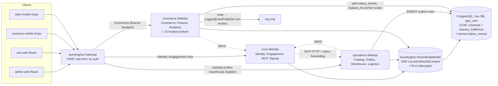

# 01 — Principal Software Architect (architecture)

## Scope and method

**Inspected (read, not run):**
- Every `*.csproj` under `backend/laundryghar/` (17 production + 3 test projects) and `laundryghar.slnx`; the
  dependency graph below is built from the `ProjectReference` elements, not from docs.
- The four composition roots: `core.WebApi/Program.cs`, `operations.WebApi/Program.cs`, `commerce.WebApi/Program.cs`,
  `laundryghar.Gateway/Program.cs`, plus `laundryghar.AppHost/AppHost.cs` (the only `.cs` in AppHost) and
  `laundryghar.ServiceDefaults/Extensions.cs`.
- The custom CQRS framework in `laundryghar.Utilities/CQRS/**` (all abstractions, dispatchers, behaviours,
  registrars) and its registration in each `*.Application/DependencyInjection.cs`.
- The shared EF model `laundryghar.SharedDataModel` (`DependencyInjection.cs`, `LaundryGharDbContext.cs`,
  `RlsConnectionInterceptor.cs`, entity/configuration layout) and the three per-context adapters
  (`ICoreDbContext`/`IOperationsDbContext`/`ICommerceDbContext` + their Infrastructure implementations).
- The multi-vertical seam: `operations.Application/Fulfillment/**`, `SharedDataModel/Enums/{VerticalKey,FulfillmentMode}.cs`,
  `CreateOrderCommand.cs`, `CreateParcelOrderCommand.cs`, `UpdateOrderStatusCommand.cs`, signup provisioning
  (`CompleteSignup.cs`, `TemplateProvisioner.cs`), DB artefacts `db/patches/phase0_multi_vertical.sql`,
  `phase4_salon_pack.sql`, `phase4_salon_fulfillment_schema.sql`, `db/migrations/0004`, `0010`, `0011`, `0012`, `0031`.
- Eventing/outbox: `commerce.Infrastructure/Worker/**` (relay, consumers, worker tenant context), ADR-007.
- DB bootstrap pipeline: `db/build_from_scratch.sh`, `db/patches/apply_patches.sh`, `db/patches/apply_saas_billing_patches.sh`,
  `db/migrations/README.md`, `deploy/README.md`, `deploy/docker-compose.yml`, `.github/workflows/ci.yml`.
- Docs treated as claims and cross-checked: `docs/SAAS_PLATFORM_ARCHITECTURE.md`, `docs/MULTI_VERTICAL_BLUEPRINT.md`,
  `docs/MULTI_VERTICAL_SLICE_C.md`, `docs/ADRs/ADR-007`, `docs/AUDIT_REPORT.md`.
- Clients only at the level needed for architecture (route table in `admin-web/src/App.tsx`, vertical-key usage counts).

**Commands run:** `grep`/`find`/`wc`/`sed` over the repo (no builds, no DB). All evidence below is static reading.

**Could NOT verify (environment):** no .NET SDK → nothing was compiled or executed; no running PostgreSQL / Docker →
no schema build, no migration run, no integration test run. Runtime claims (e.g. "this would fail at startup",
"events could be skipped") are therefore labelled *Partially Verified* or *Suspected* where they depend on runtime behaviour.

## Current-state summary

**What it is, in one sentence:** a **single-database, single-EF-model application split into three ASP.NET Core
processes behind a YARP gateway** — architecturally a *modular monolith deployed as three hosts* ("distributed
monolith" in the coupling sense), not microservices.

Evidence-backed characteristics:

| Characteristic | Finding | Evidence |
|---|---|---|
| Deployables | 3 API hosts + gateway (+ admin-web). `core` = Identity+Engagement+MCP; `operations` = Catalog+Orders+Warehouse+Logistics; `commerce` = Commerce+Finance+Analytics+**all background workers** | `laundryghar.AppHost/AppHost.cs:1-7, 55-118`; `deploy/docker-compose.yml:33-100` |
| Database | One PostgreSQL DB, one connection string (`ConnectionStrings:Default`, role `app_user`) injected into all three hosts | `AppHost.cs:23-28, 60, 72, 87` |
| Data model | One EF `LaundryGharDbContext` with ~150 `DbSet`s across all 10 bounded-context schemas, in one assembly referenced by every host | `SharedDataModel/Persistence/LaundryGharDbContext.cs:34-217`; csproj graph below |
| Data ownership | None enforced. Per-host `I*DbContext` interfaces are *views* over the same context and overlap (coupons, payments, cash book, partner wallet, customers, system settings) | `IOperationsDbContext.cs:83,98,101-112`; `ICommerceDbContext.cs:32,47,56-60,72`; `ICoreDbContext.cs:28` |
| Inter-service sync calls | Only one: core's MCP tools call operations over HTTP with token forwarding | `core.WebApi/Program.cs:408-436` |
| Messaging | No broker. `kernel.outbox_events` table is written in-transaction; the "relay" publishes to a logging stub; real consumers poll the table directly from the commerce host | `commerce.WebApi/Program.cs:289-290, 301-323`; `Worker/Services/OutboxEventRelayService.cs:12-17` |
| Domain layer | `core.Domain`, `operations.Domain`, `commerce.Domain` contain **zero source files** (csproj only). Entities live in SharedDataModel and are pure property bags (no methods anywhere under `Entities/`) | `find` over the three Domain dirs; `grep` for methods under `SharedDataModel/Entities` returned nothing |
| Application style | Transaction-script handlers writing EF LINQ directly against `DbSet`s (no repositories, no aggregates); dispatched through a custom `IDispatcher` | `ICoreDbContext.cs:12-17` (doc comment: "no repositories … write EF Core LINQ directly") |
| Tenancy | Brand = tenant. RLS GUCs set on every connection open by a scoped interceptor | `RlsConnectionInterceptor.cs:21-121` |
| Multi-vertical | Discriminators (`Brand.VerticalKey`, `Order.VerticalKey`, `Order.FulfillmentMode`) and a real `IFulfillmentStrategy` seam exist; only laundry and parcel (point-to-point) are reachable from order creation | see SA-ARCH-003/004 |

**Real request path (typical write, e.g. `PATCH order status`):**
client → YARP gateway (`/orders/**` → operations cluster, path prefix stripped; no auth at gateway — passthrough of
`Authorization`/`X-Brand-Id`; `Gateway/Program.cs:46-102, 285-313`) → operations host middleware:
`ExceptionHandler` → `UseAuthentication` (JWT via core JWKS) → `TenantResolutionMiddleware` → `ImpersonationGuardMiddleware`
→ `BrandSuspensionMiddleware` → `UseAuthorization` (dynamic `permission:*` policies + ABAC) → output cache
(`operations.WebApi/Program.cs:142-179`) → minimal-API endpoint (optional `ValidationFilter<T>`) → `IDispatcher.SendAsync`
(**no pipeline behaviours**, SA-ARCH-005) → handler → `IOperationsDbContext` → shared `LaundryGharDbContext` →
`RlsConnectionInterceptor` sets `app.current_*` GUCs → PostgreSQL RLS → response.
For status changes the handler resolves `IFulfillmentStrategy` by `order.FulfillmentMode` and delegates transition
validation, lifecycle super-state and timestamp side-effects (`UpdateOrderStatusCommand.cs:27-68`) — this part of the
seam is genuine.

### Component and dependency diagram (as implemented)



### Project dependency graph (from `ProjectReference`)

| Project | References (direct) | Notes |
|---|---|---|
| `laundryghar.SharedDataModel` | — (EF Core, Npgsql, NTS) | All entities, all EF configs, DbContext, RLS interceptor, PII cipher, **plus** application-ish services (`BrandExportService`, `TlsDomainHealthChecker`, `FeatureCatalog`, token/brand-status stores) — `DependencyInjection.cs:73-84` |
| `laundryghar.Utilities` | SharedDataModel; `FrameworkReference Microsoft.AspNetCore.App`; MailKit, Npgsql, Scrutor, FluentValidation, OpenAPI, Scalar | CQRS + auth/ABAC + middlewares + email + OpenAPI + audit interceptor: a cross-cutting "god library" (`laundryghar.Utilities.csproj:9-32`) |
| `laundryghar.ServiceDefaults` | — (OTel, Sentry, resilience, service discovery) | Clean |
| `core.Domain` / `operations.Domain` / `commerce.Domain` | SharedDataModel | **Empty** — no `.cs` files |
| `core.Application` | core.Domain, Utilities (EF Core, FluentValidation) | Transitively gets ASP.NET Core + SharedDataModel |
| `operations.Application` | operations.Domain, Utilities (EF Core, QuestPDF, ClosedXML, CsvHelper, Npgsql) | Uses `IFormFile` in commands (6 files) |
| `commerce.Application` | commerce.Domain, Utilities | — |
| `core.Infrastructure` | core.Application, Utilities, SharedDataModel | — |
| `operations.Infrastructure` | operations.Application, Utilities, SharedDataModel | 5 files only (adapter + storage) |
| `commerce.Infrastructure` | commerce.Application, Utilities, SharedDataModel | Hosts all background workers (`Worker/**`) |
| `core.WebApi` | ServiceDefaults, Utilities, SharedDataModel, core.Infrastructure | Note: **no direct** ref to core.Application (transitive) |
| `operations.WebApi` | ServiceDefaults, Utilities, SharedDataModel, operations.Application, operations.Infrastructure | — |
| `commerce.WebApi` | ServiceDefaults, Utilities, SharedDataModel, commerce.Application, commerce.Infrastructure | — |
| `laundryghar.Gateway` | ServiceDefaults | Independent of the data model (good) |
| `laundryghar.AppHost` | core/operations/commerce WebApi, Gateway | Aspire orchestration, static ports |
| `tests/core.Tests` | core.Application, core.Infrastructure, SharedDataModel, Utilities | 64 `[Fact]/[Theory]` |
| `tests/operations.Tests` | operations.Application, operations.Infrastructure, SharedDataModel, Utilities, **Gateway** | 311 tests |
| `tests/operations.IntegrationTests` | SharedDataModel, core.Application, core.Infrastructure (Testcontainers) | 243 tests; apply individual patches to minimal fixtures |
| *(none)* | commerce.Application / commerce.Infrastructure | **No test project references commerce** (SA-ARCH-010) |

Consequences of the graph: (1) every host depends on the whole data model, so any entity/config change rebuilds and
redeploys all three hosts; (2) there are no compile-time boundaries between bounded contexts — any handler can reach
any table by adding a `DbSet` to its context interface; (3) the "Clean Architecture" ring is nominal: Domain is empty,
Application sees EF Core, ASP.NET Core and Npgsql through Utilities. No architecture tests (NetArchTest etc.) exist
(grep returned nothing).

### Multi-vertical: claims vs. code

| Claim (doc) | Code reality | Status |
|---|---|---|
| "LaundryGhar is a multi-tenant, multi-vertical SaaS … across laundry, salon, logistics" (`SAAS_PLATFORM_ARCHITECTURE.md:17-19`) | Laundry operable; parcel/point-to-point operable inside any brand; salon & tiffin are scaffolding only (SA-ARCH-004) | Contradicted |
| "There is no `Brand.VerticalKey` … or `IFulfillmentStrategy` anywhere" (`MULTI_VERTICAL_BLUEPRINT.md:13`) | Now exists (`VerticalKey.cs`, `IFulfillmentStrategy.cs`) | Doc stale |
| "Vertical is denormalized onto every order and drives fulfilment strategy" (`SAAS_PLATFORM_ARCHITECTURE.md:51-53`) | Never set on create; strategy chosen by `isParcel` only (SA-ARCH-003) | Contradicted |
| Salon "ships as a new strategy + `salon_fulfillment` schema … without touching the shared spine" (`MULTI_VERTICAL_BLUEPRINT.md:175-197`) | Strategy class + DB patch + nav/bundle seed exist; no entities, handlers, endpoints, or admin route | Partially implemented |
| "there is no self-serve signup" (`SAAS_PLATFORM_ARCHITECTURE.md:99`) | `/api/v1/signup/{templates,start,complete}` exists (`core.WebApi/Endpoints/Identity/Signup.cs:30-32`) | Doc stale |
| Laundry tables relocated to `laundry_fulfillment` (`MULTI_VERTICAL_SLICE_C.md`) | EF configs map to `laundry_fulfillment.*` (e.g. `FulfillmentUnitConfiguration.cs:11`), but the code still lives in the shared `OrderLifecycle` namespace/assembly | Done at DB level only |

## Findings

### SA-ARCH-001 — Three "services" share one EF model, one database role and overlapping table ownership (distributed monolith)
- Category: Architecture / modularity / coupling
- Severity: High
- Status: Verified
- Evidence:
  - `backend/laundryghar/*/*.csproj` — every WebApi, Infrastructure and (via Domain/Utilities) Application project references `laundryghar.SharedDataModel`.
  - `laundryghar.SharedDataModel/Persistence/LaundryGharDbContext.cs:34-217` — single context mapping tenancy, identity, catalog, orders, laundry fulfilment, logistics, commerce, finance, kernel, analytics, engagement.
  - `laundryghar.AppHost/AppHost.cs:23-28,60,72,87` — identical `ConnectionStrings__Default` for all hosts.
  - Overlapping write ownership: `IOperationsDbContext.cs:98-112` (Payments, Coupons, CouponRedemptions, LoyaltyPointsLedger, CustomerPackages, PackageUsageLedger, Promotions, PaymentRefunds, CashBooks, CashBookEntries) vs. `ICommerceDbContext.cs:32-72` (same sets). Writes confirmed in both hosts: `operations.Application/Orders/Orders/Commands/CreateOrderCommand.cs:757-795` (coupon redemption, loyalty debit, package ledger, promotion counters inside the order transaction) and `commerce.Application/Commerce/Customer/Coupons/CustomerCouponHandlers.cs:120-145`.
  - Logistics dispatch written by the commerce host: `commerce.Infrastructure/Worker/Services/AutoDispatchService.cs:18-33,110-171,370-371` (creates `delivery_assignments`, bumps rider load).
- Observed behaviour: The process split (core/operations/commerce) is a deployment/scaling partition, not a bounded-context partition. Cross-context invariants (e.g. coupon usage limits, rider load) are enforced by whichever host happens to write, inside its own DB transaction.
- Reproduction / verification method: Read the csproj graph and the three context interfaces; grep for `.Add(`/mutations per table per project (counts in scope notes).
- Impact: Any schema or entity change forces coordinated redeploy of all hosts; no team/module can evolve independently; adding a vertical means editing the shared assembly every host loads (directly hurts Q7). Microservice-style operational cost (3 hosts, gateway, JWKS hops) without microservice-style independence.
- Recommended remediation (smallest safe change): Stop treating the hosts as services. Declare module ownership per table (one writing module per table, documented and test-enforced), move cross-module writes behind in-process module APIs (e.g. `ICouponRedemptionService` owned by Commerce, called by Orders in the same transaction), and add architecture tests that fail when a module's Application assembly references another module's entities for writes. Do **not** split the database.
- Regression tests required: Architecture tests (assembly dependency rules); existing order-placement tests must keep coupon/loyalty/package atomicity.
- Dependencies / priority: P1 (precondition for vertical modules).
- Prior-doc cross-ref: `MULTI_VERTICAL_BLUEPRINT.md` §4 coupling register describes coupling but not table-ownership overlap.

### SA-ARCH-002 — Domain layer is empty; business rules live in large transaction scripts and are duplicated across hosts
- Category: Design / maintainability / OOP
- Severity: Medium
- Status: Verified
- Evidence:
  - `core.Domain/`, `operations.Domain/`, `commerce.Domain/` contain only their `.csproj` (`find` output).
  - `laundryghar.SharedDataModel/Entities/**` — no methods on any entity; `Order.cs` has 100 `{ get; set; }` properties and no behaviour (`Order.cs:1-159`).
  - `operations.Application/Orders/Orders/Commands/CreateOrderCommand.cs` (925 lines) implements pricing, tax, coupon validation (`:309-319`), loyalty burn, package debit, promotion metrics, order numbering, outbox, and persistence (`:757-795`).
  - Same coupon rules re-implemented in commerce: `CustomerCouponHandlers.cs:100-115` vs `CreateOrderCommand.cs:309-319` (per-customer limit, percent vs flat, max-discount cap — textually parallel code).
- Observed behaviour: Invariants have no single home; the "Domain" projects are placeholders that only forward the SharedDataModel reference.
- Reproduction / verification method: Static read + `grep` for `MaxUsesPerCustomer|MaxDiscountAmount|CouponType ==`.
- Impact: Rule drift between POS/admin order creation and customer coupon application is likely over time (e.g. one path adds min-order-value or vertical restrictions, the other not). Vertical-specific rules (salon pricing, tiffin schedules) have nowhere to live except more handler branches.
- Recommended remediation: Introduce small domain services/aggregates only where invariants are shared — start with `CouponPolicy`/`PromotionPolicy` in a Commerce module consumed by both paths; delete the empty Domain projects or put these policies there. Not a full DDD rewrite.
- Regression tests required: Table-driven tests for coupon/promotion rules executed against both call sites (or against the single extracted policy).
- Dependencies / priority: P2.

### SA-ARCH-003 — Brand vertical is never applied when an order is created; salon/tiffin brands get laundry orders labelled "laundry"
- Category: Multi-vertical correctness / architecture seam
- Severity: High
- Status: Verified (static trace; not executed)
- Evidence:
  - `operations.Application/Orders/Orders/Commands/CreateOrderCommand.cs:618-647` — `fulfillmentMode = isParcel ? PointToPoint : ProcessDeliver`; the comment at `:643-646` states VerticalKey "defaults … via the entity initializer; Phase 2 sets it explicitly … once multiple verticals coexist". No brand lookup of `VerticalKey`.
  - `CreateParcelOrderCommand.cs:93-110` — always `PointToPoint`; does not set `VerticalKey`.
  - Only two `new Order` sites exist (grep), neither sets `VerticalKey`.
  - `SharedDataModel/Entities/OrderLifecycle/Order.cs:44,48` — initializers `VerticalKey = "laundry"`, `FulfillmentMode = "process_deliver"`; `OrderConfiguration.cs:32-33` maps them as required columns, so EF writes `'laundry'` explicitly.
  - `SharedDataModel/Enums/FulfillmentMode.cs:30-36` — `DefaultFor(verticalKey)` (salon→appointment, tiffin→recurring) has **zero callers** (grep).
  - No DB trigger derives `orders.vertical_key` from the brand (grep of `db/`, `database_scripts/` found only the brand-immutability trigger in `phase0_multi_vertical.sql:77-99`).
  - Salon is offered at self-signup: `db/migrations/0011_vertical_templates.up.sql:71-74` (public `salon` template, `fulfillment_mode='appointment'`); `CompleteSignup.cs:70-75` guards only on `is_public`, whose stated purpose is to hide templates "whose fulfilment mode has no strategy".
- Observed behaviour: A provider who self-signs-up as "Salon & studio" gets a brand with `vertical_key='salon'`, but every order created for it runs the laundry wash/QC state machine (`placed → pickup_scheduled → … → qc → ready …`) and is stored with `vertical_key='laundry'`. `SalonAppointmentStrategy` and `RecurringDeliveryStrategy` are registered (`operations.Application/DependencyInjection.cs:33-40`) but unreachable from order creation.
- Reproduction / verification method: Trace above. Runtime reproduction (sign up salon → create order → inspect row) not possible here (no SDK/DB).
- Impact: Data integrity (orders mislabelled; analytics/entitlement by vertical wrong), product correctness for any non-laundry tenant, and contradicts `SAAS_PLATFORM_ARCHITECTURE.md:51-53`.
- Recommended remediation (smallest safe change): In both create handlers, load `Brand.VerticalKey`, set `order.VerticalKey` from it, and choose the mode as `isParcel ? PointToPoint : FulfillmentMode.DefaultFor(brand.VerticalKey)`; reject creation (business-rule error) when the resolved mode's flow is not yet operable (appointment/recurring) instead of silently falling back. Until then set `is_public=false` on the salon template. Optionally add a DB `BEFORE INSERT` trigger or CHECK that `orders.vertical_key = brands.vertical_key`.
- Regression tests required: Handler tests: laundry brand → process_deliver/laundry; laundry brand parcel → point_to_point/laundry; salon brand → appointment or explicit refusal; signup template list excludes non-operable verticals.
- Dependencies / priority: P0 if salon signup is public in any environment with real customers; otherwise P1.
- Prior-doc cross-ref: `MULTI_VERTICAL_BLUEPRINT.md` §8 "Resolved" note on FulfillmentMode vs VerticalKey (the resolution is sound; the wiring was never completed).

### SA-ARCH-004 — Salon and tiffin verticals are scaffolding (strategy + SQL), not operable modules
- Category: Multi-vertical completeness / docs-vs-code
- Severity: High
- Status: Verified
- Evidence:
  - Salon strategy exists: `operations.Application/Fulfillment/Salon/SalonAppointmentStrategy.cs:1-70`; unit tests `tests/operations.Tests/Fulfillment/SalonStrategyTests.cs`.
  - Salon DB schema only in a patch: `db/patches/phase4_salon_fulfillment_schema.sql:25,39,52,75` (`staff_members`, `resources`, `appointments`, `resource_bookings`). No EF entity/config, no `DbSet`, no handler, no endpoint references them (grep for `StaffMember|ResourceBooking|appointments` in backend returned only onboarding counters).
  - Salon nav module seeded with route `/appointments` (`db/patches/phase4_salon_pack.sql:17-26`), but `admin-web/src/App.tsx:57-116` has no `appointments` route (falls through to `*` → redirect home).
  - Tiffin: `RecurringDeliveryStrategy.cs` exists and migration `0012_recurring_fulfillment_mode.up.sql:52,127` creates `delivery_schedules`/`delivery_schedule_occurrences`, but no C# entity, producer job or endpoint emits orders from schedules (grep `DeliverySchedule|delivery_schedules` finds only comments). `VerticalKey.cs` doc comment itself says tiffin "NOT yet operable".
- Observed behaviour: Only laundry (process_deliver) and courier/parcel (point_to_point) flows are end-to-end. The vertical *metadata* layer (templates, terminology, bundles, role/feature vertical gating) is real; vertical *behaviour* modules are not.
- Reproduction / verification method: Static search across backend, db and admin-web.
- Impact: Any go-to-market claim of salon/tiffin support is not backed by code; Q7 cannot be answered positively from the existing salon "validation", because it validated only the state-machine shape, not catalog, booking, staff capacity, UI or billing.
- Recommended remediation: Treat salon as the first true vertical module (see target architecture) and gate its template/nav until done; correct `SAAS_PLATFORM_ARCHITECTURE.md` §1/§2.1.
- Regression tests required: End-to-end salon booking path once built; a CI check that every public template's fulfilment mode has a create-path test.
- Dependencies / priority: P1 (depends on SA-ARCH-003).

### SA-ARCH-005 — CQRS pipeline behaviours (validation, transaction, audit, caching, exception) are dead code
- Category: Framework design / maintainability
- Severity: Medium
- Status: Verified
- Evidence:
  - `laundryghar.Utilities/CQRS/Extensions/ServiceCollectionExtensions.cs:10-34` — `AddCustomCQRS` registers `IDispatcher → Dispatcher` and handlers only.
  - `laundryghar.Utilities/CQRS/Dispatcher/Dispatcher.cs:15-45` — resolves and invokes the handler directly; no `IPipelineBehavior` resolution.
  - The pipeline-capable `CommandDispatcher`/`QueryDispatcher` (`CommandDispatcher.cs:21-58`, `QueryDispatcher.cs:21-58`) and `BehaviorRegistrar.RegisterBehaviors` (`BehaviorRegistrar.cs:13-25`) have **no callers** outside `Utilities/CQRS` (grep over the backend).
  - If enabled, `ExceptionBehavior.cs:32-47` would wrap `BusinessRuleException`/`ForbiddenException` in `CqrsException`, which `Middlewares/ExceptionsMiddleware/ExceptionHandler.cs:88-160` does not map (it maps `laundryghar.Utilities.Exceptions.ValidationException`, a *different* type from `CQRS.Exceptions.ValidationException`) → business errors would become 500s. `TransactionBehavior.cs:42-47` silently no-ops because nobody registers `DbContext` as the base type.
- Observed behaviour: Validation runs only where an endpoint opts into `ValidationFilter<T>` (113 filter usages across endpoint files vs. 141 validators); transactions are hand-rolled per handler (`ExecuteInTransactionAsync`); audit relies on the EF `AuditSaveChangesInterceptor`, not the behaviour.
- Impact: Cross-cutting policy is opt-in per endpoint, so a new vertical module's endpoints can ship without validation. The dead behaviours are a trap for the next engineer who "turns them on".
- Recommended remediation: Either delete `Behaviors/`, `CommandDispatcher`, `QueryDispatcher`, registrars and `IUnitOfWorkCommand`, or make `Dispatcher` run a *curated* pipeline (validation only, using the app's own `ValidationException`) and add a test proving a validator-bearing command is validated without an endpoint filter. Pick one.
- Regression tests required: Dispatcher test with a failing validator; exception-mapping test for `BusinessRuleException` through the dispatcher.
- Dependencies / priority: P2.

### SA-ARCH-006 — Outbox is a DB-polling integration with no broker, no typed contracts, and inconsistent consumer semantics
- Category: Integration / reliability
- Severity: Medium
- Status: Partially Verified (code read; event skipping is Suspected — not reproduced)
- Related area: BE / DATA
- Evidence:
  - Relay publishes to a logging stub unconditionally in all environments: `commerce.WebApi/Program.cs:289-290`; `Worker/Stubs/LoggingEventPublisher.cs:7-10`.
  - Consumers poll `outbox_events` directly with different cursor semantics:
    - `LoyaltyEarnService.cs:90-112` — strict `OccurredAt > lastOccurredAt` watermark, no id tie-break.
    - `NotificationMappingService.cs:119-137` — `(OccurredAt, Id)` watermark.
    - `PartnerBookingDebitService.cs:100-112` — inbox anti-join on `outbox_consumed_events`; its own comment explains that a time watermark can step over events that commit out of `OccurredAt` order.
  - Producers stamp `OccurredAt = now` before commit (e.g. `CreateQualityCheck.cs:122`), so commit order ≠ `OccurredAt` order under concurrency.
  - Event types are free strings set at ~15 call sites (`grep EventType = "…"`); no shared contract type or schema.
  - ADR-007 (`docs/ADRs/ADR-007-transactional-outbox-for-events.md:11`) describes `laundryghar.Worker/…OutboxEventRelayService` "dispatching to consumers" — that project no longer exists and the relay dispatches to nothing.
- Observed behaviour: Integration between contexts is "shared table + polling" with three different correctness models.
- Impact: Loyalty credits (and to a lesser degree notifications) can be silently skipped when two transactions interleave; adding vertical-specific consumers would copy whichever pattern is nearest. No path to an external broker without per-consumer rework despite the ADR claim.
- Recommended remediation: Standardise every consumer on the inbox pattern already proven in `PartnerBookingDebitService`; introduce a small `OutboxEventTypes` + payload record catalogue in a shared contracts namespace; either remove the no-op relay or make it explicitly "mark-as-relayed" with a TODO for a broker. No broker needed now.
- Regression tests required: Concurrency test inserting two events with inverted commit order, asserting each consumer processes both.
- Dependencies / priority: P1 for loyalty (money-adjacent), P2 otherwise.

### SA-ARCH-007 — Background workers run in-process in the commerce API host with no leader election; host cannot be scaled out safely
- Category: Scalability / deployment
- Severity: Medium
- Status: Partially Verified (registration and absence of locking verified; multi-replica behaviour not run)
- Related area: DEVOPS
- Evidence:
  - `commerce.WebApi/Program.cs:301-323` — 14 `AddHostedService` registrations (outbox relay, notification mapping/dispatch, auto-dispatch, billing, royalty, recon, loyalty, partner debit, partition maintenance, retention, erasure, matview refresh) inside the HTTP host.
  - No `pg_try_advisory_lock`, `SKIP LOCKED` or leader-election construct anywhere in the backend (grep).
  - In-process caches: output cache (`Utilities/Caching/OutputCaching.cs:27-29` explicitly warns eviction does not fan out across replicas), ABAC `PolicyCache` 15 s window (`PolicyCache.cs:36`), brand-status/feature caches in `IMemoryCache` (`SharedDataModel/DependencyInjection.cs:68-81`).
- Observed behaviour: Scaling commerce for HTTP load also multiplies every worker; correctness then depends on each job's own idempotency (only the partner-debit consumer has an explicit inbox).
- Impact: Commerce (payments, billing) is the host most likely to need horizontal scale and the least safe to scale; a multi-tenant SaaS with many brands will hit this early.
- Recommended remediation: Move hosted services into a separate `laundryghar.Worker` host (same code, different composition root) deployed as a singleton, or wrap each job's tick in a Postgres advisory lock. Keep HTTP hosts stateless; swap output cache to Redis only when scaling HTTP.
- Regression tests required: Two-instance test (or advisory-lock unit test) proving a job tick runs once.
- Dependencies / priority: P1 before any multi-replica deployment.

### SA-ARCH-008 — No reproducible schema source of truth: the documented bootstrap does not create columns/schemas the EF model maps
- Category: Deployment / persistence architecture
- Severity: High
- Status: Verified (scripts read; not executed)
- Related area: DB / DEVOPS
- Evidence:
  - Documented bootstrap: `deploy/README.md:34-35` = `db/build_from_scratch.sh` + `db/tools/migrate.sh up`.
  - `db/build_from_scratch.sh:10-24,77-90` applies `database_scripts/` + FK patches (`apply_patches.sh:35-44`, 11 `fk_patch_*` files) + 4 named patches; it does not apply any `phase*` patch.
  - `tenancy_org.brands.vertical_key`, `order_lifecycle.orders.vertical_key/fulfillment_mode` are created only in `db/patches/phase0_multi_vertical.sql:30-47`; the `laundry_fulfillment` schema only in `phase1_slice_c_laundry_fulfillment.sql`/`phase1_slice_f_*`; the salon schema only in `phase4_salon_fulfillment_schema.sql`. None is referenced by `build_from_scratch.sh`, `apply_patches.sh`, `migrate.sh` or any migration (grep of all `.sh`; `database_scripts/` has no `vertical_key`). `apply_saas_billing_patches.sh:25-30` covers a different subset of phase4 patches.
  - EF maps these: `BrandConfiguration` (vertical_key), `OrderConfiguration.cs:32-33`, `FulfillmentUnitConfiguration.cs:11` (`laundry_fulfillment.fulfillment_unit`).
  - `docs/SCHEMA_FULL.sql` (labelled "COMPLETE PRODUCTION SCHEMA") contains no `vertical_key` and no `laundry_fulfillment` (grep count 0).
  - CI only checks migration file pairing (`.github/workflows/ci.yml:88-110`); it never builds a schema; integration tests apply single patches onto minimal fixtures (`tests/operations.IntegrationTests/Phase*Tests.cs`).
- Observed behaviour: The live dev DB was evolved by hand-applied patches; a new environment built per the runbook would not match the code.
- Impact: Cannot reliably stand up a new region/tenant cluster, DR restore-to-new, or staging; every vertical added via "a patch" widens the gap. Blocks Q15.
- Recommended remediation: Produce one baseline (pg_dump of the current canonical dev schema, reviewed) as migration `0000_baseline`, fold historical patches into it, and from then on only `db/migrations`. Add a CI job that builds an empty Postgres from baseline+migrations and runs an EF model-vs-schema check (e.g. query each mapped table/column via `information_schema`).
- Regression tests required: CI "schema from scratch + EF model validation" job.
- Dependencies / priority: P0 for production readiness.

### SA-ARCH-009 — Layering is nominal: `Utilities` is a cross-cutting god-library; composition roots are copy-pasted per host
- Category: Maintainability / dependency hygiene
- Severity: Low
- Status: Verified
- Evidence:
  - `laundryghar.Utilities.csproj:9-32` — `FrameworkReference Microsoft.AspNetCore.App`, SharedDataModel, MailKit, Npgsql, OpenAPI; contains CQRS, ABAC PDP/store, middlewares, email sender, audit interceptor, output caching (file inventory).
  - Every `*.Application` references Utilities (`core.Application.csproj:24-29`, `operations.Application.csproj:33-37`), so Application code can (and does) use ASP.NET types: `IFormFile` in commands, e.g. `operations.Application/Logistics/RiderSelf/Commands/UploadProofPhoto/UploadProofPhoto.cs:5,22` (6 files).
  - Per-context DbContext interfaces expose raw `DbSet<T>` with very wide surfaces (e.g. `IOperationsDbContext` ~80 sets spanning 9 schemas), so they document rather than constrain dependencies.
  - Composition roots repeat the same auth/ABAC/middleware wiring (`core.WebApi/Program.cs:370-392,507-576`; `operations.WebApi/Program.cs:114-170`; `commerce.WebApi/Program.cs:161-185,339-385`) with drift already visible in handler lists (e.g. `RiderOnlyHandler` only in operations); stale comments "None yet; MapEndpoints finds nothing" at `operations.WebApi/Program.cs:178` and `commerce.WebApi/Program.cs:394` although 42/27 endpoint files exist.
- Impact: Each new vertical module would copy another ~150 lines of host wiring; cross-cutting changes (e.g. a new middleware) must be made three times.
- Recommended remediation: Split Utilities into `Platform.Abstractions` (CQRS interfaces, Result, ICurrentUser — no ASP.NET) and `Platform.Web` (middlewares, auth handlers, OpenAPI); add one `AddPlatformWebDefaults()/UsePlatformPipeline()` extension used by every host; add NetArchTest rules.
- Regression tests required: Architecture tests; a middleware-order test per host.
- Dependencies / priority: P3.

### SA-ARCH-010 — Commerce (payments, wallets, subscriptions, billing workers) has no test project
- Category: Testability
- Severity: Medium
- Status: Verified
- Related area: QA
- Evidence: Test csproj references (`tests/core.Tests/core.Tests.csproj:19-22`, `tests/operations.Tests/operations.Tests.csproj:20-26`, `tests/operations.IntegrationTests/operations.IntegrationTests.csproj:31-36`) — none references `commerce.Application` or `commerce.Infrastructure` (96 source files incl. `RazorpayWebhookHandler.cs`, `SubscriptionBillingService.cs` 551 lines, wallet handlers).
- Impact: The money-moving bounded context — and the one hosting all workers — has no automated regression net; refactoring towards modules (SA-ARCH-001/006/007) is high-risk there.
- Recommended remediation: Add `commerce.Tests` mirroring `operations.Tests` (EF InMemory or Testcontainers) starting with webhook idempotency, wallet balance mutations and the outbox consumers.
- Regression tests required: as above.
- Dependencies / priority: P1 (before touching commerce structure).

### SA-ARCH-011 — MCP downstream URLs are not wired for AppHost or compose; synchronous core→operations coupling
- Category: Configuration / inter-service coupling
- Severity: Low
- Status: Partially Verified (config read; not run)
- Evidence: `core.WebApi/Program.cs:100-118,408-436` builds keyed HttpClients from `DownstreamServices:{Catalog,Orders}BaseUrl`; defaults are `https://localhost:7254` (`core.WebApi/appsettings.json:28-31`), `http://localhost:5056` (Development), `http://localhost:5002` (`Mcp/Infrastructure/Http/DownstreamClients.cs:24-25`). Neither `AppHost.cs:56-62` nor `deploy/docker-compose.yml` sets them (grep `DownstreamServices` in `deploy/` → none), while operations actually listens on 5302 / `operations:8080`.
- Observed behaviour: MCP tools would call a non-existent host in both the Aspire dev loop and the compose deployment unless an operator sets env vars that no runbook mentions.
- Impact: The only synchronous inter-service dependency is broken-by-default; it also shows the MCP feature is laundry-specific (`LaundryTools`, `core.WebApi/Mcp/Tools/LaundryTools.cs`) code living in the platform-core host.
- Recommended remediation: Inject `DownstreamServices__*` in AppHost and compose (point at the gateway or operations), or call the operations Application handlers in-process if hosts are consolidated.
- Regression tests required: Startup config test asserting non-default downstream URLs outside Development.
- Dependencies / priority: P3.

### SA-ARCH-012 — Architecture documents materially out of date with the code
- Category: Documentation / governance
- Severity: Low
- Status: Verified
- Evidence: `SAAS_PLATFORM_ARCHITECTURE.md:17-19,51-53,99` vs SA-ARCH-003/004 and `Signup.cs:30-32`; `MULTI_VERTICAL_BLUEPRINT.md:13` ("no discriminator exists") vs `Enums/VerticalKey.cs`; `ADR-007…md:11` (non-existent `laundryghar.Worker` relay dispatching to consumers) vs `commerce.WebApi/Program.cs:289-290`.
- Impact: Decision-makers reading the docs will over-estimate multi-vertical readiness and under-estimate integration gaps.
- Recommended remediation: Add a "status as of <date>, verified against commit" header to these docs and correct the specific lines; record a new ADR for the target modular-monolith structure.
- Dependencies / priority: P3.

## Recommended target architecture

### Options considered

| Option | Description | Fit to what exists | Risks | Rough cost* |
|---|---|---|---|---|
| **A. Status quo** (3 hosts over one model, verticals as strategy classes + SQL patches) | Keep adding vertical branches in shared handlers/seeders | Zero migration | Fails Q7: each vertical edits SharedDataModel, operations DI, CreateOrder, seeder, CHECK constraints, clients; coupling and drift grow (SA-ARCH-001/002/003) | 0 now, rising per vertical |
| **B. Modular monolith with vertical modules** (recommended) | One codebase/one DB; explicit modules with owned schemas, owned EF configuration, owned endpoints, published in-process APIs and typed events; vertical packs plug in via a registration contract. Hosts become *scale units* (API host(s) + one worker host), not service boundaries | High: schemas per BC already exist; `IFulfillmentStrategy` seam, `VerticalKey`, templates, bundles, terminology, per-context DbContext adapters, RLS are reusable as-is | Needs discipline (architecture tests); one DB remains a shared failure domain (acceptable at this scale) | ~2–4 engineer-months for structure (estimate; excludes salon feature build) |
| **C. Microservice per vertical (and per BC)** | Separate deployables + DBs for laundry, salon, commerce, identity… | Low: order spine, payments, coupons, dispatch are shared by every vertical and currently committed in one transaction (`CreateOrderCommand.cs:757-795`); would require sagas, data replication, per-service RLS, a broker | Distributed transactions, ops cost, small-team overload; no evidence of independent scaling needs per vertical | Very high (quarters) |

\*Costs are architect estimates for planning, not measured.

**Recommendation: Option B.** Microservices are not justified: there is one shared order/payment spine, one team-sized codebase, and the current three-host split already shows that process separation without data separation adds cost without independence.

### Target shape (Option B)

```mermaid
flowchart TB
  subgraph Hosts["Deployables (scale units, same codebase)"]
    API[API host(s): all module endpoints<br/>or keep core/ops/commerce split by load]
    WRK[Worker host: singleton / advisory-locked jobs]
    GW2[Gateway]
  end
  subgraph Platform["Platform modules (vertical-neutral)"]
    TEN[Tenancy & Identity<br/>brands, users, RBAC/ABAC, entitlement, signup]
    BILL[Platform billing & plans]
    COMM[Commerce: payments, coupons, wallet, loyalty]
    SPINE[Order spine: orders, status history, invoices, slots]
    LOG[Logistics/dispatch: riders, assignments]
    ENG[Engagement: notifications, CMS]
  end
  subgraph Verticals["Vertical modules (one per vertical)"]
    LAU[Laundry: laundry_fulfillment schema,<br/>fabric catalog, QC; LaundryProcessStrategy]
    SAL[Salon: salon_fulfillment schema,<br/>staff/resources/appointments; SalonAppointmentStrategy]
    TIF[Tiffin: delivery_schedules; RecurringDeliveryStrategy]
  end
  Verticals -->|implement IVerticalModule + IFulfillmentStrategy| SPINE
  SPINE -->|in-process API| COMM & LOG
  Platform & Verticals -->|typed outbox events, inbox consumers| WRK
  API --> Platform & Verticals
```

Key rules:
1. **One writing module per table** (SA-ARCH-001). Cross-module writes go through the owning module's in-process API within the caller's transaction (keeps today's atomicity).
2. **`IVerticalModule` contract** registered via DI: `VerticalKey`, its `IFulfillmentStrategy`, EF configurations for its private schema, endpoint group, permission/role pack and seed, catalog kind, terminology. Order creation resolves mode from `Brand.VerticalKey` (SA-ARCH-003). A vertical is enabled for signup only when its module is registered.
3. **Per-module EF configuration** (`ApplyConfigurationsFromAssembly` per module assembly) on the single `DbContext` first; separate DbContexts per module only if needed later.
4. **Typed outbox contracts + inbox consumers** everywhere (SA-ARCH-006); worker host separated (SA-ARCH-007).
5. **One schema pipeline**: baseline + migrations, CI-built (SA-ARCH-008).
6. **Architecture tests** enforcing module dependency rules (SA-ARCH-009).

### Migration path (incremental, each step shippable)
1. **Stabilise (P0/P1, ~2–4 weeks):** schema baseline + CI schema build (008); wire `VerticalKey`/mode in order creation and hide non-operable templates (003); move workers to a worker host or add advisory locks (007); inbox pattern for loyalty (006); `commerce.Tests` (010); delete or wire CQRS behaviours (005).
2. **Carve modules (P1/P2, ~1–2 months):** move laundry-fulfilment entities/configs/handlers into a `Laundry` module assembly (DB already relocated per `MULTI_VERTICAL_SLICE_C.md`); extract coupon/promotion policy into Commerce (002); introduce `IVerticalModule`; split Utilities (009); add architecture tests.
3. **Prove with salon (P2):** build the salon module against the contract (entities for `salon_fulfillment.*`, booking endpoints, admin route). The blueprint's own estimate for its Phase 4 is 49 person-days (`MULTI_VERTICAL_BLUEPRINT.md` §7, a doc claim, not verified).

Risks of the migration: regressions in order placement money flow (mitigate with parity tests before moving code), RLS coverage for any new module schema (reuse `rls_brand` pattern in the same migration), and partial adoption (mitigate with failing architecture tests rather than conventions).

## Positive controls verified

- **Fulfilment strategy seam is real for transitions:** `UpdateOrderStatusCommand.cs:53-68` delegates transition validation, lifecycle super-state and timestamp effects to the resolved strategy; `FulfillmentStrategyResolver.cs` indexes by mode with a laundry fallback; parity tests exist (`tests/operations.Tests/Fulfillment/FulfillmentStrategyParityTests.cs`, `SalonStrategyTests.cs`, `RecurringStrategyTests.cs`). Good OCP/Strategy usage.
- **Consistent vertical slice pattern:** 99 of 102 endpoint files dispatch through `IDispatcher`; handlers are discovered by Scrutor (`ServiceCollectionExtensions.cs:16-31`). Endpoint → command/query → handler is uniform and easy to follow.
- **RLS context propagation is carefully designed:** scoped interceptor resolved per request (`SharedDataModel/DependencyInjection.cs:48-96`); every GUC written on every open with an explicit "unresolved" sentinel to avoid pooled-connection leakage (`RlsConnectionInterceptor.cs:57-121`, real lines of `BuildSetConfigCommand`).
- **Worker RLS bypass is granted by a positive marker, not by absence of HttpContext** (`commerce.Infrastructure/Worker/WorkerScope.cs:5-60`, `CommerceHostCurrentTenant.cs:7-60`).
- **Correct inbox consumer exists** as a reference implementation (`PartnerBookingDebitService.cs:100-125`).
- **Vertical metadata layer works in code:** self-signup provisions brand + franchise + bundle features filtered by vertical (`CompleteSignup.cs:70-114,184`; `TemplateProvisioner.cs:51-66,99,146-150`); `brands.vertical_key` is immutable once orders exist (`phase0_multi_vertical.sql:77-99`).
- **Gateway is decoupled from the data model** (references only ServiceDefaults) and ServiceDefaults centralises OTel, health, resilience and Sentry (`laundryghar.ServiceDefaults/Extensions.cs:26-200`).
- **Migrations discipline going forward:** every `.up.sql` has a `.down.sql`, enforced in CI (`.github/workflows/ci.yml:88-110`).

## Open questions / not verified

- Whether the production/staging databases were built with all `phase*` patches (SA-ARCH-008 assumes the runbook is what operators follow). Needs a `pg_dump --schema-only` from a real environment.
- Runtime confirmation of SA-ARCH-003 (salon signup → order) and SA-ARCH-006 (event skipping) — needs SDK + DB.
- Whether each opt-in worker (billing, royalty, recon, auto-dispatch) is individually idempotent under two replicas (SA-ARCH-007) — not traced job by job.
- Client-side vertical packs: only usage counts were checked (admin-web 8 files reference vertical keys; customer-mobile consumes `/api/v1/fulfillment-config` in order tracking). Detailed client architecture is left to the frontend specialist.
- Isolation strength of RLS/ABAC (platform-admin bypass, franchise/store scope) is deferred to the security/ABAC specialists; prior `AUDIT_REPORT.md` A-6 already notes franchise/store GUCs are read by no policy.

## Verdict inputs

- **Q1 — Genuine multi-tenant SaaS today?** **Partially Supported** — brand-as-tenant with RLS on a shared DB, self-serve signup and entitlement bundles exist in code; but the schema cannot be reproduced from the runbook (SA-ARCH-008), workers prevent safe scale-out (SA-ARCH-007), and isolation strength is for the security specialist to confirm.
- **Q7 — New verticals without widespread modification?** **Not Supported** — the strategy seam covers only the state machine; a new vertical still requires edits to the shared SharedDataModel (all hosts), operations DI, order-creation handlers (which ignore the vertical today, SA-ARCH-003), the central IdentitySeeder, SQL patches/CHECK constraints and client routes; salon/tiffin remain scaffolding (SA-ARCH-004).
- **Q14 — OOP/SOLID in material areas (architectural view)?** **Partially Supported** — clean Strategy/OCP for fulfilment modes and consistent CQRS slices; offset by an empty domain layer with anemic entities, 900-line transaction scripts, duplicated coupon rules across hosts (SA-ARCH-002), wide `DbSet` interfaces and a leaky Utilities layer (SA-ARCH-009), and dead pipeline code (SA-ARCH-005).
- **Q15 — Production-ready for commercial multi-tenant SaaS?** **Not Supported** (architecture view) — blocking items: non-reproducible schema (008, P0), vertical not applied to orders while salon signup is public (003), in-process unscalable workers (007), untested commerce context (010).
