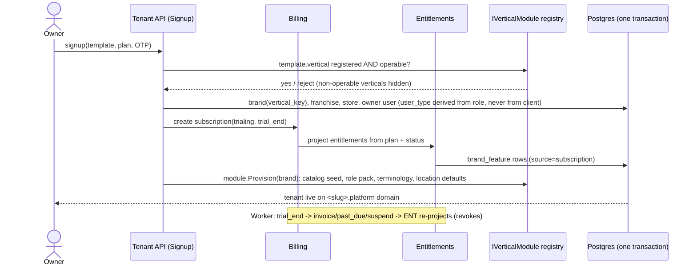

# 01b — Principal Architect: Independent Challenge Review (Rule 7)

Agent key: `architecture` · AREA code: `ARCH` (continuing after SA-ARCH-012) · Date: 2026-10-09

## Scope and method

**Inputs:** the eleven other specialist reports in `docs/audit/specialists/` (02, 03, 04, 05, 06, 07, 08, 08b, 09, 11, 12) plus my own `01-architecture.md`.

**What I did:**
1. **Mobile/delivery (required).** I re-opened the code cited by `12-mobile-delivery-maps.md` for SA-MOB-001 to SA-MOB-005 and checked them myself (below). I then answered M1–M12 independently and judged the report's proposed architecture.
2. **Material claims.** I re-read every report's verdict section and every High/Critical heading. Where conclusions conflict, I resolved them by opening the repository files at the centre of each dispute:
   - migration `0031`, token minting and the RLS interceptor;
   - the core rate limiter and the compose forwarded-headers setting;
   - `CreateUser`, `ScopeResolver`, `PermissionHandler`;
   - `NotificationSettingsCache`, `BrandPlatformBillingService`, the royalty status filter;
   - the users/memberships RLS migration (0029) and `NpgsqlAbacStore`.
3. **Root causes.** I clustered the ~200 findings by mechanism.
4. **Updated target architecture and phased roadmap.**

**Commands:** `grep`, `sed` and `find` only. No builds, DB or devices; the environment limits in the brief still apply. Three QA agents are re-verifying individual findings in parallel, so this review does **not** re-verify every finding. Each "Verified (code)" below means I read the cited lines myself for this review.

**Not verified:** runtime behaviour of any claim. Whether migration 0031 or any `phase*` patch is applied to a real production database. Device behaviour.

---

## 1. Mobile, delivery and maps review (12-mobile-delivery-maps.md)

### 1.1 Independent verification of SA-MOB-001 … 005

| Finding | My check (file:lines read) | Result | My severity |
|---|---|---|---|
| **SA-MOB-001**: no leg state machine; a cancelled order can become delivered | `operations.Application/Logistics/RiderSelf/Commands/UpdateMyTaskStatus/UpdateMyTaskStatus.cs:34-42` only does an allow-list check; `:96` `da.Status = cmd.Status;` never reads the current status. `:150-164` sets `o.Status = "delivered"` gated only on `o.DeliveredAt == null`, with no order-status or strategy check. `:172-173` hard-codes `FromStatus = "out_for_delivery"`. `:186-229` adds a COD `Payment` and mutates `AmountPaid`. `:262-264` runs `RiderLoad.DecrementAsync` on every completed/failed call, **outside** the transaction. | **Confirmed.** Additional observation: the order write bypasses `IFulfillmentStrategy.EnsureTransition`, which `UpdateOrderStatusCommand.cs:53-68` does use. This is the same root cause as SA-SOLID-001 and SA-API-006 (RC3 below). | High (agree) |
| **SA-MOB-002**: duplicate active assignments | `Orders/Pickup/Commands/PickupCommands.cs:204-279`: no `pr.Status` check and no existing-leg check; always inserts, then increments load after `SaveChangesAsync` (non-atomic). `database_scripts/04_bc4_order_lifecycle.sql:332-335`: only non-unique indexes. No later patch or migration adds a unique index on `delivery_assignments` (grep of `db/`, `database_scripts/`). | **Confirmed** for the manual path (deterministic). The races remain Suspected. | High (agree) |
| **SA-MOB-003**: delivery/pickup OTP never generated | grep for assignments to `DeliveryOtp`/`PickupOtp`/`delivery_otp` across `backend/`, `db/`, `database_scripts/`: the only writer is partner dispatch (`AssignPartnerDispatch.cs:67`). Columns have no default (`04_bc4_order_lifecycle.sql:44-45`). | **Confirmed.** The OTP gate at `UpdateMyTaskStatus.cs:89-94` is inert for orders. | High (agree; P1 because it is a missing control, not an exploitable one) |
| **SA-MOB-004**: no coordinate capture | The only `CreatePoint` calls are `BatchLocationPing.cs:53,85`. No `GeoLocation =` assignment and no `ST_MakePoint`/`ST_SetSRID` in C#. The only raw geo SQL nulls it (`CustomerErasureService.cs:177`). `GetFareQuoteQuery.cs:57-59` throws when either point is null. | **Confirmed.** The courier flow cannot quote for any app-created address. | High for the logistics vertical, Medium for laundry (agree) |
| **SA-MOB-005**: pickup `addressId` not owner-checked | `PickupCommands.cs:103` copies `req.AddressId`. `PickupCommands.cs` contains **no** reference to `CustomerAddresses` (grep). The customer handler (`:336-470`) validates cart items and slot but not the address. | **Confirmed** (static). Exploitation needs a foreign address UUID. | Medium (agree) |

**Cross-report correction 12 missed:** the customer-app journeys in §2 ("checkout/book pickup", "tracking", "slot selection") are judged as if the database were pre-0031. Migration `db/migrations/0031_subbrand_scope_rls.up.sql:139-172,198` puts a RESTRICTIVE policy on `orders`, `order_items`, `pickup_requests`, `delivery_slots`, `delivery_slot_bookings`, `delivery_assignments` and `payments`. Customer tokens carry no `scope_nodes` claim (`core.Infrastructure/Auth/JwtTokenService.cs:59-64` emits it only for user tokens; customer token at `:98-110`). The interceptor therefore publishes the "unresolved" sentinel, and `kernel.within_scope_cols` returns NULL (`0031…up.sql:82`), which denies the row. On any database migrated per the runbook, the customer app's booking, slot listing and tracking calls return empty or fail (SA-DB-001 / SA-TEN-001). Rider calls survive, because rider invites grant a franchise membership (`core.Application/Identity/AccessControl/Commands/InviteRider/InviteRider.cs:83`) and `delivery_assignments` has no franchise column, so the NULL-column arm passes. M1 and M8 below are therefore **conditional** on fixing 0031 for the customer lane.

### 1.2 My answers to M1–M12

| # | My answer | Agreement with 12 | Justification |
|---|---|---|---|
| M1 Functional customer app | **Partially Supported** (conditional) | Agree, with the 0031 caveat | Real auth, catalog, slots, booking and timeline. Online pay is a placeholder (SA-FE-012) and courier is broken (MOB-004). On a 0031-migrated DB the booking and tracking APIs are denied for customers (SA-DB-001). |
| M2 Functional partner app | **Partially Supported** | Agree | Tasks, status, photos, KYC and background GPS are real. Offer UI, push, state machine and offline-queue correctness are missing (MOB-001/006/007/008). |
| M3 Tenant and business type resolved correctly | **Partially Supported** | Agree, and extend | Tenant is a build-time constant. More fundamentally, the **backend** does not resolve the vertical for orders either (SA-ARCH-003 / SA-VERT-001), so even a vertical-aware app would receive laundry-mode orders. |
| M4 Map capabilities configured automatically by business type | **Not Supported** | Agree | No capability model links vertical to location features. |
| M5 Vertical map workflows without mixing logic | **Not Supported** | Agree | There are no vertical map workflows. The correct seam already exists (strategies keyed by `FulfillmentMode`) but declares no location capabilities. |
| M6 Geocoding / address pick / routing / navigation / live tracking | **Partially Supported** overall | Agree | Geocoding: Not. Map pick: Not. Routing/ETA: Not. Navigation: Partially (deep link with text fallback). Live tracking: Partially (rider→admin polling only). |
| M7 Zones / regions / serviceability | **Not Supported** | Agree | Pincode check exists but no caller and no server enforcement (MOB-013). |
| M8 Assignment/status consistency across customer, partner, admin | **Not Supported** | Agree | MOB-001/002/014/016. The admin UI also hard-codes laundry transitions (SA-FE-004). |
| M9 Location data protected by backend authz + isolation | **Partially Supported** (mechanism) / **Not Supported** (as a guarantee) | Stricter than 12 | Rider-self and admin scoping are correct as far as they go. But SA-AUTHZ-001 (Critical, verified below) lets an anonymous signup become `platform_admin`, which bypasses RLS on every table, rider pings included. Until Phase 0 lands, no location-privacy claim holds. |
| M10 Background tracking, permissions, privacy, battery, network | **Partially Supported** | Agree | The managed workflow is correctly configured. Retention is unenforced (MOB-012, OPS-004), ingestion is unvalidated (MOB-010), headless logout is Suspected (MOB-009). |
| M11 Duplicates/repeats prevented under concurrency | **Not Supported** | Agree | No unique index, no concurrency token, non-idempotent load counter. |
| M12 Minimum changes | See below | Re-ordered | — |

**M12, my minimum set (ordered by dependency):**
1. Fix the customer lane under 0031: emit a customer scope or exempt `token_use=customer` in the predicate. This is part of Phase 0; nothing customer-side works on a migrated DB without it.
2. Fix the pickup address-ownership IDOR (MOB-005) and validate location pings: range, batch size, server time, duty/active (MOB-010/011).
3. Build a single **leg transition service** used by rider, admin and auto-dispatch paths. It must route the order-side effect through the order's strategy (MOB-001/016), and it needs partial unique indexes plus conditional updates for assignment (MOB-002).
4. Fix the rider offline queue and headless auth (MOB-008/009). Add push on assign and cancel (MOB-007).
5. Generate OTPs with lockout, **or** remove the "OTP-verified delivery" claim until that ships (MOB-003).
6. Get mobile CI green and configure EAS/FCM (MOB-017).
7. **Laundry can launch without geocoding** if geofence and distance ranking are documented as inactive. **Courier cannot launch** without coordinate capture (MOB-004) and serviceability enforcement (MOB-013).
8. Before a second vertical goes live, add server-side capability/entitlement gates on vertical endpoints (MOB-015 / AUTHZ-012).

### 1.3 Judgement on 12's recommended architecture

| Element proposed by 12 | Fits the codebase? | Proportionate? | My adjustment |
|---|---|---|---|
| Shared location infrastructure (`IGeocoder` port, `GeoPoint`, `ServiceAreaResolver`, `DistanceService`) inside operations | Yes. PostGIS columns and GIST indexes already exist (`05_bc5_logistics.sql`, `03_bc3_customer_catalog.sql`) and NTS is wired in SharedDataModel. Per-brand provider settings exist. | Yes: one port, one adapter, haversine first. | Make it a **platform module** (`Location`) owned by no vertical, as the single writer of coordinates. Record provider, accuracy and timestamp. Geocoding sends customer addresses to a third party, so add it to the DPDP processor register. Cache geocodes per address and never per request (quota/cost). |
| Tenant location config (reuse `system_settings`; optional `service_area` polygons; capability projection; `GET /app-config`) | Yes | Yes, if capabilities are **not** a new gating system | Express map/tracking/parcel capabilities as **features in the existing feature catalog** (`features.vertical_key`, `brand_feature`). Combine them with what the active fulfilment strategy declares. `/app-config` is a read projection of *entitlement ∩ strategy requirements*; enforcement uses the same endpoint-metadata check as every other feature (§4.5). A parallel "capabilities" table would make a third source of truth next to navigation and entitlement. |
| Vertical-specific map workflows live with the fulfilment strategies (`RequiresAddressGeo`, `SupportsLiveTracking`, …) | Yes. `RequiresStoreDrop` already proves the pattern (`IFulfillmentStrategy.cs:91`). | Yes | Agree. Key them by `FulfillmentMode`, not `VerticalKey`, consistent with the seam's documented decision. |
| Customer vs partner experiences: two Expo apps, per-tenant EAS profiles, runtime `/app-config` | Yes | Yes for a handful of tenants | Alternative for scale: one white-label "host" app with brand discovery (search/QR/deep link) as the default, with per-tenant builds sold as a premium add-on. Per-tenant store listings carry store-policy and operational cost (accounts, review, OTA channels); confirm current App Store/Play policy before committing. |
| `AssignmentService` + `TrackingService` refactored inside operations; AutoDispatch "calls the same rules (shared static helpers)" | Partly | Mostly | **Disagree with "shared static helpers"**. AutoDispatch lives in `commerce.Infrastructure/Worker/Services/AutoDispatchService.cs` and writes logistics tables (SA-ARCH-001, SA-SOLID-011). Move dispatch into the operations-owned **Dispatch module**, and let the worker host compose that module and call `AssignmentService`. Shared statics would keep two writers for one invariant. |
| ABAC/RBAC policies for addresses, pings, location reads, assignment mutation, history | Yes | Yes | Implement them as **handler-level guards plus DB constraints** (composite FK address→customer; unique active leg), not by activating the inert ABAC engine (SA-AUTHZ-008). Add the store-level scope for the live map. |
| Polling (no SignalR) | Yes | Yes | Agree. Rider push is the missing piece, not WebSockets. |

**Verdict on 12's architecture:** it fits and it is proportionate. It introduces no new deployables and reuses PostGIS, strategies, settings and entitlement. Two corrections are needed:
- dispatch must have one owner (operations), not shared helpers across hosts;
- capabilities must be features in the existing entitlement model, not a new subsystem.

12's roadmap (R1–R14) is sound, but it omits the cross-cutting Phase 0 blockers (0031 customer lane, AUTHZ-001, rate limiter) that dominate mobile readiness.

---

## 2. Challenge of material conclusions across reports

### 2.1 Disputes resolved with repository evidence

| Dispute | Positions | Evidence I read | Resolution |
|---|---|---|---|
| **0031 RESTRICTIVE policy severity** | SA-TEN-001 Critical; SA-DB-001 Critical; SA-AUTHZ-006 High | `0031…up.sql:82-83` (NULL on unresolved nodes, false on empty), `:139-172` (orders, pickups, slots, assignments, payments, audit_logs, cash books, expenses, royalty…), `:198` RESTRICTIVE FOR ALL TO app_user. Customer token has no `scope_nodes` (`JwtTokenService.cs:59-64` vs `:98-110`). Commerce adapter publishes no subject GUCs (SA-AUTHZ-005 evidence, `CommerceHostCurrentTenant.cs`). | **Critical as a release/availability blocker; not a confidentiality issue.** It fails closed. 0031 is a versioned migration that `migrate.sh up` applies (the documented step), so every correctly migrated environment loses the customer order/pickup/payment lane and non-platform commerce reads and audited writes. AUTHZ's "High" reflects the security lens (no data exposure); both are right on their axis. For go-live it is P0. |
| **Core auth rate limiter behind the gateway** | SA-API-001 Critical; SA-OPS-001 High | `core.WebApi/Program.cs:198,207-216`: partition = `Connection.RemoteIpAddress`, default 10/60 s. `deploy/docker-compose.yml:25`: "ForwardedHeaders stays OFF on the services". | **Critical (availability).** In the shipped topology every staff/customer/partner OTP and login across all tenants shares one 10-requests-per-minute bucket. That is a platform-wide login outage under ordinary load, not only under attack. One config/code change fixes it. |
| **DB-Q8 (pooled-connection tenant context)** | SA-TEN (02): Fully Supported for EF; 08b and 11: Partially | `RlsConnectionInterceptor.cs:57-121` sets all GUCs on every open (EF path safe). `Utilities/Authorization/Abac/NpgsqlAbacStore.cs:33-44` opens raw connections from a separate `NpgsqlDataSource` with no GUCs (documented as deliberate). Session-level `set_config(...,false)`. | **Partially Supported.** 02 is correct for the EF request path, but the question is about the system. Raw ABAC connections run without context (they fail closed today because ABAC is inert). Session-level GUCs rule out transaction-mode pooling (PgBouncer), a scaling constraint 11 rightly flags. No leak path was found. |
| **DB-Q3 (duplicates under concurrency/retries)** | 08: Partially; 08b: Not Supported | 08b reproduced an over-refund (SA-DB-006) and a lost update (SA-DB-008); 08 SA-API-004/005 found no concurrency tokens. I confirmed `PickupCommands.cs:204-279` and the absence of a unique index on assignments. | **Not Supported for money and dispatch paths; Supported only for pickup booking and partner wallet.** A reproduced over-refund outweighs the partial controls. |
| **Q7 interpretation** | ARCH (01), SOLID (07): "add a vertical without widespread modification" → Not Supported. VERT (04): "one vertical cannot reach another's functionality" → Partially. | — | **These are two different questions; keep both.** Q7a (extensibility): **Not Supported** (SA-ARCH-003/004, SA-SOLID-004). Q7b (vertical isolation): **Not Supported at the API**, Partially in navigation/provisioning only. That is stricter than 04, because SA-AUTHZ-012, SA-ONB-003, SA-FE-006 and SA-MOB-015 all show vertical endpoints (e.g. `/orders/parcel`, fabric APIs) ungated server-side. The verdict owner should state which Q7 is meant. |
| **Q13 interpretation** | 02: tenant restrictions; 03/06: plan entitlements; 09: "client-only restrictions?" | — | Same split. Entitlements: Partially (staff lane only). Vertical restrictions: client/navigation-only. Suspension: server-side but self-reversible (SA-TEN-003) and HTTP-only. |
| **Q1 / "secure tenant isolation"** | 02 and 06: Partially (mechanism present) | I verified SA-AUTHZ-001 myself: `CreateUser.cs:31` only checks `UserType.IsValid`; `:45` copies the client's `UserType`; `UserType.All` includes `platform_admin` (`UserType.cs:12,30-34`); `users.create` is seeded to brand_admin/franchise_owner/store_admin (`IdentitySeeder.cs:521,577,603`); `PermissionHandler.cs:33` grants every permission when `user_type == platform_admin`; `TenantResolutionMiddleware.cs:34-40` sets `bypass_rls`; `PasswordLoginHandler.cs` / `ScopeResolver.cs:28-49` do not require a membership. Self-signup creates a brand_admin anonymously (`CompleteSignup.cs`). | **Mechanism: Partially Supported. Security guarantee: Not Supported.** An anonymous OTP-verified signup can mint a platform administrator who bypasses RLS on every table. While that path exists, "secure tenant isolation" must not be claimed in any form. I agree with Critical for SA-AUTHZ-001. |
| **Q14 (SOLID)** | 01 and 07: Partially. 07 calls layering "sound"; 01 calls it nominal | `Utilities.csproj` FrameworkReference; `IFormFile` in Application commands | **Partially Supported (agreed).** Minor wording disagreement: layering is consistent by *convention* and unenforced (07 itself says so in SA-SOLID-012). |
| **Q4 / subscription enforcement** | 03: Partially | SA-SUB-006 (entitlement not tied to payment), SA-AUTHZ-004 (self-grant `saas.manage`), SA-SUB-004 (verified: `BrandPlatformBillingService.cs:63` uses `CreateAsyncScope()` while `:156` and every other worker use `CreateWorkerAsyncScope()`) | **Catalogue and staff-lane gating: Partially. Billing-driven enforcement: Not Supported.** A tenant can hold paid features without paying (perpetual trial, no past_due recovery, self-grant). |
| **Q15 production readiness** | All reports: Not Supported | — | **Not Supported (unanimous; upheld).** |

### 2.2 Spot checks of other High claims (confirmed)

- **SA-SOLID-007 / SA-API-012** (cross-tenant notification credentials): `commerce.Infrastructure/Worker/Channels/NotificationSettingsCache.cs:31-58`. `GetAsync` has no brand parameter, selects all active `whatsapp/cloud` and `sms/provider` rows with no `OrderBy`, and takes `FirstOrDefault`. **Confirmed; this is a cross-tenant data flow.** I place it in Phase 0.
- **SA-SOLID-003** (royalties always zero): `RoyaltyGenerationService.cs:198` and `RoyaltyCommands.cs:102` filter `p.Status == "completed"`, while `06_bc6_commerce.sql:379-381` allows no such value (the code writes `succeeded`). **Confirmed.**
- **SA-SOLID-001 / SA-API-006** (status logic duplicated): direct order-status writes exist in `CancelOrderCommand.cs:59`, `CancelOrderByCustomerCommand.cs:53`, `UpdateOrderStatusCommand.cs:60` (strategy-checked), `UpdateMyTaskStatus.cs:159` (not checked) and `UpdateMyTaskStatus.cs:368`. **Confirmed.**
- **SA-DB-005 / SA-AUTHZ-003** (identity tables outside RLS): `db/migrations/0029_users_brand_rls.up.sql:147-152` explicitly leaves `user_scope_memberships` RLS **off**; `:122` users INSERT `WITH CHECK (true)`. **Confirmed.**

### 2.3 Over-statements to watch in the final verdict

- No report claims full SaaS readiness, complete ABAC/RBAC or secure isolation. That restraint is correct.
- **Over-statement in prior docs**, not in the reports: `ABAC_AUDIT_2026-08-31.md` §3/§6 ("production-sound") is contradicted by SA-AUTHZ-001/002. `SAAS_PLATFORM_ARCHITECTURE.md` multi-vertical claims are contradicted by SA-ARCH-003/004. Neither doc should be cited as evidence.
- **Under-statement risk:** severity is assessed per finding, but several High findings combine into Critical chains:
  - AUTHZ-003 (attach any user) + AUTHZ-002 (reset a target's password) → cross-tenant takeover;
  - AUTHZ-004 (self-grant `saas.manage`) + SUB-006 → free paid features.

  The registry should record these as chains.

---

## 3. Cross-cutting root causes

| RC | Root cause | Mechanism (evidence) | Finding clusters it explains |
|---|---|---|---|
| **RC1** | **No single schema source of truth** | DB shape is `database_scripts` + ~145 hand-applied patches + 33 migrations. `build_from_scratch.sh` applies neither `phase*` patches nor migrations, and CI never builds a schema (01 §SA-ARCH-008). | SA-ARCH-008, SA-DB-002 (rebuild reverts RLS fix), SA-VERT-010, SA-SUB-020, SA-OPS-007, SA-TEN-010 (isolation tests on fixtures), MOB open questions; also why 0031 shipped without customer-lane testing |
| **RC2** | **Cross-cutting policy is opt-in per endpoint/handler** (CQRS pipeline not wired) | `Dispatcher.cs:15-45` runs no behaviours. Validation needs `ValidationFilter` per endpoint, and transactions are hand-rolled. | SA-ARCH-005, SA-SOLID-005, SA-API-003 (40 validators never run), SA-MOB-010 (no ping validator), SA-API-016 (unbounded pageSize), SA-SUB-010 / SA-AUTHZ-011 (entitlement only where a permission policy is attached) |
| **RC3** | **Anemic shared model; invariants live in handlers and are duplicated** | Empty Domain projects, 100-property `Order`, five order-status writers, three coupon implementations, two dispatch implementations, string-typed statuses | SA-ARCH-002, SA-SOLID-001/003/006/009/011, SA-API-006, SA-MOB-001/016, SA-FE-004 (client-side duplicate state machine), SA-DB-010 |
| **RC4** | **No concurrency model** | No `xmin`/rowversion tokens, read-modify-write counters, check-then-act idempotency, few partial unique indexes for business invariants | SA-API-004/005/009/020, SA-DB-006/008/009/011/022, SA-MOB-002/011, SA-SUB-016 |
| **RC5** | **Workers co-hosted in an API host without locks, leader election or a uniform tenant-scope contract** | 14 hosted services in `commerce.WebApi/Program.cs:301-323`; trust is per-call-site (`CreateWorkerAsyncScope` vs `CreateAsyncScope`); tenant-agnostic caches | SA-ARCH-007, SA-OPS-005/015, SA-API-014/015, SA-DB-009, SA-SUB-004/018, SA-SOLID-007/008, SA-MOB-006/007 (events with no consumers) |
| **RC6** | **Identity/authorization plane trusts client-supplied attributes, and platform power is one mutable column with no DB backstop** | `CreateUser.cs:45` (user_type from request); `GrantMembership` accepts any user id; overrides accept any code; `PermissionHandler.cs:33` and `TenantResolutionMiddleware.cs:35-40` derive god-mode from `user_type`; memberships RLS off; users INSERT `WITH CHECK (true)` | SA-AUTHZ-001/002/003/004/013, SA-TEN-004, SA-DB-005/020, new **SA-ARCH-013** |
| **RC7** | **Tenant context is composed per host and per lane rather than once** | Three `ICurrentTenant` implementations (`HttpContextCurrentTenant`, `CommerceHostCurrentTenant`, `WorkerCurrentTenant`); customer tokens lack `scope_nodes`; gateway and core partition rate limits on unverified or proxied identity | SA-TEN-001/002/005, SA-DB-001, SA-AUTHZ-005/006/010, SA-API-001/002, SA-OPS-001/002, new **SA-ARCH-014** |
| **RC8** | **Subscription state is not the source of entitlements** | Entitlement is computed at token mint from `brand_feature` rows that signup, operator or self-grant write directly; billing never revokes | SA-SUB-001/003/006/007/009/011/012, SA-AUTHZ-004 |
| **RC9** | **Vertical is modelled as metadata, not as modules** | `VerticalKey` gates navigation, terminology and bundles. Order creation, invoices, notifications and clients are laundry-coded. | SA-ARCH-003/004, SA-VERT-001…008, SA-ONB-003/004/006, SA-FE-004/006/009, SA-MOB-015, SA-API-021 |
| **RC10** | **Single-node / developer-machine infrastructure assumptions** | Local `/tmp` uploads, partman via macOS launchd, in-process caches and limiters, logs not exported | SA-OPS-003/004/008/010/015, SA-API-017, SA-MOB-012 |
| **RC11** | **Documentation runs ahead of code and is used as evidence** | Stale ADR-007, SAAS architecture doc, ABAC audit "production-sound" | SA-ARCH-012, SA-VERT-011, SA-OPS-018, SA-AUTHZ-001 cross-ref |

RC1, RC6 and RC7 together explain every Critical finding.

---

## 4. Updated target architecture

The principle is unchanged from `01-architecture.md`: a **modular monolith on one PostgreSQL database with RLS**, with explicit modules, one owner per table, a separate worker host, and **no microservices**. The changes below fold in the security, DB, subscription and mobile/maps findings.

### 4.1 Target component architecture

```mermaid
flowchart TB
  subgraph Edge
    GW[Gateway: TLS, Host->brand resolution (forwarded),<br/>per-tenant rate limit keyed on VERIFIED claims]
  end
  subgraph ControlPlane["Platform control plane (separate audience + role)"]
    PADM[Platform Admin API<br/>tenants, plans, invoices, entitlements]
  end
  subgraph TenantPlane["Tenant plane API host(s) — modular monolith"]
    direction TB
    subgraph PlatformModules["Platform modules"]
      IAM[Identity & Access<br/>TargetUserGuard, grant ceilings]
      TEN[Tenancy & Lifecycle]
      ENT[Entitlements (projection of subscription)]
      BILL[Billing & Subscriptions]
      COMM[Commerce: payments, coupons, wallet, loyalty]
      SPINE[Order Spine + OrderTransitionService]
      DISP[Dispatch: AssignmentService, TrackingService]
      LOC[Location: Geocoder port, ServiceArea, Distance]
      ENG[Engagement: notifications (brand-keyed creds)]
      FILES[File storage port (object store)]
    end
    subgraph VerticalModules["Vertical modules (IVerticalModule)"]
      LAU[Laundry]; SAL[Salon]; COU[Courier]; TIF[Tiffin]
    end
  end
  WRK[Worker host: singleton/advisory-locked jobs,<br/>inbox consumers, same modules]
  DB[(PostgreSQL: RLS + composite tenant FKs<br/>schemas per module, baseline+migrations)]
  OBJ[(Object storage)]
  GW --> TenantPlane
  GW --> PADM
  TenantPlane --> DB
  PADM --> DB
  WRK --> DB
  FILES --> OBJ
  VerticalModules -->|strategy + capabilities| SPINE
  SPINE --> COMM
  SPINE --> DISP
  DISP --> LOC
```

| Choice | Alternatives considered | Why this one | Risks | Migration cost* |
|---|---|---|---|---|
| Modular monolith + separate worker host | (a) status quo three hosts; (b) microservice per BC/vertical; (c) one host for everything | One shared order/payment transaction; small team; the current split already shows process separation without data separation. A worker host fixes RC5 cheaply. | Module discipline erodes without architecture tests | M (2–4 eng-months incl. module carving) |
| Separate **platform control plane** (own token audience/role; platform admin cannot be minted by tenant APIs) | Keep `user_type` god-mode in the tenant API | Removes RC6 at its root (SA-ARCH-013) | Operator tooling must use the separate audience | S–M |
| Keep shared-DB + RLS | Schema-per-tenant; DB-per-tenant | ADR-001 is sound and 126/126 tables already carry RLS. The defects are wiring (RC7) and backstops, not the model. | RLS performance (SA-DB-017: set-based scope instead of per-row plpgsql) | S |

\*Costs are architect estimates, not measurements.

### 4.2 Tenant provisioning



Alternatives: operator-only provisioning (today's `CreateBrand`, unprovisioned per SA-ONB-005/SA-VERT-009) versus a self-serve wizard. Make **both use one provisioning service**. Risk: partial provisioning; mitigated by a single transaction plus an idempotent re-run. Cost: S–M.

### 4.3 Request processing

```mermaid
flowchart LR
  C[Client] --> G[Gateway<br/>forward Host + client IP, verify JWT for rate key]
  G --> MW1[ExceptionHandler]
  MW1 --> MW2[AuthN: JWT audience per plane]
  MW2 --> MW3[TenantContext: ONE resolver for all lanes<br/>user / customer / partner / api_key / worker]
  MW3 --> MW4[Lifecycle gate: suspended/cancelled — all lanes]
  MW4 --> MW5[AuthZ: permission + scope + feature metadata]
  MW5 --> D[Dispatcher pipeline:<br/>Validation -> Transaction/Concurrency -> Audit]
  D --> H[Handler -> module API -> DbContext]
  H --> RLS[RLS interceptor: GUCs incl. customer scope]
  RLS --> PG[(Postgres)]
```



Key changes:
- **One `ICurrentTenant`** with lane-specific claim mapping, replacing the three implementations (SA-ARCH-014).
- **Real dispatcher pipeline**: validation always on; RC2.
- **Optimistic concurrency** on aggregates (orders, assignments, wallets, coupons); RC4.
- Gateway forwards client IP and Host (SA-API-001, SA-ONB-001, SA-OPS-013).

Alternative: keep per-endpoint filters. Rejected, because RC2 shows opt-in policy is forgotten. Risk: enabling validation surfaces latent 400s, so roll it out per module behind tests. Cost: S.

### 4.4 AuthN / AuthZ

```mermaid
flowchart TB
  subgraph Tokens
    U[user token: sub, brand, scope_nodes, perms(entitled), perm_version]
    CU[customer token: sub, brand, customer scope node]
    P[partner token: partner_id]
    K[api_key: brand, scopes]
    PA[platform token: separate audience]
  end
  U & CU & P & K --> PDP[In-process policy layer]
  PDP --> R1[Permission (RBAC) — server-held, grant ceiling enforced on write]
  PDP --> R2[Scope (franchise/store) — IsWithinScope + RLS restrictive policy]
  PDP --> R3[Resource guards — TargetUserGuard, address ownership, rider active+on-duty]
  PDP --> R4[Feature/entitlement — endpoint metadata, all lanes]
  R1 & R2 & R3 & R4 --> DBB[DB backstops: RLS on identity tables,<br/>composite tenant FKs, trigger: only platform role writes platform_admin]
  PA --> CP[Control-plane endpoints only]
```

| Choice | Alternatives | Rationale | Risk | Cost |
|---|---|---|---|---|
| RBAC + hand-written resource guards + DB backstops; ABAC engine stays off until parity-tested, then used only for declarative brand rules | (a) activate the generic ABAC engine now; (b) external PDP (OPA/Cedar) | The engine is inert and its raw connections lack context (SA-AUTHZ-008, SA-DB-014). The exploitable gaps are **missing guards**, not a missing engine. An external PDP adds latency and an operational dependency for no gain now. | Guard sprawl; mitigate with one `TargetUserGuard` / `ResourceGuard` library plus tests | S (Phase 0 guards), M (backstops) |
| Server-derived `user_type`; grant ceiling (grant only codes you hold and never platform codes) | Client-supplied type with validation | Fixes SA-AUTHZ-001/004 at the source | Existing invite flows change | S |
| RLS on `user_scope_memberships` and identity tables with brand-resolving policies | App-only checks | Defence in depth (SA-DB-005) | Access-control screens read others' memberships, so the policy must be designed and not copied (0029 note) | M |
| Remove self-settable `app.bypass_rls`; use a distinct DB role for workers and control plane | Keep the GUC | SA-TEN-007 / SA-DB-015 | Two connection strings to manage | S–M |

### 4.5 Entitlement enforcement

```mermaid
flowchart LR
  PLAN[Plan + add-ons] --> SUB[Subscription state machine<br/>trialing->active->past_due->suspended->cancelled]
  SUB -->|projection, versioned| BF[brand_feature (source=subscription|grant, valid_until)]
  OVR[Operator grant (control plane only, audited)] --> BF
  BF --> SNAP[Entitlement snapshot cache keyed brand+version]
  SNAP --> TOK[Staff token perms filtered at mint (optimisation)]
  SNAP --> EP[Endpoint metadata RequireFeature — staff, customer, partner, api_key]
  SNAP --> WK[Workers check before acting (billing, notifications)]
  SNAP --> APPCFG[/app-config capabilities = entitlement ∩ strategy requirements/]
```

- Alternative 1, per-request DB check: correct but costly; the versioned snapshot gives the same correctness.
- Alternative 2, token-only (today): misses non-staff lanes and stale tokens (SA-SUB-010/019).
- Risks: revocation latency, which is bounded by snapshot TTL and the `perm_version` bump.
- Cost: M.
- Fixes RC8 and SA-SUB-001/003/006/009/010, and provides the capability source the mobile `/app-config` needs.

### 4.6 Vertical module boundaries

```mermaid
flowchart TB
  subgraph Spine["Shared spine (vertical-neutral)"]
    ORD[Order Spine: create/transition via OrderTransitionService]
    SLOT[Capacity/Slots]
    INV[Invoicing: TaxProfile per vertical/SAC]
    NOTIF[Notification event catalog]
  end
  subgraph IVerticalModule
    S[IFulfillmentStrategy (by FulfillmentMode)]
    CAT[CatalogKind + attributes]
    PERM[Permission/role pack + seed]
    TERM[Terminology]
    CAPS[Location/tracking capability requirements]
    EPS[Vertical endpoints + private schema + EF configs]
  end
  ORD -->|mode = DefaultFor(brand.vertical) unless parcel| S
  INV --> TAXP[TaxProfile from module]
  NOTIF --> TPL[module-supplied templates]
  EPS --> PRIV[(laundry_fulfillment / salon_fulfillment / tiffin schema)]
```

Rules:
1. Only `OrderTransitionService` writes `orders.status`. Every writer goes through it: admin, POS, rider leg completion, cancel, customer cancel, warehouse. Admin-web reads `allowedTransitions` from the server.
2. A vertical is signup-visible only if its module is registered **and** passes its operability check.
3. Vertical endpoints carry feature metadata, enforced server-side.

Alternatives:
- Status quo (metadata-only verticals): fails Q7a.
- Plugin assemblies loaded at runtime: premature; compile-time module registration is enough.

Risk: the order-transition consolidation touches the money path, so it needs parity tests first. Cost: M–L, including the salon module itself (the blueprint's own 49 person-day claim for salon is unverified).

### 4.7 Map / location / dispatch boundaries

```mermaid
flowchart LR
  subgraph Clients
    CA[Customer app: address pin/geocode, serviceability, own-leg tracking (coarse)]
    RA[Rider app: tasks, offers, push, deep-link nav, background pings]
    AW[Admin: live map (store-scoped), assign/reassign]
  end
  subgraph Location["Location module (platform)"]
    GEO[IGeocoder port -> provider adapter (per-brand key, encrypted)]
    SA[ServiceAreaResolver: pincode -> polygon (ST_Covers)]
    DIST[DistanceService: haversine -> matrix later]
  end
  subgraph Dispatch["Dispatch module (operations-owned, single writer)"]
    AS[AssignmentService: create/offer/accept/reassign/cancel<br/>partial unique index + conditional UPDATE]
    LEG[LegTransitionService: leg state machine -> OrderTransitionService]
    TRK[TrackingService: validated pings, duty/active gate,<br/>server time, retention drop, customer view]
  end
  CA --> SA
  CA --> GEO
  AW --> AS
  RA --> LEG
  RA --> TRK
  WRK[Worker: auto-dispatch policy, offer expiry, retention] --> AS
  WRK --> TRK
  AS --> DIST
  LEG --> SPINE[Order Spine]
  STRAT[Strategy capability flags: RequiresAddressGeo,<br/>SupportsLiveTracking, RequiresStoreDrop] --> AS
  ENT[Entitlement snapshot] --> CA
```

Alternatives:
- (a) A dedicated dispatch microservice: rejected. It shares the order and payment transactions and has no independent scale need yet.
- (b) Real-time WebSockets: deferred. Polling plus rider push is sufficient.
- (c) A per-vertical dispatch implementation: rejected. Dispatch is vertical-neutral; strategies declare requirements.

Risks:
- third-party geocoding cost and DPDP processor obligations;
- location privacy (retention must be enforced in-app, not by partman alone).

Cost: M (assignment and tracking consolidation) + M (location and serviceability) + S (mobile client changes).

---

## 5. Phased roadmap (dependency-ordered)

| Phase | Goal | Items (finding IDs) | Depends on | Exit criteria |
|---|---|---|---|---|
| **0 — Verified critical security and data-loss risks** | Stop takeover, cross-tenant leaks, outages and money/data loss | **Takeover/escalation:** SA-AUTHZ-001 (server-derived `user_type`, reject platform_admin from tenant APIs, DB trigger), SA-AUTHZ-002/003 (TargetUserGuard; GrantMembership target in-brand), SA-AUTHZ-004 (grant ceiling; platform-only entitlement handlers), SA-TEN-003 (suspension self-lift), SA-DB-003 (revoke `app_user` EXECUTE on brand-lifecycle DEFINER functions). **Cross-tenant data flow:** SA-SOLID-007/SA-API-012 (brand-keyed notification credentials). **Outage:** SA-DB-001/SA-TEN-001/SA-AUTHZ-006 (customer and commerce lanes under 0031: customer scope node + commerce adapter delegation), SA-API-001/SA-OPS-001 (forwarded client IP). **Money/data loss:** SA-API-007 (captured online payments ignored), SA-API-008 (refunds never executed), SA-DB-006 (over-refund), SA-MOB-001 (phantom delivered + COD), SA-OPS-003 (uploads in `/tmp`), SA-OPS-004 (partition runway), SA-OPS-010 (backup schedule proven), SA-DB-002 (rebuild reverts RLS fix: freeze the bootstrap path). | — | Regression tests for each; anonymous signup cannot obtain platform rights; customer booking works on a 0031-migrated DB; one tenant's messages never use another's credentials |
| **1 — Production foundations** | Reproducibility, safe concurrency, safe workers, quality gates | Schema baseline + CI schema build + EF-model check (SA-ARCH-008, SA-OPS-007). Worker host with advisory locks; inbox consumers everywhere (SA-ARCH-006/007, SA-OPS-005, SA-API-014/015, SA-DB-009). Concurrency tokens + partial unique indexes: orders idempotency, assignments, coupons, wallets (SA-API-004/005, SA-DB-008/010/011, SA-MOB-002). Dispatcher validation pipeline (SA-ARCH-005, SA-API-003). Unified `ICurrentTenant` (SA-ARCH-014, SA-TEN-002, SA-AUTHZ-005). Gateway rate-limit key from verified claims (SA-API-002). Release gating (SA-OPS-006/012), commerce tests (SA-ARCH-010), tenant-tagged telemetry (SA-OPS-008). Mobile R3/R7/R9/R11 (SA-MOB-005/008/009/010/011/017). Hide non-operable templates (SA-ARCH-003 quick fix, SA-VERT-002). | 0 | A fresh environment built from scripts passes EF-model validation; two worker instances run jobs once; CI green including mobile |
| **2 — Billing and entitlement correctness** | Subscription drives features on every lane | Subscription → entitlement projection (SA-SUB-006), trial end (001), past_due recovery and paylink (002/003, SA-API-011), renewal worker scope (SA-SUB-004, SA-API-010), billing worker on by default (005), RequireFeature metadata for customer/partner/api_key lanes (SA-SUB-010, SA-AUTHZ-011), sellable features gate something (009), tenant billing UI (007), GST invoices (013), quotas (008), royalty status fix (SA-SOLID-003) | 1 (concurrency, workers) | Unpaid tenant loses paid features automatically; paying reinstates; non-staff lanes 402/403 correctly |
| **3 — Module boundaries and the vertical/dispatch seam** | One owner per invariant | Table ownership + architecture tests (SA-ARCH-001/009, SA-SOLID-012). `OrderTransitionService` as the only status writer; admin-web uses server transitions (SA-SOLID-001, SA-API-006, SA-FE-004, SA-MOB-016). Coupon/promotion policy (SA-SOLID-006). Dispatch module with Assignment/Leg/Tracking services, AutoDispatch moved out of commerce (SA-SOLID-011, SA-MOB-001/002/006/007/014). `IVerticalModule` + order creation from `Brand.VerticalKey` (SA-ARCH-003, SA-VERT-001). Server-side vertical gates (SA-AUTHZ-012, SA-ONB-003, SA-MOB-015). Vertical TaxProfile and notification templates (SA-VERT-004/006). RLS on identity tables + composite tenant FKs (SA-DB-004/005, SA-TEN-011). Location module: coordinates, geocoder port, serviceability enforcement (SA-MOB-004/013). | 1, 2 | Adding a test vertical touches only its module plus registration; laundry parity suite green |
| **4 — White-label and onboarding** | Configured, branded tenant experience | Branding write path + client consumption (SA-ONB-002, SA-FE-008), custom domains via forwarded Host + TLS automation (SA-ONB-001, SA-OPS-013, SA-TEN-009), anonymous public content under RLS (SA-TEN-006), `/app-config` capabilities (MOB R12), per-tenant mobile build pipeline / host app (SA-MOB-015, SA-OPS-016), signup and brand-management UI (SA-FE-007), unified provisioning service (SA-ONB-005, SA-VERT-009), white-label leaks (SA-ONB-006, SA-API-013) | 2, 3 | A new tenant self-onboards to a branded web and app experience without code changes |
| **5 — New verticals and advanced logistics** | Prove multi-vertical | Salon module: appointments, staff/resource capacity, exclusion constraints (SA-VERT-003, SA-DB-021). Courier GA with fares on real coordinates (SA-MOB-004). Tiffin schedule generator (SA-ARCH-004). Customer live tracking (MOB R13). Offer mode end-to-end (SA-MOB-006). ABAC activation only if declarative brand rules are still needed (SA-AUTHZ-008). Revisit scale units (separate dispatch/worker scaling, PgBouncer-compatible context) only on measured need (SA-OPS-015, SA-DB-017). | 3, 4 | Salon tenant books, serves and bills appointments end-to-end; laundry unaffected (parity suite) |

---

## New findings (continuing ARCH numbering)

### SA-ARCH-013 — Platform control plane is not separated from the tenant plane; global authority is a single mutable column
- Category: Architecture / authorization model
- Severity: High (root cause of a Critical chain)
- Status: Verified (code read)
- Related area: AUTHZ / TEN
- Evidence:
  - `laundryghar.Utilities/Auth/PermissionHandler.cs:31-33`: every permission is granted when the `user_type` claim is `platform_admin`.
  - `laundryghar.Utilities/Middlewares/TenantResolutionMiddleware.cs:34-40`: `bypass_rls` for the same claim.
  - `HttpContextCurrentUser.cs:62-63`: `IsPlatformAdmin` derived the same way.
  - The claim is minted from `identity_access.users.user_type`, which tenant-plane handlers write from client input (`core.Application/Identity/Users/Commands/CreateUser/CreateUser.cs:31,45`).
  - Users INSERT RLS is `WITH CHECK (true)` (`db/migrations/0029_users_brand_rls.up.sql:122`).
  - Platform endpoints (entitlements, plans, brands) are served by the same host and token audience as tenant admin (`core.WebApi/Endpoints/Identity/AdminEntitlements.cs`, `AdminBrands.cs`).
- Observed behaviour: any write path to `users.user_type` is a full platform takeover. SA-AUTHZ-001 is one instance; SA-AUTHZ-003 → 002 chains reach the same outcome against existing platform users.
- Impact: tenant isolation depends on every identity-admin handler being perfect, with no structural or database backstop.
- Recommended remediation (smallest safe change):
  - Phase 0: server-derive `user_type`; add a DB trigger allowing `platform_admin` writes only from a platform/bypass role.
  - Phase 1–3: give platform operators a separate token audience and endpoint group that tenant tokens cannot satisfy.
- Regression tests required: tenant-plane create/invite/set-type of `platform_admin` → refused; a platform-audience token is required for `/admin/entitlements`, `/admin/brands` and platform invoices.
- Dependencies / priority: P0 (trigger and derivation), P1 (audience split).

### SA-ARCH-014 — Tenant context is implemented three times and per lane, and the implementations diverge
- Category: Architecture / tenancy plumbing
- Severity: High (root cause of a Critical outage and a fail-open)
- Status: Verified (code read)
- Related area: TEN / DB
- Evidence:
  - Three `ICurrentTenant` implementations: `laundryghar.Utilities/Services/HttpContextCurrentTenant.cs`, `commerce.Infrastructure/Worker/CommerceHostCurrentTenant.cs`, `commerce.Infrastructure/Worker/WorkerCurrentTenant.cs`.
  - The commerce one omits `CustomerId` and the subject GUCs (SA-AUTHZ-005).
  - Customer tokens carry no `scope_nodes` (`core.Infrastructure/Auth/JwtTokenService.cs:59-64` vs `:98-110`), which 0031's predicate treats as unresolved and denies (`db/migrations/0031_subbrand_scope_rls.up.sql:82`).
  - Worker trust is per call site (`BrandPlatformBillingService.cs:63` vs `:156`).
- Observed behaviour: each new lane or host must re-implement context correctly. The 0031 migration was written against the staff lane only and broke the customer and commerce lanes.
- Impact: outages (SA-DB-001), fail-open customer RLS on commerce (SA-TEN-002), silent worker no-ops (SA-SUB-004).
- Recommended remediation: one `TenantContextResolver` mapping every token type (user, customer, partner, api_key, worker) to the same GUC set, with an explicit customer scope node. Add a test matrix (lane × host × restrictive-policy table) run against a migrated schema in CI (depends on SA-ARCH-008).
- Regression tests required: the lane matrix above.
- Dependencies / priority: P0 for the customer/commerce lanes; P1 for consolidation.

---

## Positive controls reconfirmed in this review
- The rider-self IDOR guards in `UpdateMyTaskStatus.cs:44-53` filter by rider derived from the JWT and by brand (agrees with 12).
- `UpdateOrderStatusCommand.cs:53-68` correctly delegates to the fulfilment strategy. The seam is sound wherever it is used, so RC3 is about bypass, not design.
- The RLS interceptor writes every GUC on every open with a three-state sentinel (`RlsConnectionInterceptor.cs:57-121`). The 0031 failure is a lane-mapping defect, not an interceptor defect.
- Reports were appropriately conservative: no specialist claimed full SaaS readiness, secure isolation, complete ABAC or production readiness.

## Open questions / not verified
- Whether 0031 and the `phase*` patches are applied in any production database. This decides whether SA-DB-001 is a live outage or a latent release blocker.
- Runtime confirmation of SA-AUTHZ-001 (an integration test is recommended in Phase 0).
- Current app-store policy on per-tenant template apps (relevant to 12's per-tenant EAS proposal).
- Whether any external operator process sets address coordinates (MOB-004 assumes not).

## Verdict inputs (architect's consolidated view)
- **Q1 (genuine multi-tenant SaaS):** Partially Supported as a mechanism; **Not Supported as a secure guarantee** while SA-AUTHZ-001/003 exist.
- **Q4 (subscriptions enforced):** Partially (catalogue and staff-lane gating); **Not Supported** for billing-driven enforcement.
- **Q7a (add a vertical without widespread modification):** Not Supported. **Q7b (vertical isolation):** Not Supported at the API; Partially in UI and provisioning.
- **Q12 (ABAC):** Not Supported (inert). **Q11 (RBAC):** Partially Supported.
- **Q14 (OOP/SOLID):** Partially Supported.
- **Q15 (production-ready):** Not Supported. Phase 0 is mandatory before any commercial tenant.
- **DB-Q3:** Not Supported (money/dispatch). **DB-Q8:** Partially Supported.
- **Mobile M1–M12:** as in §1.2. The headline is that both apps are real but the delivery workflow is not consistent (M8/M11 Not Supported), and the location stack is absent outside rider pings and the admin map.
