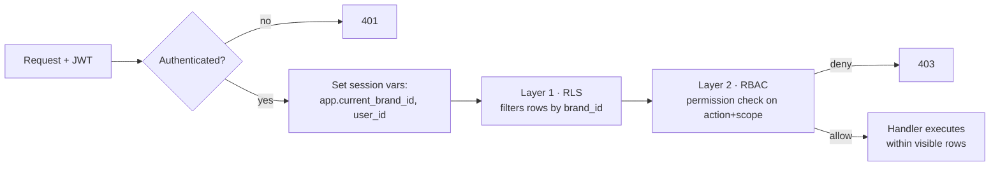
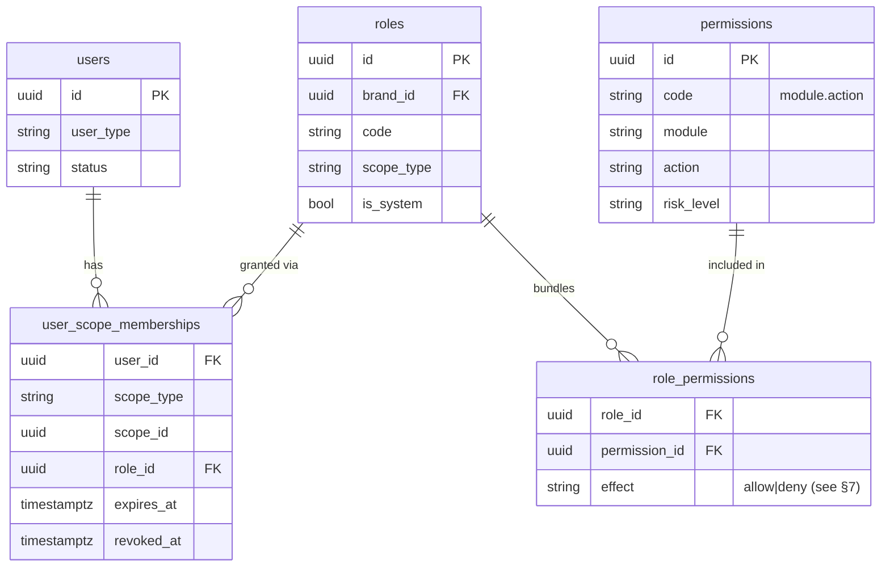
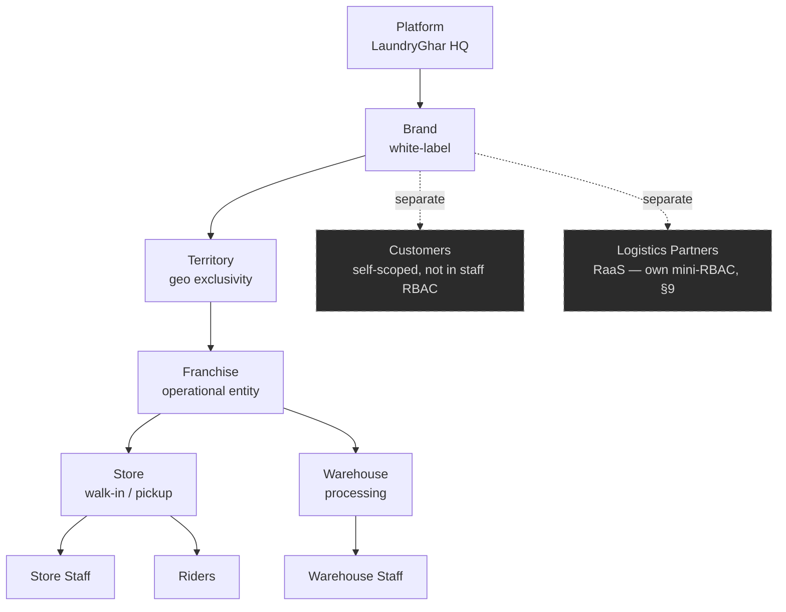
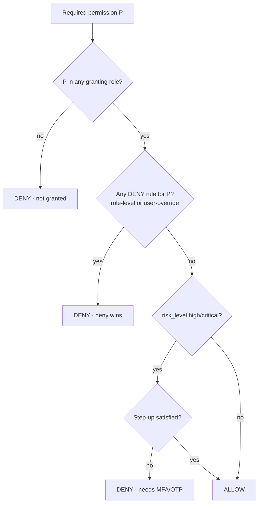
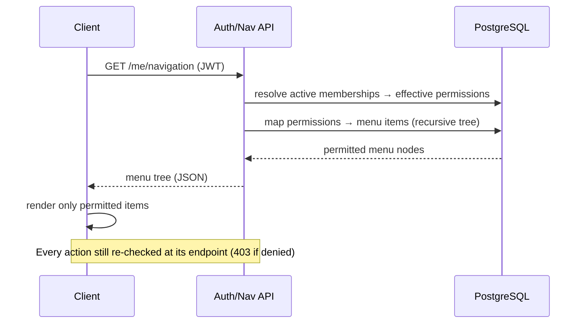

# LaundryGhar — Role-Based Access Control (RBAC)

> Shared reference for all developers. Describes how authorization works across the platform: scopes, roles, permissions, evaluation (deny-wins), and how it maps to the schema. Diagrams are Mermaid and render natively on GitHub.

**Status:** Design spec · **Applies to:** backend (.NET 10), all four clients, PostgreSQL
**Canonical schema:** `database/*.sql` — this doc describes behaviour; the SQL defines shape.

---

## 1. Two layers of protection (read this first)

LaundryGhar enforces access in **two independent layers**. A request must pass **both**.

| Layer | Question it answers | Mechanism | Granularity |
|---|---|---|---|
| **1. Tenancy isolation** | *Which rows may this request even see?* | PostgreSQL **Row-Level Security** on `brand_id` (ADR-001) | Coarse — per brand |
| **2. RBAC authorization** | *What may this user DO within what they can see?* | Roles → permissions, scoped, **deny-wins** | Fine — per action + sub-scope |

RLS makes cross-tenant data leakage **structurally impossible** — even a buggy query or a missing check can't read another brand's data. RBAC then decides what the authenticated user may do inside their own brand. Never rely on one layer alone.



---

## 2. Core concepts

- **User** (`users`) — a staff member, admin, or rider. Authenticates with phone/email + password or OTP.
- **Customer** (`customers`) — an end user of the mobile app. **Separate table, separate auth, separate capability model.** Customers are *not* part of the staff RBAC graph; their abilities are implicit and self-scoped (a customer can only act on their own orders/wallet/addresses). The rest of this doc is about **staff/partner RBAC**.
- **Role** (`roles`) — a named bundle of permissions, defined at a scope level. May be system (built-in) or brand-custom.
- **Permission** (`permissions`) — a single capability, coded `module.action` (e.g. `order.refund`), with a `risk_level`.
- **Scope** — *where* a role applies: `platform`, `brand`, `territory`, `franchise`, `store`, or `warehouse`.
- **Scope membership** (`user_scope_memberships`) — the link that says *"user U has role R at scope node S"*. A user can hold several memberships (e.g., store_admin at Store-1 **and** store_admin at Store-2).



---

## 3. The scope hierarchy

Scopes form a tree. A role granted at a node applies to that node **and everything beneath it** (scope inheritance, §6).



A membership's `scope_id` points at the specific node (which Brand, which Store, …). `platform`-scope memberships have `scope_id = NULL` and, combined with `app.bypass_rls`, can operate across brands.

---

## 4. Role catalog

System roles ship with the platform. Each has a **home scope** (the level it's normally granted at) and a one-line mandate.

| Role code | Home scope | Mandate |
|---|---|---|
| `platform_admin` | platform | Full control of the platform, all brands. Break-glass + config. |
| `brand_admin` | brand | Full control within one brand: catalog, pricing, franchises, staff, reports. |
| `regional_manager` | territory | Oversees the franchises/stores in a territory; performance + escalations. |
| `franchise_owner` | franchise | Runs a franchise: its stores, warehouses, staff, finance, royalty view. |
| `store_admin` | store | Manages one store: staff, orders, cash books, local pricing overrides. |
| `store_staff` | store | Day-to-day store ops: order entry/POS, pickups, cash entries, garment tagging. |
| `warehouse_supervisor` | warehouse | Runs a warehouse: batches, QC sign-off, stock reconciliation approval. |
| `warehouse_staff` | warehouse | Processing floor: scan, wash/dry/iron steps, first-pass QC. |
| `rider` | store | Pickup/delivery legs, GPS, OTP + proof capture. |
| `auditor` | brand / franchise | **Read-only** across a scope for compliance/finance review. Never mutates. |
| `support` | brand | Customer support: view orders, add notes, trigger limited refunds within cap. |
| `partner_admin` | logistics_partner | (RaaS) Owns an external partner account: book riders, wallet, invoices. |
| `partner_operator` | logistics_partner | (RaaS) Books/tracks rides on behalf of the partner. No billing control. |

> Brands may define **custom roles** (`roles.is_system = false`) by cloning a system role and adjusting permissions — e.g., a "Cashier" role that is store_staff minus refunds.

---

## 5. Permission model

A permission is `module.action`. Modules follow the schema communities; actions are a small closed verb set.

**Verb set:** `view · create · update · delete · approve · publish · assign · cancel · refund · export · override · manage`
(`manage` = the union of view/create/update/delete for a module — a convenience super-permission.)

**Representative modules:** `platform, brand, territory, franchise, store, warehouse, user, role, customer, catalog, pricing, order, pickup, garment, warehouse_ops, rider, delivery, package, loyalty, coupon, payment, refund, wallet, cashbook, expense, royalty, subscription, partner_booking, notification, cms, settings, feature_flag, audit, report`

**Risk levels** (`permissions.risk_level`) drive step-up auth (§8):

| Risk | Examples | Extra control |
|---|---|---|
| `low` | `order.view`, `report.view` | none |
| `normal` | `order.create`, `pickup.assign` | none |
| `high` | `payment.refund`, `pricing.publish`, `user.create` | audit + optional OTP |
| `critical` | `royalty.override`, `role.manage`, `franchise.delete`, `wallet.adjust` | **mandatory step-up (MFA/OTP)** + audit |

---

## 6. Scope inheritance & resolution

**Inheritance:** a role at a higher scope covers everything below it.
- `brand_admin` @ Brand-B → may act on every franchise/store/warehouse under Brand-B.
- `franchise_owner` @ Franchise-F → every store & warehouse under F.
- `store_admin` @ Store-1 → only Store-1.

**Multiple memberships:** effective permissions are the **union** across all *active* memberships (not revoked, not expired), then deny is applied (§7).

**Resolution algorithm (per request):**
```
1. Load user's active memberships (revoked_at IS NULL AND (expires_at IS NULL OR expires_at > now())).
2. Filter to memberships whose scope node is an ANCESTOR-OR-SELF of the target resource's node.
3. Collect all permission grants from those roles  → GRANTS.
4. Collect all permission denies (role-level or user-override, §7) → DENIES.
5. Effective = GRANTS − DENIES.   (deny always wins)
6. If required permission ∉ Effective → 403.
7. If permission.risk_level ∈ {high, critical} → enforce step-up (§8).
```

Scope-ancestry is computed from the hierarchy in §3 (Platform ⊃ Brand ⊃ Territory ⊃ Franchise ⊃ Store|Warehouse).

---

## 7. Deny-wins semantics

Authorization is **default-deny** and **explicit-deny-overrides-allow**. If *any* applicable rule denies a permission, it is denied — no matter how many roles grant it. This lets you:
- Suspend a capability for one user without touching their role (`user_permission_overrides` with `effect='deny'`).
- Put a customer/staffer on watchlist and strip sensitive actions instantly.
- Encode "franchise_owner can do everything **except** `royalty.override`" as a role-level deny.



> **Schema additions required to fully support deny-wins** (not yet in the base schema — track as issues):
> 1. `role_permissions.effect VARCHAR(10) NOT NULL DEFAULT 'allow' CHECK (effect IN ('allow','deny'))`.
> 2. New table `user_permission_overrides(user_id, permission_id, scope_type, scope_id, effect, reason, expires_at, granted_by)` for per-user allow/deny that beats role rules.

---

## 8. Step-up authentication for risky actions

`high` and `critical` permissions require recent re-verification even for an authenticated user:
- The action endpoint checks for a valid **step-up token** (fresh OTP/MFA within a short window, e.g. 5 min).
- If absent → `403` with a `step_up_required` code; client prompts OTP; on success the action retries with the step-up token.
- Every high/critical action is written to `audit_logs` with actor, resource, and before/after.

---

## 9. Special actors

### Riders
`rider` is scoped to a store but its permission set is deliberately narrow: view assigned legs, update leg status, submit GPS, verify pickup/delivery OTP, upload proof. A rider can never see finance, pricing, or other riders' data.

### Auditors
`auditor` gets `*.view` and `*.export` across its scope and **nothing else** — no create/update/delete/approve anywhere. Enforced by granting only view/export permissions; deny rules block mutation as a belt-and-braces measure.

### Customers
Not in this graph. A customer token authorizes only self-owned resources (`customer_id = self`), enforced in the handler + RLS-style predicates. Documented here only to clarify the boundary.

### Logistics partners (Rider-as-a-Service)
External partners get a **mini-RBAC** isolated by `partner_id` (see the RaaS plan). `partner_admin` manages the account (bookings + wallet + invoices); `partner_operator` books/tracks only. Partners see **only** their own bookings — enforced by an RLS policy on `partner_id`, mirroring the brand isolation pattern.

---

## 10. Role → permission matrix (key modules)

`M` = manage (CRUD) · `V` = view · `A` = approve · `X` = special action · `—` = none

| Module ↓  /  Role → | platform_admin | brand_admin | regional_mgr | franchise_owner | store_admin | store_staff | wh_supervisor | wh_staff | rider | auditor | support |
|---|---|---|---|---|---|---|---|---|---|---|---|
| brand / platform config | M | V | — | — | — | — | — | — | — | V | — |
| franchise | M | M | V | V | — | — | — | — | — | V | — |
| store | M | M | V | M | M | V | — | — | — | V | — |
| warehouse | M | M | V | M | — | — | M | V | — | V | — |
| user / staff | M | M | V | M | M(store) | — | M(wh) | — | — | V | — |
| role | M | M | — | — | — | — | — | — | — | V | — |
| catalog / pricing | M | M | V | V+X(store price) | V+X(store price) | V | — | — | — | V | V |
| order | M | M | V | M | M | M | V | — | V(assigned) | V | V+notes |
| pickup / delivery | M | M | V | M | M | M | — | — | X(legs) | V | V |
| garment / warehouse_ops | M | M | V | V | V | V | M+A(QC) | M | — | V | V |
| rider | M | M | V | M | M(assign) | V | — | — | V(self) | V | — |
| payment / refund | M | M | V | M | M(cap) | V | — | — | — | V | X(refund cap) |
| wallet | M | M | V | V | V | V | — | — | — | V | — |
| cashbook / expense | M | M | V | M+A | M | M(entries) | — | — | — | V | — |
| royalty | M | M | V | V | — | — | — | — | — | V | — |
| subscription (A/B) | M | M | V | V | — | — | — | — | — | V | V |
| partner_booking (RaaS) | M | M | V | M | M | M | — | — | X(legs) | V | V |
| notification / cms | M | M | V | V | V | — | — | — | — | V | — |
| settings / feature_flag | M | M | — | V | V(store) | — | — | — | — | V | — |
| audit / report | M | M | V | V | V | — | V | — | — | M(view/export) | V |

> This matrix is the **seed** for `roles` + `role_permissions`. Generate the concrete permission rows from it during Wave 0. It is illustrative, not exhaustive — the authoritative grant list is the seed migration.

---

## 11. Backend-driven navigation

Menus are **not** hardcoded in the clients. After login, the backend resolves the user's effective permissions → a **menu tree**, and each client renders exactly what it receives. A user without `royalty.view` never sees the Royalty menu; hiding is defense-in-depth on top of the API-level 403.



---

## 12. Enforcement points (defence in depth)

1. **API gateway / middleware** — validates JWT, sets tenancy session vars.
2. **Authorization filter** — `[RequirePermission("order.refund")]` attribute on each endpoint runs the §6 algorithm.
3. **Database RLS** — brand isolation regardless of app correctness (ADR-001).
4. **Step-up guard** — for high/critical permissions (§8).
5. **Audit** — every mutating + every high/critical action to `audit_logs`.
6. **UI gating** — backend-driven menus + per-control checks (cosmetic layer only; never the sole control).

---

## 13. Worked examples

- **Franchise owner refunds an order in Store-3 (their franchise).** Membership `franchise_owner @ Franchise-F`; Store-3 is under F → scope OK. `payment.refund` granted (capped) → risk `high` → OTP step-up → allowed, audited.
- **Store staff tries to publish a price list.** `store_staff @ Store-3` grants `pricing.view` only; `pricing.publish` not in grants → 403.
- **Auditor tries to cancel an order.** Only `*.view`/`*.export` granted; explicit deny on mutations → 403 (deny wins).
- **Platform admin views Brand-B revenue.** `platform_admin` @ platform + `bypass_rls` for cross-brand read → allowed.
- **Partner operator books a rider.** `partner_operator @ Partner-P` grants `partner_booking.create`; RLS on `partner_id` limits visibility to Partner-P → allowed; wallet debit requires `partner_admin` (operator sees but can't top up).

---

## 14. Implementation checklist (see GitHub issues)

```
[ ] Add role_permissions.effect + user_permission_overrides (deny-wins)
[ ] Seed system roles + permission catalog from §10 matrix
[ ] Scope-resolution service (ancestor-or-self + union − deny)
[ ] [RequirePermission] authorization filter
[ ] Step-up auth guard for high/critical
[ ] Backend-driven /me/navigation endpoint (recursive menu tree)
[ ] RLS ⟂ RBAC integration tests (tenant leakage + privilege escalation)
[ ] Role management admin UI (clone/customize roles)
[ ] Partner (RaaS) mini-RBAC with partner_id RLS
[ ] Audit wiring for all mutating + high/critical actions
```
